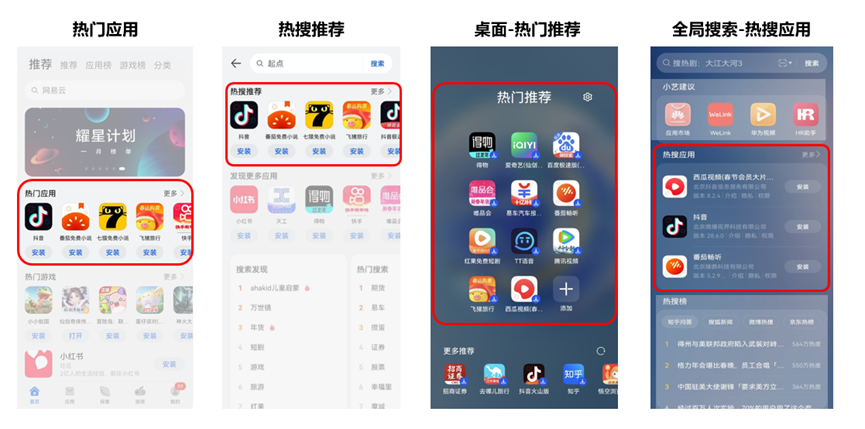
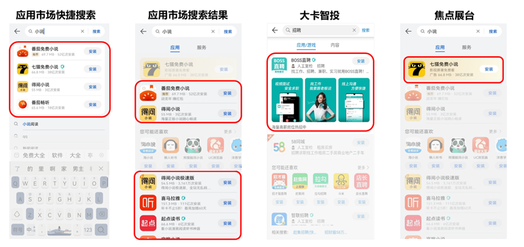
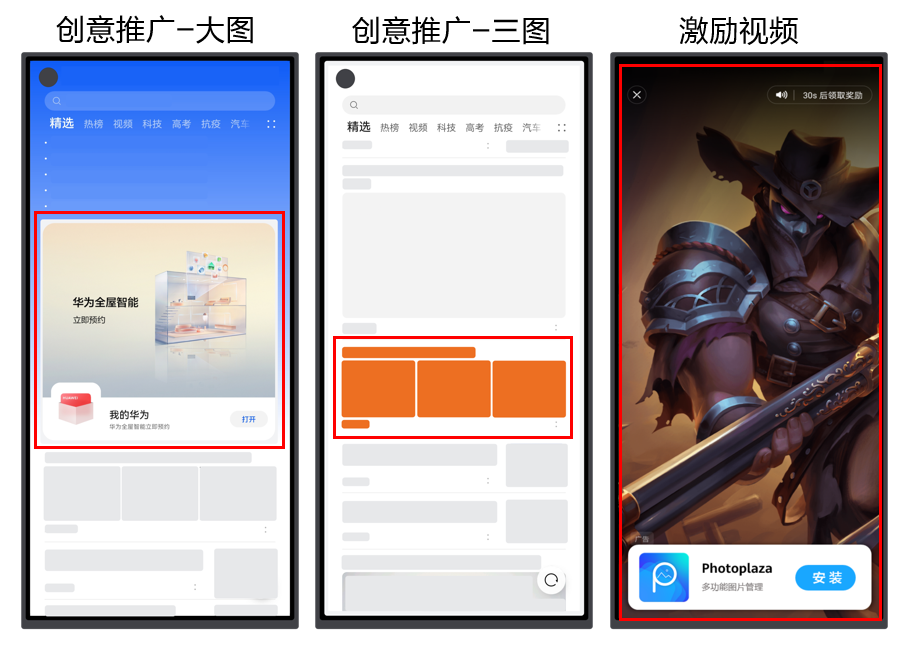
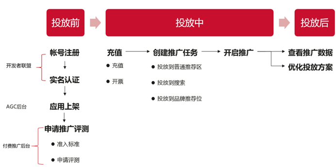

# 应用推广

## 业务概述

作为全球三大应用分发平台之一，华为应用市场围绕安全、精品、体验和全场景四大维度持续助力开发者高效分发、实现用户高质量增长。华为应用市场应用推广面向合作伙伴提供精准、优质、高效的推广服务，涵括流量场景、产品功能、赋能权益及营销方案，助力合作伙伴快速获量增长，实现商业成功。

## 应用推广优势特点

应用推广有四大优势特点：

### 流量大，转化高，即刻推广

亿级月活优质用户、千亿级年分发量，海量投放资源，高效直达客户。通过平台精准推荐算法，提高推广效率，达到投放高转化率的目的。应用通过推广评测，完成充值开发票之后，即可创建任务，开启推广之旅，与亿万优质华为用户紧密接触。

### 管理方式灵活，自管/托管随需选择

华为应用市场应用推广支持直客模式和客户投放伙伴模式投放管理。直客模式即直接管理推广自有应用，深度管理掌控全局；客户投放伙伴模式即为委托给客户投放伙伴负责推广，坐享收益。

### 计费方式简单灵活，成本可控

CPD计费方式按实际下载量计费，无需研究每个资源位的价值，您只要选择被推广应用和出价，系统就会根据应用的受欢迎程度、出价、与展示位置的匹配度等因素自动推广您的应用。另有分时段投放模式，设置想投放的时间段，配合日预算、出价等，灵活控制成本。

### 数据透明，支持归因分析

推广产生的消耗、下载等数据随时在后台查看，账目清晰准确。华为应用市场应用推广提供归因分析，洞察自家应用优劣势，随时调整推广策略。

## 计费方式

当前应用市场应用推广有四大计费方式。

### CPD

CPD（Cost per Download）：即按下载付费，根据实际下载量收费。

消耗费用 = 单个下载出价\*下载量

适用范围：精选推荐、全域推荐、应用搜索、焦点展台、创意推广等。

CPD竞价排序规则：按ECPM=pCTR\*CPD出价\*1000排序。CPD出价即为您在任务创建时设定的价格，pCTR由平台推荐算法根据大数据特征计算判定，为您找到匹配的用户群，为应用提供精准投放。

* 仅推广位上的新用户下载量计算在“下载量”之内，更新下载不计算，保障每一分钱都花在高质量新增用户身上；成本可量化、可控制。
* 华为应用市场应用推广为CPD推广任务设置专属资源位，当您充值完毕，并且设置好推广计划之后就会进入推广竞价列表。CPD推广出价和应用的质量会影响系统对应用的投放展示量，进而会影响到应用的下载量。更高的出价会为您带来更多的展示机会，但是这不是唯一决定的因素。

### CPC

CPC（Cost per Click）：即按点击付费。

消耗费用 = 单个点击出价\*点击量

适用范围：精选推荐、全域推荐、创意推广等。

点击量：用户实际点击应用ICON或点击素材/条目进入详情页的次数加上点击列表页“安装”按钮的次数，不计详情页点击“安装”按钮的次数。

纯ICON榜单和创意（图片、视频等）类的资源位均支持CPC计费，可以满足您促活或者内容展示的需求。

### CPM

CPM （Cost per Mille）即按展示量计费。

消耗费用 = 展示量\*CPM单价/1000

### CPT

CPT（Cost per Time）即按时长付费。

消耗费用 = 竞得资源位金额

适用范围：图文合约

图文合约任务中的品牌资源位以“天”为单位来计费，推广时间为00:00:00至23:59:59。您可在华为应用市场应用推广平台上，创建品牌推荐位的推广任务，对选定的时间、资源位进行在线竞价。竞价过程中，您可实时监测竞价情况。竞价结束后，若您的出价金额领先其他竞价方，则成功竞得该资源位。

## 推广资源位

共有四大类的推广资源：推荐资源、搜索资源、创意资源、品效资源等。

### 推荐资源

华为应用市场应用推广围绕华为应用市场、云文件夹、浏览器、全局搜索、负一屏等场景构筑华为终端应用分发体系，推荐资源覆盖以下场景：

### 搜索资源

华为应用市场应用推广搜索资源覆盖搜索中、搜索后两大围绕搜索框产生搜索行为的场景。

### 创意资源

创意资源是一种图文类广告，合作伙伴可根据自身推广的应用的需求或特点，制作上传自定义图片或视频素材，有利于帮助用户更直观地了解您的应用。

### 品效资源

品牌效果类资源，满足合作伙伴拉新、促活、成交等多种推广投放需求，提升用户对品牌的认可度和美誉度，进一步提高品牌价值及影响力。

## 推广流程

开发者在开启投放之前需要在开发者联盟后台完成账号注册，实名认证，AppGallery Connect后台完成应用上架，再进入应用推广后台申请推广评测。需要注意的是，目前仅支持企业开发者申请华为应用市场应用推广。完成推广评测和充值之后，即可创建任务，开启推广。开发者在任务开启后，可随时在后台报表查看推广数据，并进行后续优化。

