# 预约发布

## 概述

您的应用在鸿蒙应用市场上首次发布之前，您可以通过预约发布服务，实现用户从预约到安装应用的全链路闭环，高效触达目标用户。

如果您的鸿蒙应用提供预约发布服务，首先需要在[AppGallery Connect](https://developer.huawei.com/consumer/cn/service/josp/agc/index.html#/)上创建应用的简要版本，补充应用信息，再在[应用推广引擎](https://developer.huawei.com/consumer/cn/service/apcs/aggrowth/chassis/resources/scheduledService/mgt)使用预约发布服务，以便在发布之前吸引用户预约下载该应用。

发布当日，您的鸿蒙应用会自动下载到预约用户的设备上，以便立即开始体验您的应用。

目前应用仅支持中国区域的预约发布服务。

当前元服务不支持使用预约发布服务。

## 前提条件

1. 已在AppGallery Connect创建鸿蒙应用；若未创建，请参考[创建HarmonyOS应用/元服务](https://developer.huawei.com/consumer/cn/doc/app/agc-help-createharmonyapp-0000001945392297)开始创建。
2. 已在AppGallery Connect补充完整鸿蒙应用的应用信息；若未补充，请参考[配置应用信息](https://developer.huawei.com/consumer/cn/doc/app/agc-help-harmonyos-releaseapp-non-next-0000002179322402#section242410559206)，并前往[AppGallery Connect](https://developer.huawei.com/consumer/cn/service/josp/agc/index.html#/)补充应用信息，其中"应用信息"界面的语言，应用名称，应用图标，应用分类，应用标签为必填项。
3. 您的鸿蒙应用未在鸿蒙应用市场发布。

## 创建预约发布任务

1. 登录[应用推广引擎](https://developer.huawei.com/consumer/cn/service/apcs/aggrowth/chassis/resources/scheduledService/mgt)，进入预约发布服务页面，点击“新增发布”。

   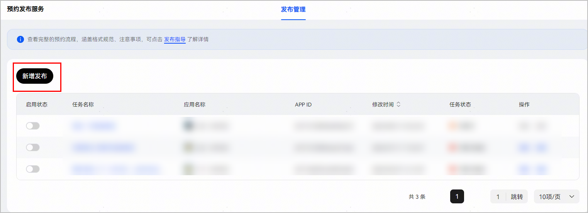
2. 选择未上架应用创建发布项目，填写相关信息。提交审核，待通过后即可开始预约发布。

   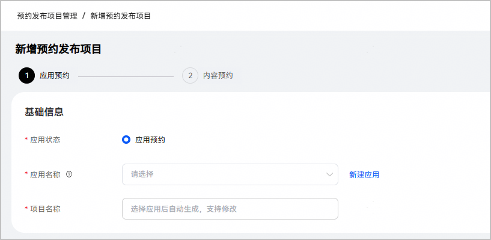

   

   * 若未找到目标应用，请参考[前提条件](#section17149192215207)第1点和第2点，新建鸿蒙应用和补充应用信息。
   * 若提交任务后系统显示"新增预约发布任务失败，应用基础信息不完整"，请参考[前提条件](#section17149192215207)第2点，补充应用信息。
   * 若提交审核按钮为灰色，请确认以下预约发布任务必填项是否都已填写。

|  |  |
| --- | --- |
| 预约发布任务设置项 | 说明 |
| 应用名称 | 必填项，读取开发者在AppGallery Connect草稿状态下的鸿蒙应用。 |
| 项目名称 | 必填项，系统自动初始化名称，支持手动修改。 |
| 预计上线时间 | 必填项，应用具体上线时间，暂未明确时可按预估时间填写。 |
| 上线时间展示 | 必填项，应用在鸿蒙应用市场展示的上线时间格式，支持以下3种方式选择：  1.展示具体时间(到日)，即在应用市场中展示的预计推出时间会具体到日。  2.展示具体时间(到月)，即在应用市场中展示的预计推出时间会具体到月。  3.不展示具体时间，即在应用市场中不展示预计上线时间。请先补充应用名称后，再选择此选项。 |
| 投放时间 | 必填项，项目投放时间，支持以下2种方式选择：  1. 正式上架后结束，应用上架后即停止投放任务。  2. 自定义投放时间，限定时间段开启投放。 |
| 应用介绍 | 必填项，应用的详细介绍。 |
| 应用一句话介绍 | 必填项，应用的一句话总结介绍。 |
| 应用素材及截图 | 必填项，应用的素材形式及截图。 |
| 版本号 | 必填项，应用的版本号。 |
| 隐私政策网址 | 必填项，应用的隐私政策网址 。 |
| 应用涉及获取的权限 | 必填项，应用涉及获取的权限。 |
| 年龄分级 | 必填项，应用的年龄分级。  您在[AppGallery Connect](https://developer.huawei.com/consumer/cn/service/josp/agc/index.html#/)填写的应用分类，将决定哪些年龄分级可供选择。 |
| 内容标题 | 必填项，关于预约应用的内容标题，不超过30个中文。<strong>该标题不可与应用名称重复。</strong> |
| 内容简短文案 | 必填项，关于预约应用的内容简短描述，不超过50个中文。 |
| 内容完整文案 | 必填项，关于预约应用的内容详细描述，不超过120个中文。 |
| 封面图片 | 必填项，关于预约应用的内容封面图片。设计原则可参考以下：  说明：  1.黄色区域为图片的视觉重心。  2.蓝色区域为图片的辅助区域，其左上角及右上角系统自带圆角裁切效果。  3.红色区域作为底部区域，展示内容标题、内容简短文案或应用列表。请注意：系统将自动生成此区域的模糊蒙层，请勿在该区域上预置同类效果或文案，避免内容标题被遮挡。  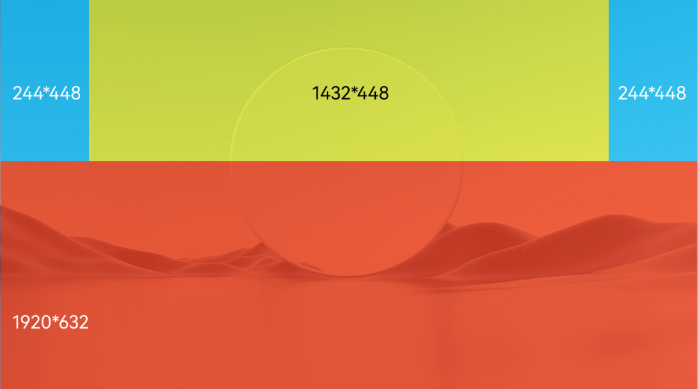 |
| 详情页图片 | 必填项，关于预约应用的内容详情页图片，建议使用无文字的图片素材。 |

## 管理预约发布任务

您可以在预约发布管理台处对已创建的预约发布任务进行修改，暂停，删除等操作。同一个未上架应用仅支持创建一个预约发布任务。

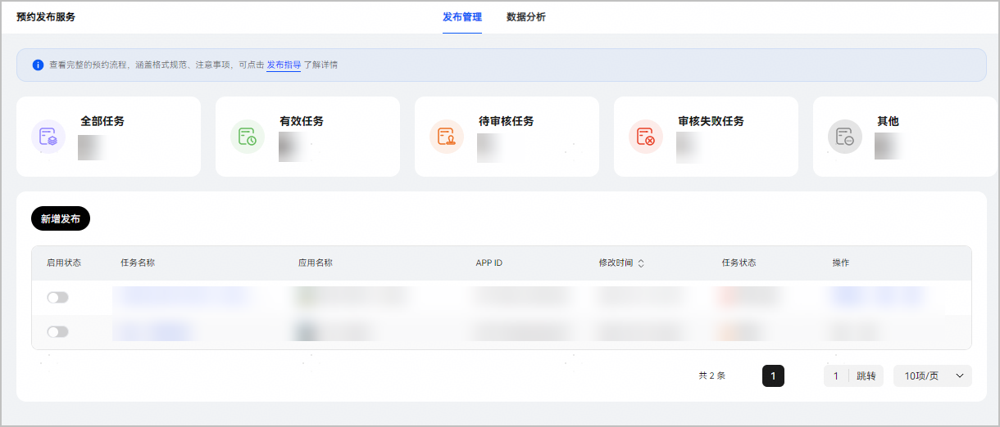

### 查看预约发布任务

在预约发布管理台处，找到想要查看的预约发布任务，点击任务名称即可。

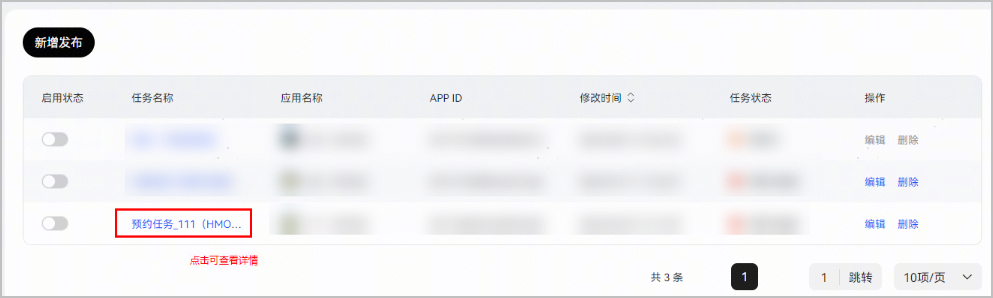

投放中的预约推广任务以通过审核的应用信息为准。

若您后续在AppGallery Connect更新了应用信息，则需要修改预约推广任务，重新提交审核。

### 修改预约发布任务

1. 在预约发布管理台处，找到想要修改的预约发布任务，点击"编辑"。

   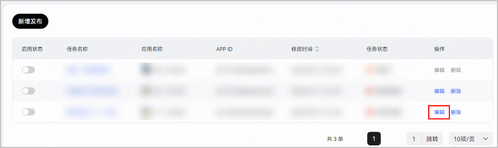
2. 选择想要修改的信息，重新编辑。

   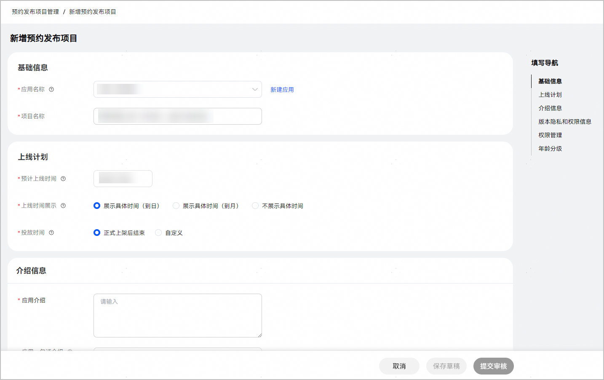
3. 重新提交，待审核通过后，预约推广任务即修改成功。任务审核通常会在7个工作日内完成。

   

   若需涉及到应用名称及应用图标的编辑，则需要在AppGallery Connect处修改。待5分钟后，数据会同步到应用推广引擎。

   数据同步后，即可使用最新的应用信息。

### 暂停预约发布任务

在预约发布管理台处，找到想要暂停的预约发布任务，点击任务左侧按钮置灰即可。

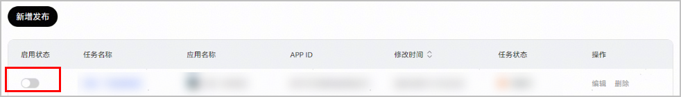

### 重启预约发布任务

在预约发布管理台处，找到想要重启的预约发布任务，点击任务左侧按钮变蓝即可。

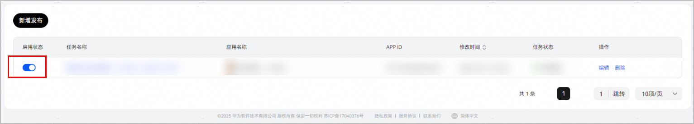

### 删除预约发布任务

在预约发布管理台处，找到想要删除的预约发布项目，点击“删除”即可。

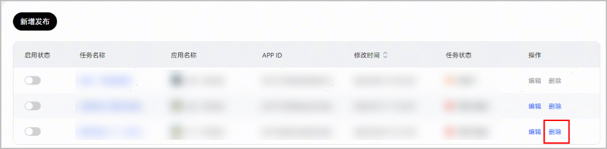

## 数据分析

您可以在[数据分析](https://developer.huawei.com/consumer/cn/service/apcs/aggrowth/chassis/resources/scheduledService/analysis)页面，对已创建的预约发布任务进行数据分析和导出。当前支持应用、日期、任务维度的检索，查询预约量、展示量、取消预约量以及预约率的数据和趋势。

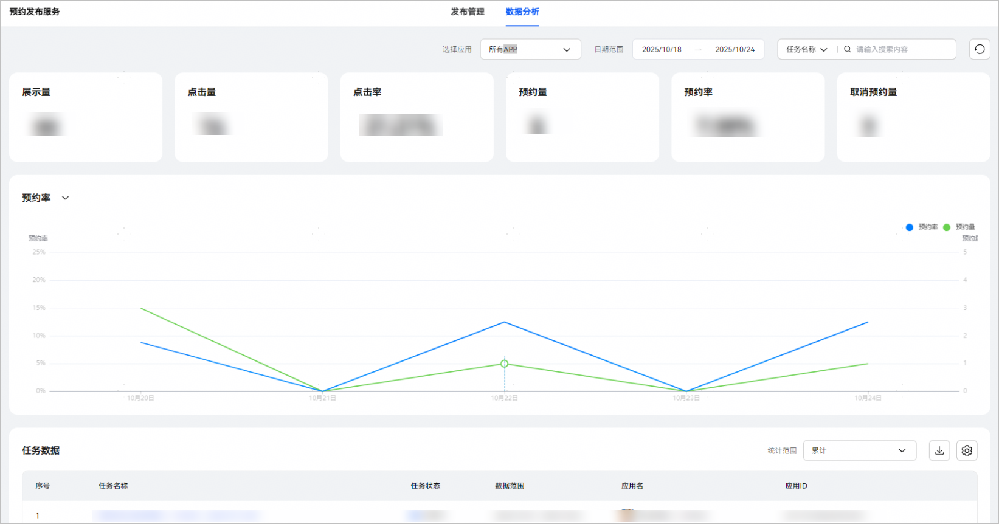

## FAQ

<strong>1. 鸿蒙</strong><strong>应用和鸿蒙游戏都可以使用"预约发布"服务吗？会展示在哪里？</strong>

感谢您的关注与支持。当前分发至中国大陆的鸿蒙应用和鸿蒙游戏首次发布之前均可通过应用推广引擎进行"预约发布"。预约发布任务审核通过后，即会展示在鸿蒙应用市场，抢先一步为您锁定潜在用户。

<strong>2.</strong> <strong>"预约发布"服务需要付费才能使用吗？</strong>

感谢您的关注与支持。"预约发布"服务全面免费开放给开发者，助力开发者高效触达目标用户。

<strong>3.</strong><strong>可以使用"预约发布"服务宣传应用/游戏更新版本更新吗？</strong>

感谢您的关注与支持。当前不支持为应用/游戏更版创建"预约发布"任务。"预约发布"服务仅支持您的鸿蒙应用/游戏在首次发布之前，通过预约发布任务触达目标用户。

<strong>4.</strong><strong>"预约发布"任务创建后需要审核吗？审核期是多长？</strong>

感谢您的关注与支持。创建"预约发布"任务后会进入审核阶段，任务审核通常会在7个工作日内完成。请您按照贵司的应用预热、上架计划提前进行"预约发布"任务创建。

<strong>5.</strong><strong>“预约发布”任务支持展示在哪些设备类型上的鸿蒙应用市场？</strong>

感谢您的关注与支持。当前"预约发布"任务支持展示在手机和平板鸿蒙应用市场。后续会逐渐支持在更多设备上展示，敬请期待。