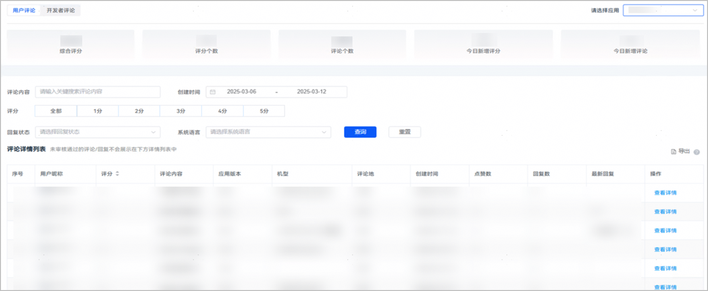
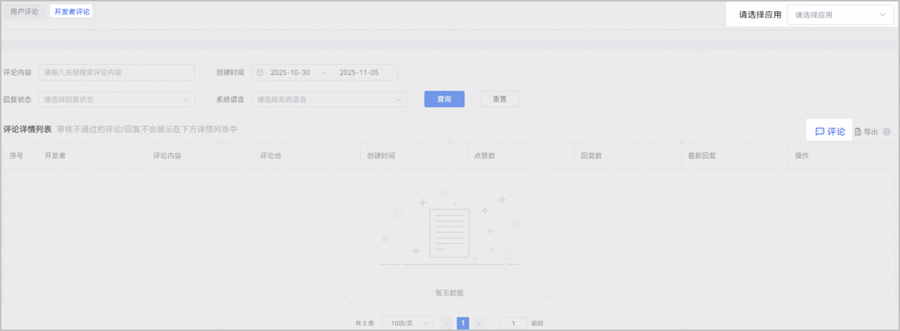
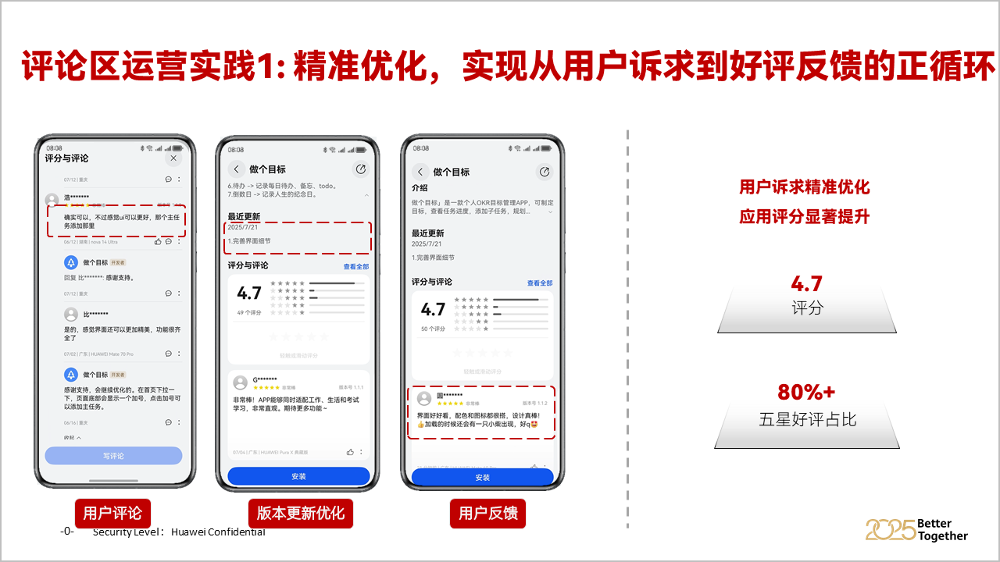
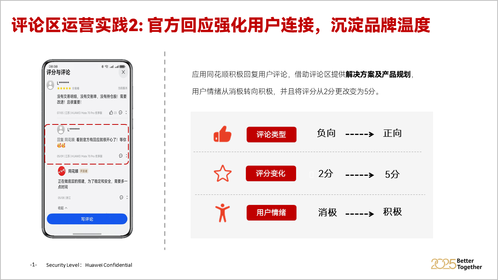
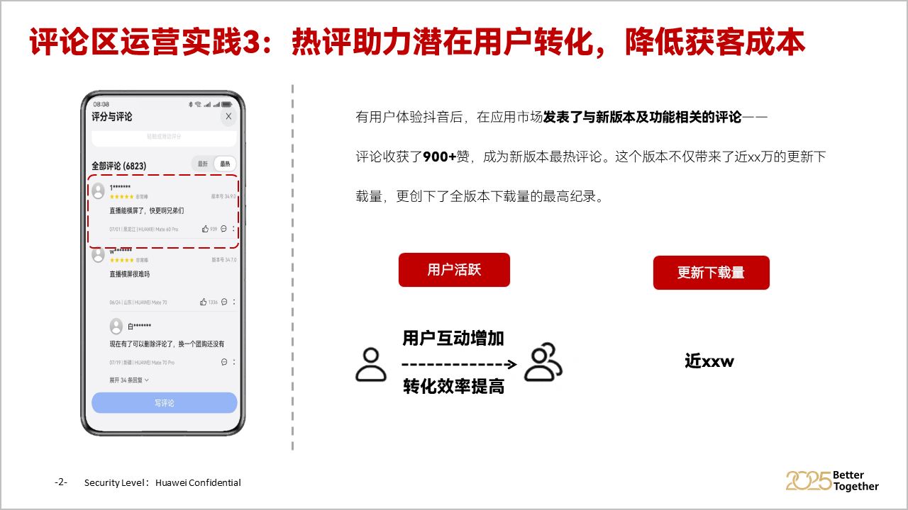
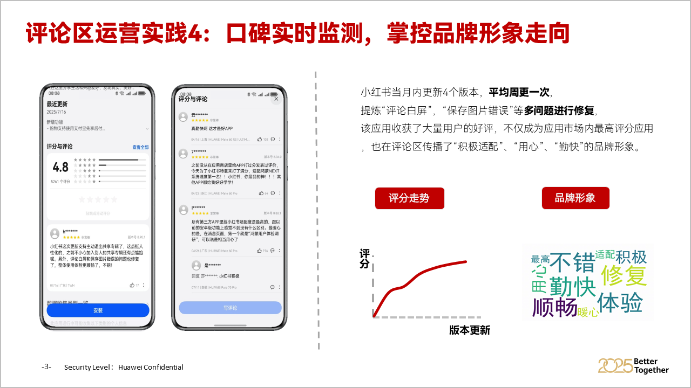

# 评论与评分

## 概述

鸿蒙应用市场评论评分服务为HarmonyOS 5.0及以上开发者提供一站式评论管理解决方案，涵盖评论回复互动、数据导出分析、API接口对接等核心功能，帮助您快速响应用户反馈、挖掘产品优化方向、提升应用评分与用户满意度。

### 核心功能矩阵

|  |  |  |
| --- | --- | --- |
| <strong>功能模块</strong> | <strong>核心价值</strong> | <strong>适用场景</strong> |
| [查看、回复、导出用户评论](#section898941831118) | 实时响应用户反馈，解决用户诉求，塑造良好品牌形象；批量获取评论原始数据，支持多维度筛选。 | 处理用户咨询、投诉、好评致谢，舆情紧急响应、产品迭代分析、用户需求调研、客服质量复盘。 |
| [发表开发者评论](#section1045954151116) | 开发者主动发布官方信息，如版本更新说明、功能亮点介绍、问题修复通知等，强化与用户的信息传递。 | 新功能上线宣传、重大问题修复告知、活动推广、用户疑问集中解答。 |
| [应用内评分弹窗](#section1335414545113) | 在应用内合适场景触发评分弹窗，引导用户便捷提交评分与评论，提升应用主动评价量。 | 应用核心功能使用完成后、用户体验良好时、版本更新后。 |
| [评论置顶/删除](#section18729954151115) | 对重要评论（如官方评论、优质用户好评）进行置顶展示，对违规评论（含恶意诋毁、广告导流等）进行删除，维护评论区秩序。 | 突出官方重要通知、展示优质用户反馈、清除恶意评论内容。 |
| [评论回复消息通知](#section113774111143) | 开发者回复用户评论后，通过 Push通知实时告知用户，提升用户查看回复的概率，增强用户互动体验。 | 用户提交评论后、开发者完成回复时，确保用户及时知晓反馈结果。 |
| [评论API支持](#section546022981211) | 实现评论数据与自有系统打通，支持自动化运营。 | 自定义数据分析、第三方工具集成、批量运营脚本开发。 |

请您正确使用评论工具，精细化运营提升应用评分。为维护评论区健康生态，鸿蒙应用市场禁止一切通过付费、提供奖励或第三方渠道操纵评论评分的行为，如有发现我们将采取相应措施，其中可能包含对您的应用进行下架处理。

## 详细操作指导

<strong>首次登录应用推广引擎时，请使用账号持有者关联的华为账号。账号持有者登录后可在“账号管理”对协作者进行授权使用。</strong>

### 评论回复、查看与导出

* 操作路径：登录[应用推广引擎](`https://developer.huawei.com/consumer/cn/service/apcs/aggrowth/chassis/resources/interactiveTools`)→选择【用户互动】服务→进入【评论互动】页面→默认展示【用户评论】列表。
* 功能说明：
  1. 支持按「星级（1-5 星）」「应用版本」「机型」「评论时间」「是否已回复」筛选检索。
  2. 支持关键词搜索评论内容，快速定位相关反馈。
  3. 每条评论显示完整信息：用户昵称、评分、评论时间、评论内容、机型、系统版本、点赞数、回复数、已回复评论标注「最新回复」。
  4. 在评论列表中找到已回复的评论，点击右侧「查看详情」→「回复」。
  5. 评论列表右上方点击「导出」，最多支持180条评论内容批量导出。

* 功能使用建议：
  1. 产品优化：通过关键词分析（如 “卡顿”“闪退”“功能缺失”），定位高频问题，优先纳入版本迭代计划。
  2. 用户分层运营：根据用户评分与评论内容，划分忠诚用户、潜在流失用户、问题用户，针对性制定运营策略。
  3. 搜索优化：提取用户常用描述关键词，优化应用关键词/标签（推荐使用[应用市场搜索优化服务](`https://developer.huawei.com/consumer/cn/doc/app/search-0000002414572264`)），提升搜索曝光。
  4. 客服培训：分析用户常见咨询问题，完善客服知识库，提升客服响应效率与解决问题能力。

### 开发者发布官方评论

* 操作路径：登录[应用推广引擎](`https://developer.huawei.com/consumer/cn/service/apcs/aggrowth/chassis/resources/interactiveTools`)→选择【用户互动】服务→进入【评论互动】页面→选择【开发者评论】
* 功能说明：
  1. 选择需发布官方评论的应用（若账号下有多个应用）。
  2. 右上角点击「评论」输入开发者评论内容并提交，等待平台审核。
  3. 审核通过后，官方评论将在应用评论区展示，标注「开发者」标识。

* 功能使用建议：
  1. 官方评论内容需与应用相关，避免发布无关信息（如其他应用推广、无关活动等）。
  2. 官方评论支持编辑与删除，编辑后需重新审核，删除后不可恢复；已有点赞或回复的开发者评论不支持重新编辑。
  3. 严禁通过官方评论恶意攻击竞品、误导用户。

### 应用内评分弹窗

开发者可通过集成鸿蒙应用市场提供的SDK，在应用内特定场景（如用户完成核心功能体验、使用应用满一定时长、版本更新后）触发评分弹窗，引导用户直接在弹窗中提交评分（1-5 星）与评论，简化用户评价流程，提升主动评价量。弹窗触发需遵循平台规则，避免频繁打扰用户（同一用户一年内最多触发3次）。

* 操作路径：
  1. 应用[调用接口](`https://developer.huawei.com/consumer/cn/doc/harmonyos-guides/appgallery-comment`)拉起应用评论弹窗。
  2. AppGalleryKit返回接口调用结果给应用。
  3. 应用返回评论窗口给用户。

* 功能使用建议：
  1. 时机选择：在用户感到满意时出现，如：用户完成一项任务、成功通关或达到某个里程碑后的开心时刻弹出评分请求。
  2. 频率克制：不要对同一用户重复弹出相同内容的弹窗。用户拒绝或关闭后，应记住其选择，并在合理的时间间隔后（或当上下文更相关时）再次询问。
  3. 反馈机制设计：设计一个问题反馈流程，引导潜在好评用户去评分，而将体验不佳的用户引导至内部反馈渠道，给用户一个表达不满的出口。例，可设置两个按钮：“去好评”和“吐个槽”。当用户选择“吐个槽”时，引导至应用内的反馈页面，这样既能收集到宝贵意见，也避免了用户因无处宣泄而去商店打低分。
  4. 评论管理：收到评分和评论后，积极的管理同样重要。你可以[应用推广引擎](`https://developer.huawei.com/consumer/cn/service/apcs/aggrowth/chassis/resources/interactiveTools`)中及时回复用户的评论，保持回复简洁明了、尊重友善。优先处理低分评论和提及当前版本技术问题的评论，明确表示你已知晓问题并正在处理。若新版本已修复相关问题，可在更新说明中提及并回复相关评论，告知用户问题已解决。

### 评论内容置顶与删除

<strong>评论内容置顶：</strong>

鸿蒙应用市场支持将开发者官方评论或优质用户评论（如 5 星好评且内容有参考价值）置顶在评论区顶部，提升内容曝光度，您可以提供APPID+需要置顶的评论截图（最多3条，且评论时间于近期一个月以内）发邮件到developer@huawei.com申请置顶。

<strong>评论内容删除：</strong>

对含违规内容的评论（如恶意诋毁、人身攻击、广告导流、虚假反馈、涉政涉黄等）、不实评论（如历史版本不具备相关功能产生的差评），开发者可提供含用户昵称及时间的评论截图、应用名称，APPID及申请删除的理由，通过邮件反馈至developer@huawei.com申请删除，平台审核通过后移除评论，维护评论区良好秩序。

### 评论回复消息通知

开发者回复用户评论后，系统将自动向该用户发送Push通知，告知用户评论已收到回复，引导用户返回应用商店查看回复内容，提升用户互动率与回复查看率，通知内容不可自定义，由平台统一生成。

Push通知触发条件：

1.开发者回复用户评论且审核通过。

2.用户开启应用市场Push通知权限。

### 评论API支持

您可以通过[Comments API-开发指南](`https://developer.huawei.com/consumer/cn/doc/AppGallery-connect-References/agcapi-comapi-harmonyos-0000002470067188`)<strong>，</strong>高效管理您的鸿蒙应用评分数据，支持查询应用的评论评分列表，回复用户的评论。

## FAQ

<strong>1.找不到应用市场鸿蒙应用的评论评分数据，或评论数据没更新？</strong>

开发者您好，应用市场评论与评分服务已完成升级，请您前往[应用推广引擎-用户互动](`https://developer.huawei.com/consumer/cn/service/apcs/aggrowth/chassis/resources/interactiveTools`)查看及管理评论，感谢您的支持。

<strong>2.登录应用推广引擎-用户互动页面后，显示应用数据为空，无法找到账号下关联的鸿蒙应用？</strong>

开发者您好，首次登录应用推广引擎使用评论与评分服务时，需要您使用账号持有者关联华为账号登录，即在开发者联盟完成应用上架时关联的账号，请确认您是否为账号持有者角色。

## 评论运营案例

