# 数字商品服务

## 概述

数字商品服务为了帮助开发者更好地实现应用增长和商业价值，为开发者提供全生命周期服务，实现多路径用户、收入、经营能力增长，推出一站式的应用推广引擎提供应用全域增长能力，开发者可以在增长平台上使用数字商品全域推广能力以及一站式管理数字商品服务全流程。

## 创建商品推广任务

* 您可以通过“[应用推广引擎](`https://developer.huawei.com/consumer/cn/service/apcs/aggrowth/chassis/home`)”首页点击进入“[数字商品](`https://developer.huawei.com/consumer/cn/service/apcs/aggrowth/chassis/digitalProduct/resources/promotion/serviceMgt`)”后，点击“推广管理”页面， 进入数字商品管理台。

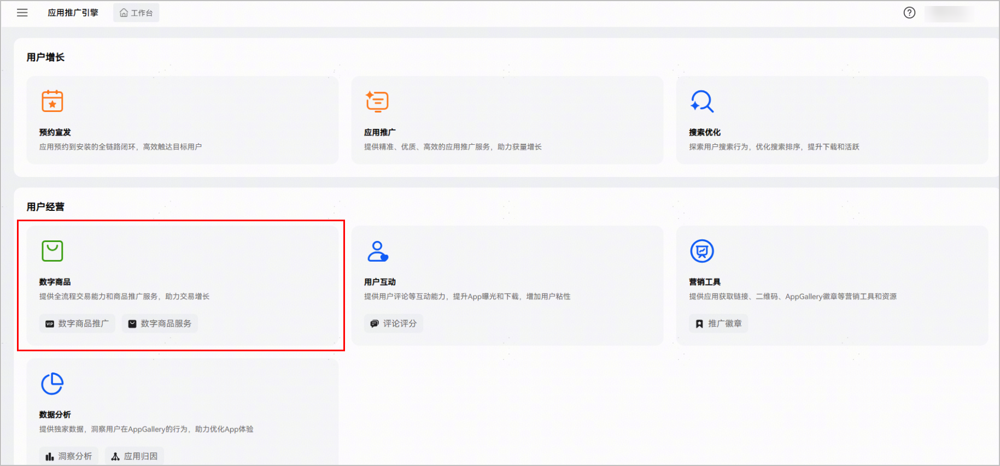

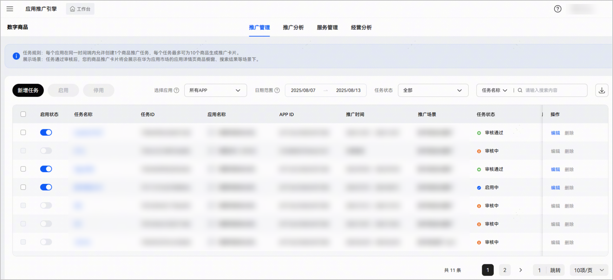

1、仅支持已签署数字商品服务协议的HarmonyOS应用（不支持元服务&Android应用），请在AppGallery Connect内开通应用内购买后使用。

2、如登录账号为主账户，旗下在[AppGallery Connect](`https://developer.huawei.com/consumer/cn/service/josp/agc/index.html#/`)创建的所有应用均默认为【推广已授权的应用】。

3、如登录账号为协作者账户（子账户），需通过主账户应用授权后，即可支持数字商品推广任务管理。

* 点击推广管理页上的“新增任务”按钮，打开推广任务详情页面，支持创建商品推广任务。

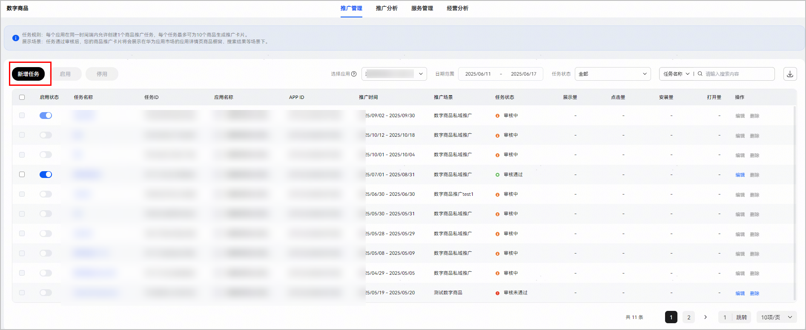

* 选择您要推广的应用，填写基础信息。

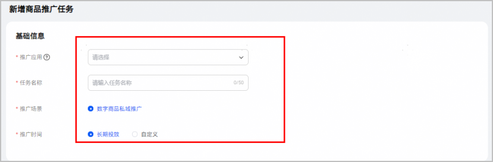

1、 任务名称：长度不超过50个字符，超过不允许输入；不支持特殊字符。

2、 推广场景：默认选择"数字商品私域推广"。

3、 推广时间：

- 推广时间可选长期投放或自定义选择日期，如果选择长期投放则该任务审核通过后即生效。

- 如果点击选定日期，支持选择跨度最长一年，支持最早选择今天开始。

如存在时间冲突的推广任务（删除状态除外），请调整推广时间后再试。

* 点击 “新增推广卡片”按钮或列表中“编辑”按钮，在所有该应用当前生效状态的商品中选择要推广的商品，并填写推广信息。

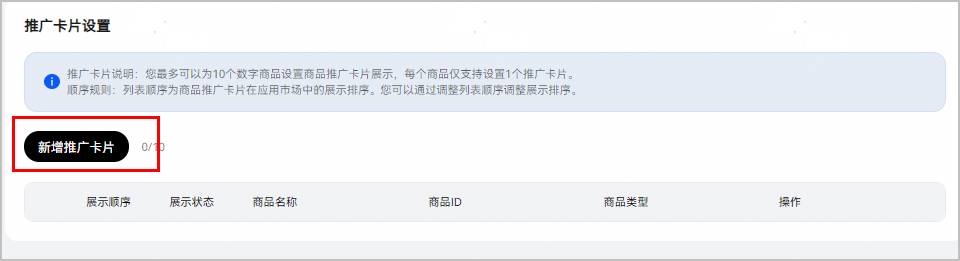

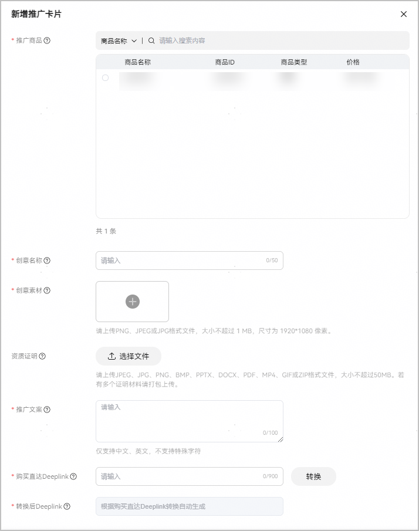

[创建数字商品操作指南](`https://developer.huawei.com/consumer/cn/doc/app/create-digital-products-0000001958955105`)

<strong>1、</strong><strong>创意名称：</strong>用于标识该推广卡片创意，便于您后续进行管理，不会展示在应用市场上。建议包含该推广卡片内容关键词（如功能/场景/营销节点等），长度控制在50个字以内。

<strong>2、创意素材：</strong>将作为该商品内容的展示图展示在应用市场上，建议包含购买该商品后可解锁的应用内容/权益以及高辨识度视觉元素（如品牌LOGO、应用内核心功能和内容等）。为了避免与系统里的商品定价不一致，请勿在素材图片上标注价格。请上传PNG、JPG或JPEG格式文件，尺寸为1920\*1080像素，大小不超过1MB。

<strong>3、资质证明：</strong>如创意素材涉及肖像权、商标或第三方版权内容，请上传内容权利人的有效授权书，资质文件需包含授权方、被授权方、授权范围及有效期等。请上传JPEG、JPG、PNG、BMP、PPTX、DOCX、PDF、MP4、GIF或ZIP格式文件，大小不超过50MB，若有多个证明材料请打包上传。

<strong>4、推广文案：</strong>此文案将展示在上述素材图下方，帮助用户更好地理解该商品内容，建议用1-2句话突出该商品的解锁权益与核心价值，最长不超过100字符。为了避免与系统里的商品定价不一致，请勿在推广文案中标注价格。

<strong>5、购买直达Deeplink：</strong>建议填写能自动拉起应用内展示该商品的页面链接，以便当用户在应用市场内点击该商品推广卡片上的购买按钮后，可以直达该页面，并在应用内完成后续的购买操作。注意： 链接不能以http、https开头。

<strong>6、转换后</strong><strong>Deeplink：</strong>系统将基于您填写的Deeplink自动生成携带商品ID的转换后标准链接，当用户在应用市场里点击购买时会打开该链接。您可以扫描二维码验证转换后的跳转链接的准确性和效果。

请勿在素材图片和推广文案中标注价格。

请注意图片安全区域展示，重要信息即安全区要在白色蒙层里。

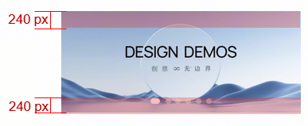

## 推广管理

* 在推广任务列表，支持针对单个任务启用或停用；支持勾选全部/部分任务进行批量启用或批量停用。

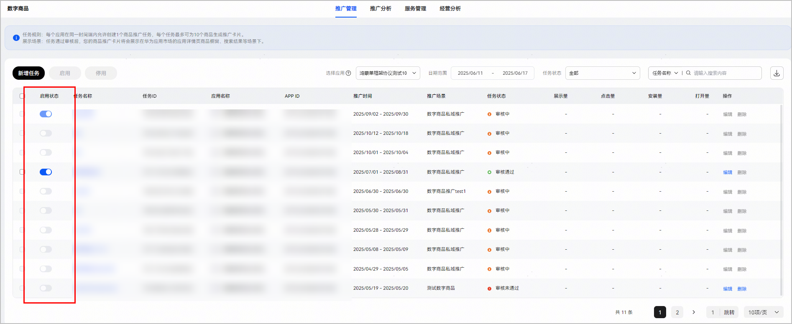

* 任务状态包括草稿、启用中、停用、完成、审核中、审核不通过、审核通过，可筛选对应状态的任务。

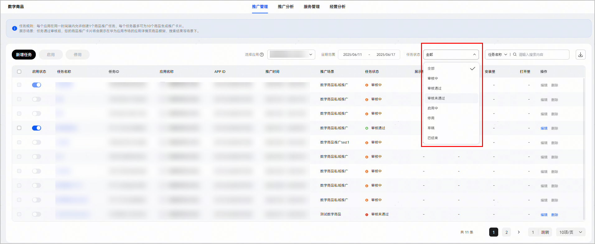

推广任务新建并保存后，状态为草稿；后续编辑草稿态的任务时，不支持再次保存，编辑后仅支持提交审核。

## 推广分析

### 概览

您可以选择所有APP或单一应用及时间范围，切换不同维度进行数据分析。时间维度最长365天，如选择时间范围超过90天，图表只会按月展示数据。

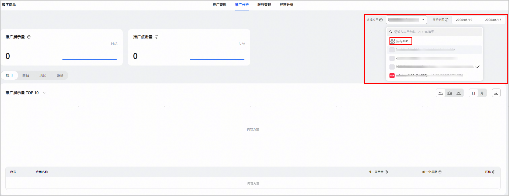

### 支持按应用、商品、地区、设备四个维度分析数据

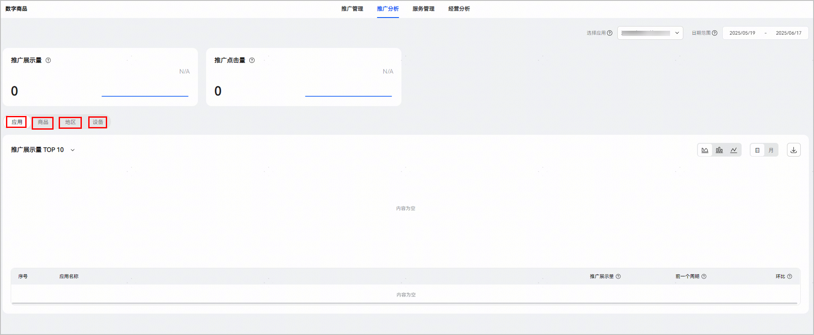

## 服务管理

* 数字商品基础服务分步骤流程图，共分为以下五个步骤：

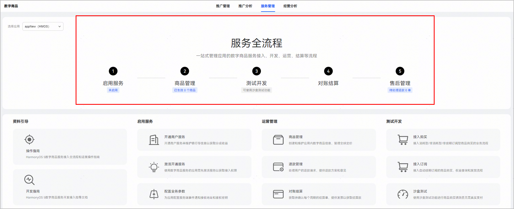

1、启用服务：如果该应用已在AGC-我的项目-应用内购买服务页面上激活服务，则此处状态为“已启用”，否则为“未启用”。应用启用数字商品服务的指南详见：[配置数字商品服务](`https://developer.huawei.com/consumer/cn/doc/app/digital-products-serve-0000001931836308`)。

2、商品管理：该应用在单框PMS中存在多少个生效状态的数字商品。商品管理系统操作指南详见：[管理数字商品](`https://developer.huawei.com/consumer/cn/doc/app/digital-products-manage-0000001959074881`)。

3、对账结算：该应用的开发者在联盟侧-管理中心-收益是否存在待确认的数字商品服务结算单。财务结算操作指南详见：[财务结算](`https://developer.huawei.com/consumer/cn/doc/app/financial-settlement-0000001931995732`)。

4、售后管理：该应用待处理的退款请求工单数量。订单售后管理操作指南详见：[退款管理](`https://developer.huawei.com/consumer/cn/doc/app/refund-management-0000002084083100`)。

## 经营分析

支持筛选数据统计的结束日期，选择后页面展示的数据为该日期及往前30天的汇总数据。

点击“经营分析”，展示所选应用在所选日期的30天内的汇总鸿蒙全渠道数字商品经营数据（不仅限于推广任务）。

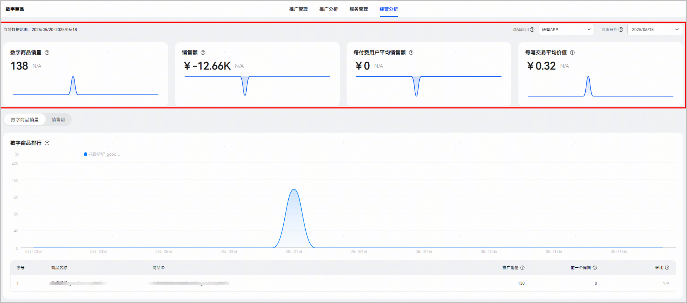

选择单个应用，点击左上角“更多数据”，跳转[AppGallery Connect](`https://developer.huawei.com/consumer/cn/service/josp/agc/index.html#/`)-分析-数字商品服务分析-概览。

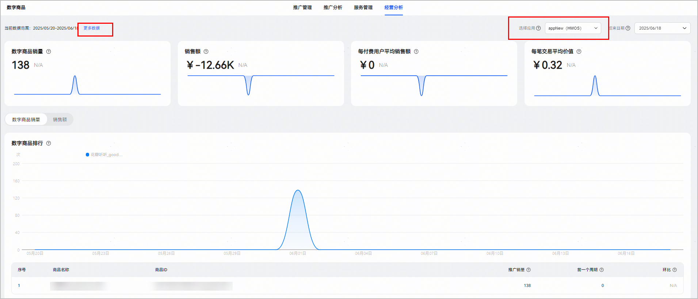