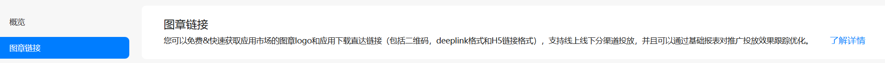
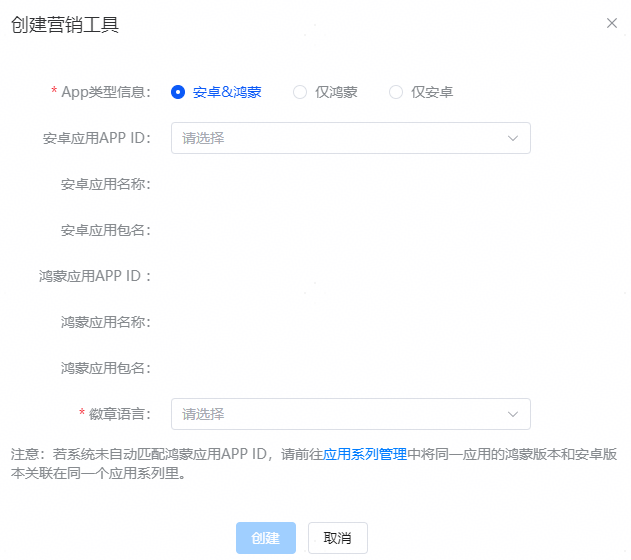
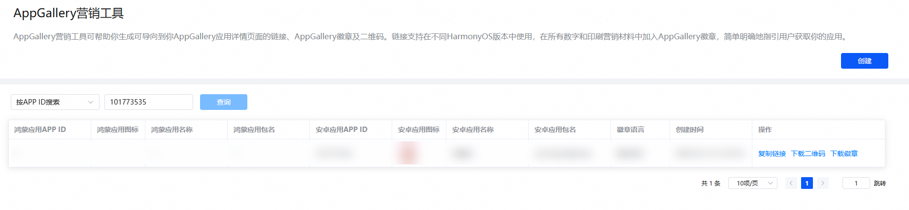

# 营销工具

## 业务介绍

您可以通过“[AppGallery营销工具](`https://developer.huawei.com/consumer/cn/service/apcs/aggrowth/chassis/resources/appMarketingTools`)”来分发应用，可以将链接/二维码投放到推广的第三方应用或者社交媒体。

该功能提供标准化的链接、徽章和二维码，使用任意鸿蒙系统版本均可进入应用市场详情页面进行应用下载和安装，不需要区分和维护同一个应用的多系统版本链接，方便开发者获取和使用。

AGC中的图章链接功能不支持鸿蒙应用创建。请前往[AppGallery营销工具](`https://developer.huawei.com/consumer/cn/service/apcs/aggrowth/chassis/resources/appMarketingTools`)创建链接并获取AppGallery徽章。

## 创建营销工具

您可以在[AppGallery营销工具](`https://developer.huawei.com/consumer/cn/service/apcs/aggrowth/chassis/resources/appMarketingTools`)为您的应用申请链接、二维码及徽章。

App应用类型有三个选项：鸿蒙&安卓、仅鸿蒙、仅安卓，默认选定鸿蒙&安卓，开发者可根据自身应用进行选择。

1. 若开发者在应用类型中选择仅鸿蒙，则仅显示鸿蒙应用相关信息，选择徽章语言并点击“确定”，生成的链接对应“仅有单框应用-融合链接”场景的体验。
2. 若开发者在应用类型中选择仅安卓，则仅显示安卓应用相关信息，选择徽章语言并点击“确定”，生成的链接对应“仅有安卓应用-融合链接”场景的体验。
3. 若开发者需创建鸿蒙&安卓应用，在创建页面选择安卓应用APP ID后，自动关联出安卓应用名称和安卓应用包名信息并自动带出鸿蒙应用APP ID及鸿蒙应用名称和鸿蒙应用包名信息。
4. 若开发者事前未关联过鸿蒙和安卓应用的绑定关系，则安卓应用APP ID以及应用名称和应用包名处置空，不可修改。此时开发者可以点击创建按钮下方的提示语中的[应用系列管理](`https://developer.huawei.com/consumer/cn/service/josp/agc/index.html#/`)，跳转到应用系列管理页面，将鸿蒙版本和安卓版本的应用关联后，再返回此页面操作时，即可自动带出安卓应用的相关信息，此时选择徽章语言后，可以点击“确定”，生成的链接对应“同时有单双框应用-融合链接”场景的体验。

## 复制链接、下载二维码、下载徽章

* 点击“复制链接”，可获取链接用于应用推广。
* 点击“下载二维码”，可获取6张不同形式的二维码，提供给用户用于扫描下载。
* 点击“下载徽章”，可用于线上营销。

