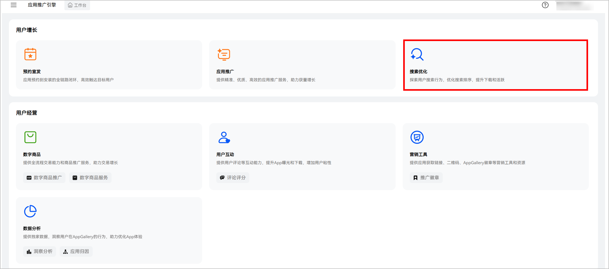
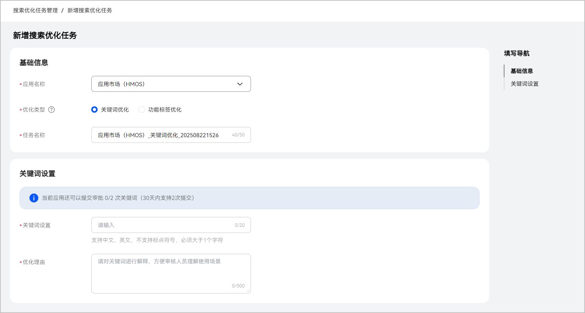
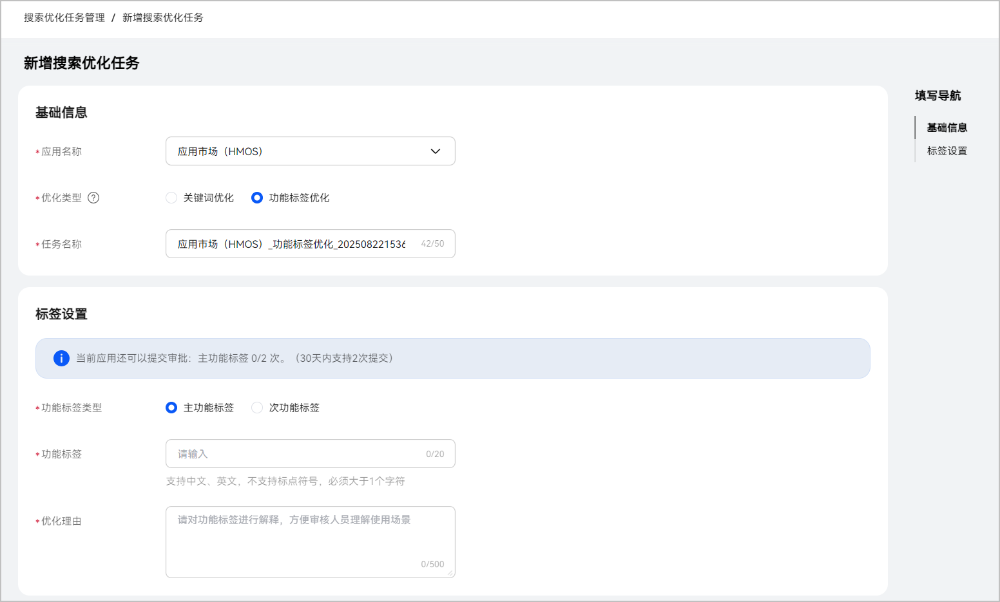
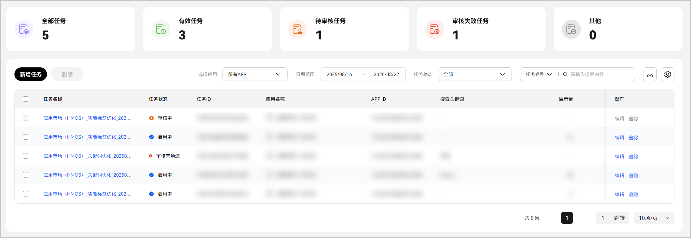
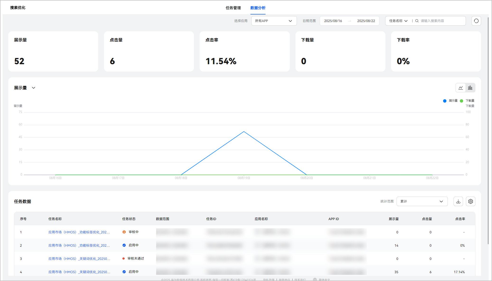

# 搜索优化服务

## 概述

搜索优化服务是面向开发者推出的一项旨在对应用的别名及功能标签进行优化的服务。主要涵盖两种优化方式，关键词优化与标签优化。开发者提交关键词和标签信息，通过审核后，会辅助应用市场的算法进行结果召回，进而有效提升应用在特定关键词下的曝光和转化效果。

如果您是首次登录平台，需使用账号持有者角色关联的华为账号登录，否则无法关联到对应的鸿蒙应用。

## 创建搜索优化任务

您可以通过[应用推广引擎-搜索优化服务](https://developer.huawei.com/consumer/cn/service/apcs/aggrowth/chassis/workbench)入口，提交关键词设置、主功能标签、次功能标签。

## 提交关键词优化

当您的应用存在应用别称、同义检索词、或者其他用户更习惯使用的搜索名称时，您可以提交关键词优化，保证用户在搜索这些关键词时，算法能够精准返回您的应用。在提交时，您需要填写优化理由，以帮助算法、人工审核更快速地了解您提交的关键词的有效性和必要性。

<strong>如果您提交的关键词，在应用市场搜索后已能正常返回您的应用，那么任务将不会生效，请您在提交之前搜索并确认。</strong>

1.一个应用支持同时存在3个关键词优化任务。

2.未审批通过前，任务仍可修改并提交。

3.审核通过的任务达到上限后，距离提交时间3个月后才可以再次提交，请您留意额度使用情况。

4.不支持标点符号，不支持单汉字、单字母，长度限制20个字符。

## 提交功能标签优化

您可以提交主功能标签和次功能标签。当您的应用主要功能发生变化时，您可以提交主功能标签，算法会根据您的主功能标签，增加在相关关键词下的曝光；当您的应用改版更新，推出全新功能，或者存在一些非主要功能时，您可以提交次功能标签，算法会根据您提交的次功能标签进行数据训练，当用户搜索与次功能相关的关键词时，您的应用将有机会得到曝光。

<strong>如果您提交的功能标签，已经存在应用市场标签数据库内，如二三级分类标签等，那么新增的功能标签将不会产生实际意义。</strong>

1.一个应用支持同时存在2个主功能标签优化任务和2个次功能标签任务。

2.未审批通过前，任务仍可修改并提交。

3.审核通过的任务达到上限后，距离提交时间3个月后才可以再次提交，请您留意额度使用情况。

## 管理搜索优化任务

您可以在搜索优化的任务管理界面进行创建、查询、修改，删除等操作。

任务状态：

1. 当算法判断该应用别名或者功能标签能有效增加应用曝光时，任务将自动生效，任务状态更新为“启用中”；

2. 当算法判断应用别名或者是功能标签相关度低或已在标签库存在时，任务将进入人工审核阶段，此时任务状态显示为“审核中”；

3.当提交的关键词或功能标签最终未能通过人工审核时，任务状态显示为“审核未通过”。

您可以对您提交的优化任务重新编辑，重新编辑后的任务将重新进入审核流程。

## 数据分析

您可以在搜索优化的任务管理界面对已创建的搜索优化任务进行数据分析。当前支持应用、日期、任务维度的检索，查询展示量、点击量、点击率、下载量以及下载率的数据和趋势。

数据报表仅展示新增曝光、点击等数据，如果您提交的关键词或标签并未能带来新增曝光，那么展示量、下载量等数据将展示为0，您可以修改您的关键词或标签后重新提交。

## FAQ

<strong>1</strong><strong>、搜索优化服务是否免费？</strong>

是免费的，该功能是面向开发者提供的，支持对应用别名或功能标签进行优化的服务。

<strong>2</strong><strong>、搜索优化服务与应用推广服务的关键词设置有什么区别？</strong>

应用推广服务关键词投放是为开发者提供付费推广服务，您可以通过关键词投放影响应用的排序结果。

<strong>3</strong><strong>、鸿蒙应用可以使用该功能吗？</strong>

该服务适用于所有类型的应用，包括鸿蒙应用。只要通过应用推广引擎进入搜索优化服务并签署优化服务协议即可。如果应用未在架，系统会提示未关联应用，请先完成鸿蒙应用的注册。

<strong>4、提交关键词优化时显示“校验未通过”？</strong>

提交的关键词不支持标点符号，不支持单汉字、单字母，长度限制20个字符。

当您提交的关键词不符合上述场景或为其他应用名称、明显泛化指代某一种功能的相关词时，系统将提示“校验未通过”。

<strong>5</strong><strong>、完成任务创建后需要多长时间能够生效？</strong>

提交任务后，算法将会对您提交的内容进行相关性、有效性进行流量验证，<strong>算法验证周期因应用在应用市场曝光量级不同而有差异</strong>，请您耐心等待。

<strong>6</strong><strong>、审核通过后的任务，数据分析报表什么时候会有数据？</strong>

任务通过后，数据报表一般在第二天生效。如果数据呈现异常，请联系客服。

<strong>7</strong><strong>、审核通过后的任务，第二天为什么数据报表没有任何数据？</strong>

可能会有以下几种情况：

1. 数据未加载完成，请在上午9点后查看。
2. <strong>搜索优化数据报表仅展示新增曝光、点击等数据</strong>。

   a. 如果您提交的关键词或标签并未能带来新增曝光，那么展示量、下载量等数据将展示为“0”。

   b. 如果您提交的关键词标签，已经能够在应用市场内召回您的应用，那么您提交的关键词优化任务将不会产生额外曝光，报表数据将会统计为“0”。

   c. 如果您提交的功能标签，已经存在应用市场标签数据库内，如二三级分类标签等，那么新增的功能标签将不会产生实际意义。

   您可以修改您的关键词或标签后重新提交，或应用有新增功能、功能变化后再使用相关服务。

<strong>8</strong><strong>、任务显示“审核未通过”，驳回的原因有哪些？</strong>

1. 当您提交的别名存在问题，如涉及应用的全名词或黄赌毒相关敏感词时，系统将不会审核通过。
2. 当您关键词优化并未按要求提交应用别名时，人工将会驳回对应任务。
3. 经算法判断及人工审核，当您提交的标签与应用本身功能相关度低时，您的标签优化任务将不会审核通过。
4. 当您提供的优化理由不够充分时，您的关键词/标签优化任务可能不会审核通过。

<strong>9</strong><strong>、一天可以创建多少条关键词任务或者功能标签任务？</strong>

1. 关键词优化任务可以提交3次。
2. 主要功能标签优化任务可以提交2次，次功能标签优化任务可以提交2次。若审核通过的任务达到上限后，距离提交时间3个月后才能再次提交。请注意任务数量的限制。

<strong>10</strong><strong>、搜索优化服务支持哪些设备类型？</strong>

该服务支持手机和平板设备。