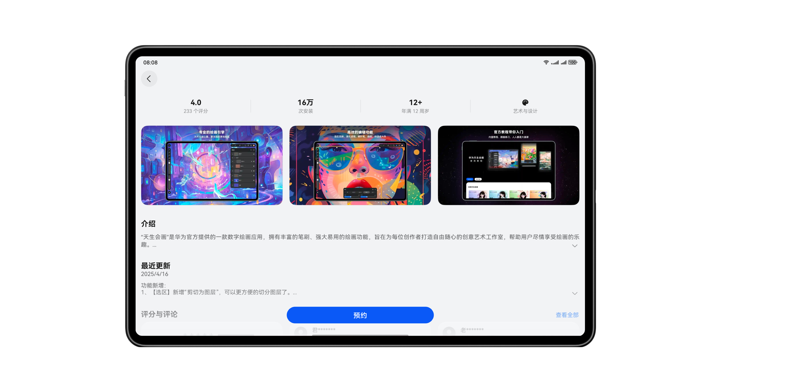
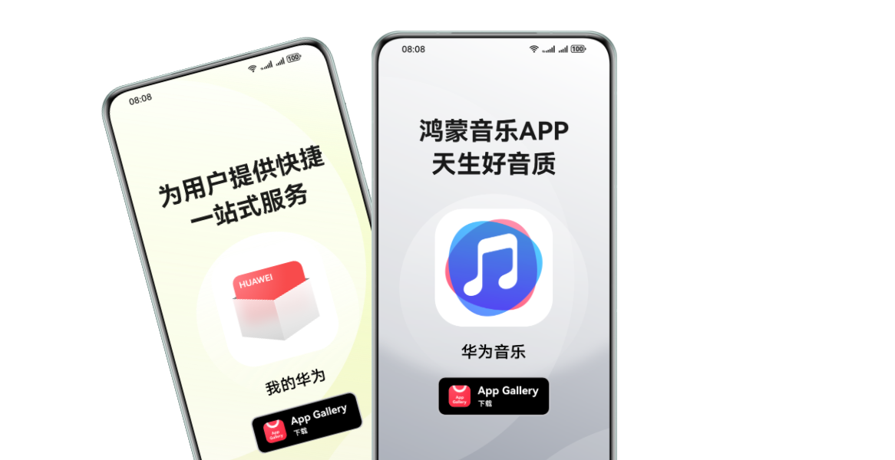
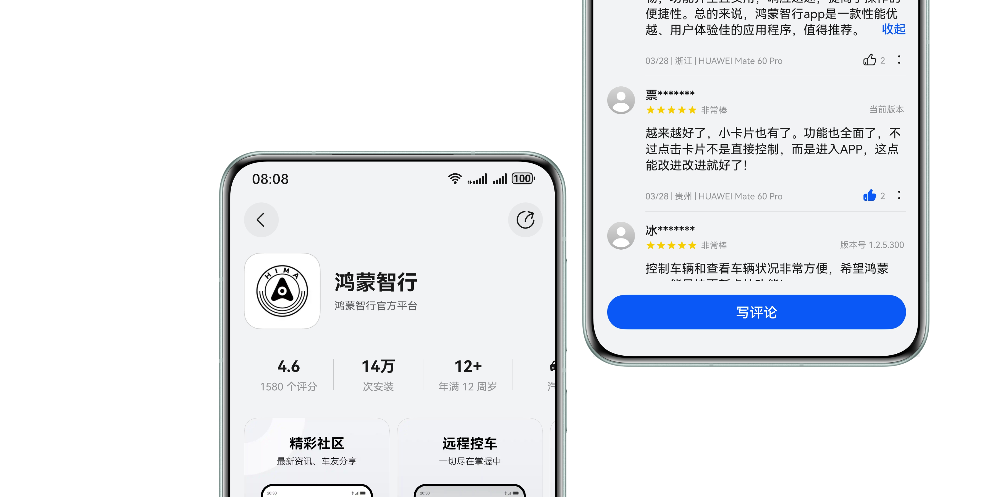
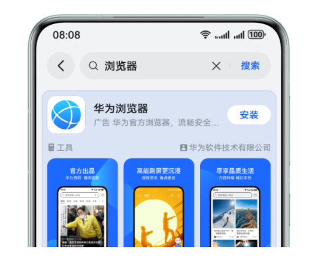
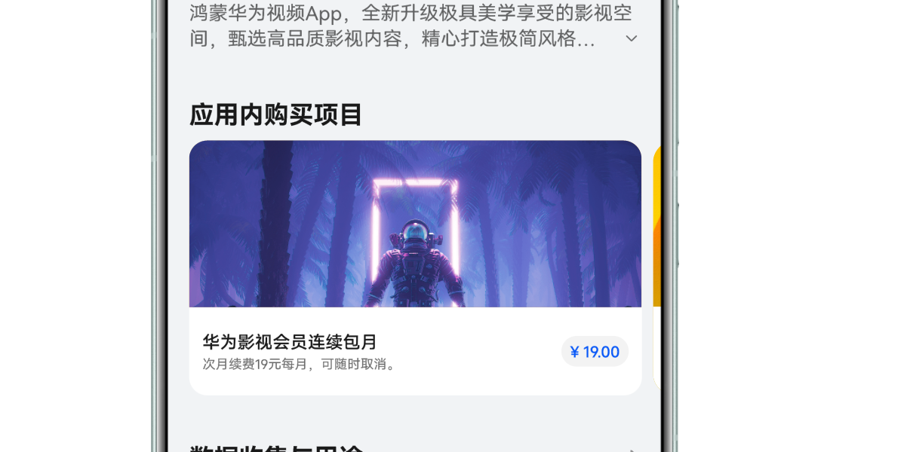
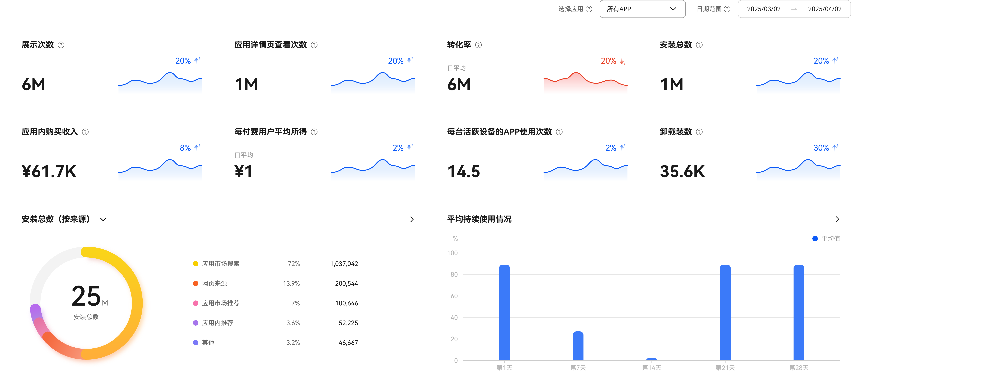

# 服务概览

## 预约发布：提前锁定潜在用户

应用正式上架前，开发者可抢先在 AppGallery搭建专属预约详情页并开放预约。通过自主设定发布日期，展示核心功能亮点，吸引潜在用户提前关注和感知产品魅力，为正式发布积累流量。系统将在应用发布后自动帮已预约用户完成下载，让应用一上线就自带热度，抢占应用市场曝光先机！

* [预约发布使用指南](`https://developer.huawei.com/consumer/cn/doc/app/appointment-release-0000002304487177`)

## 营销工具：便捷引导用户获取

打开 AppGallery 营销工具即可一键生成三大获量组件：应用详情页专属链接、品牌定制徽章、动态二维码。无论是官网、banner、社交媒体图文等数字场景，还是传单、产品包装等印刷物料，只需嵌入这些组件，用户扫码或点击即可直达应用下载页，彻底缩短从了解应用到下载应用的转化路径，让每一次曝光都成为下载转化的跳板。

* [营销工具使用指南](`https://developer.huawei.com/consumer/cn/doc/app/marketing-tools-0000002211952994`)

## 评分与评论：与高净值用户持续互动

用户在 AppGallery 留下的每一条评分与评论，都是影响潜在用户决策的重要参考。数据显示，丰富真实的评论能将转化率提升35%+。评论区互动可提升应用活跃度，形成“下载 - 评论 - 优化 - 再下载”的正向循环。通过系统化运营，开发者可将评论区转化为精准获客、优化产品、提升品牌信任的核心阵地。

* [评论与评分使用指南](`https://developer.huawei.com/consumer/cn/doc/app/comment-management-0000002246992933`)

## 应用推广：算法预估助力精准高效获量

在激烈的应用竞争赛道上，流量获取的效率与精准度直接决定成败。应用推广服务依托庞大生态与前沿技术，为合作伙伴提供精准、优质、高效的推广服务，覆盖流量场景、产品功能、权益及营销方案，让每一份投入都能转化为显著增长，助力开发者快速实现用户增长与商业成功。

* [应用推广服务介绍](`https://developer.huawei.com/consumer/cn/paidpromotion/`)

## 数字商品：多路径支持经营增长

应用推广引擎开放应用内数字商品推广服务，依托私域流量矩阵（搜索结果页、应用详情页等核心入口）构建便捷交易链路。用户可一键浏览商品详情并完成购买，全程享官方支付保障与跨端同步体验。平台为开发者提供从流量曝光到结算的全流程技术支持，助力通过数字商品拓展会员订阅、虚拟道具等多元变现场景，高效拓宽商业经营路径。

* [数字商品服务使用指南](`https://developer.huawei.com/consumer/cn/doc/app/digital-product-promotion-0000002270335466`)

## 数据服务：全方位数据洞察驱动精准决策

应用推广引擎提供覆盖应用全周期的下载、留存、归因等核心数据，通过多维度指标分析与可视化呈现，助力开发者精准把握用户行为轨迹，科学评估推广效果与产品表现，为迭代优化、投放策略调整等决策提供数据支撑，实现从数据洞察到业务增长的高效转化。

## 编辑精选、搜索优化、活动营销等更多服务陆续上线中，敬请期待~