# 分析数据

## 数字商品服务分析

1、您可以在[AppGallery Connect](`https://developer.huawei.com/consumer/cn/service/josp/agc/index.html`)首页，点击“分析”。从列表中选择您的应用，点击“运营分析 &gt; 数字商品服务分析”。

“数字商品服务分析”报表包含“[概览](#section730412118014)”、“[销售-产品销量](#section1492154014111)”、[销售-销售额](#section166761019104714)”、“[订阅摘要](#section10971768480)”、“[订阅-持续使用情况](#section9933185012537)、”“[订阅-状态](#section566019242563)”和“[订阅-事件](#section1907144716217)”七个页面，便于您查看销售和订阅情况。

数字商品服务分析仅支持查看2024年9月23号以后的数据。

2、您也可以通过[应用推广引擎-数据分析-商业经营](`https://developer.huawei.com/consumer/cn/doc/app/digital-product-data-0000002535724528`)查看数字商品销售指标。

## 概览

展开“数字商品服务分析”，进入“概览”页面，可以查看到应用以及应用内数字商品的销售情况概览。

页面显示衡量数字商品销售表现的5个数据指标：“App销量”、“数字商品销量”、“销售额”、“每付费用户平均销售额”、“每笔交易平均价值”。

* 数据指标说明

| 指标名称 | 指标说明 |
| --- | --- |
| App销量 | 包含免费App和付费App的下载数。通过“更新下载”带来的App下载数不包括在内。 |
| 数字商品销量 | 包含消耗型、非消耗型和自动续费订阅3种数字商品的总销量。退款数量已从总数中减去。 |
| 销售额 | 向购买数字商品的用户收取的总金额，退款金额已从总数中减去。请注意，销售额不等于您的收入。 |
| 每付费用户平均销售额 | 由销售额除以付费用户数，退款金额未包括在内。 |
| 每笔交易平均价值 | 付费金额除以付费次数。 |

* 每个指标右侧都默认展示了变化百分比，即所选周期和上一周期的环比变化。

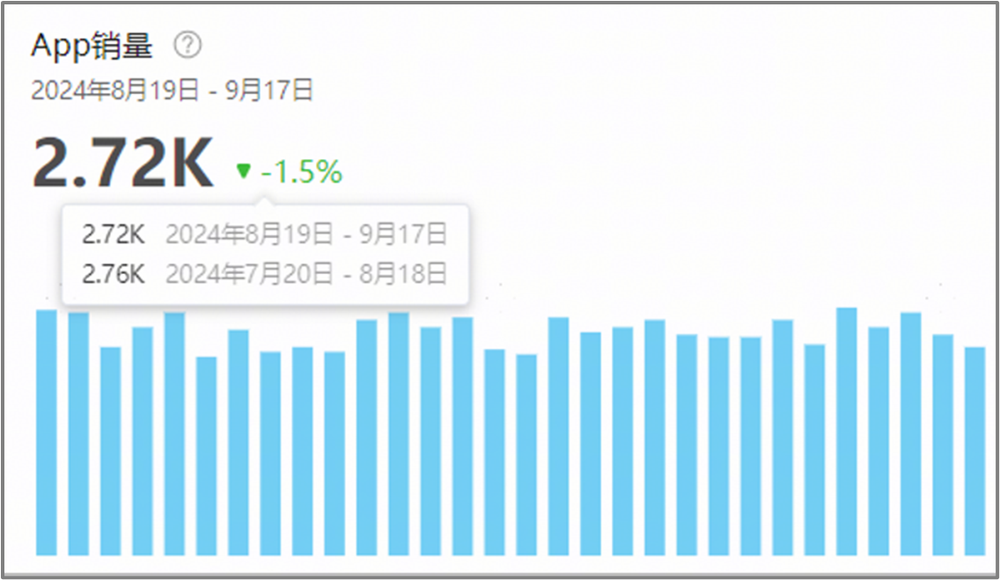

* 点击变化值，将会切换为绝对值进行展示。

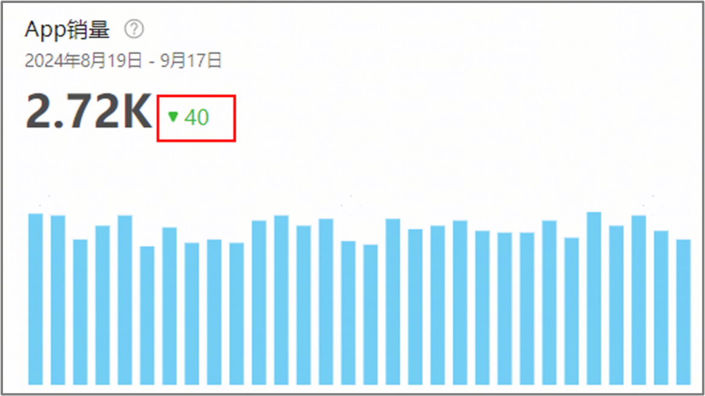

* 每个指标下的柱状图，鼠标悬停，可以查看到近30天的每日指标值。

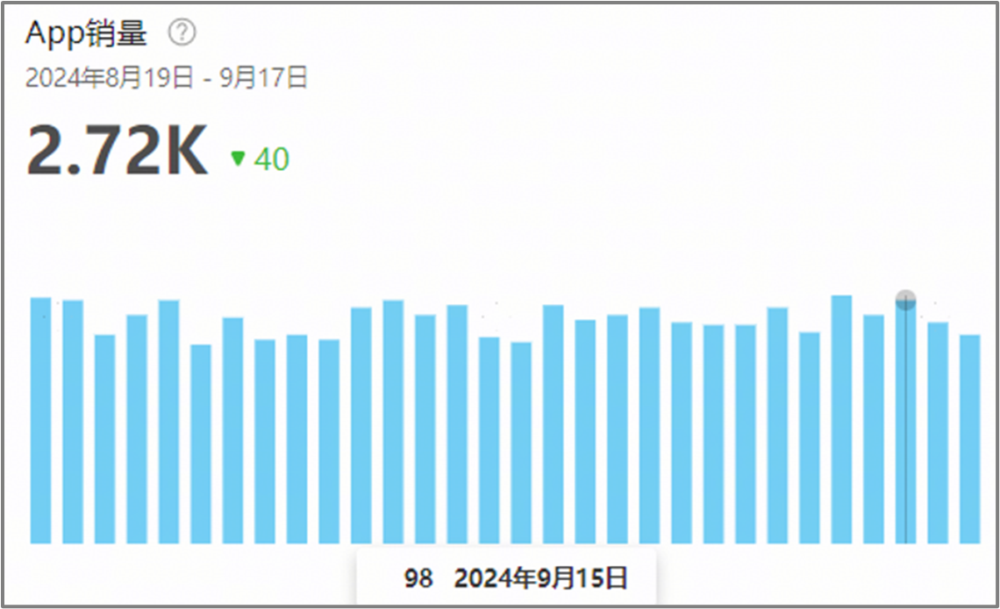

* 点击页面左上角“添加分析维度”，可以筛选在不同的地区、不同类型设备上的销售表现。

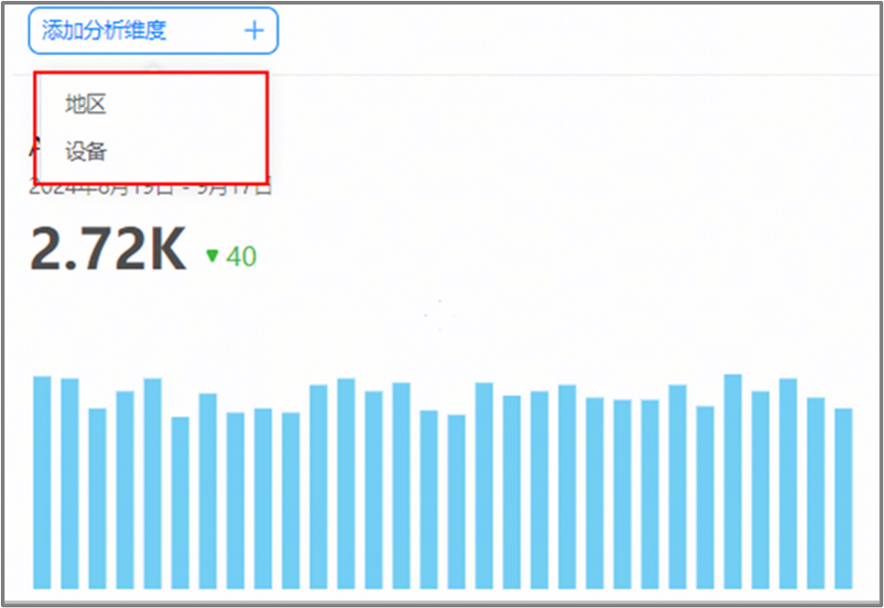

* 点击页面右上角的时间下拉框，可以选定需要查看的时间日期，系统会默认展示所选时间往前30天的销售数据情况。

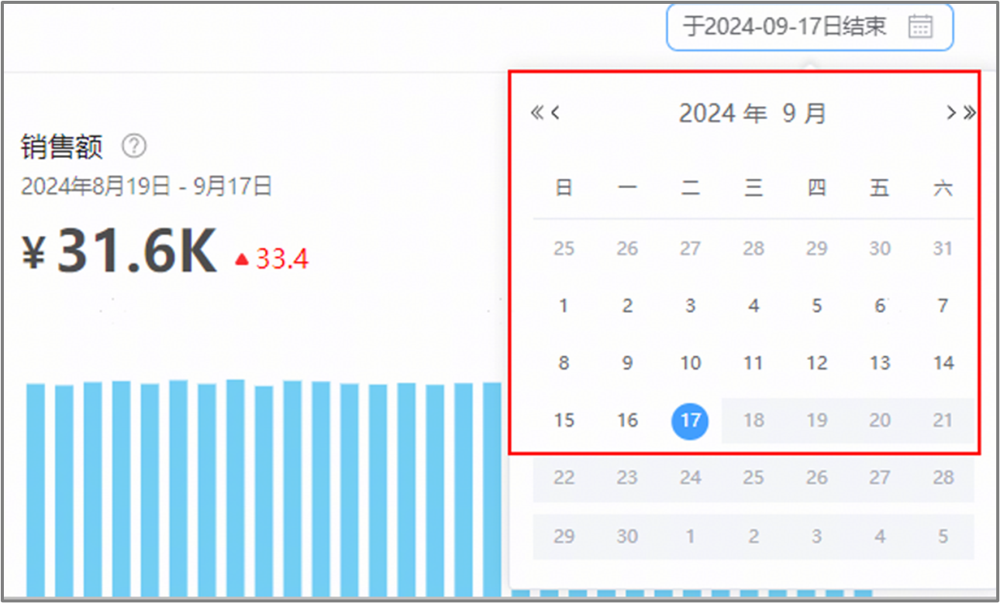

* 点击界面右侧指标的下拉框，可以选择按照“数字商品销量”、“App销量”、“销售额”指标，查看相应的数字商品排行数据。

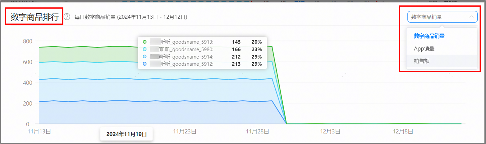

* 根据上述步骤选定的“数字商品销量”、“App销量”、“销售额”任一指标后，您可以查看相应的“地区”和“设备”贡献情况。

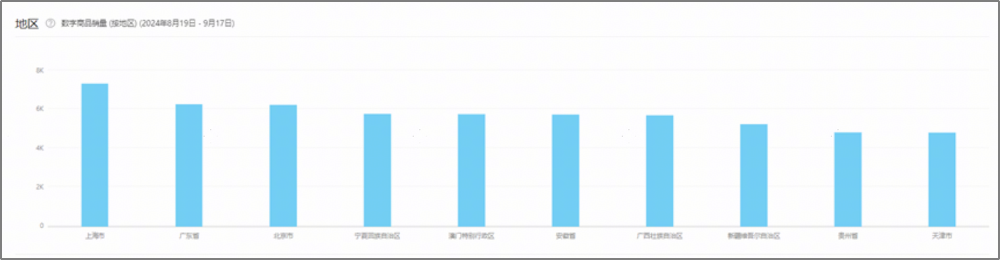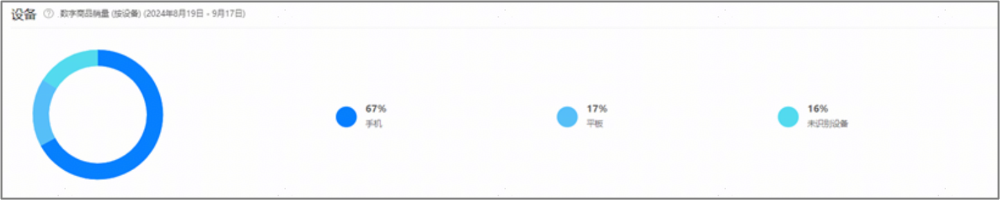

## 销售-产品销量

展开“数字商品服务分析”，进入 “销售-产品销量”页面，可以查看产品销量情况。

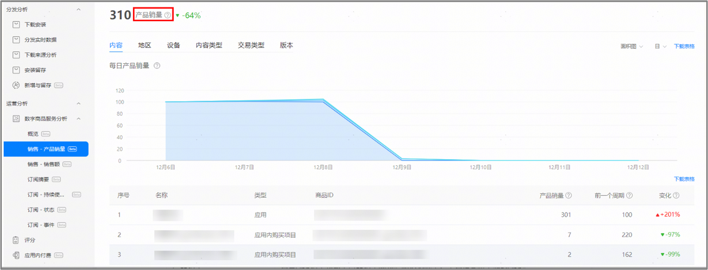

内容：指商品，内容tab签可查看各种商品的销量及趋势。

地区：按省份识别的商品销量情况。

设备：按照设备类型，如PC/平板等区分的商品销售情况。

内容类型：指应用内购买及应用下载的区分销量情况。

交易类型：指购买、退款等商品数量。

版本：指应用上架的版本下，各版本的总销售情况。

* 数据指标说明。

| 指标名称 | 指标说明 |
| --- | --- |
| 产品销量 | 包含App销量和数字商品销量总和。默认状态下，不包括更新下载的App。 |

* 点击页面左上角“添加分析维度”，可以筛选内容、地区、设备、内容类型、交易类型、版本维度的销售表现，单维度均支持单选、多选，同时支持多维度之间的组合。

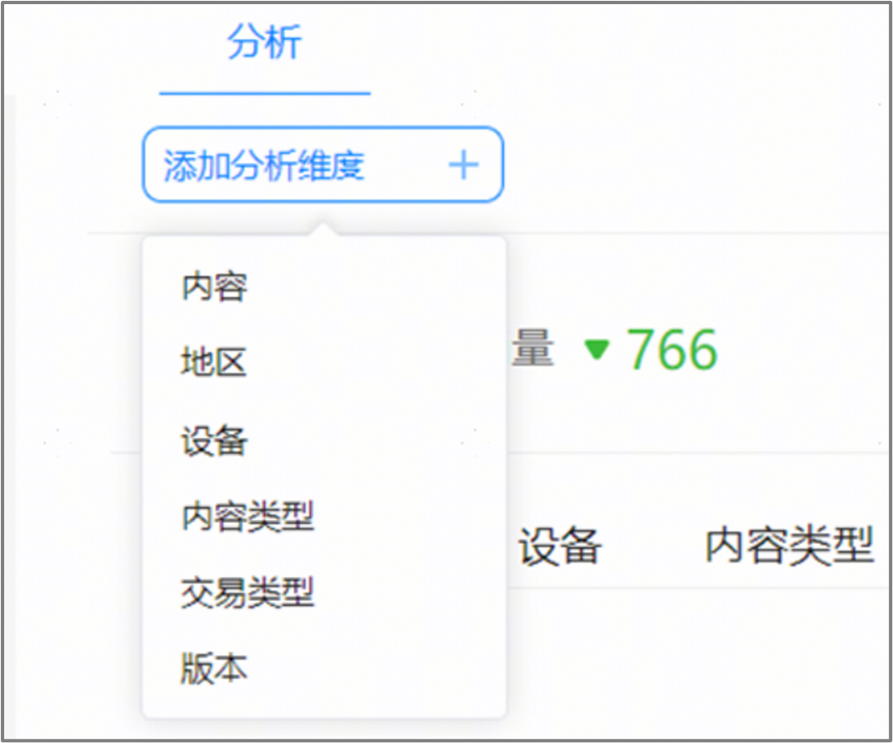

* 右上角时间控件支持自定义筛选时间。

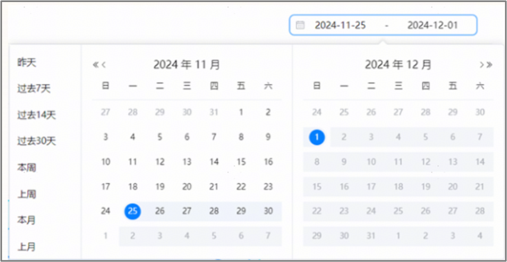

* 指标下方的6个常用维度：内容、地区、设备、内容类型、交易类型、版本。选择不同维度，会展示出对应维度的每日产品销量明细，常用维度可以和过滤器的维度，进行叠加筛选。

  以“内容”维度为例，鼠标停留趋势图，展示当前日期对应的销售明细：商品名称、商品销量和商品销量占比。

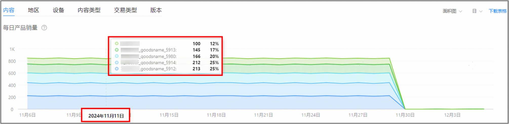

鼠标停留底部列表，展示产品销量、周期，每个指标右侧都默认展示了变化百分比，即所选周期和上一周期的环比变化。

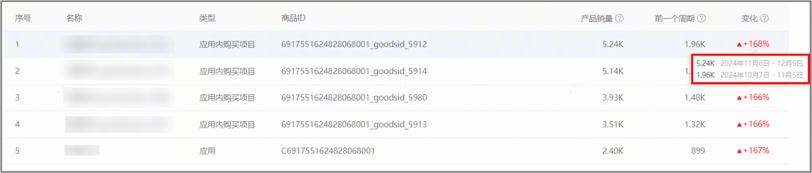点击变化值，将会切换为绝对值进行展示。

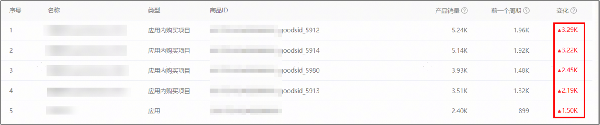

* 点击趋势图右上角可切换条形图或者折线图。

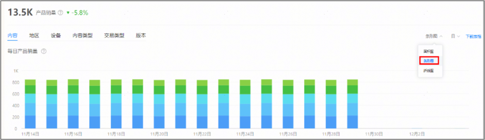

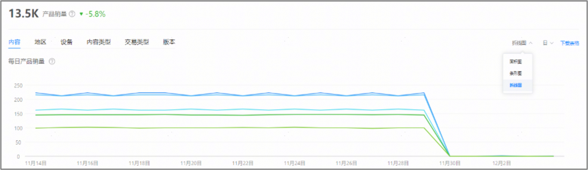

* 点击趋势图右上角可切换成按月展示。

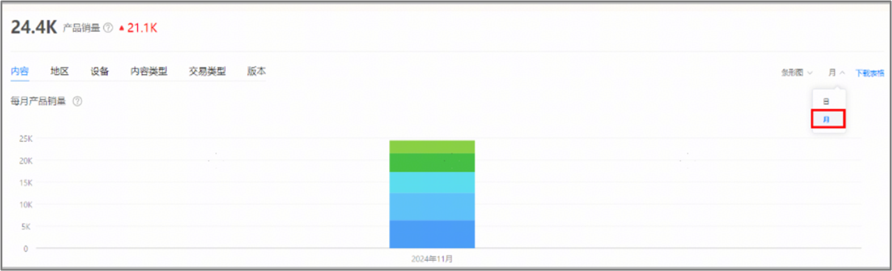

* 点击趋势图右上角“下载表格”即可下载对应筛选区间的表格。

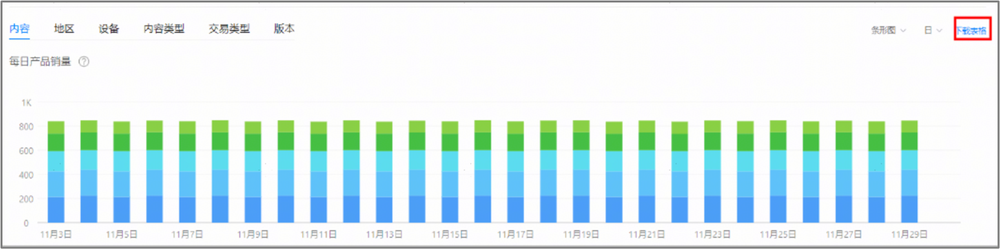

* 鼠标下拉至底部表格，点击右上角的“下载表格”即可下载对应维度的数据表格。

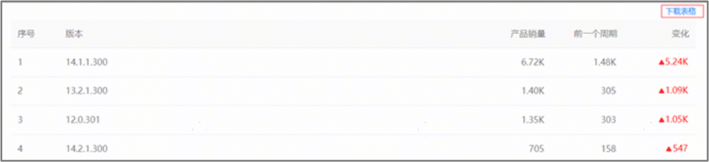

## 销售-销售额

展开“数字商品服务分析”，进入 “销售-销售额”页面，主要展示销售额的具体情况。

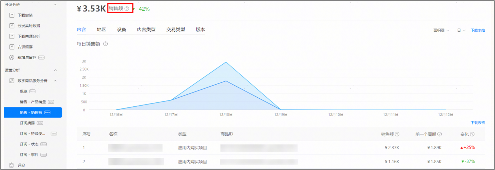

* 数据指标说明

| 指标名称 | 指标说明 |
| --- | --- |
| 销售额 | 向购买App和数字商品的用户收取的总金额，退款金额已从总数中减去。请注意，销售总额不等同于您的收入，收入情况请查看结算报表。 |

## 订阅摘要

展开“数字商品服务分析”，进入“订阅摘要”页面，可以查看到订阅情况以及持续使用率和转化率的概览。

页面显示衡量数字商品订阅表现的4个数据指标：“有效付费订阅数”、“每日订阅销量”、“每日订阅销售额”、“每日订阅退款金额”。

* 数据指标说明。

| 指标名称 | 指标说明 |
| --- | --- |
| 有效付费订阅数 | 当前处于生效阶段的自动续期订阅总数，不包括免费试用。 |
| 每日订阅销量 | 订阅购买、续期和重新激活总数。不包括免费试用，包括新用户促销价带来的订阅。总数中已减去退款数。 |
| 每日订阅销售额 | 向订阅者收取的总金额，退款已从总额中减去。请注意，订阅销售额不等于您的订阅收入。 |
| 每日订阅退款金额 | 向订阅者退还的总金额。 |

* 点击页面左上角“添加分析维度”，可以筛选不同地区、周期、订阅项目，查看对应的销售数据。

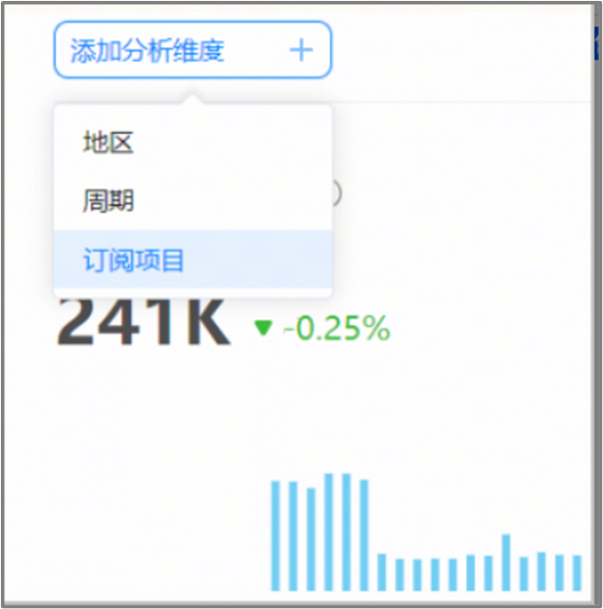

* 点击页面右上角的时间筛选器，选择想查看的截止日期。

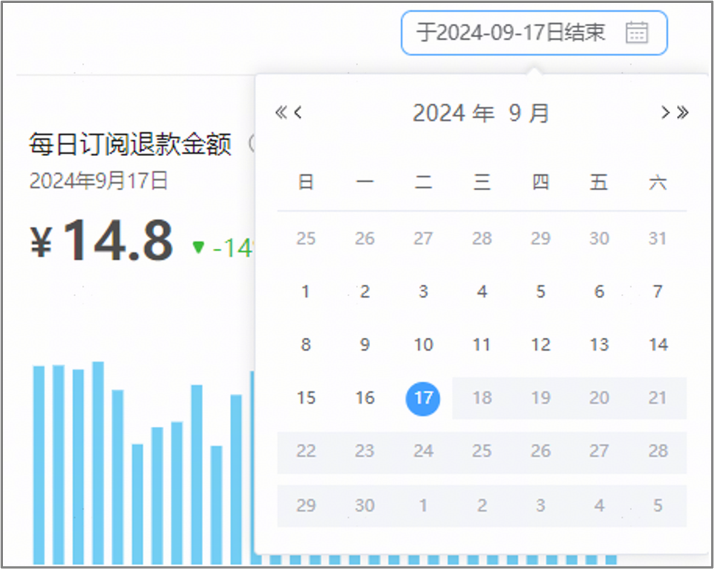

* 订阅事件趋势图:鼠标停留时候会显示不同订阅事件的类型、数量，同时支持通过右上角的“多项”下拉框进行自由配置事件，配置后的事件类型会在趋势图中进行展示。

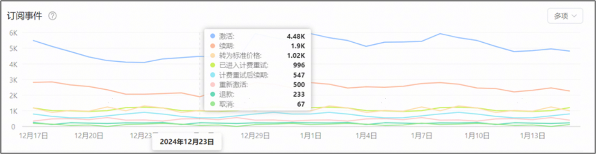

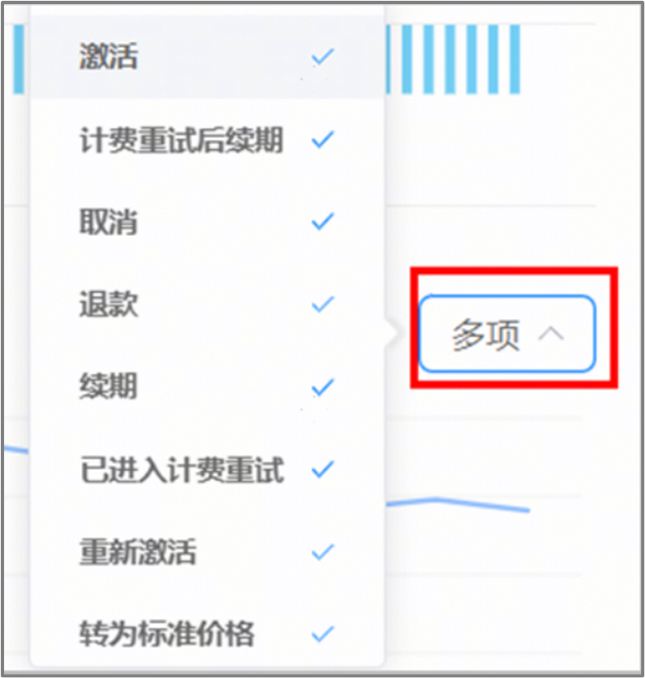

* 查看所选结束日期之前12个月的每月持续使用率和转化率，在下方趋势图中，包含“持续使用率”、“新用户促销转化率”、“自定义人群促销转化率”3个指标，支持鼠标点击横向切换，点击任意一个指标后，下方走势图会进行相应展示，您可以选择不同的指标进行分析查看。

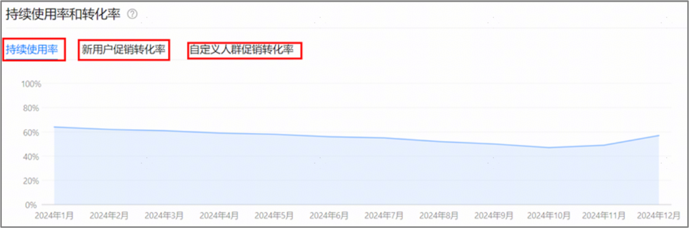

* “订阅概览”占比图：统计所选日期当天的有效订阅数，按照订阅状态进行划分，展示订阅数的绝对值和占比。

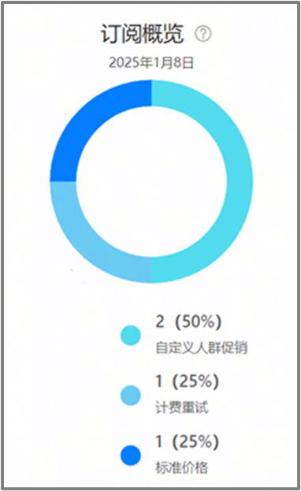

* “转化至标准付费订阅”占比图：展示标准付费订阅的所有渠道来源，当前主要有3类，分别为直接支付、新用户促销、自定义人群促销。

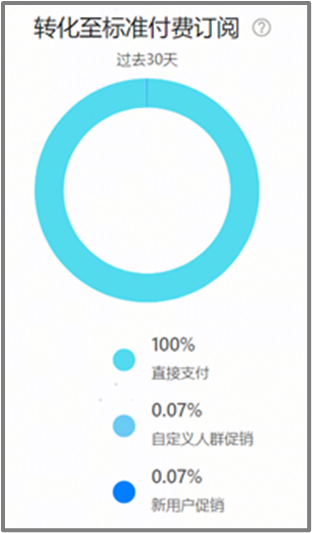

* “取消原因占比图”统计在过去30天内，所有已取消的订阅中，不同的原因分布。

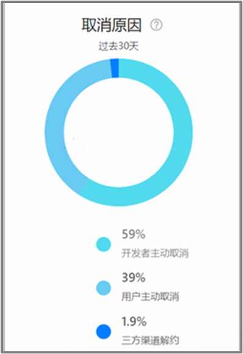

* 查看热门订阅商品的排行，按照有效订阅数量进行统计，其中“标准价格”为截止至所选日期，通过标准价格带来且仍然生效的订阅数。“新用户促销”列为截止至所选日期，通过新用户促销活动带来且仍然生效的订阅数。“自定义人群促销”为截止至所选日期通过“自定义人群促销”带来且仍然生效的订阅数。

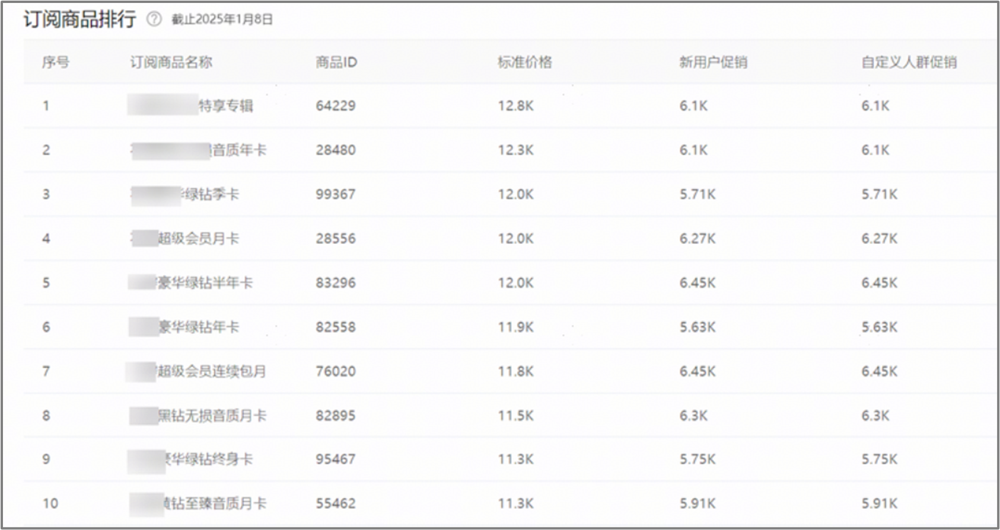

* 查看新用户促销排行，此处展示截止到所选日期，通过新用户促销活动产生的订阅数（历史累计）。

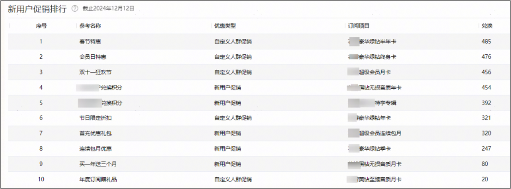

* 自定义人群促销排行，查看截止到所选日期，历史累计用户兑换次数最多的自定义人群促销优惠。

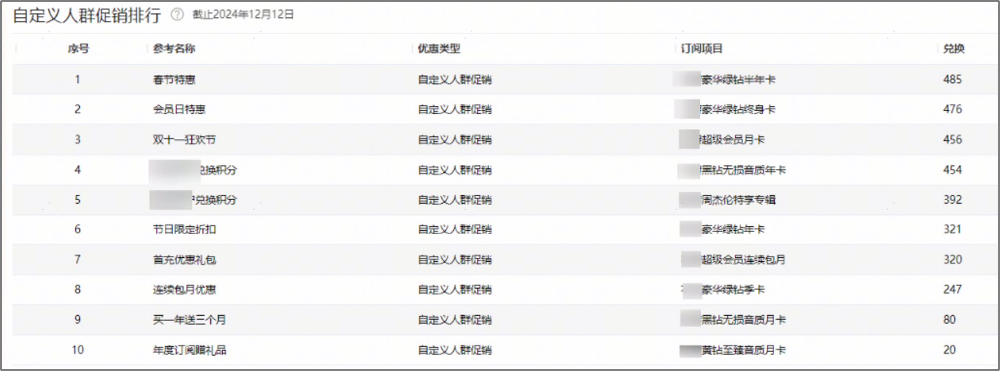

## 订阅-持续使用情况

展开“数字商品服务分析”，进入 “订阅-持续使用情况”页面，可以查看订阅商品的留存表现。

页面显示衡量数字商品持续使用情况的3个数据指标：“持续使用率”、“新用户促销转化率”、“自定义人群促销转化率”。

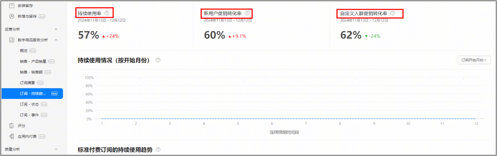

* 数据指标说明：

| 指标名称 | 指标说明 |
| --- | --- |
| 持续使用率 | 过去30天内，实际续期的订阅数量除以预计要续期的订阅数量。 |
| 新用户促销转化率 | 过去30天内，由新用户促销转为标准价格的订阅数量，除以结束新用户促销的订阅数量。 |
| 自定义人群促销转化率 | 过去30天内，由自定义人群促销转为标准价格的订阅数量，除以结束自定义人群促销的订阅数量。 |

* 点击左上角“添加分析维度”，可以筛选不同地区、周期、订阅项目，查看对应的数据。

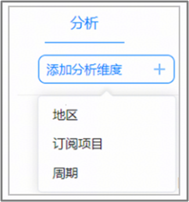

* 点击右侧的时间筛选器，选择想查看的开始日期。

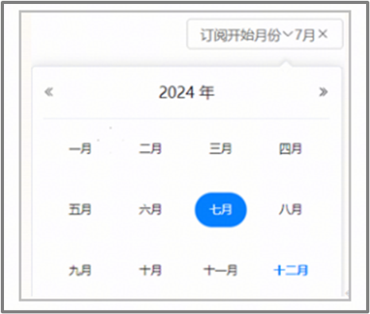

* 查看所选月份连续续期时间段内的持续使用情况，默认展示所有订阅项目，可以结合“添加分析维度”选择特定订阅项目。

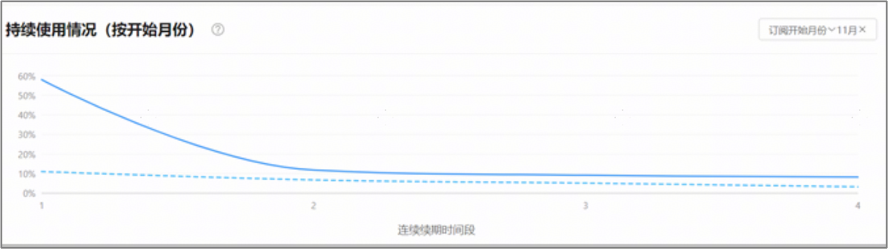

* 标准付费订阅的持续使用趋势可显示在选定的订阅开始月份中连续续期订阅的百分比。

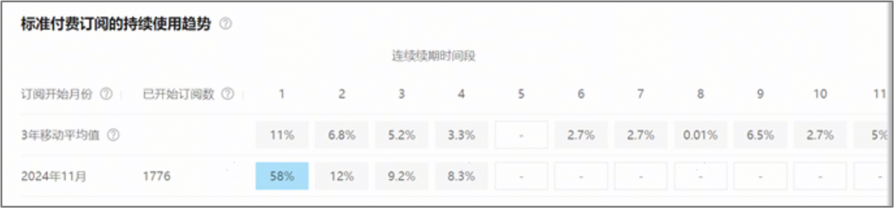

## 订阅-状态

展开“数字商品服务分析”，进入“订阅-状态”页面，可以查看到截止至指定时间的最新订阅状态分布。

订阅状态：指当前生效的订阅关系的订单状态，如新用户促销订单生效中、到期重试中、标准价格的订阅数量。

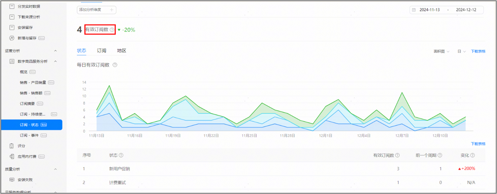

* 数据指标说明：

| 指标名称 | 指标说明 |
| --- | --- |
| 有效订阅数 | 截止到所选日期时，处于有效阶段（订阅未结束）的订阅数量。 |

* 点击页面左上角“添加分析维度”，可以筛选不同的状态、订阅项目、保留定价、新用户促销、自定义人群促销、地区。

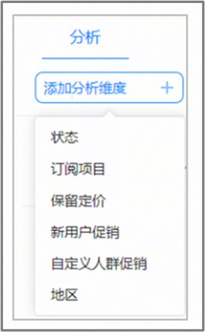

* 指标下方的3个常用维度：状态、订阅、地区，选择不同的维度，可以查看到对应维度的每日有效订阅数。常用维度可以和过滤器的维度进行叠加筛选。
  1. 状态：

     鼠标停留趋势图，展示当前日期对应的状态情况：新用户促销、计费重试、自定义人群促销、标准价格的有效订阅量和有效订阅量占比。

     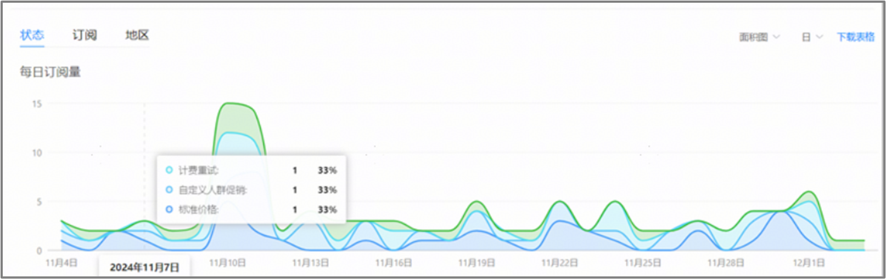
  2. 订阅：

     鼠标停留趋势图，展示当前日期对应的订阅明细：不同的付费商品有效订阅量和订阅量占比。

     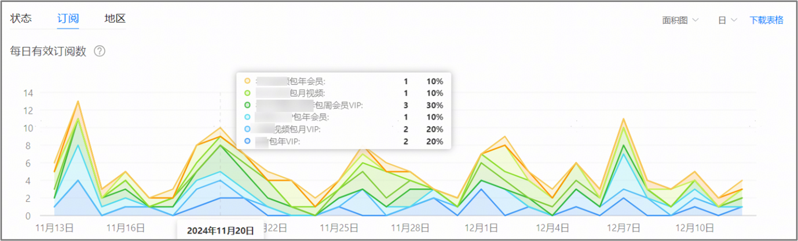
  3. 地区：

  鼠标停留趋势图，展示当前日期对应的有效订阅明细：地区、产品销售额有效订阅和占比，排名10以后的数据都会归到【其他】里面。

  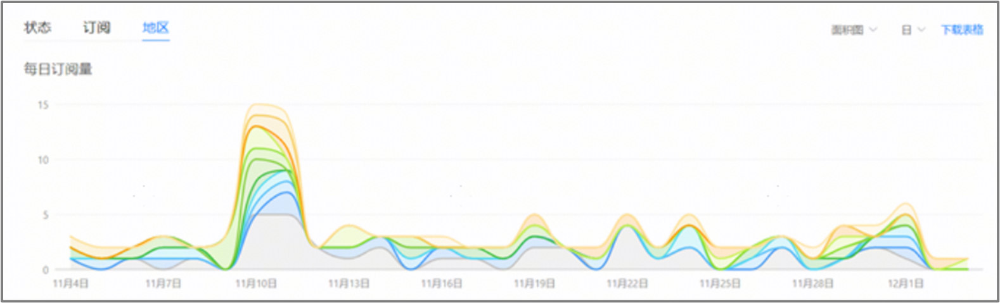

  默认展示10条记录，超过10条以后就显示“查看更多”按钮，点击以后拼接10条，以此不断纵向展开。

  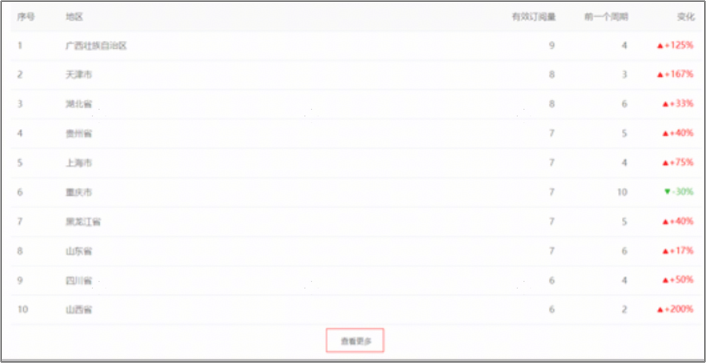

## 订阅-事件

点开“数字商品服务分析”，进入 “订阅-事件”页面，可以掌握订阅商品的动态变化情况。

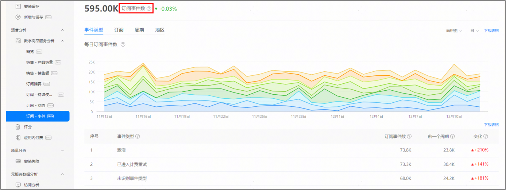

* 数据指标说明：

| 指标名称 | 指标说明 |
| --- | --- |
| 订阅事件数 | 订阅发生变化的事件次数，如取消、续期的事件次数。 |
| 事件 | 指用户侧发生的，影响订单状态的动作。 |

* 点击页面左上角“添加分析维度”，可以筛选不同的事件类型、订阅项目、周期、新用户促销、自定义人群促销、地区、当前状态、先前状态、保留定价、取消原因。

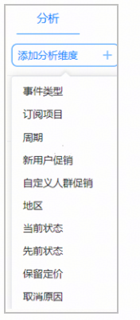

* 指标下方的4个维度：事件类型、订阅、周期、地区，选择不同的维度，可以查看到对应维度的每日事件数。常用维度可以和过滤器的维度进行叠加筛选。

  以“事件类型”为例，鼠标停留趋势图，展示当前日期对应的订阅事件情况：不同事件类型的订阅事件数和占比。

  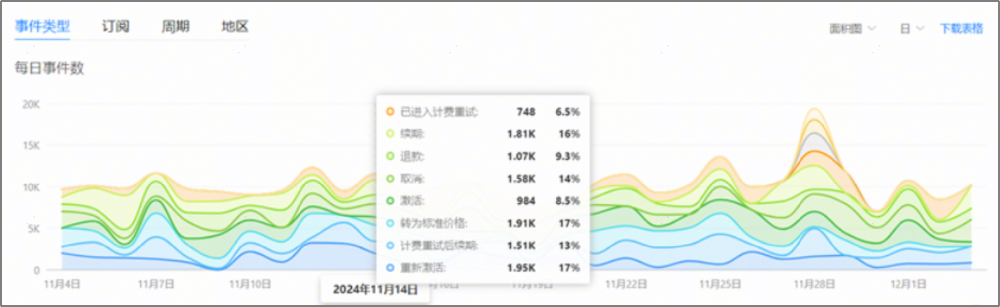