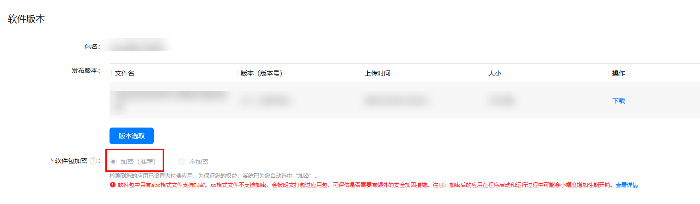
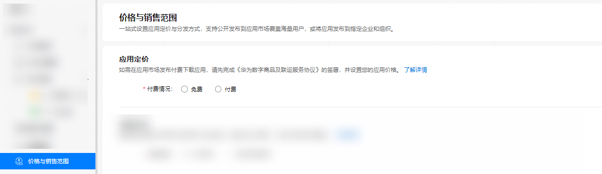
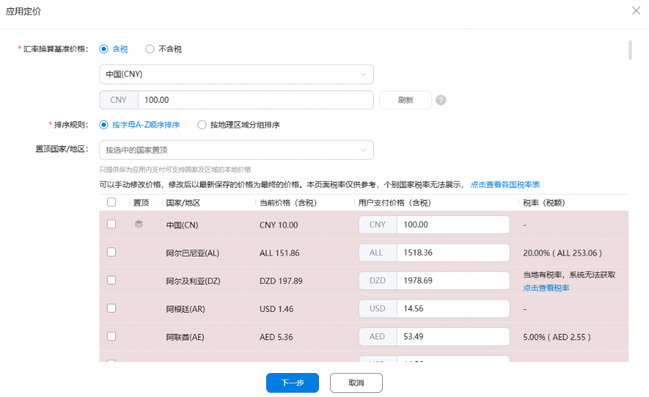
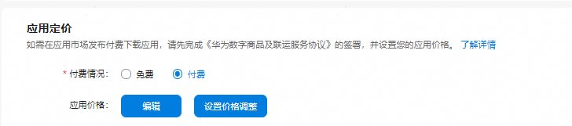
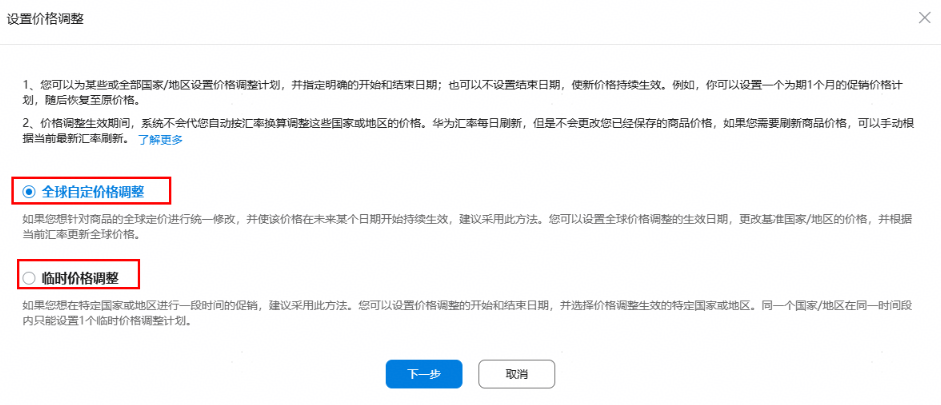
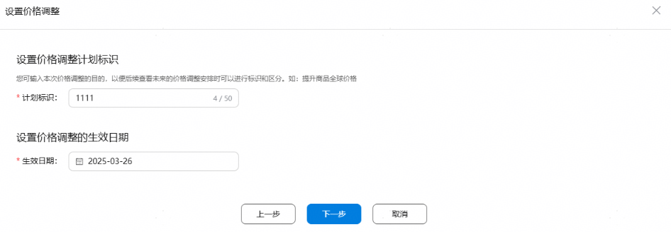
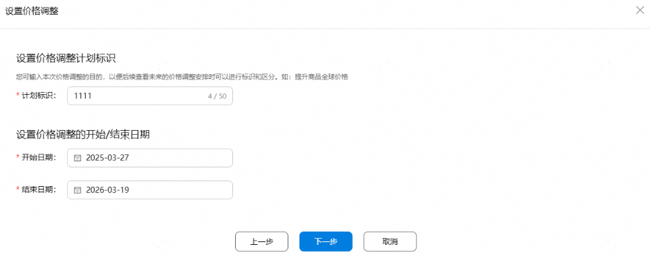
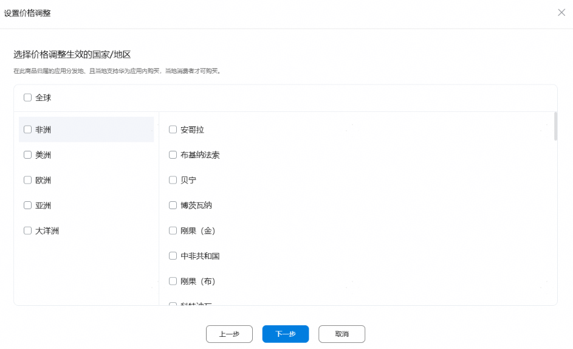

# 付费下载应用

如果您想要在鸿蒙应用市场上架付费下载的HarmonyOS应用，您可以在[AppGallery Connect](`https://developer.huawei.com/consumer/cn/service/josp/agc/index.html#/`)中发布应用时将应用设置为付费应用。

若您需要开通付费下载功能，请您先[开通商户服务](`/docs/distribute/app-dist/app-services/intermodal-transport-services-0000001933253576/digital-products-0000002005836556/guidance-document-0000001933094208/digital-products-serve-0000001931836308/open-0000001959074873)并通过官方渠道[联系我们](`/docs/distribute/app-dist/app-services/intermodal-transport-services-0000001933253576/digital-products-0000002005836556/service-0000001959074917)签署《华为数字商品及联运服务协议》。

如您有Harmony OS 5以下或安卓应用，与 Harmony OS 5及以上的应用相对应，需要做用户的权益映射（已有权益的用户无需重复购买），请联系客服developer@huawei.com。

* 邮件标题：申请付费下载应用权益平移
* 邮件正文：

  | 开发者ID | Harmony OS 5及以上的应用名称及APPID | Harmony OS 5 以下或 安卓的应用名称及APPID |
  | --- | --- | --- |
  | - | - | - |

儿童表应用暂不支持付费下载，设置后也无法在儿童表端的应用市场里展示。

## 创建应用

您可以在[AppGallery Connect](`https://developer.huawei.com/consumer/cn/service/josp/agc/index.html#/`)上，参考[创建项目和HarmonyOS应用](`/docs/distribute/app-dist/app-services/intermodal-transport-services-0000001933253576/digital-products-0000002005836556/guidance-document-0000001933094208/business-activation-0000001958955081#section104021121114213`)完成HarmonyOS应用的创建，从而使用各类服务。

## 设置应用价格

* 设置您的应用在鸿蒙应用市场内为付费下载应用，应满足如下条件：
  + 请确保软件包的API level必须大于10。
  + 设置分发的软件包须加密。

    

    针对FA模型开发的“智能手表”应用，在设置付费下载功能和提交上架时，校验和弹出提示您无法进行加密，可能存在版权风险，由您自行解决；点击“同意”后可在软件包无加密的情况下，上架发布为付费下载应用。
  + 版本发布类型仅支持设置为“测试发布/分阶段发布/全网发布”。

    

    当应用版本状态为<strong>【已上架】</strong>，且软件包为“不加密”，无法设置为付费下载应用。

    必须创建新的版本并且选中软件包加密（除FA模型开发），新版本发布成功后再设置为付费下载应用。

    

<strong>1、登录AppGallery Connect，进入"APP与元服务"</strong>。

<strong>2、在</strong><strong>“HarmonyOS”栏</strong><strong>选择您要设置的应用</strong>。

<strong>3、在“价格与销售范围”栏切换至"付费"状态</strong>。

<strong>4、</strong><strong>设置应用的全球销售价格</strong>。

勾选“汇率换算基准价格”类型，选择国家和币种，配置基准价格，根据使用需要勾选排序规则，在列表中选择使用汇率刷新价格的国家/地区，点击 “刷新”同步更新应用的用户支付价格（含税）。

* 当您在设置完“汇率换算基准价格”并点击刷新后，系统会自动根据汇率（及[税率](`https://developer.huawei.com/consumer/en/doc/start/merchant-service-0000001053025967#section154132916309`)）和相应币种美化/更正规则计算出所选国家/地区应用的用户支付价格（含税），具体请参考[换算规则描述](`https://developer.huawei.com/consumer/cn/doc/app/describe-0000001958955133`)。
* 您还可以根据不同国家/地区的应用价格策略，手动编辑应用价格表中指定国家/地区的价格，保存后将以此价格作为应用在该国家/地区的用户支付价格（含税）。
* 在使用汇率刷新不同国家/地区应用的用户支付价格（含税）时，如出现币种兑换查无汇率的警告，则您需要手动填写该国家/地区应用的用户支付价格（含税）。
* 华为汇率每日刷新，但是不会更改您已经保存的应用价格，如果您需要刷新应用价格，可以手动根据当前最新汇率刷新。
* 税率只与不同国家/地区相关，如果某国家/地区没有税率，则表示税率为0，不含税价即等同于含税价，页面展示为横线“-”。

相关参数如下表所示：

| <strong>参数</strong> | <strong>说明</strong> |
| --- | --- |
| 汇率换算基准价格 | 应用价格的汇率换算基准价格。目前，支持填入“含税”或“不含税”两种类型的基准价格，默认为“含税”类型。   * 含税：汇率换算基准价格中含有税额。 * 不含税：汇率换算基准价格中不含税额。 说明：  系统会根据汇率换算基准价格计算出应用的用户支付价格（含税），具体请参考[换算规则描述](`https://developer.huawei.com/consumer/cn/doc/app/describe-0000001958955133`)。   由于不同国家/地区的币种不同，系统会根据您输入的汇率换算基准价格进行如下规则的自动调整：   * 通用币种要求国家/地区：支持整数或小数（均保留两位小数）作为输入价格，如输入1.34，则将1.34作为该应用的输入价格； * 特殊币种要求国家/地区（详见下表）：   – 仅支持整数（保留两位小数）的国家/地区，以整数或向上取整的值（均保留两位小数）作为输入价格，如输入5.02，则默认选取6.00作为该应用的输入价格。  – 仅以五分之一为最小单位（保留两位小数）的国家/地区，以整数或向上取符合五分之一要求的数值（均保留两位小数）作为输入价格，如输入1.23，则默认选取1.40作为该应用的输入价格。 |
| 排序规则 | 国家/地区的排序规则。   * 按字母A-Z顺序排序 * 按地理区域分组排序 |
| 置顶国家/地区 | 置顶汇率换算国家/地区，方便您查看或编辑应用价格，可选。   * 当国家/地区按字母A-Z顺序排序时，您可以在下拉选项中选择您要置顶的国家/地区。 * 当国家/地区按地理区域分组排序时，您可以在下拉选项中选择您要置顶的区域。 |

特殊币种要求国家/地区详见[应用管理国家/地区、语言、币种表](`/docs/distribute/app-dist/app-services/intermodal-transport-services-0000001933253576/digital-products-0000002005836556/guidance-document-0000001933094208/digital-products-manage-0000001959074881/countries-overview-0000002071714318)。

<strong>5、</strong><strong>价格调整</strong>

<strong>全球自定价格调整：主要使用场景为针对该应用设置新的全球定价，并在未来某个时间点开始持续生效</strong>。仅支持设置生效日期、不支持设置结束日期，不支持设置特定国家/地区，价格调整设置后，全球国家/地区对应的<strong>应用</strong>价格会在生效日期开始自动刷新为新价格。

<strong>临时价格调整：主要使用场景为针对应用在特定国家或地区，设置一段时间的促销价或临时涨价</strong>。支持设置价格调整的开始和结束日期，以及生效的国家或地区。价格调整设置后，所选国家/地区对应的<strong>应用</strong>价格会在生效时间段内自动刷新为新价格；价格调整期结束后，将会恢复到原价格。

<strong>修改应用当前生效价格：</strong>价格与销售范围-点击“编辑”按钮。<strong>编辑此处应用价格为当前立即生效、且无结束日期的“价格调整”。</strong>

全球自定价格调整：

临时价格调整：

## 提交版本审核

设置完成后，需要通过“版本信息”栏提交“版本审核”，审核通过后即可成为付费下载应用并发布到鸿蒙应用市场。

如您的应用已上架并通过上述步骤设置为付费下载应用，无须再次提交版本审核，付费下载应用功能将在10min内生效。

<strong>应用上架后由免费转为付费，在免费上架期间下载安装过的用户则不需要付费，即可再次打开和更新应用。</strong>