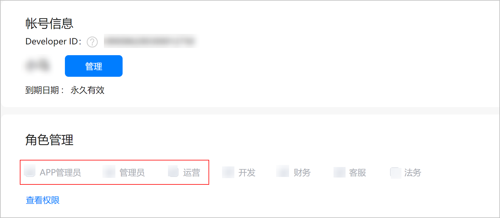

# 前提条件

* 请您确保当前登录的AGC账号，拥有“APP管理员”、“管理员”、“运营”的其中<strong>任意一项</strong><strong>[角色](`https://developer.huawei.com/consumer/cn/doc/app/agc-help-rolepermission-0000002271930352`)</strong>。若您想查询账号角色，请登录[AppGallery Connect](`https://developer.huawei.com/consumer/cn/service/josp/agc/index.html`)，进入“用户与访问 &gt; 用户 &gt; 个人信息 &gt; 角色管理”，即可看到当前账号的角色信息。

  
* 推荐您使用Google Chrome浏览器访问商品管理服务，最低版本为62.0.3202.62。
* 您需要先设置好应用分发国家/地区。
* 新建商品前，您需要提前仔细规划好商品ID，以便顺畅完成商品配置。商品ID规则如下：
  + 必须以大小写字母或数字开头，并且只能由大小写字母 (A-Z,a-z)、数字 (0-9)、下划线（\_）或句点 (.) 组成。
  + 输入字符数上限148个。
  + 同一个数字商品ID不能重复，保存后将无法修改（删除后也无法再次使用该商品ID新建商品）。