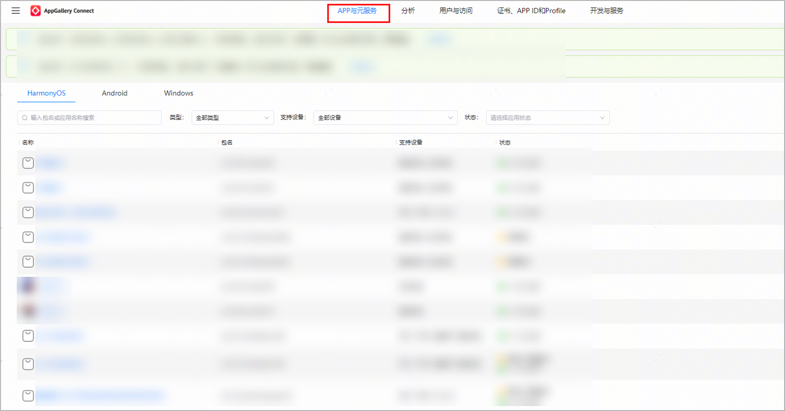
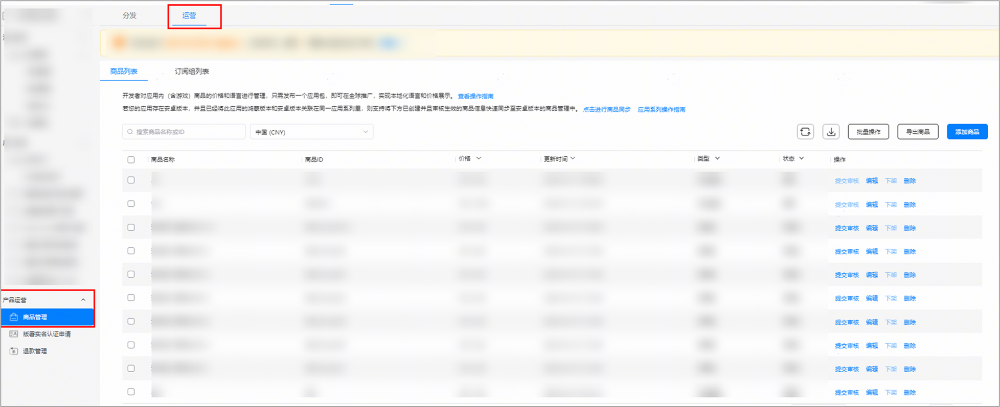
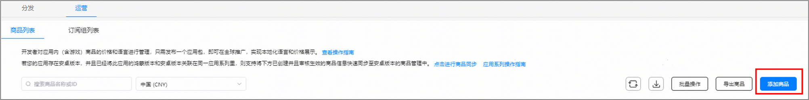
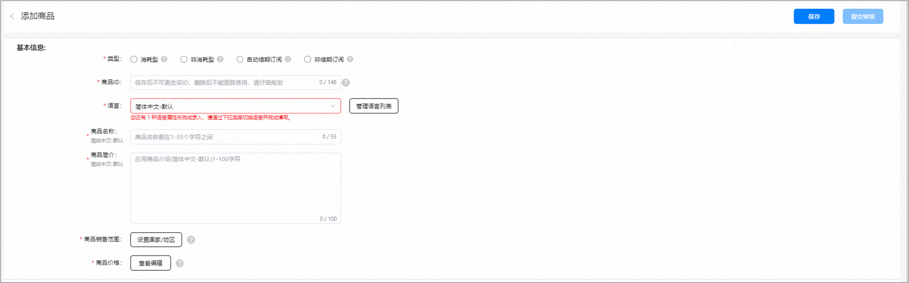
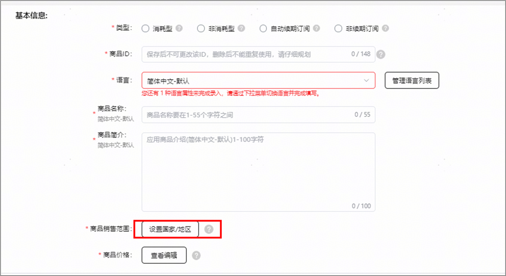
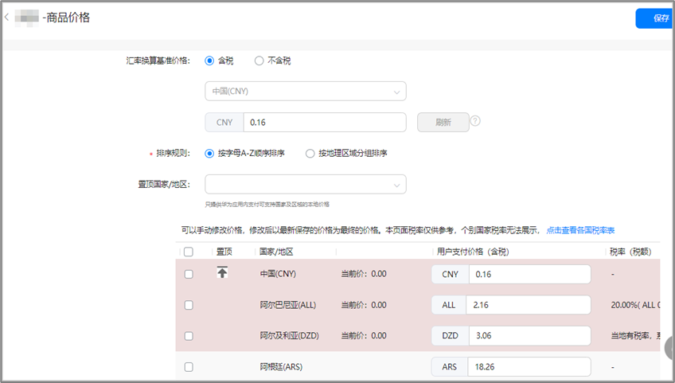
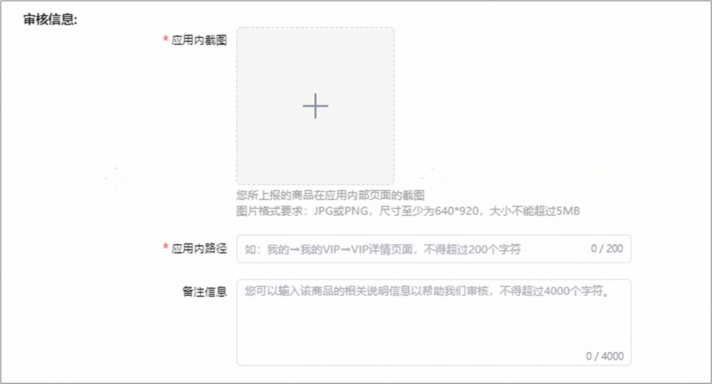

# 消耗型/非消耗型/非续期订阅商品

1. 登录[AppGallery Connect](`https://developer.huawei.com/consumer/cn/service/josp/agc/index.html`)，选择“APP与元服务”。
2. 在应用列表中点击需要新增商品的应用。

   
3. 在“运营”页签下的左侧导航栏中，选择“产品运营 &gt; 商品管理”。
4. 选择“商品列表”页签，并点击“添加商品”。

   

   如果应用还未设置分发国家/地区，则会弹出“请先设置应用分发国家/地区”的警告提示，请先设置应用分发国家/地区后再创建商品。

   
5. 配置商品信息，完成后点击“保存”。

   

   相关参数如下表所示：

   | <strong>参数</strong> | <strong>说明</strong> |
   | --- | --- |
   | 类型 | 非自动续期订阅类商品只能选择“消耗型”、“非消耗型”或者“非续期订阅”。  注意：  商品创建成功后，商品类型将无法更改。 |
   | 商品ID | 必须以大小写字母或数字开头，并且只能由大小写字母 (A-Z,a-z)、数字 (0-9)、下划线（\_）或句点 (.) 组成。输入字符数上限148个字符。  注意：  同一个数字商品ID不能重复，保存后将无法修改（删除后也无法再次使用），请仔细规划。 |
   | 语言 | 点击“管理语言列表”，勾选需要支持的语言种类。  注意：  如果配置多种语言种类后，必须依次选择下拉框中配置的语言，配置此语言对应的“商品名称”和“商品简介”。 |
   | 商品名称 | 不能为空，最长55个字符，不支持特殊字符 |。 |
   | 商品简介 | 不能为空，最长100个字符，不支持特殊字符 |。 |
   | 商品销售范围 | 不能为空，至少选择1个国家/地区才可以保存。 |
   | 商品价格（含税） | 点击“查看编辑”，为商品配置合适的价格。  说明：  此价格为展示给用户查看和支付的数字商品价格（含税），华为将根据当地税率，扣税后与开发者分成，分成以对账单为准。 |
6. 在商品编辑页面上点击 “设置国家/地区”，配置商品销售范围。
   * 商品销售范围：决定商品可供用户购买的国家/地区，销售范围至少选择1个销售国家/地区。
   * 新国家或地区：鸿蒙应用市场会对未来新增的国家或地区自动提供您的商品，届时以您设置的全球商品定价为准，您可以选择是否在新国家或地区销售。

   

   

   当前HarmonyOS应用数字商品服务的销售范围仅支持中国大陆，如后续新增国家或地区时，您希望商品自动支持在新国家或地区销售，请保持勾选“新国家或地区”选项。
7. 点击商品编辑页面的“查看编辑”，配置商品的用户支付价格（含税）。

   勾选“汇率换算基准价格”类型，选择国家和币种，配置基准价格，根据使用需要勾选排序规则，在列表中选择使用汇率刷新价格的国家/地区，点击 “刷新”同步更新商品的用户支付价格（含税）。

   

   * 当您在设置完“汇率换算基准价格”并点击刷新后，系统会自动根据汇率（及[税率](`https://developer.huawei.com/consumer/en/doc/start/merchant-service-0000001053025967#section154132916309`)）和相应币种美化/更正规则计算出所选国家/地区商品的用户支付价格（含税），具体请参考[换算规则描述](`https://developer.huawei.com/consumer/cn/doc/app/describe-0000001958955133`)。
   * 您还可以根据不同国家/地区的商品价格策略，手动编辑商品价格表中指定国家/地区的价格，保存后将以此价格作为商品在该国家/地区的用户支付价格（含税）。
   * 在使用汇率刷新不同国家/地区商品的用户支付价格（含税）时，如出现币种兑换查无汇率的警告，则您需要手动填写该国家/地区商品的用户支付价格（含税）。
   * 华为汇率每日刷新，但是不会更改您已经保存的商品价格，如果您需要刷新商品价格，可以手动根据当前最新汇率刷新。
   * 税率只与不同国家/地区相关，如果某国家/地区没有税率，则表示税率为0，不含税价即等同于含税价，页面展示为横线“-”。

   

   相关参数如下表所示：

   | <strong>参数</strong> | <strong>说明</strong> |
   | --- | --- |
   | 汇率换算基准价格 | 商品价格的汇率换算基准价格。目前，支持填入“含税”或“不含税”两种类型的基准价格，默认为“含税”类型。  * 含税：汇率换算基准价格中含有税额。 * 不含税：汇率换算基准价格中不含税额。 说明：  系统会根据汇率换算基准价格计算出商品的用户支付价格（含税），具体请参考[换算规则描述](`https://developer.huawei.com/consumer/cn/doc/app/describe-0000001958955133`)。 由于不同国家/地区的币种不同，系统会根据您输入的汇率换算基准价格进行如下规则的自动调整：  * 通用币种要求国家/地区：支持整数或小数（均保留两位小数）作为输入价格，如输入1.34，则将1.34作为该商品的输入价格； * 特殊币种要求国家/地区（详见下表）： – 仅支持整数（保留两位小数）的国家/地区，以整数或向上取整的值（均保留两位小数）作为输入价格，如输入5.02，则默认选取6.00作为该商品的输入价格。  – 仅以五分之一为最小单位（保留两位小数）的国家/地区，以整数或向上取符合五分之一要求的数值（均保留两位小数）作为输入价格，如输入1.23，则默认选取1.40作为该商品的输入价格。 |
   | 排序规则 | 国家/地区的排序规则：  * 按字母A-Z顺序排序 * 按地理区域分组排序 |
   | 置顶国家/地区 | 置顶汇率换算国家/地区，方便您查看或编辑商品价格，可选。  * 当国家/地区按字母A-Z顺序排序时，您可以在下拉选项中选择您要置顶的国家/地区。 * 当国家/地区按地理区域分组排序时，您可以在下拉选项中选择您要置顶的区域。 |

   特殊币种要求国家/地区详见[商品管理国家/地区、语言、币种表](`https://developer.huawei.com/consumer/cn/doc/app/countries-overview-0000002071714318`)。
8. 添加审核信息。

   审核信息包括应用内截图、应用内路径与备注信息，有助于审核人员审核数字商品。此信息仅用于审核，不会在 AppGallery 中显示。

   

   | <strong>参数</strong> | <strong>说明</strong> |
   | --- | --- |
   | 应用内截图 | 图片格式要求：JPG或PNG，尺寸至少为640\*920，大小不能超过5MB。 |
   | 应用内路径 | 如：我的→我的VIP→VIP详情页面，不得超过200个字符。 |
   | 备注信息 | 可以输入该商品的相关说明以帮助审核人员审核，不得超过4000个字符。同时请提供有效的演示账户或全功能演示模式，确保审核人员可以登录应用内查看对应的商品。 |
9. 基本信息和审核信息填写完成后，点击“保存”或“提交审核”。

   

   * 单个应用创建商品的上限是50000个。
   * 除了在AGC界面可以新增商品，您还可以通过[创建商品](`https://developer.huawei.com/consumer/cn/doc/AppGallery-connect-References/agcapi-addproduct-harmonyosnext-0000002131508844`)接口创建单个商品或者通过[批量创建商品](`https://developer.huawei.com/consumer/cn/doc/AppGallery-connect-References/agcapi-batchaddproduct-harmonyosnext-0000002131350704`)接口批量创建商品。