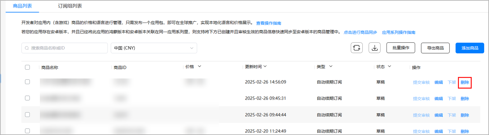
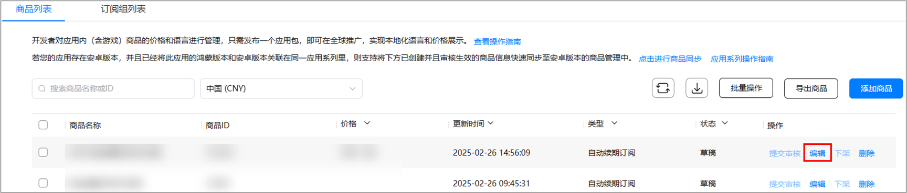
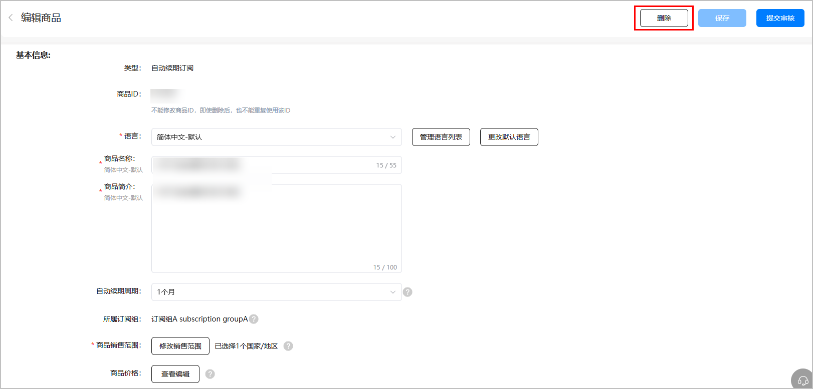
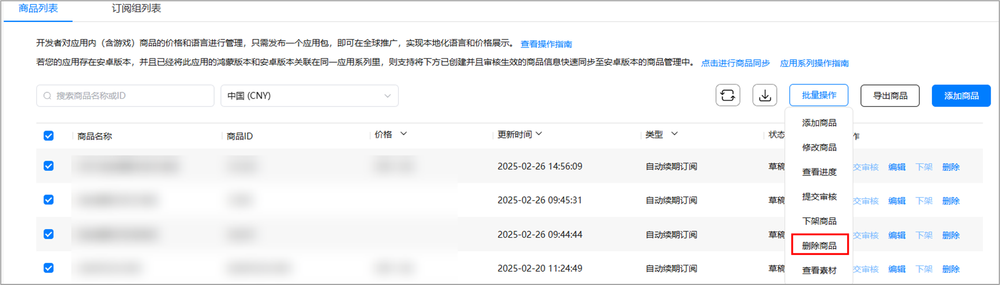

# 删除数字商品

如果您想将冗余的商品从商品列表中去除，您可以选择删除该商品。

* 审核中或生效状态的数字商品无法删除。
* 正在生效中的商品发生修改后，即使处于待提交状态，也将无法删除。

## 删除单个数字商品

1. 登录[AppGallery Connect](`https://developer.huawei.com/consumer/cn/service/josp/agc/index.html`)，选择“APP与元服务”。
2. 在应用列表中点击需要删除的商品的应用。
3. 在“运营”页签下的左侧导航栏中，选择“产品运营 &gt; 商品管理”。
4. 在商品列表中，您可以直接点击待删除商品对应“操作”列下的“删除”。

   
5. 您还可以点击待删除商品对应“操作”列下的“编辑”，进入商品信息详情页后，点击“编辑商品”页面右上角的“删除商品”。

   

   

## 批量删除数字商品

1. 登录[AppGallery Connect](`https://developer.huawei.com/consumer/cn/service/josp/agc/index.html`)，选择“APP与元服务”。
2. 在应用列表中点击需要删除的商品的应用。
3. 在“运营”页签下的左侧导航栏中，选择“产品运营 &gt; 商品管理”。
4. 在商品列表中，您可以勾选待删除商品，点击“批量操作 &gt; 删除商品”。

删除商品后，该商品将无法支付购买，且此商品ID将无法在该应用下继续创建商品时使用。