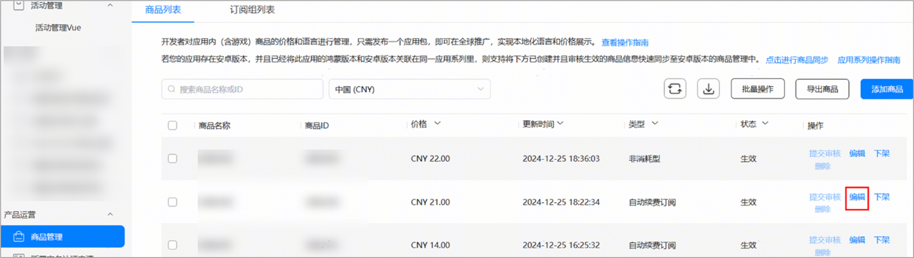
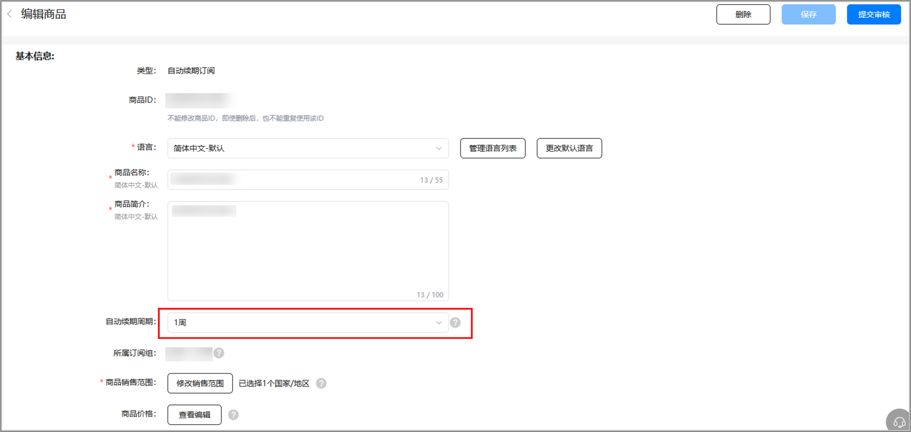
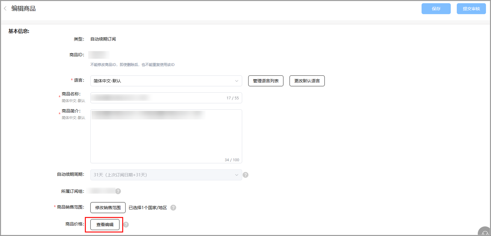
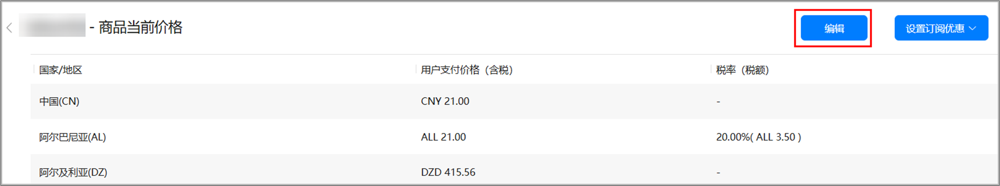
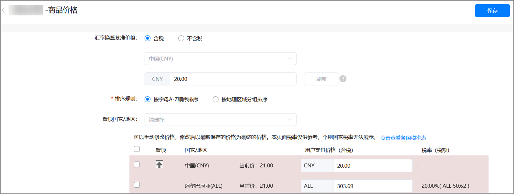
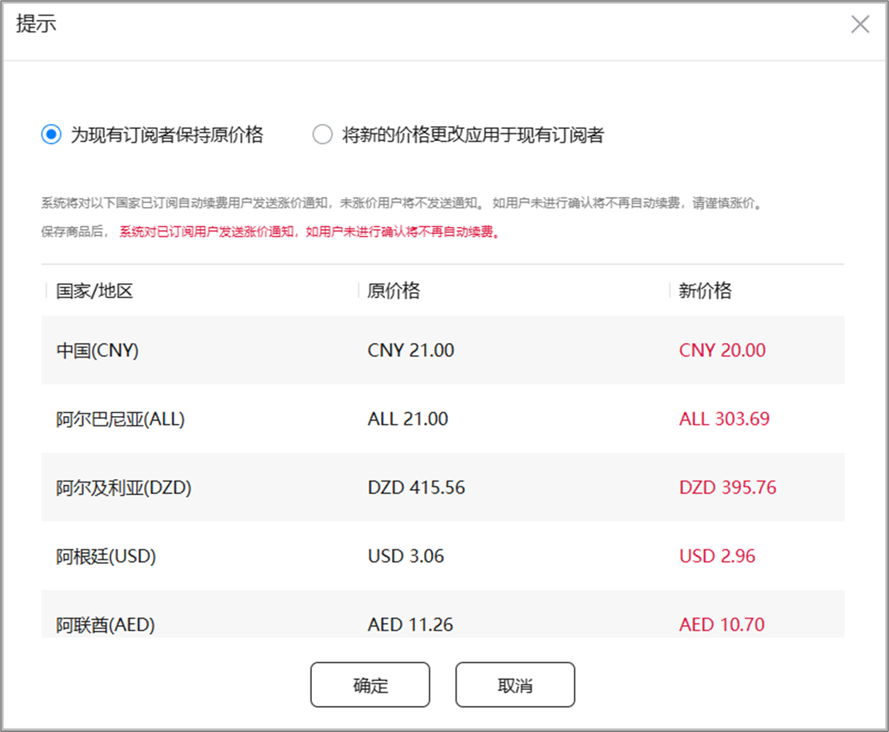

# 自动续期订阅商品

1. 登录[AppGallery Connect](https://developer.huawei.com/consumer/cn/service/josp/agc/index.html)，选择“APP与元服务”。
2. 在应用列表中点击需要修改商品的应用。
3. 在“运营”页签下的左侧导航栏中，选择“产品运营 &gt; 商品管理”。
4. 在商品列表中，点击待编辑的自动续期订阅商品对应“操作”列的“编辑”。

   
5. 可修改商品基本信息和审核信息，其中自动续期周期仅在自动续期订阅商品的状态为草稿或待提交状态时可修改。

   

   

   在修改自动续期周期时，需要删除该商品下的所有订阅优惠，否则将无法保存。
6. 如需修改商品销售范围。在商品编辑页面上点击 “修改销售范围”。
   * 商品销售范围：决定商品可供用户购买的国家/地区，修改销售范围至少选择1个销售国家/地区。
   * 新国家或地区：鸿蒙应用市场会对未来新增的国家或地区自动提供您的商品，届时以您设置的全球商品定价为准，您可以选择是否在新国家或地区销售。

   

   

   * 当前鸿蒙应用数字商品服务的销售范围仅支持中国大陆，如后续新增国家或地区时，您希望商品自动支持在新国家或地区销售，请保持勾选“新国家或地区”选项。
   * 如您的订阅商品正在生效中，移除原销售国家/地区后，原销售国家/地区的用户将无法购买，生效中的现有订阅者将无法续期 。
   * 如消耗型/非消耗型/非续期订阅商品正在生效中，移除原销售国家/地区后，原销售国家/地区的用户将无法购买。
7. 如需修改商品价格，点击商品编辑页面的“查看编辑”。

   
8. 修改商品价格。
   * 不同国家/地区的商品价格

   a）在“商品价格”页面，点击右上角“编辑”。

   

   b）修改“汇率换算基准价格”，勾选排序规则，在列表中选择使用汇率刷新价格的国家/地区，点击“刷新”同步更新商品价格。如果您需要对指定国家/地区的商品价格进行调整，还可以手动填写来修改该国家/地区对应商品的用户支付价格（含税）。

   

   * 当进行切换“汇率换算基准价格”选项（含税或不含税）时，如果该商品存在未开始或者正在进行中的订阅优惠，需要先删除/结束订阅优惠后才能切换成功。切换成功后之前计算出的所有国家/地区的价格将被清空，需选中所有国家/地区点击刷新重新计算。
   * 如果对商品进行涨价，且对当前订阅者生效，系统会对已订阅用户发送涨价通知，如用户未进行确认将不再自动续期。降价则不需要用户确认。
   * 当华为数字商品服务新增上线国家后，如果开发者未重新确认保存商品价格，新上线国家的价格会受到汇率变动而变动（已上线国家价格不受影响）。只有当您重新确认保存商品价格后，新上线国家的价格才会固定下来，不再受汇率变动影响。

   

   c）点击“保存”后，需在如下弹窗中确认新价格的生效对象，默认选择只针对新用户生效（对已有订阅老用户保持原价）。你可选择将涨价后的新价格应用于已有的订阅用户。

   

   将涨价后的新价格应用于已有的订阅用户将触发系统涨价通知消息，如果用户没有进行确认，将自动取消订阅。

   

   * 商品促销价格

   您还可根据您的促销策略设置商品促销价，详情请参见[设置促销价格](/docs/distribute/app-dist/app-services/intermodal-transport-services-0000001933253576/digital-products-0000002005836556/guidance-document-0000001933094208/digital-products-manage-0000001959074881/set-0000001931995712/promotion-renewal-0000001959074897)。
9. 完成修改后，点击“保存”或“提交审核”。

已通过审核的数字商品，如果仅修改其价格和商品销售范围，则无需重新提交审核，新价格和新的商品销售范围立即生效；如果还修改了其他基本信息或审核信息，则需要再次提交审核，数字商品方可生效。