# 消耗型/非消耗型/非续期订阅商品

在HarmonyOS应用数字商品服务中，针对消耗型/非消耗型/非续期订阅商品，支持您设置两种订阅优惠类型，包含自定义人群促销、设置商品的临时价格调整计划。

<strong>自定义人群促销：</strong>请提前在商品管理系统中针对商品设置自定义人群促销价格，由您自行根据用户画像判断用户是否满足促销优惠条件。在发起购买前，通过调用查询商品信息接口，获取[promotionalOffers](`https://developer.huawei.com/consumer/cn/doc/harmonyos-references/iap-iap#section446812293465`)，查询该商品的优惠活动信息；在最终发起购买时，通过将优惠活动信息（[promotionalOfferId](`https://developer.huawei.com/consumer/cn/doc/harmonyos-references/iap-iap#section1340120344598`)）传递到华为IAP Kit，最终将优惠活动信息展示给用户。

自定义人群促销规则：

每个商品最多可设置10个有效的自定义促销价格（与设置的优惠标识一一对应），由您自行决定每一位用户可使用的次数（非消耗型商品购买后终身有效，用户只能购买和享受一次促销）。

<strong>设置商品的临时价格调整计划</strong>：如果想在一段时间内针对特定国家/地区的所有用户展示统一的促销价格，可设置该商品的临时价格调整计划，设置开始和结束日期以及对应国家/地区后，该促销价格届时将对该国家/地区的所有用户展示和生效。

## <strong>设置促销价格</strong>

支持开发者自定义人群并设置促销优惠，一个商品可以设置不同的促销价格。

1、登录AppGallery Connect，选择“APP与元服务”。

2、在应用列表中点击需要设置促销价格的应用。

3、在“运营”页签下的左侧导航栏中，选择“产品运营 &gt; 商品管理”。

4、在商品列表中，点击待设置订阅优惠的非自动续期订阅商品对应“操作”列的“编辑”。

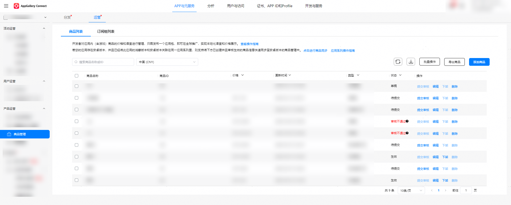

5、在商品编辑页面，选择“查看编辑”选项。

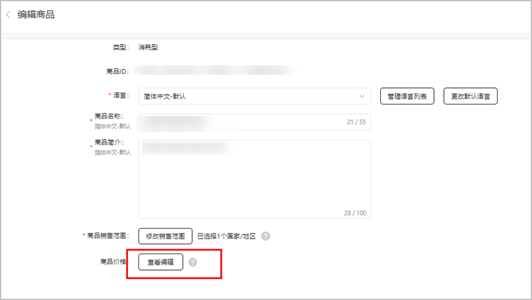

6、在商品价格页面，点击“设置促销优惠”。

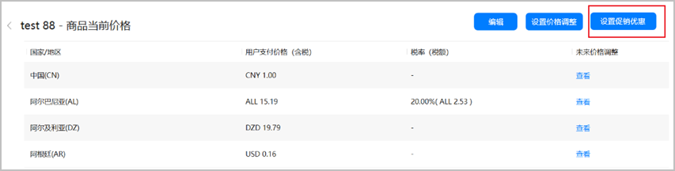

7、看到如下弹窗，请继续点击“设置促销优惠”。

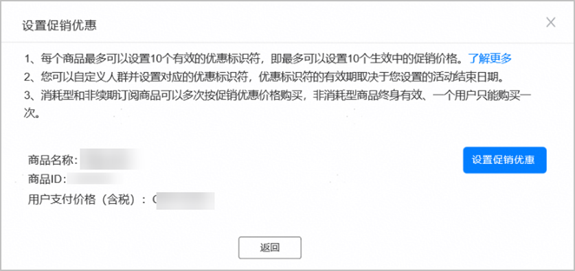

8、继续设置促销活动名称、促销优惠标识符以及开始/结束时间，完成后请点击“下一步”。

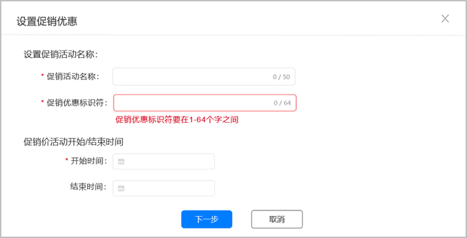

* 最多支持设置10个有效优惠标识符。
* 同一国家/地区在同一时间段可以设置不同促销价。
* 优惠标识符用于区分不同优惠促销，且在当前商品下唯一，最大长度64个字符，需满足[0-9a-zA-Z]，可包含特殊字符。

9、设置参与促销活动的国家/地区，设置完成后点击“下一步”。

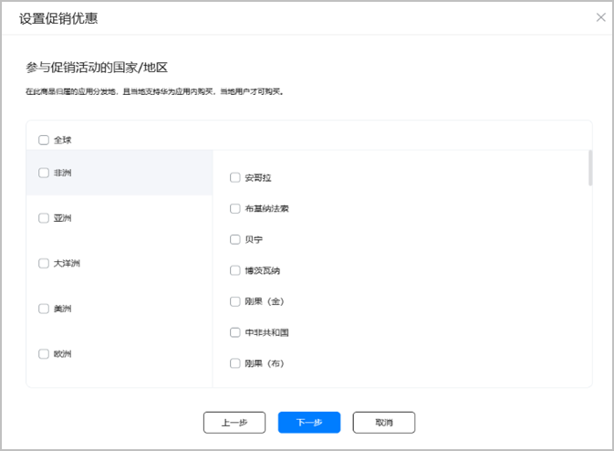

10、可对所有区域的价格进行确认或修改，确认后点击“完成”。

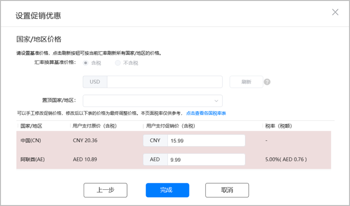

设置促销价和调整价格时，促销价需低于原价。

11、点击“完成”后，跳转回活动列表页。

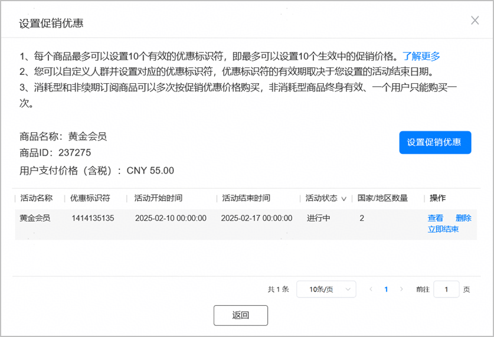

12、可查看促销详情信息。

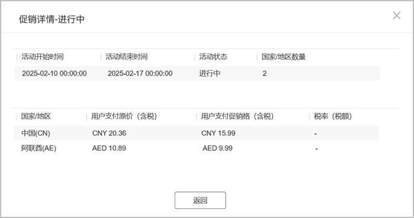

13、如需结束促销活动，点击“立即结束”按钮，弹出确认结束弹窗，点击“确认”即可结束商品促销活动。

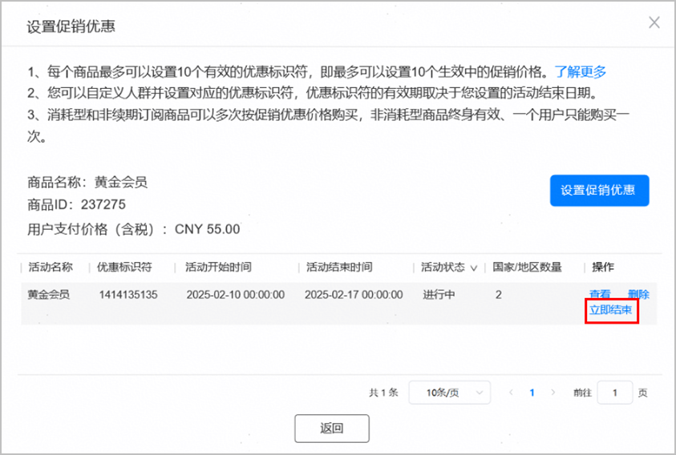

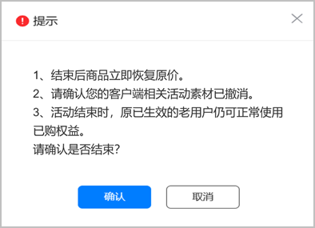

如有冲突时间段、国家、价格，可通过修改促销价或删除冲突的未来价格调整计划。