# 自动续期订阅商品

在HarmonyOS应用数字商品服务中，针对自动续期订阅商品，支持您设置三种订阅优惠类型：新用户促销、自定义人群促销、退订挽留促销。

<strong>新用户促销：</strong>用户未享受过同一订阅组的新用户促销价时可享受，由您在商品管理后台设置促销价格，平台自动判断是否满足条件。

新用户促销规则：

A. 用户对每个订阅组至多享受一次新用户促销，如果一个订阅组里的多个商品均配置了新用户促销价格，在用户尝试切换该订阅组的其他商品时，用户只能享受在该订阅组第一次遇到的新用户促销。

B. 新用户促销享受的触发方式是新订阅、恢复订阅、切换订阅三种场景，无论是新发起的订阅、恢复订阅、切换订阅，均遵从“用户对每个订阅组至多享受一次新用户促销”的原则，只要用户没有享受过该订阅组的新用户促销，就可以享受该促销价。

<strong>自定义人群促销：</strong>请提前在商品管理系统中针对商品设置自定义人群促销价格，由您自行根据用户画像判断用户是否满足促销优惠条件。在发起购买前，通过调用查询商品信息接口，获取[promotionalOffers](`https://developer.huawei.com/consumer/cn/doc/harmonyos-references/iap-iap#section446812293465`)，查询该商品的优惠活动信息；在最终发起购买时，通过将优惠活动信息（[promotionalOfferId](`https://developer.huawei.com/consumer/cn/doc/harmonyos-references/iap-iap#section1340120344598`)）传递到华为IAP Kit，最终将优惠活动信息展示给用户。

自定义人群促销规则：

A. 每个订阅商品最多可设置10个有效的自定义促销价格（与设置的优惠标识一一对应），由您自行决定每一位用户可使用的次数。

B. 当用户同时符合自定义人群促销和新用户促销的资格时，自定义人群促销的优先级高于新用户促销。

C. 当用户历史上享受过自定义人群促销，仍具备享受新用户促销的资格。

<strong>退订挽留促销：</strong>您可以指定优惠持续时间、促销价格类型（免费试用、按周期扣费等）和多次享受挽留促销的间隔期（从优惠结束时间起算），可用于挽留即将取消订阅的用户，当用户在订阅管理界面取消订阅且满足挽留促销条件时，系统会弹出挽留弹框提示，用户可以选择享受挽留促销并继续订阅或者仍要取消订阅。当用户选择享受挽留促销则保持订阅关系，下次续期时享受挽留促销价。

退订挽留促销规则：

A. 用户订阅该商品并生效中。

B. 用户的当期订阅以商品正价（非促销价）续期。

C. 用户在过去特定时段未享受过同一订阅商品的挽留促销优惠（支持开发者选择优惠间隔周期）；同一优惠价间隔周期内只能享受一次挽留促销优惠。

D. 用户选择享受优惠功能，是在原有的同一订阅关系、同一个订阅ID上产生订阅关系。当用户选择以优惠价格享受优惠后，您根据原有的订阅ID发放权益。

<strong>设置活动类型说明：</strong>

<strong>免费试用：</strong>设置一个免费时间段，让用户在购买初期免费享受一段时间的商品服务，到期后按原订阅价格和续费周期续订。

免费试用的优惠持续时间可以设置为：3天、1周、2周、1个月、2个月、3个月、6个月或1年。

<strong>按周期扣费：</strong>用户在特定时限内的每个续费周期享有折扣价，到期后按原订阅价格和续费周期续订。

可供选择的优惠持续时间：

订阅续期周期为1周，可选：1至12 周。

订阅续期周期为1个月，可选：1至12 个月。

订阅续期周期为2个月，可选：2、4、6、8、10或12个月。

订阅续期周期为3个月，可选：3、6、9或12个月。

订阅续期周期为6个月，可选：6或12个月。

订阅续期周期为1年，可选：1年。

订阅续期周期为30天，可选：30天\*1~12。

订阅续期周期为31天，可选：31天\*1~12。

<strong>提前支付：</strong>用户一次性支付未来一段优惠期的折扣价格，到期后按原订阅价格和续费周期续订。

优惠持续时间可以设置为：3天、1周、2周、1个月、2个月、3个月、6个月或1年。

## 新用户促销/自定义人群促销

1. 登录[AppGallery Connect](`https://developer.huawei.com/consumer/cn/service/josp/agc/index.html`)，选择“APP与元服务”。
2. 在应用列表中，点击需要设置促销价格的应用。
3. 在“运营”页签下的左侧导航栏中，选择“产品运营 &gt; 商品管理”。
4. 在商品列表中，点击待设置订阅优惠的自动续期订阅商品对应“操作”列的“编辑”。

   
5. 在商品编辑页面，选择“查看编辑”选项。

   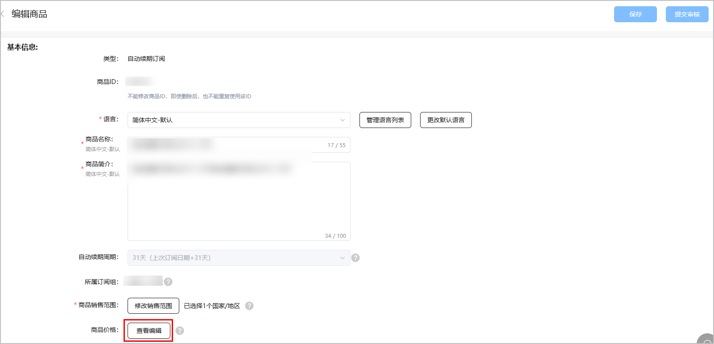、
6. 在商品价格页面，点击“设置订阅优惠”。

   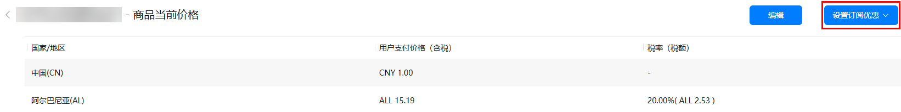
7. 当弹出“设置订阅优惠”下拉框时，您可以根据业务场景需求，选择“新用户促销”或“自定义人群促销”产品能力。

   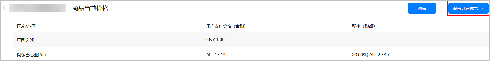

   * 当您选择“新用户促销”时，会看到如下弹窗，请继续点击“设置订阅优惠”。

     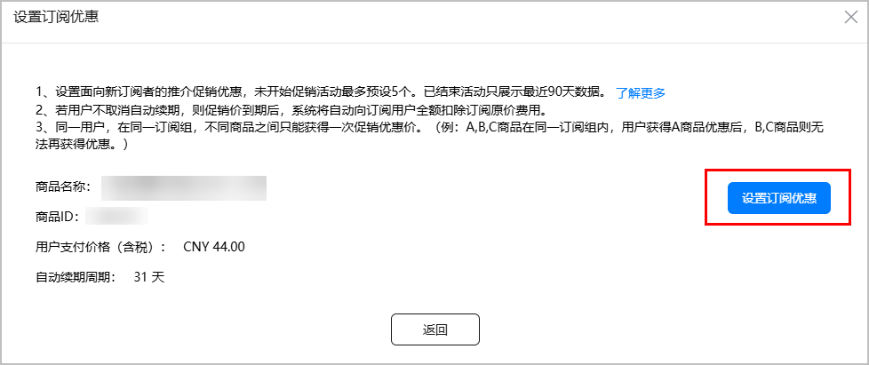

     继续设置促销活动、名称和开始/结束时间，完成后请点击“下一步”即可。

     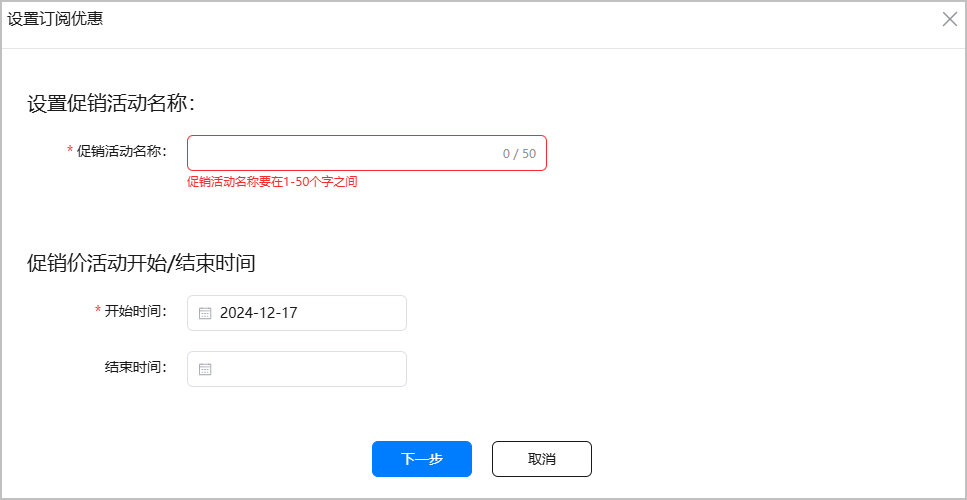
   * 当您选择“自定义人群促销”时，则会进入以下弹窗，请点击“设置订阅优惠”。

     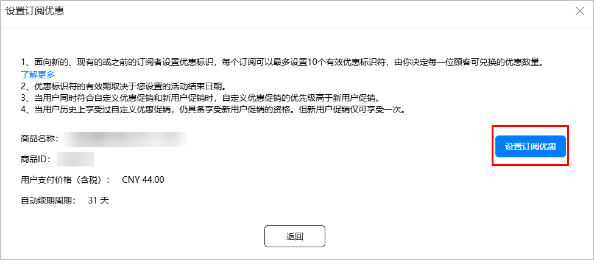

     

     + 面向新的、现有的或之前的订阅者设置优惠标识，每个订阅可以最多设置10个有效优惠标识符，由您决定每一位顾客可兑换的优惠数量。
     + 优惠标识符的有效期取决于您设置的活动结束日期。
     + 当用户同时符合自定义优惠促销和新用户促销时，自定义优惠促销的优先级高于新用户促销。
     + 当用户历史上享受过自定义优惠促销，仍具备享受新用户促销的资格。但新用户促销仅可享受一次。
     + 创建自定义优惠促销后，您可以在发起购买前，查询该商品的优惠信息，在最终发起购买时，将优惠信息传递到华为IAP，最终将优惠活动信息展示给用户。

     继续设置促销活动名称、促销优惠标识符以及开始/结束时间，完成后请点击“下一步”。

     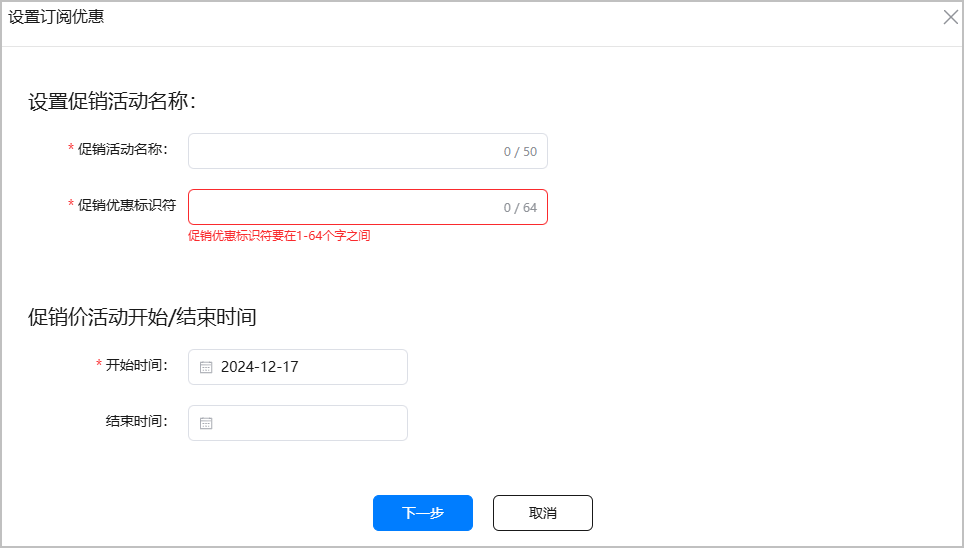

     

     + 优惠促销标识符用于区分不同优惠促销，当前商品下唯一，最大长度64个字符，需满足[0-9a-zA-Z]。
     + 除了通过在AGC控制台创建自定义人群促销活动，您还可以通过接口[创建商品促销信息](`https://developer.huawei.com/consumer/cn/doc/AppGallery-connect-References/agcapi-addpromotion-harmonyosnext-0000002131508856`)。
8. 设置参与促销活动的国家/地区，设置完成后点击“下一步”。

   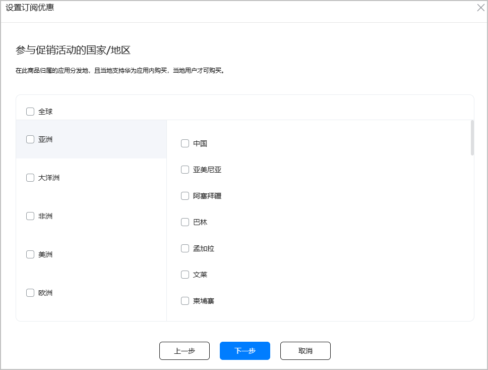
9. 设置活动类型：
   * 免费试用：需设置试用的期限。

   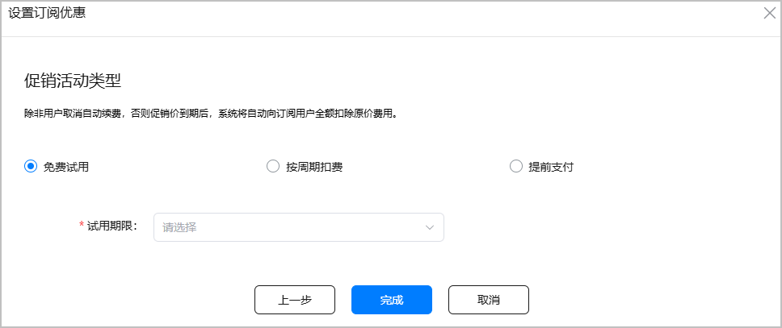

   * 按周期扣费：需设置优惠续费周期以及促销优惠价，且促销优惠价必须低于原价。

     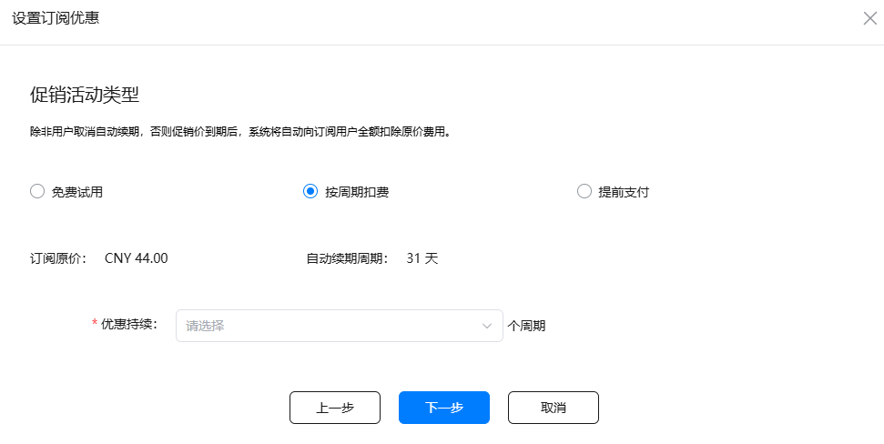
   * 提前支付：需设置优惠持续时间以及促销优惠价，且促销优惠价必须低于原价。

   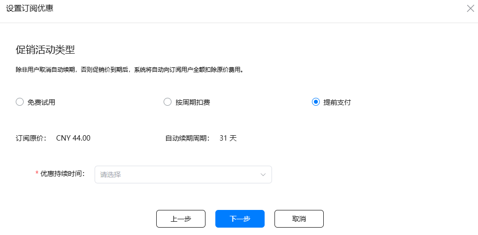
10. 若选择“免费试用”，设置完成后点击“完成”即可。若选择“按周期扣费”或“提前支付”，设置完成后点击“下一步”，可对所有区域的价格进行确认或修改，确认后点击“完成”。

    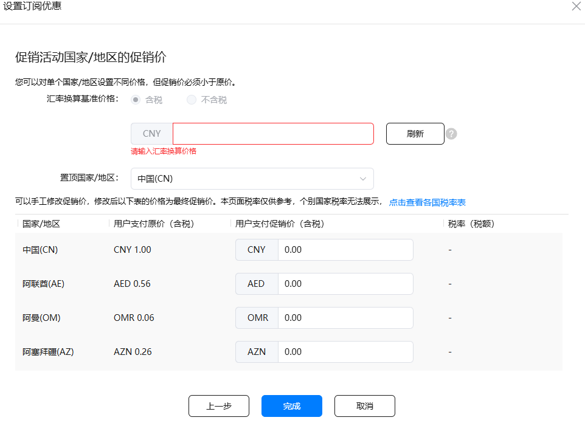

    

    如果您需要调整某个国家/地区商品的用户支付促销价，可单独进行修改。

    免费试用：用户可以在特定时限内免费体验您的订阅，到期后按原订阅价格和续费周期续订。

    按周期扣费：用户在特定时限的每个结算周期享有折扣价，到期后按原订阅价格和续费周期续订。

    提前支付：用户一次性支付未来一段优惠期的折扣价格，到期后按原订阅价格和续费周期续订。

## 退订挽留促销

当前商品价格-设置订阅优惠中新增“退订挽留促销优惠”活动，并支持开发者针对订阅退订人群进行挽留，在订阅退订弹窗中提供挽留营销能力。

<strong>仅支持自动续期订阅商品使用退订挽留促销优惠功能。</strong>

如您需要开通退订挽留促销优惠功能，请联系对应的行业运营。

1、登录AppGallery Connect，选择“APP与元服务”。

2、在应用列表中点击需要设置促销价格的应用。

3、在“运营”页签下的左侧导航栏中，选择“产品运营 &gt; 商品管理”。

4、在商品列表中，点击待设置订阅优惠的自动续期订阅商品对应“操作”列的“编辑”。

5、 在商品编辑页面，选择“查看编辑”选项。

6、在商品价格页面，点击“设置订阅优惠”。

7、当弹出“设置订阅优惠”下拉框时，您可以根据业务场景需求，选择“新用户促销”、“自定义人群促销”或“退订挽留促销”产品能力。

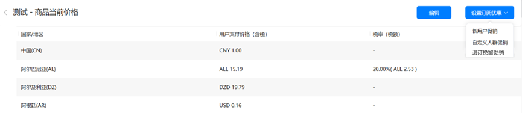

8、如果您选择“退订挽留促销”的时候，则会进入以下弹窗，请点击“设置订阅优惠”。

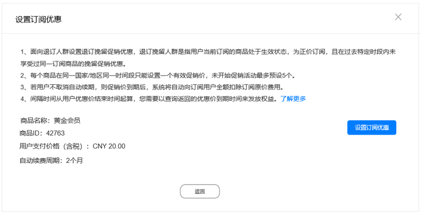

退订用户需满足如下条件：

* （1）用户订阅该商品并生效中。
* （2）用户的当期订阅以商品正价（非促销价）续期。
* （3）用户在过去特定时段未享受过同一订阅商品的挽留促销优惠（支持开发者选择周期）。
* （4）同一优惠价间隔周期内只能享受一次挽留促销优惠。
* （5）用户选择享受优惠功能，是在原有的同一订阅关系、同一个订阅ID上产生订阅关系。当用户选择以优惠价格享受优惠后，开发者根据原有的订阅ID发放权益。

9、点击“设置订阅优惠”按钮，设置促销活动名称、两次优惠价的间隔时间、促销价活动开始/结束时间、参与促销活动的国家/地区、促销活动类型、促销价格，完成后请点击“下一步”。

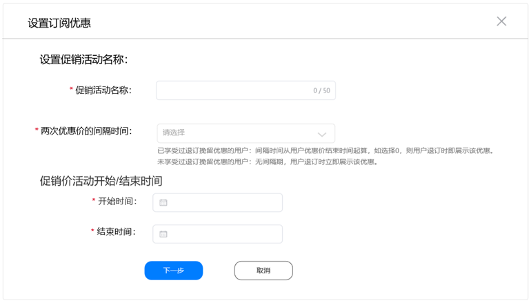

两次优惠价的间隔时间：退订挽留优惠价的间隔时间从用户优惠价结束时间起算，以查询返回的到期时间为准。可以选择0-12个月的任意值。如选择0，表示无间隔周期，用户退订时即展示该优惠；时间选项支持选择0-12个月的任意值，不受商品续期周期影响。

1、未享受过退订挽留优惠的用户，无间隔期。

2、间隔时间从用户优惠价结束时间起算，以查询返回的到期时间为准，开发者需要处理续期通知，详细请参考开发者文档指南。

10、设置完成后，如您需要管理退订挽留，在活动列表页，可以查看和编辑“退订挽留间隔时间”。

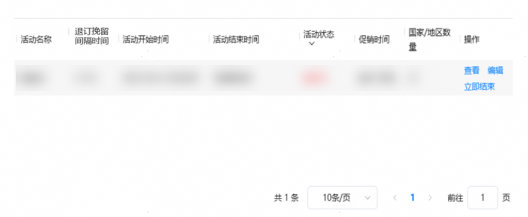