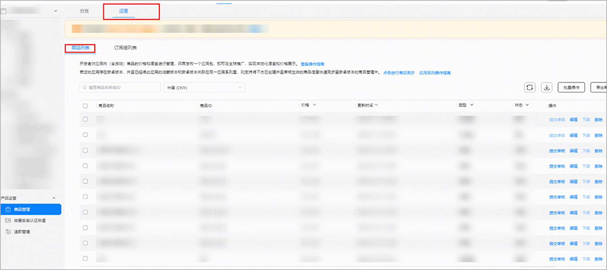
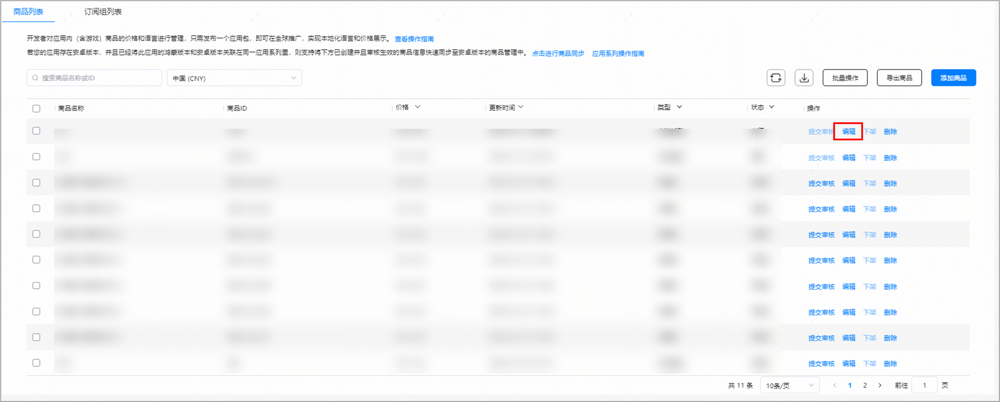
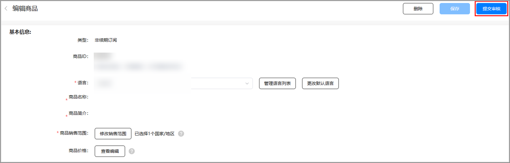
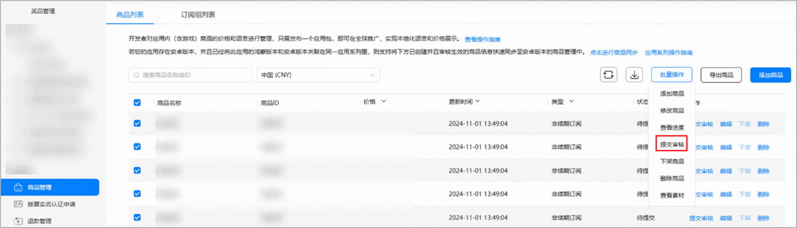

# 提交已生效类型的数字商品

## <strong>提交单个数字商品</strong>

1. 点击[AppGallery Connect](`https://developer.huawei.com/consumer/cn/service/josp/agc/index.html`)，选择“APP与元服务”。
2. 在应用列表中点击需要提交商品的应用。
3. 在“运营”页签下的左侧导航栏中，选择“产品运营 &gt; 商品管理”。
4. 在右侧商品列表页，找到要提交的数字商品，点按旁边的“提交审核”。

   
5. 您也可以点击“编辑”，进入要提交的数字商品详情页，点按右上方的“提交审核”。

若所提交商品为已生效类型，且计划在即将上线的新版本应用中展示，请务必先等待该商品通过审核并正式生效后，再提交待发布的新版本应用至审核，从而确保新版本应用审核通过后，该商品在应用内可正常展示并供用户购买。

## 批量提交数字商品

1. 点击[AppGallery Connect](`https://developer.huawei.com/consumer/cn/service/josp/agc/index.html`)，选择“APP与元服务”。
2. 在应用列表中点击需要提交商品的应用。
3. 在“运营”页签下的左侧导航栏中，选择“产品运营 &gt; 商品管理”。
4. 在右侧商品列表页，找到要提交的数字商品，勾选要提交审核的数字商品，点击“批量操作&gt;提交审核”。

