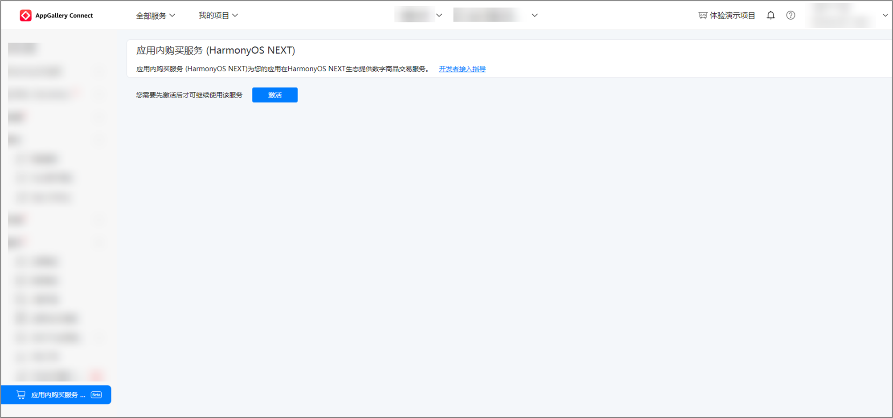
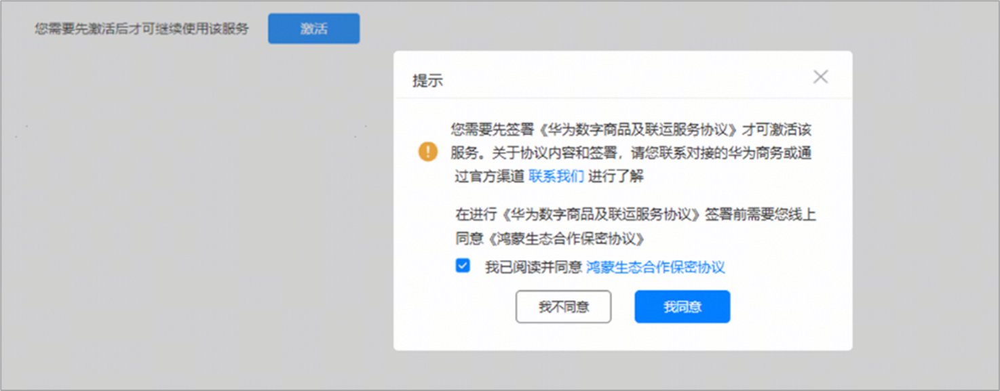
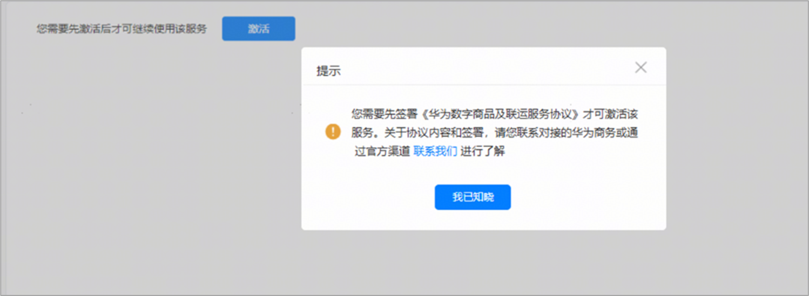
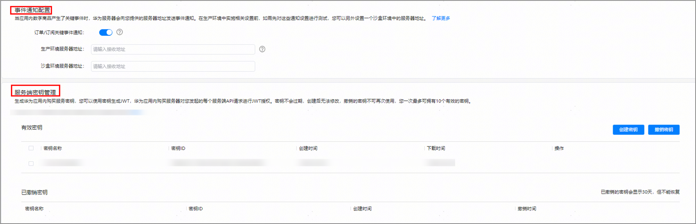
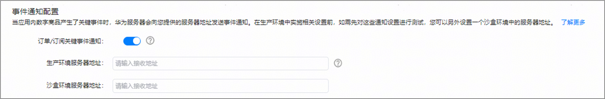
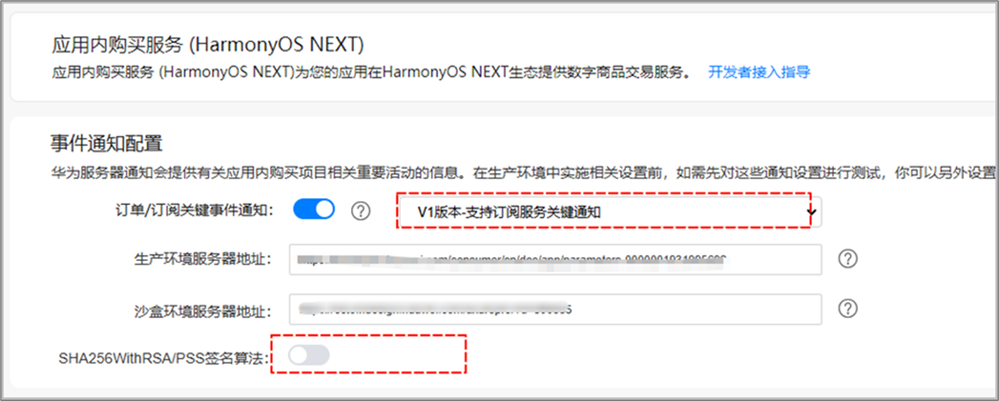
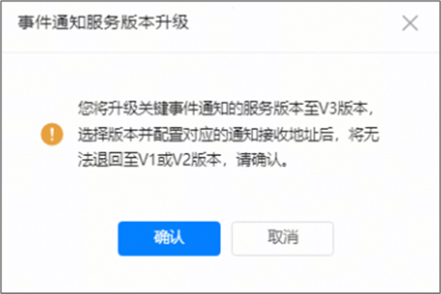

# 激活服务和配置事件通知

1. 登录[AppGallery Connect](`https://developer.huawei.com/consumer/cn/service/josp/agc/index.html#/`)，选择“开发与服务”。
2. 在项目列表中找到对应项目，在项目下的应用列表中选择需要配置鸿蒙应用内购买服务参数的HarmonyOS应用。
3. 在左侧导航栏选择“盈利&gt;应用内购买服务”,首次进入需要点击“激活”按钮，激活后方可开通和使用该服务配置。

   
4. 您接入应用内购买服务需要签署《鸿蒙生态合作保密协议》，若您未签署过《鸿蒙生态合作保密协议》，则在点击“激活”按钮时页面将弹出协议签署弹框，您可在弹框中点击“我同意”完成协议签署。

   

   

   签署《鸿蒙生态合作保密协议》需账号持有者或拥有法务权限的管理员方可操作。
5. 如果您已完成《鸿蒙生态合作保密协议》签署，但尚未与华为签署《华为数字商品及联运服务协议》，会弹窗提示您先联系对接的华为商务（联系方式详见：[服务与支持-商务联系方式](`/docs/distribute/app-dist/app-services/intermodal-transport-services-0000001933253576/digital-products-0000002005836556/service-0000001959074917)）了解和签署该协议，签署完成后可开通对应服务，并在后续开展数字商品服务。

   
6. 服务激活开通后，页面上会展示可供配置的关键事件通知地址和服务端密钥。在生产环境中实施相关设置前，如需先对这些通知设置进行测试，您可以另外设置一个沙盒环境中的服务器地址。

   
7. 在“事件通知配置”模块下，打开“订单/订阅关键事件通知”所在行开关，配置通知接收地址。通知地址仅支持HTTPS地址，后期可随时修改。

   

   若您的应用之前已配置过关键事件通知，并且选择的服务版本为V1或V2，可点击下拉框点击V3版本进行服务升级，并配置对应的通知接收地址。

   

   

用户购买商品后，服务器会在订单/订阅场景的某些关键事件发生时通知您配置的事件通知地址，具体可参见[服务端关键事件通知](`https://developer.huawei.com/consumer/cn/doc/harmonyos-references/iap-key-event-notifications`)。

如果您同时提供生产环境服务器地址和沙盒环境服务器地址，华为服务器会将两种环境的通知分别发送到对应环境的服务器地址；如果您只提供了生产环境服务器地址，而没有提供沙盒环境服务器地址，华为服务器会自动将两种环境的通知发送到您提供的生产环境服务器地址；如果您只提供了沙盒环境服务器地址，则生产环境中的通知将无法收到。