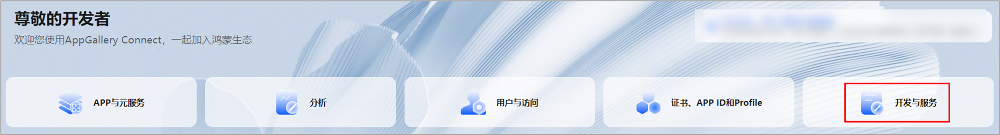
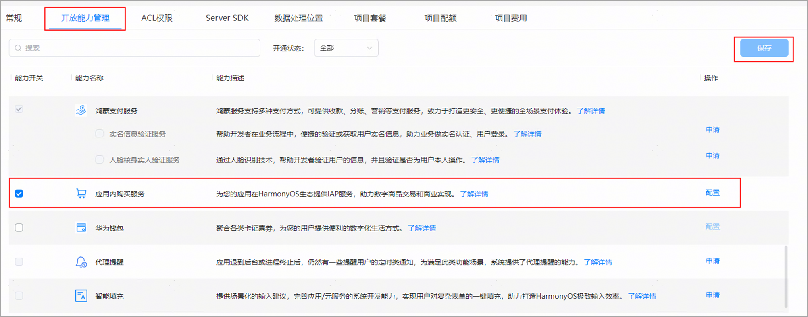

# 打开应用内购买服务API开关

需要使用数字商品服务的应用需打开应用内购买服务API开关。

打开服务开关是应用级别的，即每个需要使用数字商品服务的应用都需要先打开应用内购买服务API开关。

1. 登录[AppGallery Connect](`https://developer.huawei.com/consumer/cn/service/josp/agc/index.html`)，选择“开发与服务”。 
2. 在项目列表中找到对应项目，点击进入项目。
3. 在项目下的应用列表中选择需要开通服务的HarmonyOS应用。
4. 点击“开放能力管理”页签，打开鸿蒙应用内购买服务所在行的开关，配置后点击“保存”。

   
5. 如果您此前尚未开通商户服务，则当您点击开启鸿蒙“应用内购买服务”开关时，会弹出提示弹框，提示您前往开通商户服务并且签署《华为商户服务协议》。