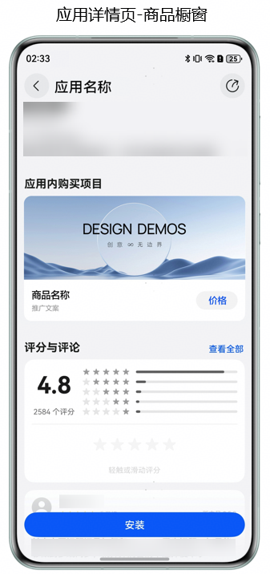
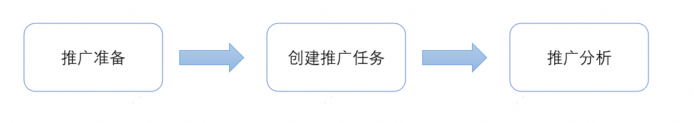
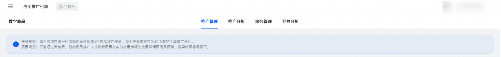
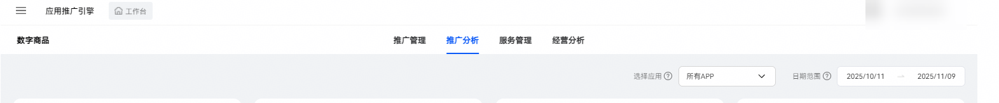

# 数字商品推广

## 业务介绍

数字商品推广面向已签署《华为数字商品及联运服务协议》并上架数字商品的开发者提供精准、优质、高效的推广服务，助力合作伙伴快速获量增长，实现商业成功。开发者可以在应用推广引擎上使用数字商品全域推广能力以及一站式管理数字商品服务全流程，让您的数字商品高效触达，缩短用户决策路径，打造沉浸式浏览体验，提升用户转化率。

## 数字商品推广展示效果

点击“价格”按钮后，

1、未安装该应用的用户，系统会先提示引导用户安装应用，安装后自动跳转至应用端内指定页面（由开发者在数字商品推广任务中配置的Deeplink，建议指定为该商品在应用内的展示页）。

2、已安装应用的用户，点击购买按钮后，直接跳转至应用端内指定页面。

## 推广流程

1、推广准备

* 确保您登录的应用推广引擎账号拥有相对应的账号权限，请参考[账户管理](`https://developer.huawei.com/consumer/cn/doc/app/platform-introduction-0000002306078829#section184632011511`)。

* 创建推广任务前，确认要推广的数字商品，请参考[配置数字商品服务](`https://developer.huawei.com/consumer/cn/doc/app/digital-products-serve-0000001931836308`)。

* 提前准备推广素材，请参考数字商品素材规范。

2、创建推广任务

您可以通过“[应用推广引擎](`https://developer.huawei.com/consumer/cn/service/apcs/aggrowth/chassis/home`)”首页点击“数字商品”后进入数字商品管理台，点击“推广管理”页面， 您可以创建、查看、编辑任务。请参考[创建商品推广任务](`https://developer.huawei.com/consumer/cn/doc/app/digital-product-promotion-0000002270335466#section973920911819`)。

3、推广分析

创建商品推广任务后，您可以登录应用推广引擎，点击“数字商品-推广分析”，从而查看到App内数字商品的推广数据，您可以从这些数据中洞察到任务表现情况，最终辅助您做出更好的数字商品推广策略。请参考[推广分析](`https://developer.huawei.com/consumer/cn/doc/app/digital-product-promotion-0000002270335466#section1779013215437`)。

