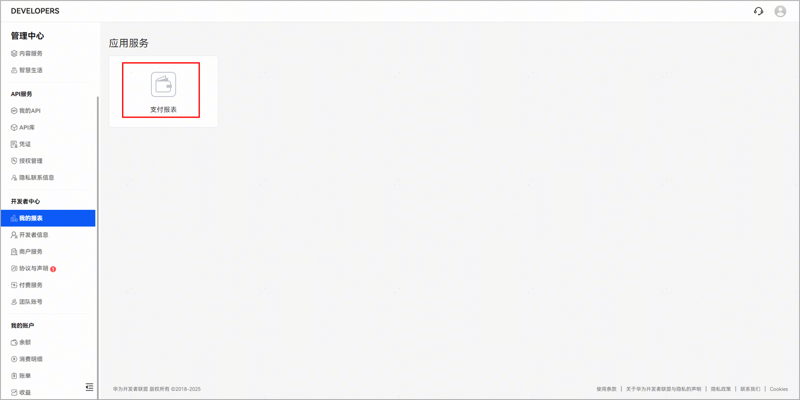
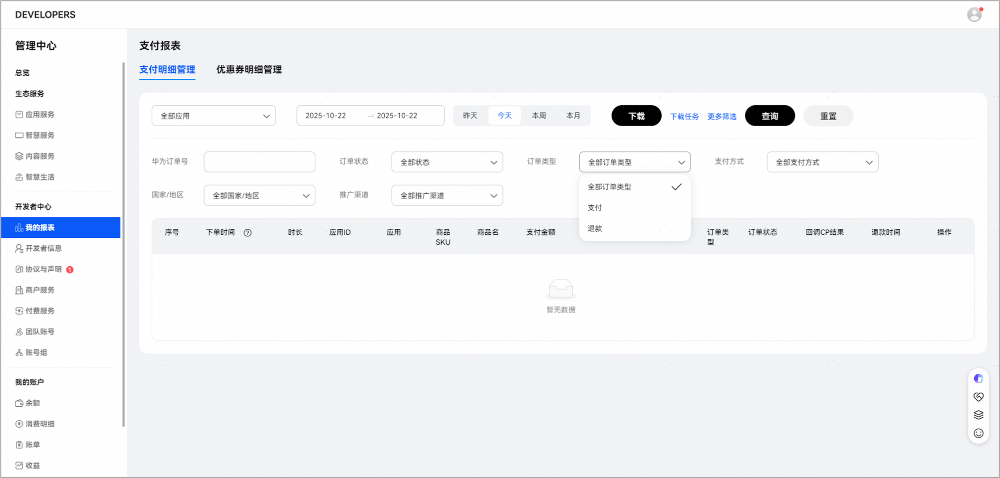
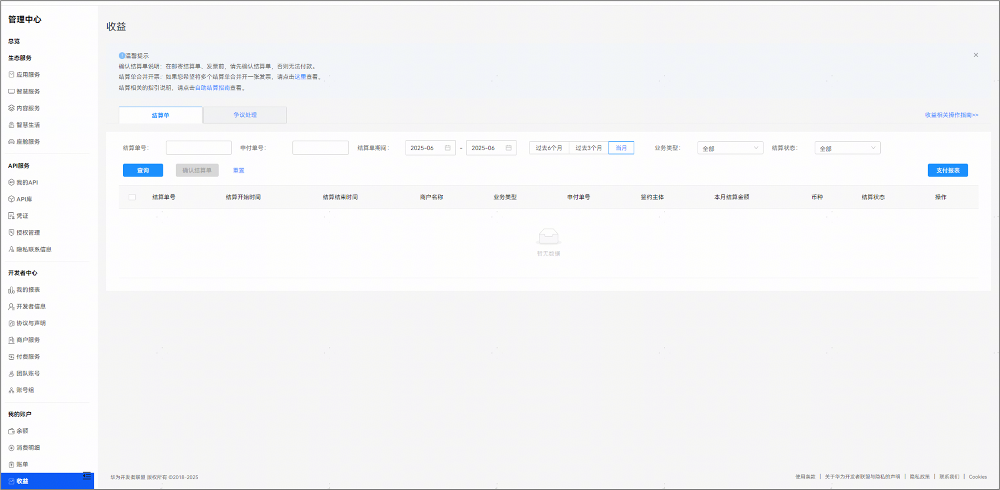
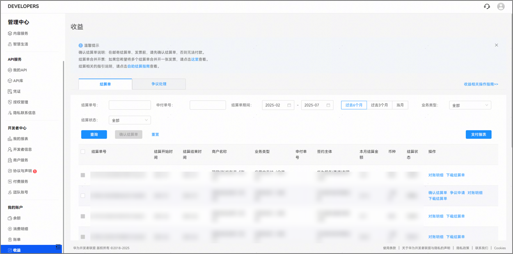
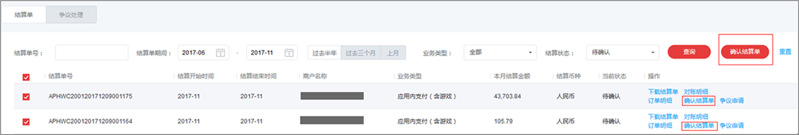
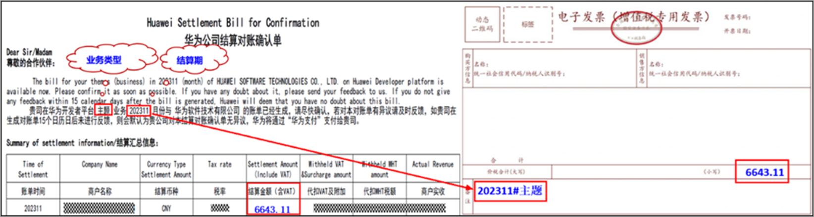
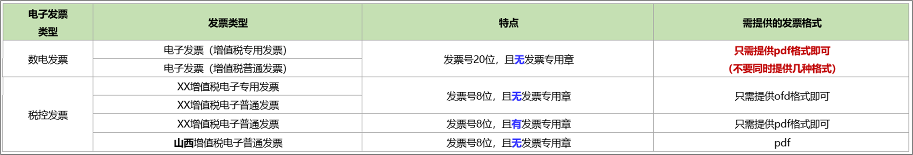

# 财务结算

## 概览

含有数字商品服务的应用进行财务结算时，可以通过开发者联盟平台获取结算数据、核对和确认结算单。

请务必先确认结算单，再提供发票，否则无法付款。

## 查看和下载支付报表

您可登录[开发者联盟](https://developer.huawei.com/consumer/cn/)，进入“管理中心”，在“我的报表 > 支付报表”中，查看或导出指定时间段内支付明细和优惠券明细。

## 账单出具时间

上一个日历月应得收入，预计在每个结算周期的第5个工作日前，通过开发者联盟平台向您提供结算款的结算单。

只有接入数字商品服务的应用才会涉及结算。

结算周期为月度或合同单独约定。

## 获取结算数据

**自助结算页面获取结算数据**

登录[开发者联盟](https://developer.huawei.com/consumer/cn/)，进入“管理中心”，点击“我的账户”，选择“收益”，进入自助结算页面查看结算单并确认。

根据已签订的合作协议，预计在每个结算周期的第5个工作日前通过开发者联盟平台将结算款的结算单提供您。若您的数据与华为计算的结算款有差异，且差异达到结算款的3%，您可要求对账，并在收到结算单的15个日历日内发起异议。逾期未提出异议的，视为接受结算。详见[《华为开发者商户服务协议》](https://developer.huawei.com/consumer/cn/doc/start/merchantserviceagreement-0000001052848245#section07451552162120)。

**API获取结算数据**

此接口用于开发者查询和获取对账结算数据。详见：**[《获取对账结算数据》](/docs/distribute/app-dist/app-services/intermodal-transport-services-0000001933253576/digital-products-0000002005836556/guidance-document-0000001933094208/operation-guide-0000002381879945/reconciliation-data-0000002348239424)**

## 核对和确认结算数据

###核对结算单

点击“下载结算单”或者“对账明细”，核对本月结算数据。将结算单的“结算期#业务类型”备注在发票备注栏（详细见“开票信息”），必须备注。若不备注，可能影响付款及时性。备注后无需传递结算单给华为。

如果您需要进一步获取全量订单明细核对，可以调用“[应用购买记录相关支付订单查询](https://developer.huawei.com/consumer/cn/doc/harmonyos-references/iap-order-query)”的接口查询历史订单，或在联盟“支付报表”查询和下载。

###确认结算单

如您对结算数据无异议，点击“确认结算单”提交结算申请，核对申付金额及收款银行等信息无误后，点击“提交”，提交后将无法取消。

## 提供发票

###开具发票

对于企业开发者，您需开具增值税专用发票，不接受其他类型的发票。

如您是个人开发者，需前往税务局申请代开增值税发票。

###开票金额

请您按照确认的结算单金额开具发票，注意结算金额与发票价税合计金额要完全一致，不能有一分钱差异。

（1）结算期范围：开发者账号、签约主体、合同、币种、业务类型相同时，以结算单上结算期为准开票，不可合并开票。

（2）开具增值税发票时，发票上的购买方和销售方的“名称”、“纳税人识别号”、“地址电话”、“开户行及账号”等信息请务必清晰、完整、准确。

（3） 纸质增值税专用发票必须提供一式两联：发票联、抵扣联。且发票联及抵扣联加盖发票专用章，发票的专用章税号及名称须清晰可见，且不可覆盖发票表面信息。

（4） 开票信息上的银行账号不是回款账号，只供开票使用。

如果开发者和华为走第三方主体代结算的流程，即上架主体为A公司、结算主体转为B公司，那么结算单的结算主体及发票销售方为B公司，不管是在联盟后台获取结算数据还是通过API获取结算数据。

###开票信息

| **华为公司开票信息** | |
| --- | --- |
| 名 称 | 华为软件技术有限公司 |
| 通讯地址 | 南京市雨花台区软件大道101号 |
| 邮 编 | 210012 |
| 电 话 | 025-56621111 |
| 传 真 | 025-56621111 |
| 收款人名称 | 华为软件技术有限公司 |
| 开户银行  银行账号  税务登记号  发票内容：项目名称 | 中国工商银行股份有限公司南京三山街支行  4301016539100121556  913201147770231720  **\*****信息系统服务\*信息服务**费 |

开发票时，发票的备注栏内须备注该张发票对应结算单的“**结算期#业务类型**”（参见结算单与发票备注栏样例）。必须备注，否则可能影响付款及时性。备注后无需传递结算单给华为。

## 交付发票

###电子发票通过邮箱接收

|  |  |
| --- | --- |
| 收票公共邮箱 | hwinvoice@huawei.com  请勿打印邮寄，也不要重复发送。 |
| 邮件标题 | 华为软件技术有限公司发票+业务类型+结算期+实名认证名称。 |
| 附件要求 | 仅提供电子发票（发票格式如下），不提供结算单（发票已备注“结算期#业务类型”），不要提供完税证明，不要压缩附件。 |

###纸质发票请邮寄至如下地址

| **邮寄地址** | |
| --- | --- |
| 邮寄地址 | 中国四川省成都市高新西区西源大道1899号 |
| 邮 编 | 611731 |
| 收 件 人 | 华为成都账务共享中心 发票团队 |
| 电 话 | 028-62844628 |

上述开票信息及发票邮寄信息在华为给开发者的结算单上也有说明，如与结算单上存在不一致，请以结算单信息为准。另，收件地址均不接收除发票之外的其他文件（如结算单、合同）。

## 单据审核及付款

若您的付款单据被审核通过，结算页面的结算单状态会变为“付款中”（发起结算单付款）。

华为会收到合格有效的付款单据后15个自然日付款。 若遇节假日可能顺延。付款完成后，结算单状态会变为“付款成功”。

## 完成结算

以发票签收时间起计算付款赎期，华为公司会在合同约定的付款赎期及时完成结算款项支付。