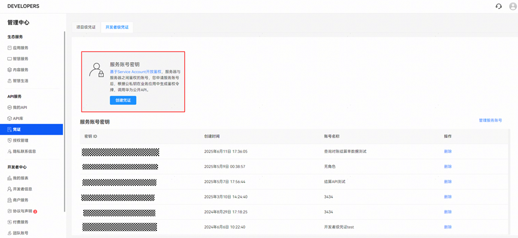
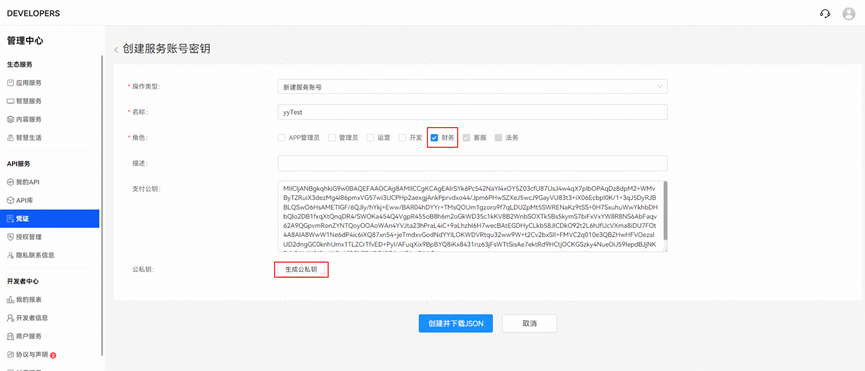

# 获取对账结算数据

## 功能介绍

此接口用于开发者查询和获取对账结算数据。

## 接口原型

|  |  |
| --- | --- |
| <strong>承载协议</strong> | HTTPS POST |
| <strong>接口方向</strong> | 开发者服务器-&gt;华为数字商品服务器 |
| <strong>接口URL</strong> | https://connect-api.cloud.huawei.com/api/apdoms/v1/open-api/finance-report/list |
| <strong>数据格式</strong> | 请求消息：Content-Type: application/json;charset=UTF-8  响应消息：Content-Type: application/json;charset=UTF-8 |

## 请求参数

<strong>Request Header</strong>

| 参数 | 是否必选 | 参数类型 | 描述 |
| --- | --- | --- | --- |
| Content-Type | 是 | String | 取值为：application/json;charset=UTF-8 |
| Authorization | 是 | String | 认证信息，使用JWT进行鉴权，具体请参见[Authorization说明。](`https://developer.huawei.com/consumer/cn/doc/HMSCore-Guides/open-platform-service-account-0000001053509221`) |


JWT生成服务账号鉴权令牌前提条件：

在开发者联盟创建并下载开发者级凭证。

1、点击“凭证&gt;开发者级凭证&gt;创建凭证”。



2、创建服务账号密钥：操作类型选择“新建服务账号”，角色选择“财务”；点击“生成公钥”。



3、点击“创建并下载JSON”，完成“开发者级凭证”创建。


如果不点击生成公私钥，则下载的JSON里面没有私钥信息。私钥信息需妥善保存。

<strong>Request Body</strong>

| 参数 | 是否必选 | 参数类型 | 描述 |
| --- | --- | --- | --- |
| timeRange | 是 | Object | 查询的时间范围，结算周期（一般为月度或合同单独约定）需要完整地包含在此时间范围内才会返回对应的结算数据。例如时间范围为start=2025-01-22，end=2025-06-22，则返回2、3、4、5月份账期的数据。 |

<strong>timeRange</strong>

| 参数 | 是否必选 | 参数类型 | 描述 |
| --- | --- | --- | --- |
| start | 是 | String | 开始时间，格式为YYYY-MM-DD |
| end | 是 | String | 结束时间，格式为YYYY-MM-DD |

## 请求示例

```
POST https://connect-api.cloud.huawei.com/api/apdoms/v1/open-api/finance-report/list
Content-Type: application/json;charset=UTF-8
Authorization：Bearer ***.***.***
Accept: application/json
{
"timeRange": {
"start": "2025-01-22",
"end": "2025-06-22"
}
}
```

## 响应参数

<strong>Response Header</strong>

| 参数 | 是否必选 | 参数类型 | 描述 |
| --- | --- | --- | --- |
| Content-Type | 是 | String | 取值为：application/json;charset=UTF-8 |

<strong>Response Body</strong>

| 参数 | 是否必选 | 参数类型 | 描述 |
| --- | --- | --- | --- |
| rtnCode | 是 | Integer | 错误码 |
| rtnDesc | 是 | String | 错误描述 |
| financeReports | 是 | List&lt;FinanceReportItem&gt; | 财务报告数据 |

<strong>FinanceReportItem</strong>

| 参数 | 是否必选 | 参数类型 | 描述 |
| --- | --- | --- | --- |
| startDate |  | String | 账期开始时间，格式为YYYY-MM-DD |
| endDate |  | String | 账期结束时间，格式为YYYY-MM-DD |
| totalAmount |  | Number | 账期内商户实收金额，例：12345.67 |
| settleCurrency |  | String | 结算币种，例：CNY |
| reconciliationUrl |  | String | 对账明细文件下载URL |
| settlementFileUrl |  | String | 结算单文件下载URL |

## 响应示例

```
HTTP/1.2 200 OK
Content-Type: application/json;charset=UTF-8
{
"rtnCode": 0,
"rtnDesc": " Operation success ",
"financeReports": [
{
"startDate": " 2025-05-01",
"endDate": " 2025-05-31",
"totalAmount": 1941.6,
"settleCurrency": " CNY ",
"reconciliationUrl": " https://nsp-**********",
"settlementFileUrl": " https://nsp-**********"
}
]
}
```

## 响应码

| 响应码 | 错误码 | 描述 |
| --- | --- | --- |
| 200 | 0 | 接口成功 |
| 200 | 1612648968 | 查询时间范围超过365天异常 |
| 200 | 1612648969 | 开始时间晚于结束时间异常 |
| 200 | -1 | 接口内部异常 |
| 403 | -- | 接口鉴权不通过 |