# 退款管理

退款行为是由用户发起的，针对订单向您提出退回已支付款项的请求。当用户因商品、服务等相关退款原因提出退款请求后，您可以基于自身规则、交易实际情况等进行审核评估，最终由您决定是否同意退款及具体的退款方式、金额等。

## <strong>用户退款路径</strong>

通常情况下，用户可通过HarmonyOS 5及以上系统找到应用订单后，根据页面指引提交退款申请，直接在应用内请求退款，请参考[用户申请退款操作指引](`https://developer.huawei.com/consumer/cn/doc/harmonyos-guides/iap-refund#section435204014114`)。

除此之外，如您希望优化应用内的退款体验，方便用户可直接在应用内申请退款，可在您的应用[集成应用内接入退款入口](`https://developer.huawei.com/consumer/cn/doc/harmonyos-guides/iap-refund#section13850184720182`)。

1、建议您设置应用客服回复，以便指引用户在系统中的自助申请退款路径：

系统设置&gt;华为账号&gt;付款与账单&gt;购买记录&gt;点击待退款的订单&gt;对订单有疑问，点击“申请退款”&gt;选择退款原因后，提交退款申请。

2、应用内接入退款入口仅支持非游戏类应用接入。

3、应用内接入退款入口仅支持应用本身所产生的订单的退款。

## <strong>退款管理</strong>

若[用户购买应用内数字商品后申请退款](`https://developer.huawei.com/consumer/cn/doc/harmonyos-guides/iap-refund#section435204014114`)，您可以使用“退款管理”功能处理用户的退款请求，提供退款意见，以便华为对用户完成退款。

处理退款有两种方式：

1、您可以使用[退款管理API](#section16244110171513)返回退款审核结果。

2、您可以使用[AppGallery Connect 退款管理](#section10741115338)页面审核退款单。

## <strong>退款管理API</strong>

如您使用退款管理API，当用户申请退款，我们向您的服务器发送退款审核事件通知，您再将退款审核结果返回，请参考[退款申请通知与处理](`https://developer.huawei.com/consumer/cn/doc/harmonyos-references/iap-server-refund-notify-and-handle`) 。

## <strong>AppGallery Connect 退款管理</strong>

您可通过[AppGallery Connect](`https://developer.huawei.com/consumer/cn/service/josp/agc/index.html#/`)打开退款管理页面，处理用户申请的退款单，并支持查看已完成的退款单。

如使用AppGallery Connect退款管理功能，您需使用[团队账号](`https://developer.huawei.com/consumer/cn/doc/app/agc-help-manageaccount-0000002306610129`) ，为您的团队成员分配具备退款权限的角色。

### 退款工单处理邮件通知

系统于每日09:00向您在[开发者联盟](`https://developer.huawei.com/consumer/cn/`)中维护的邮箱地址发送退款处理提醒邮件。请您务必确保所填邮箱地址准确有效，以免遗漏重要通知。

拥有退款管理功能的账号，均会收到通知邮件。请参考[角色与权限](`https://developer.huawei.com/consumer/cn/doc/app/agc-help-rolepermission-0000002271930352`)。

### 打开退款管理页面

1.登录[AppGallery Connect](`https://developer.huawei.com/consumer/cn/service/josp/agc/index.html#/`)，选择“APP与元服务”。在应用列表中点击待处理退款单的应用。

2. 在“运营”页签下的左侧导航栏中，选择“产品运营 &gt; 退款管理”。您可以查看用户提交的退款申请，处理退款单，以及查询对应的退款进度。

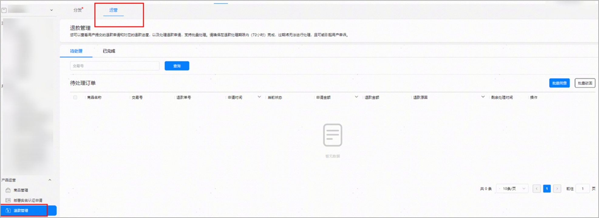

### 处理退款单

您可以在页面上看到当前待处理的退款单，可筛选某一段“申请时间”内的退款单，选择由新到旧或者由旧到新排序。

请您确保在退款处理期限内（72小时）完成退款单处理，请关注每一笔退款单的“剩余处理时间”，过期后您将无法处理退款单，将由平台统一审核受理。

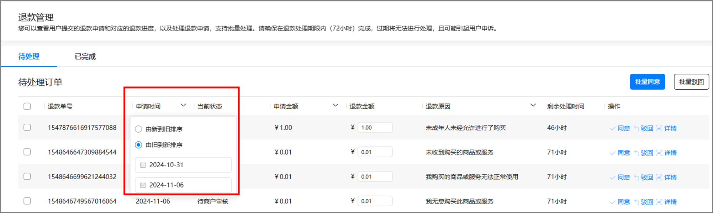

### 处理单个退款单

1.如果您同意退款，可在 “退款金额”直接输入可退款金额，选择“同意”，点击弹窗中“确定”，即可为这笔退款单的完成退款。

退款金额默认为订单支付金额，支持修改，但退款金额需大于零且小于等于申请金额。

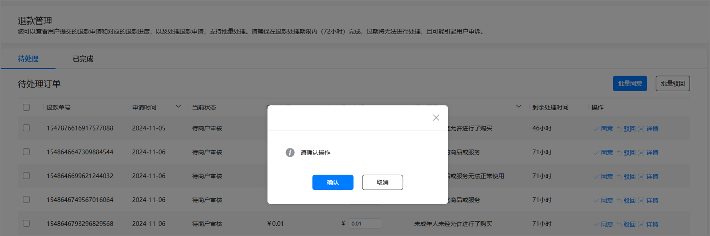

2.如果您不同意退款，可点击“驳回”，输入驳回原因，点击“确认”。

请您尽可能清晰和详细地填写退款驳回原因，以便协助华为客服处理用户申诉。

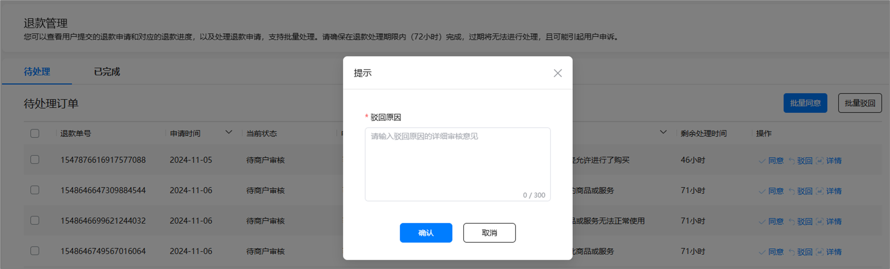

3.如果您需要查看更多退款订单的信息，例如订单号、原订单支付金额、交易时间等，可点击“详情”。在退款单详情页，您也可以填写退款金额后“同意”，或填写驳回原因后“驳回”退款申请。

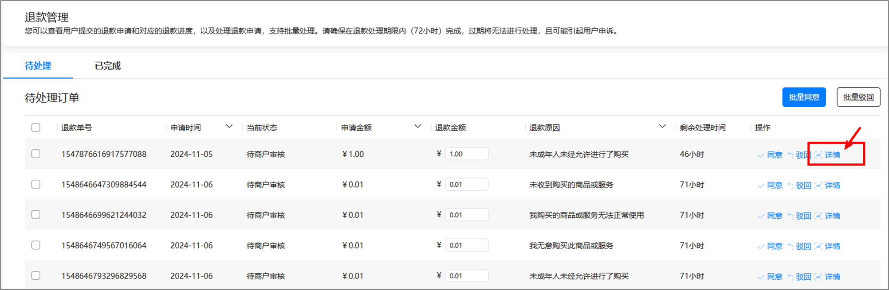

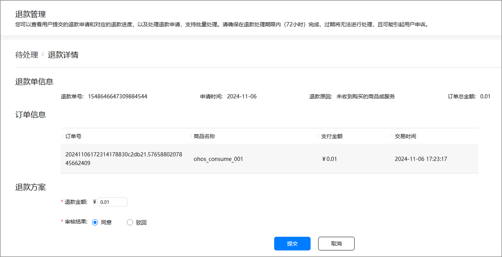

当您审核同意退款后，华为财务系统会发起原路退回款项流程，款项不会实时退回给用户，请勿在审核退款后直接回收用户权益。

具体的权益回收时间，请以华为服务器发送的[订单退款/撤销订阅事件通知](`https://developer.huawei.com/consumer/cn/doc/harmonyos-references/iap-key-event-notifications#section1716151320494`)为准。

### 批量处理退款单

1.您可勾选多个待同意退款的退款单，分别输入退款金额后，点击“批量同意”，点击弹窗中 “确认”。

退款金额默认为订单支付金额，支持修改，但退款金额需大于零且小于等于支付金额。

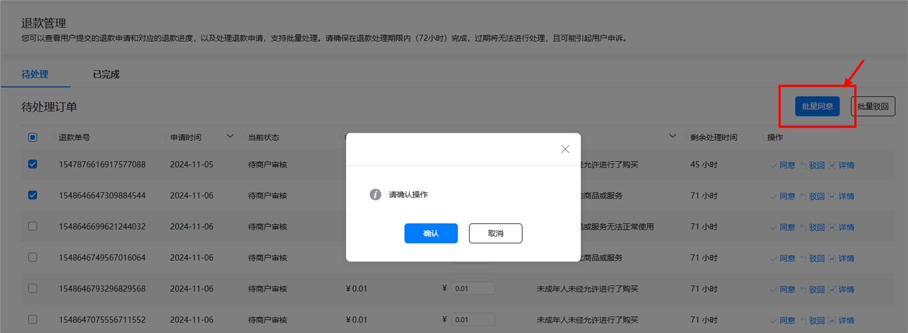

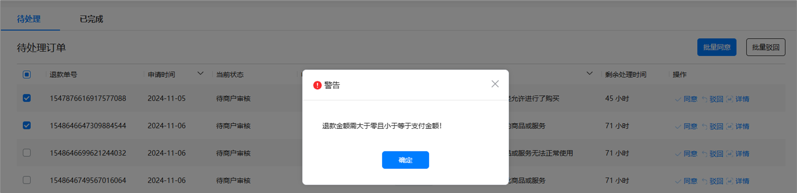

2.您可勾选多个待拒绝退款的退款单，点击“批量驳回”，输入驳回原因，点击“确认”。

请您尽可能清晰和详细地填写退款驳回原因，以便协助华为客服处理用户申诉。

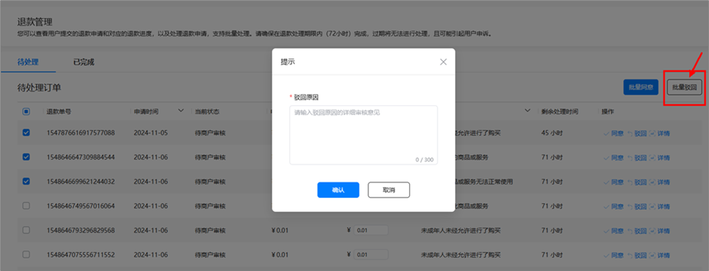

### 查看已完成退款单

1. 选择“已完成”页签，您可以按退款单的“申请时间”由新到旧或者由旧到新的排序，展示您已处理的退款单。

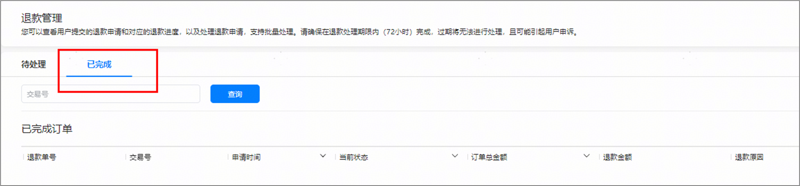

2.您可以通过“当前状态”筛选您需要查询的退款单。退款单有6种状态，请参考下表退款单状态说明。

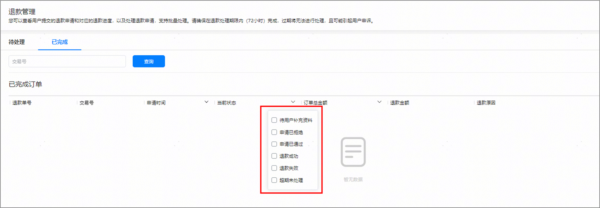

### 退款状态说明

| <strong>序号</strong> | <strong>退款单状态</strong> | <strong>说明</strong> |
| --- | --- | --- |
| 1 | 申请已拒绝 | 由开发者驳回的退款单。 |
| 2 | 申请已通过 | 由开发者同意的退款单。 |
| 3 | 退款成功 | 由开发者同意的退款单，华为操作退款成功。 |
| 4 | 退款失败 | 由开发者同意的退款单，华为操作退款失败。 |
| 5 | 超期未处理 | 开发者未在处理期内操作的退款单。 |