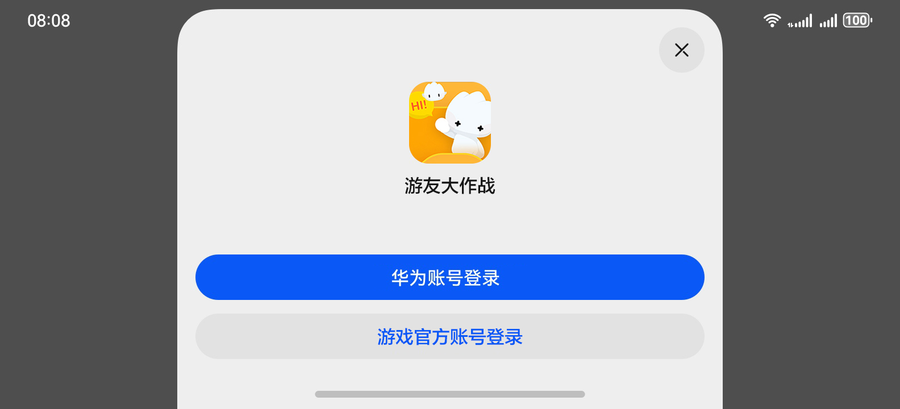

# 基础游戏服务

基础游戏服务能为游戏快速、低成本地构建基础功能，例如联合登录、华为账号实名认证、未成年人防沉迷等，让开发者聚焦游戏本身的业务能力，从而迅速推广游戏，并基于用户和内容的本地化进行深度的游戏运营。基础游戏服务的详细介绍及接入流程请参见[基础游戏服务](/docs/dev/app-dev/application-services/game-service-kit-guide/gameservice-gameplayer-dev)。

游戏接入基础游戏服务后，支持玩家在联合登录面板上选择华为账号或游戏官方账号登录游戏。

