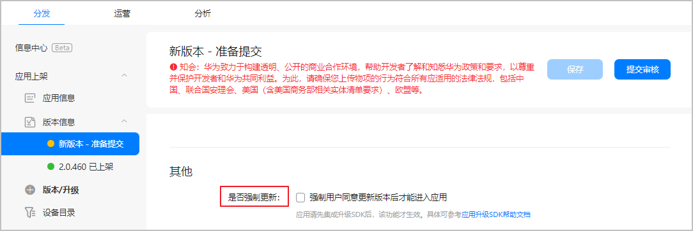
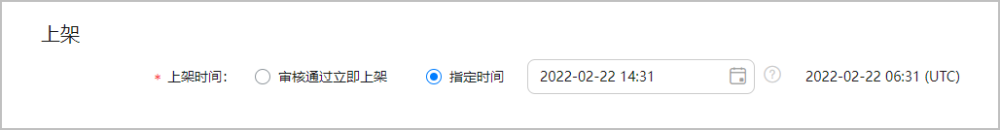

import MergeTable from "@site/src/components/MergeTable";

# FAQ

## 各类游戏分别如何接入SDK？

* 联运游戏（应用内支付模式）接入SDK请参考[联运游戏开发接入要求](https://developer.huawei.com/consumer/cn/doc/AppGallery-connect-Guides/appgallerykit-devguide-game-0000001055156905)。
* 付费下载游戏（付费下载模式）接入SDK请参考[付费下载游戏开发接入要求](https://developer.huawei.com/consumer/cn/doc/AppGallery-connect-Guides/appgallerykit-paidapps-introduction-0000001073582987)。
* 快游戏接入SDK请参考[快游戏开发接入要求](https://developer.huawei.com/consumer/cn/doc/quickApp-Guides/quickgame-doc-introduction-0000001073124845)。

## 游戏公钥、游戏私钥、支付公钥等参数如何获取？

<MergeTable
  headers={['参数类别', '参数名', '获取方式']}
  rows={[
    [{ text: '公共', rowspan: 2 }, '应用ID', { text: '详情请参见 查看应用基本信息 。', rowspan: 2 }],
    [null, '应用包名', null],
    [{ text: '支付服务', rowspan: 2 }, 'cp_id', { text: '详情请参见 查看支付服务信息 。', rowspan: 2 }],
    [null, '支付公钥', null],
    [{ text: '游戏服务', rowspan: 2 }, '游戏私钥', { text: '详情请参见 查看游戏服务信息 。', rowspan: 2 }],
    [null, '游戏公钥', null],
  ]}
/>

## 华为联运游戏对包名、签名有什么要求？

* 联运游戏的包名均以“.huawei”或“.HUAWEI”结尾。
* 若游戏未使用应用签名服务，华为不会对您的游戏做二次签名。
* 联运游戏的包名与签名一旦生成，不支持修改。

## 游戏接入HMS Core SDK，是否提供自检工具？

提供以下自检工具：

* 参考[自检工具](https://developer.huawei.com/consumer/cn/doc/distribution/app/agc-help-self-check-0000001100158786)对待上架的游戏进行自检，并根据自检报告修改。
* 参考[自检Checklist](/docs/monetize/promotion/access-guide-0000001063305339#section206152022153813)排查是否满足上架要求，减少您提交审核后被打回的概率。

## 华为侧是否支持游戏强更？

华为游戏SDK支持游戏内提示更新和强更功能，请务必按照要求接入[更新接口](https://developer.huawei.com/consumer/cn/doc/AppGallery-connect-Guides/appgallerykit-game-update-0000001055756860)。 您可以在升级游戏版本时，决定“是否强制更新”，版本上架后即会通过SDK对老用户进行强更，无需游戏另外设置下载链接。

## 如何指定或修改上架时间？

* 指定上架时间：提交版本审核时，您可以选择指定时间上架游戏。若您的游戏审核通过，则会在设定的时间自动上架。

  
* 修改上架时间：版本审核通过后，您可以修改游戏上架时间。
  + 若在提交审核时选择“指定时间”上架方式，可在“版本信息”页面修改游戏上架时间。
  + 若在提交审核时选择“审核通过立即上架”方式，则不支持修改上架时间。您可以撤销游戏上架，重新设置上架时间并提交审核。

## 如何修改预约游戏名称或在架游戏名称？

###预约更名流程

当前在架游戏处于预约状态。

* 若在“版本信息”页面未提交过apk包，更名流程如下：
  1. 发送更名申请邮件。

     |  |  |
     | --- | --- |
     | 邮件标题 | 您的游戏名称+更名申请 |
     | 邮件内容 | + 更名需求 + 更名原因 + 原游戏名称 + APP ID：查询方法可参见[查询应用基本信息](https://developer.huawei.com/consumer/cn/doc/distribution/app/agc-help-appinfo-0000001100014694) + 新游戏名称 + “应用信息”界面截图（截图必须包含顶部的应用名称和右上角的开发者账号） |
     | 邮件附件 | 需提交具备游戏新名称的资质材料：  + 《软著证明》或《更名函》（需中国版权中心盖章） + [《免责函》](https://communityfile-drcn.op.dbankcloud.cn/FileServer/getFile/cmtyPub/011/111/111/0000000000011111111.20241223142412.48793453290709902447193162188519%3A50001231000000%3A2800%3AEE52F935D35B81E9CEC7C330E93C5E42FC8412B9DE4E47E1EBA85C7BCC47393B.docx?needInitFileName=true) + 《游戏版号》或《广电总局盖章的版号更名文件》 |
     | 收件邮箱 | gamepreorder@huawei.com |
  2. 在“应用信息”页面修改应用名称后，保存即可。
  3. 重新编辑“预约申请”页面并提交预约审核，华为工作人员会在1~3个工作日内完成审核。审核通过，更名生效。
* 若您在“版本信息”页面已提交过apk包，更名流程如下：
  1. 发送上述邮件至gamepreorder@huawei.com与game.business@huawei.com。。
  2. 在“版本信息”页面重新上传已更名的游戏apk包后，提交版本审核，审核通过后即可生效。
  3. 在“应用信息”页面更名，保存后重新编辑“预约申请”页面并提交预约审核，华为工作人员会在1~3个工作日内完成审核。审核通过，预约游戏的名称同步更新。

###在架游戏更名流程

1. 在“版本信息”页面重新上传已更名的游戏apk包后，提交版本审核。
2. 游戏apk包上架成功后，需发送更名备案邮件。

   |  |  |
   | --- | --- |
   | 邮件标题 | 您的游戏名称+更名备案 |
   | 邮件内容 | * 原游戏名称 * APP ID：查询方法可参见[查询应用基本信息](https://developer.huawei.com/consumer/cn/doc/distribution/app/agc-help-appinfo-0000001100014694) * 新游戏名称 |
   | 邮件附件 | 需提交具备游戏新名称的资质材料：  * 《计算机软件著作权登记证书》（非自研需提供[《版权授权书》](https://communityfile-drcn.op.dbankcloud.cn/FileServer/getFile/cmtyPub/011/111/111/0000000000011111111.20241223142412.67791357589422835394635730914980%3A50001231000000%3A2800%3AB37D86EE5ECD72453F8ADD3B6CC1B7010A69F21A24A91E669086CA767C2B0E64.docx?needInitFileName=true)） * 《网络游戏出版物号（ISBN）核发单》或《关于同意出版运营国产移动网络游戏的批复》（非运营单位需提供[《版号授权书》](https://communityfile-drcn.op.dbankcloud.cn/FileServer/getFile/cmtyPub/011/111/111/0000000000011111111.20241223142413.52812958427475007422895461848171%3A50001231000000%3A2800%3A695AD859D120B155493B7E45F42830C616A77C4E509E678093D7BB679EBF7037.docx?needInitFileName=true)） * 《软著授权书》 |
   | 收件邮箱 | game.business@huawei.com |

## 在开发者联盟上提交银行信息后，审核需要多久？

华为工作人员将在1~3个工作日内完成银行信息的审核。如需紧急处理，可[在线提单](https://developer.huawei.com/consumer/cn/support/feedback/#/)反馈。

## 若在“开户行支行”没有找到对应银行支行，怎么办？

若在填写银行信息时无法找到所需银行，您可以通过[工单系统](https://developer.huawei.com/consumer/cn/support/feedback/#/ticketlist)反馈问题，或联系结算运营QQ：2851508862进行反馈处理。

## 华为是否有游戏防沉迷措施？

请查看[防沉迷专题](https://developer.huawei.com/consumer/cn/doc/HMSCore-Guides/faq-anti-indulgence-0000001050164364)了解更多相关信息。