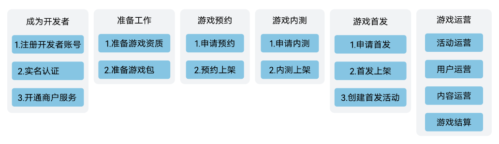

# APK游戏接入

## 成为开发者

注册开发者账号、完成实名认证并开通商户服务，详情请参见[准备工作](`https://developer.huawei.com/consumer/cn/doc/app/game-center-preparation-work-0000001194305246`)。

## 准备工作

游戏准备工作包括配置应用基本信息、制作游戏包等：

* 按照国家政策要求，您需提前准备各类游戏版权信息和版号对应的资质文件，详情请参见[版权资质审核要求](`https://developer.huawei.com/consumer/cn/doc/80301`)。
* 您需要提前制作并适配游戏包，以免影响接入进展，详情请参见[游戏SDK接入指南](`/docs/distribute/app-dist/game-center/game-center-access-0000001239622337/game-center-preparation-work-0000001194305246#section188071321105117`)。

## 新游预约

游戏预约指在游戏首发前进行宣传，配合游戏论坛、资讯的持续更新曝光，保证首发前的游戏热度，为正式首发凝聚力量。当玩家对游戏感兴趣时会选择预约游戏，在游戏首发后，华为游戏中心会给已预约的用户发送通知，这些用户会有较高概率转化成游戏玩家。因此我们强烈推荐您使用游戏预约，详情请参见[游戏预约](`https://developer.huawei.com/consumer/cn/doc/app/game-center-pre-order-0000001239342333`)。

## 游戏内测

游戏内测是开发者验证游戏对华为手机适配情况、获取游戏数据情况并进行改进的关键环节，同时内测数据也是我们确定游戏评级与首发推广资源的重要参考依据。因此强烈建议您对游戏进行内测，详情请参见[游戏内测](`https://developer.huawei.com/consumer/cn/doc/app/game-center-early-access-0000001194302390`)。

## 游戏首发

游戏首发是指从未公开运营过的新游戏，首次在华为应用市场/游戏中心以联合运营的方式，为华为用户提供游戏服务，是在游戏预约、内测阶段之后的重要商业推广环节。优质的首发游戏将获得一定的首发推广资源，详情请参见[游戏首发](`https://developer.huawei.com/consumer/cn/doc/app/game-center-first-applyfor-0000001239502317`)。

## 游戏运营

游戏首发后，通过日常的活动运营、内容运营、用户运营，可以提升用户活跃、留存以及收入，同时良好的日常运营动作有助于获取更多的曝光资源，因此强烈建议您在首发之后，关注游戏全生命周期运营。

* 活动运营详细说明与指南请参见[活动运营指南](`https://developer.huawei.com/consumer/cn/doc/app/game-center-setup-activities-overview-0000001704790612`)。
* 内容运营详细说明与指南请参见[内容运营指南](`https://developer.huawei.com/consumer/cn/doc/app/game-center-renewing-program-0000001194142418`)。
* 用户运营详细说明与指南请参见[用户运营指南](`https://developer.huawei.com/consumer/cn/doc/app/game-center-user-operation-0000001239342339`)。
* 游戏结算详细说明与指南请参见[自助结算指南](`https://developer.huawei.com/consumer/cn/doc/start/checkoutguide-0000001053128363`)。