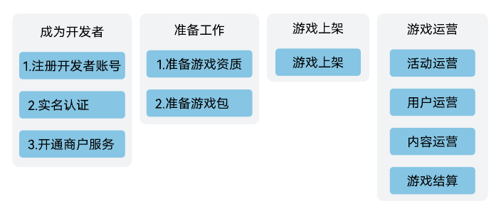

# APP游戏接入

## 成为开发者

注册开发者账号、完成实名认证并开通商户服务，详情请参见[准备工作](`https://developer.huawei.com/consumer/cn/doc/app/game-center-preparation-work-0000001194305246`)。

## 准备工作

游戏准备工作包括配置应用基本信息、制作游戏包等：

* 按照国家政策要求，您需提前准备各类游戏版权信息和版号对应的资质文件，详情请参见[版权资质审核要求](`https://developer.huawei.com/consumer/cn/doc/80301`)。
* 您需要提前制作并适配游戏包，以免影响接入进展，详情请参见[联运游戏SDK接入指南](`https://developer.huawei.com/consumer/cn/doc/app/joint-operation-access-0000002024211358`)。

## 游戏上架

当您的应用开发和测试完成后，您可以在AppGallery Connect正式提交[APP游戏上架](`https://developer.huawei.com/consumer/cn/doc/app/agc-help-release-app-0000002271695230`)。

## 游戏运营

游戏上架后，通过日常的内容运营、用户运营，可以提升用户活跃、留存以及收入，同时良好的日常运营动作有助于获取更多的曝光资源，因此强烈建议您在上架之后，关注游戏全生命周期运营。

* 活动运营详细说明与指南请参见[活动运营指南](`https://developer.huawei.com/consumer/cn/doc/app/game-center-setup-activities-app-0000002111387918`)。
* 内容运营详细说明与指南请参见[内容运营指南](`https://developer.huawei.com/consumer/cn/doc/app/game-center-renewing-program-0000001194142418`)。
* 用户运营详细说明与指南请参见[用户运营指南](`https://developer.huawei.com/consumer/cn/doc/app/game-center-user-operation-0000001239342339`)。
* 游戏结算详细说明与指南请参见[自助结算指南](`https://developer.huawei.com/consumer/cn/doc/start/checkoutguide-0000001053128363`)。

## 商品管理

您可以通过华为商品管理系统（PMS）将您的应用商品信息托管在华为侧，方便您的应用商品价格国际化管理，助力您的应用进行全球化推广。详情请参见[数字商品服务](`https://developer.huawei.com/consumer/cn/doc/app/business-activation-0000001958955081`)。