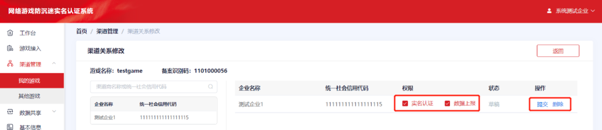
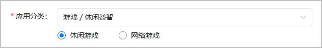
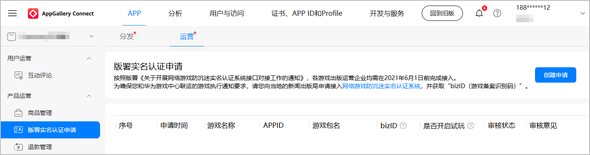
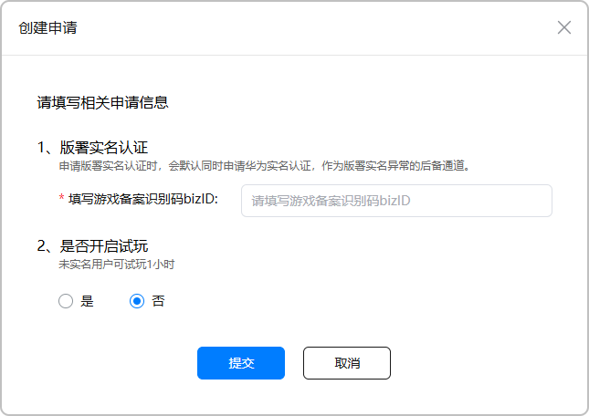
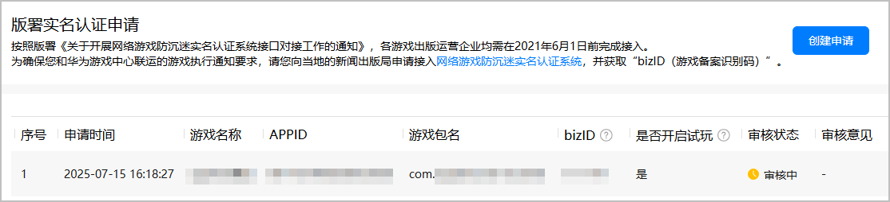

# 版署实名认证申请

按照国家新闻出版署《关于开展网络游戏防沉迷实名认证系统接口对接工作的通知》，各游戏出版运营企业均须在2021年6月1日前完成国家新闻出版署的实名认证系统的接入。

为落实您和华为游戏中心联运的游戏执行通知要求，您需要完成如下2步才能完成国家新闻出版署实名认证系统的接入：

1. 向当地新闻出版局申请接入[网络游戏防沉迷实名认证系统](`https://wlc.nppa.gov.cn/fcm_company/index.html#/login?redirect=/`)，并获取“bizID（游戏备案识别码）”。
2. 在华为[AppGallery Connect](`https://developer.huawei.com/consumer/cn/service/josp/agc/index.html`)提交bizID信息，并通过华为运营人员的审核。

华为游戏服务提供了华为账号登录时的实名认证功能，完成上述2步后，您的游戏将自动对接国家新闻出版署的实名认证系统并开启强制实名认证，无需您进行额外的开发。

## 前提条件

在华为AppGallery Connect提交bizID信息的前提条件如下：

* 您已在[网络游戏防沉迷实名认证系统](`https://wlc.nppa.gov.cn/fcm_company/index.html#/login?redirect=/`)上勾选“实名认证”和“数据上报”权限，填写渠道商名称为“华为软件技术有限公司”，并获取“bizID（游戏备案识别码）”，bizID为6-14位的整数数字。

  

* 您的游戏处于“准备提交”状态，且已配置应用分类。

  

## 操作步骤

在华为AppGallery Connect提交bizID信息的操作步骤如下：

1. 登录[AppGallery Connect](`https://developer.huawei.com/consumer/cn/service/josp/agc/index.html`)，点击“APP与元服务”，在应用列表选择需要申请版署实名认证的游戏。选择“运营 &gt; 产品运营 &gt; 版署实名认证申请”，在页面右侧点击“创建申请”。

   
2. 在“创建申请”窗口中根据提示填写信息，完成后点击“提交”。

   

   | 配置项 | 说明 |
   | --- | --- |
   | 版署实名认证 | 填写6~14位整数数字的游戏备案识别码bizID。  说明：  * 若输入小于6位或15到20位的数字，或输入非数字的字符，界面会提示bizID可能错误，但不影响提交申请。 * 若输入超过20位的字符，则无法提交。 |
   | 是否开启试玩 | 根据国家出版署规定不能以任何形式给未成年人提供游戏，所以该配置项目前已<strong>不生效</strong>。 |
3. 提交成功后进入运营审核流程。您可以在申请列表查看审核状态和审核意见。

   

   审批通过后可以再次创建申请，但是前一次审批通过的实名认证申请会被新的申请替换。若当前有正在审批的申请，则无法再次创建申请。

   

   游戏在AppGallery Connect提交上架前，您需要提交版署实名认证申请并通过审核，否则该游戏的上架申请可能会被驳回。

   