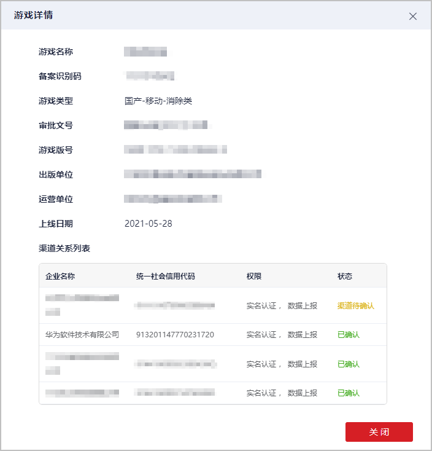

# 准备工作

游戏接入前，您需要准备绑定华为渠道关系、注册账号、填写游戏基本信息、接入SDK。

## 绑定华为渠道关系

请登录[网络游戏防沉迷实名认证系统](`https://wlc.nppa.gov.cn/fcm_company/index.html#/login?redirect=/`)，实名认证游戏并关联渠道商为“华为软件技术有限公司”。

## 注册账号

1. 您需要在华为联盟官网[注册账号](`https://developer.huawei.com/consumer/cn/doc/start/registration-and-verification-0000001053628148`)并完成[实名认证](`https://developer.huawei.com/consumer/cn/doc/start/itrna-0000001076878172`)。审核时间为1~3个工作日。如果需要加急审核，可[在线提单](`https://developer.huawei.com/consumer/cn/support/feedback/#/`)进行反馈。
2. 实名认证后，您需要[开通商户服务](`https://developer.huawei.com/consumer/cn/doc/start/merchant-service-0000001053025967`)并填写银行卡信息，否则将影响到游戏正常运营。

## 填写游戏信息

[创建游戏](`https://developer.huawei.com/consumer/cn/doc/distribution/app/agc-help-createapp-0000001146718717`)后，您需要在“应用信息”页面[配置游戏基本信息](`https://developer.huawei.com/consumer/cn/doc/app/agc-help-release-overview-0000001272395372`)。

### 选择游戏类型

请按实际情况选择游戏类型。

| 游戏类型 | 区分方式 |
| --- | --- |
| 休闲游戏 | 主要指以轻度娱乐为主的游戏，包括体育竞速、塔防、独立游戏、付费下载游戏。 |
| 网络游戏 | 主要指高度依赖互联网，强调多人协作和实时对战的游戏。除付费下载模式外的二次元游戏，请选择网络游戏。 |

若您选择的分类和华为应用市场管理规则不一致，华为运营人员可能会予以修改并邮件通知您。若您修改应用分类时发现应用的二、三级分类被锁定，请联系华为运营人员协助处理。应用分类详情请参见[华为应用市场应用分类示例](`https://developer.huawei.com/consumer/cn/doc/50103`)。

### 准备游戏资质

关于版权和版号的详细上传说明，请参考[版权资质审核要求](`https://developer.huawei.com/consumer/cn/doc/80301#h1-1584931854487-2`)。

| 游戏资质 | 资质文件 |
| --- | --- |
| 版权信息 | * 《电子版权证书》 * 《应用版权证书》或《代理证书》 * [《管控能力声明》](`https://alliance-communityfile-drcn.dbankcdn.com/FileServer/getFile/cmtyPub/011/111/111/0000000000011111111.20250912133410.61388402171647177200842537559211%3A50001231000000%3A2800%3A36D9D1BEC3352A4DD088244DA5709FEA27BF912EE3EB2B2408B832482AD4212E.docx?needInitFileName=true`)   说明：  为培育积极健康、向上向善的网络文化氛围，给用户提供清朗的游戏环境，要求您对游戏内生成的敏感内容进行有效管控并提供[管控能力声明](`https://alliance-communityfile-drcn.dbankcdn.com/FileServer/getFile/cmtyPub/011/111/111/0000000000011111111.20250912133410.77777259860493125795667351605877%3A50001231000000%3A2800%3A9D28E44889C970C14F6701D90C6329A0EB5BE09ABEB209784BFA5947C09B32D7.docx?needInitFileName=true`)，请认真填写并盖章。 |
| 版号  说明：  若游戏发布范围包含“中国大陆”，您需要准备“版号”文件。 | * 《版号信息》 * 《版号证明》 |

## 接入SDK

* 联运游戏（应用内支付模式）接入SDK请参考[联运游戏开发接入要求](`https://developer.huawei.com/consumer/cn/doc/AppGallery-connect-Guides/appgallerykit-devguide-game-0000001055156905`)。
* 付费下载游戏（付费下载模式）接入SDK请参考[付费下载游戏开发接入要求](`https://developer.huawei.com/consumer/cn/doc/AppGallery-connect-Guides/appgallerykit-paidapps-introduction-0000001073582987`)。
* 快游戏接入SDK请参考[快游戏开发接入要求](`https://developer.huawei.com/consumer/cn/doc/quickApp-Guides/quickgame-doc-introduction-0000001073124845`)。