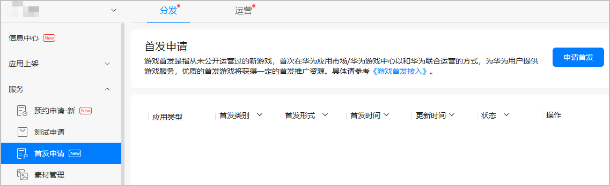
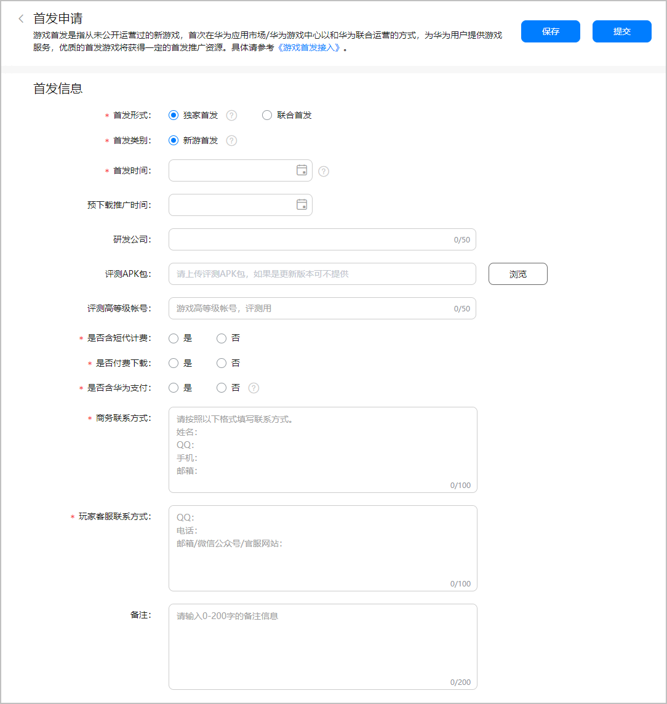
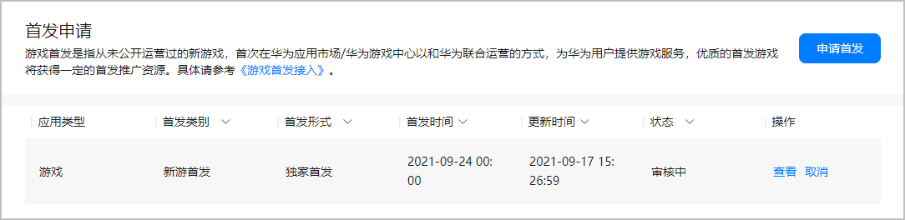
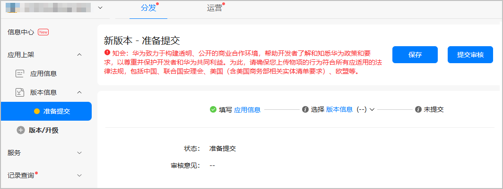
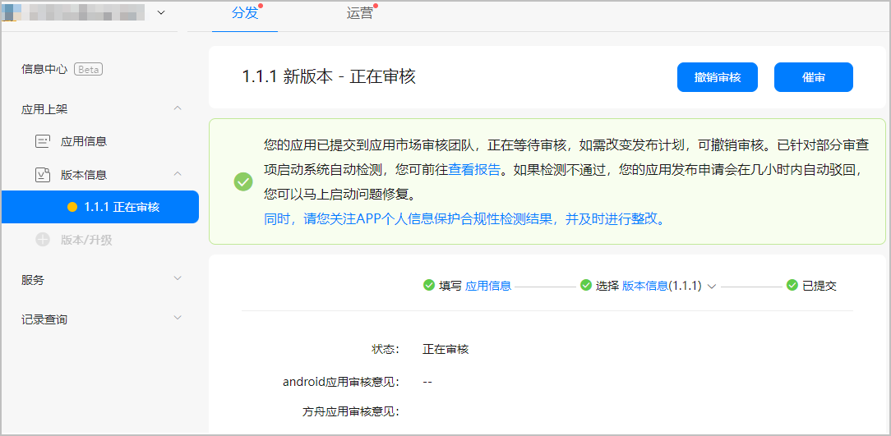
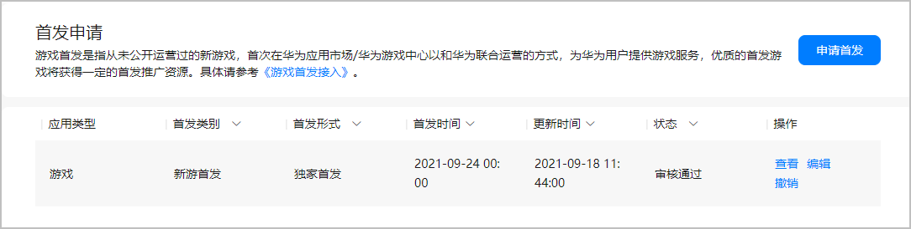

# 游戏首发

游戏首发是指从未公开运营过的新游戏，首次在华为渠道以联合运营的方式，为华为用户提供游戏服务，是在游戏预约、内测阶段之后的重要推广环节。优质的首发游戏将在“精品首发”榜单或花瓣轻游首页“新游首发”展示，具体的资源位以最终上线为准。

游戏首发流程如下：

## 前提条件

* 您已成功[创建游戏](`https://developer.huawei.com/consumer/cn/doc/distribution/app/agc-help-createapp-0000001146718717`)，且软件包类型为“APK(Android应用)”或“RPK(快应用)”，支持设备为“手机”。
* 您已完成[配置应用基本信息](`https://developer.huawei.com/consumer/cn/doc/app/agc-help-releaseapkrpk-0000001106463276#section27070410361`)。
* 为了提升游戏版本包的通过率，您需要提前自检游戏接入参数、游戏登录体验、游戏支付体验等。

## 提交首发申请

1. 登录[AppGallery Connect网站](`https://developer.huawei.com/consumer/cn/service/josp/agc/index.html#/`)，点击“APP与元服务”。
2. 在应用列表页面点击需要提交首发申请的游戏，选择“分发 &gt; 服务 &gt; 首发申请”，在页面右上角点击“申请首发”。

   

   

   * 请至少提前7天申请首发服务。
   * 同名游戏的APK版本和RPK版本首发不会互相影响，即已首发的APK/RPK可继续申请RPK/APK的首发。
3. 在“首发申请”页面根据提示填写信息。

   

   | 字段信息 | 说明 |
   | --- | --- |
   | 首发形式 | 首发期间，根据是否仅在华为平台上架分为：  * 独家首发：仅在华为平台上线。 * 联合首发：可在包含华为在内的多个平台上线。 |
   | 首发类别 | 仅支持新游首发。 |
   | 首发时间 | 建议与您的游戏上架时间一致（RPK游戏建议与上架时间间隔一周）。  说明：  若首发时间发生变更，请至少提前一天更新，避免错过新游首发。 |
   | 预下载推广时间 | 选填。预下载推广时间需在首发前7天内。 |
   | 研发公司 | 选填。您可以填写实名认证的企业名称或个人开发者。要求1~50个字符。 |
   | 评测APK包/评测RPK包 | 选填。仅更新版本无需提供游戏试玩包。 |
   | 评测高等级账号 | 选填。使用高等级账号登录游戏可直接跳过新人指导环节，为游戏审核人员节省时间，加快审核进度。 |
   | 是否含短代计费 | 您的游戏内是否包含运营商短信计费功能。 |
   | 是否付费下载 | 您的游戏下载是否需要付费购买。 |
   | 是否含华为支付 | 您的游戏内是否接入华为应用内支付。  说明：  网络游戏必须接入华为应用内支付。 |
   | 商务联系方式 | 请您按照模板格式填写联系方式。 |
   | 玩家客服联系方式 | 请您按照模板格式填写联系方式。 |
   | 备注 | 选填。可补充额外说明信息。要求1~200个字符。 |
4. 完成信息的配置，点击“提交”后等待审核。审核结果可在状态栏或您预留的邮箱查看。

   

   

   若有其他疑问，可以通过以下方式获取帮助。

   * 网游对接QQ：2851508861
   * 休闲对接QQ：2851161555
   * 快游戏对接QQ：2851508950

## 提交首发包

提交首发申请后，请尽快提交首发包信息并提交审核。

* APK游戏版本的上架时间建议与首发时间保持一致。
* RPK游戏版本的上架时间建议早于首发时间一周。
* 请在游戏上架时间之前，提前至少3个工作日提交游戏的版本审核，预留时间修改问题，保证新游顺利首发。

1. 登录[AppGallery Connect网站](`https://developer.huawei.com/consumer/cn/service/josp/agc/index.html#/`)，点击“APP与元服务”。
2. 在应用列表点击需要提交版本包的游戏。
3. 选择“分发 &gt; 应用上架 &gt; 版本信息”，配置游戏的版本信息，详情请参见[发布应用（APK）](`https://developer.huawei.com/consumer/cn/doc/distribution/app/agc-help-releaseapkrpk-0000001106463276`)或[发布应用（RPK）](`https://developer.huawei.com/consumer/cn/doc/distribution/app/agc-help--release-fastapp-0000001099836868`)，完成后点击“提交审核”。

   
4. 版本审核预计需要1~3个工作日，请耐心等待。审核结果可在版本信息页面或[互动中心](`https://developer.huawei.com/consumer/cn/doc/distribution/app/agc-help-interaction-center-0000001146518763`)查看。

   
5. 游戏审核通过后，将根据您设定的时间或默认时间上架，玩家可在华为应用市场或游戏中心下载、花瓣轻游打开。

## 上架审核

若游戏的首发申请与版本审核均已通过，到达首发时间时，您的游戏将会成功首发，华为应用市场会根据游戏的内测评级给予首发推广资源。

新游正式首发前，请务必做好公告提醒，避免用户投诉。

## 首发上架

以上工作完成后，到达首发时间，游戏即可正常上架。为取得更好的首发效果，我们强烈建议您进行以下工作：

1. 若您想要获取更好的首发推广资源，建议您在首发申请之前进行[游戏内测](`/docs/distribute/app-dist/game-center/game-center-test-0000001239342331/game-center-early-access-0000001194302390)（RPK游戏暂不支持）。
2. 若您的新游首发需要申请首发活动，建议首发前1个月进行沟通，具体请参见[游戏营销活动申请指南](`/docs/distribute/app-dist/game-center/game-center-operation-0000001239502315/agc-help-activity-operation-0000001194302394/game-center-setup-activities-all-0000001657534737/game-center-setup-activities-overview-0000001704790612)。
3. 若您的新游首发具备礼包功能，建议给华为渠道用户不低于其他分发渠道的礼包金额与数量，建议首发前7天完成礼包的配置，具体请参考：[游戏礼包配置流程和规则](`/docs/distribute/app-dist/game-center/game-center-operation-0000001239502315/agc-help-activity-operation-0000001194302394/game-center-setup-gifts-0000001239505383#section13584522142810`)。
4. 若您想要聚集核心用户，形成玩家交流阵地，实时对用户问题和建议进行实时维护，建议您开通[申请论坛](`https://developer.huawei.com/consumer/cn/doc/5020401`)。
5. 若您想要第一时间了解用户反馈，监控舆情，您可以查看/回复/举报用户在游戏评论区的评论，建议您开通[互动评论](`/docs/distribute/app-dist/game-center/game-center-operation-0000001239502315/game-center-user-operation-0000001239342339/game-center-interaction-comments-0000001239182361)。
6. 若您想在首发前获取用户对不同素材的市场反馈，以选择转化效果较好的素材内容应用于全网，可在游戏上线后[申请开通素材测试功能](`https://developer.huawei.com/consumer/cn/doc/AppGallery-connect-Guides/agc-materialmanage-applywhitelist-0000001128107381`)。

## FAQ

### 若您的首发申请未通过但版本审核已通过：

您的游戏正常上架，但未获得首发推广资源。

### 若您的首发申请已通过但版本审核未通过：

* 若还未到首发时间，建议您及时调整首发时间或取消首发。
* 若已超过首发时间，表示您已错过新游首发，则再次提交首发申请将会被拒绝。建议您及时调整首发时间，避免错过首发。