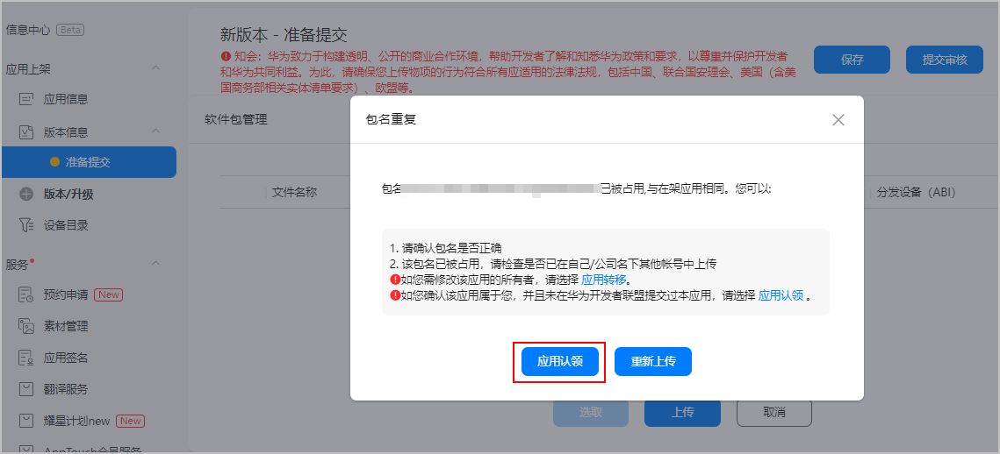
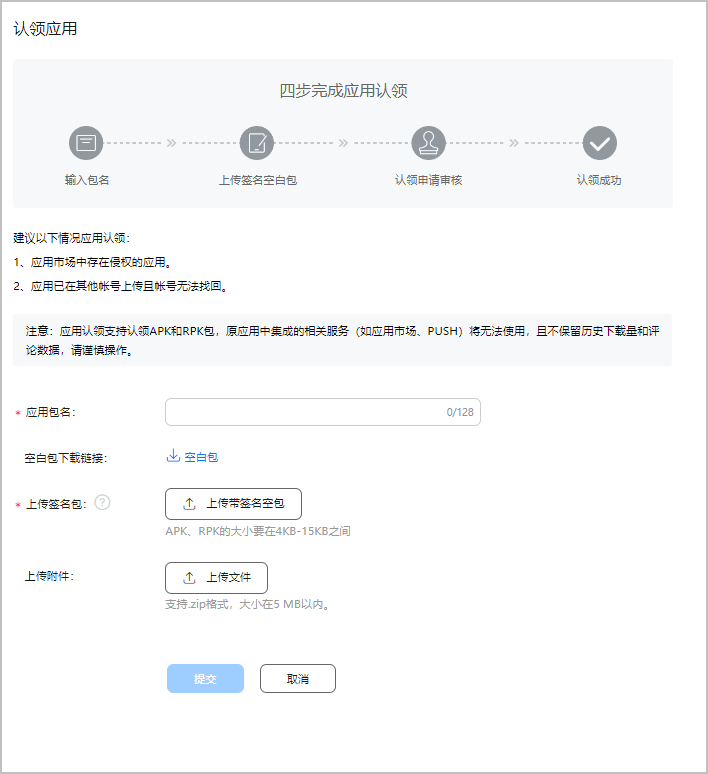
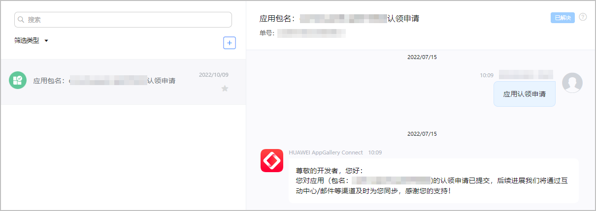
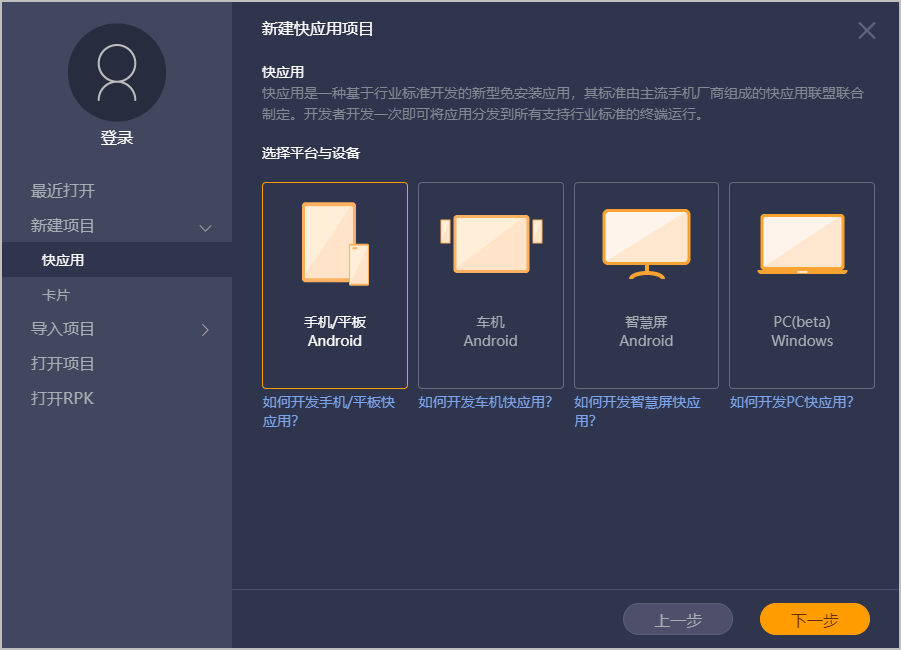
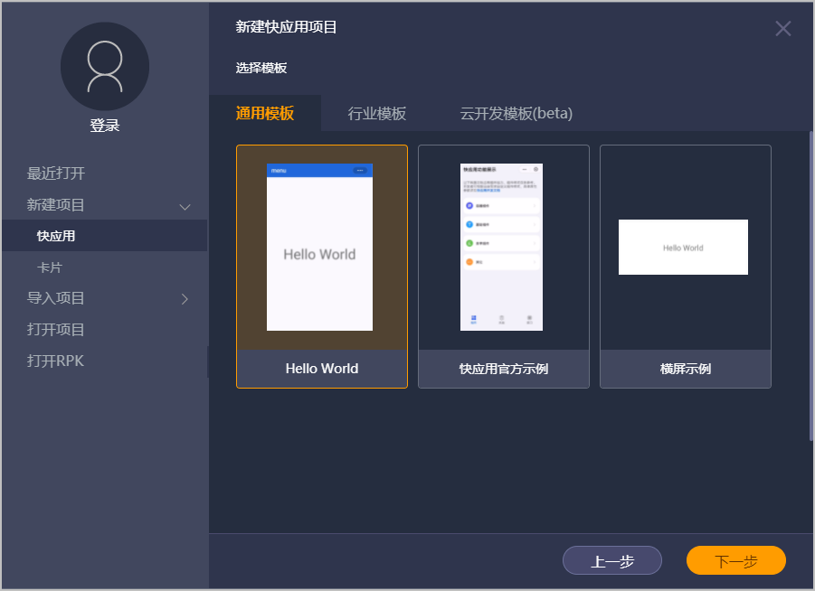
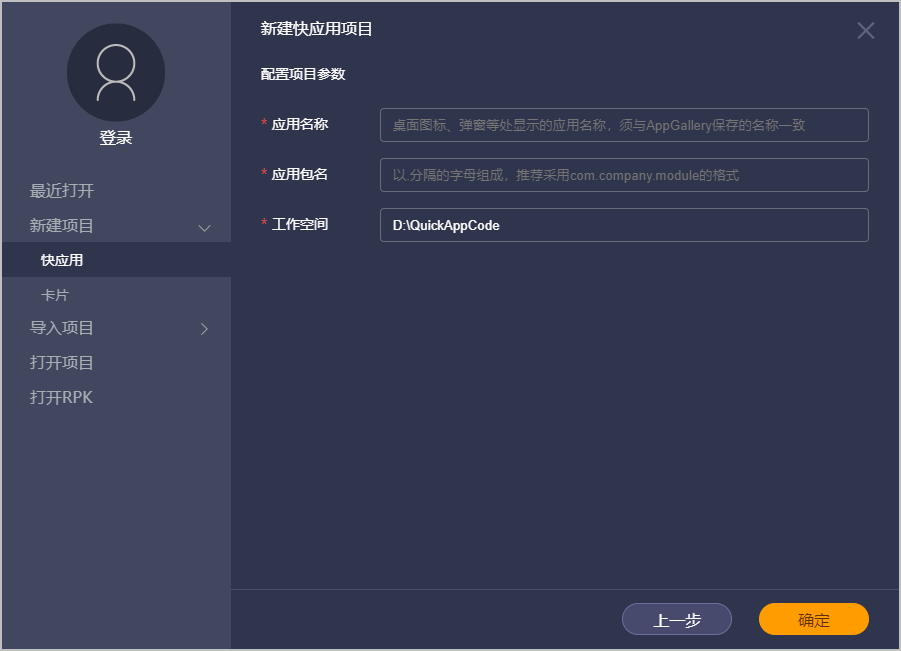
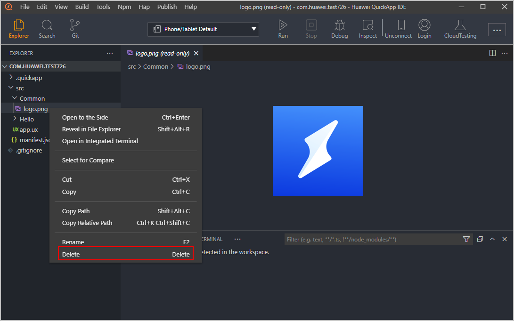
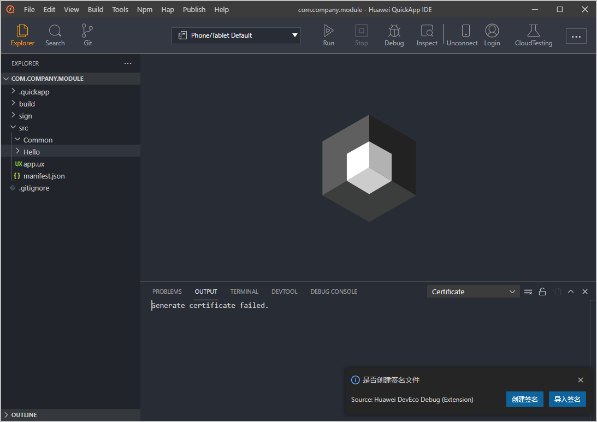

# 应用认领

上传软件包时，如果您发现包名已被占用，且确认该软件包为您所有，之前您也未在华为开发者联盟上传过该软件包，则可通过申请应用认领来获取该应用的归属权。应用认领成功后， 该应用会自动转入您的账号下，您可在AppGallery Connect实现对应用的管理及维护。

* 如果认领的应用原本是在架状态，认领成功后应用会被下架。
* 应用认领后，原有的所有服务将无法使用，且不保留历史下载量和评论数据，即仅认领应用软件包，请谨慎操作。
* 如果您只需要更换主体，建议选择[应用转移](`https://developer.huawei.com/consumer/cn/doc/app/game-center-transferring-0000001194325290#ZH-CN_TOPIC_0000001194325290`)，以防应用下架以及数据的丢失。

## 前提条件

当前仅中国大陆地区开发者的APK和RPK应用支持应用认领申请。

## 提交应用认领申请

1. 登录[AppGallery Connect](`https://developer.huawei.com/consumer/cn/service/josp/agc/index.html`)，点击“APP与元服务”。
2. 在应用列表中选择待提交应用认领申请的应用，进入应用详情页。
3. 在上传软件包处上传您想要认领的软件包。
4. 在弹出的“包名重复”提示框中点击“应用认领”。

   
5. 阅读弹出框中的建议说明后，填写应用认领申请，完成后点击“提交”。
   * 应用包名：填写待认领应用的包名。
   * 空白包下载链接：点击“空白包”下载待签名空白包，解压HWNS.zip获取空白包HWNS.apk。

     

     RPK包无法通过以下方式获取，请参考[RPK包获取方法](#section2762820384)。
   * 上传签名包：参考以下步骤将待认领应用的签名写入该空白包中，并上传。
     1. 找到待认领应用的签名文件（.jks文件），选择一个目录存放该文件。
     2. 将下载的空白包HWNS.apk和签名文件存放在同一目录下。
     3. 打开cmd，进入上面目录地址，输入命令（对应替换黑色加粗文件）：jarsigner -verbose -keystore *<strong>test.jks</strong>* -signedjar *<strong>test.apk</strong>* *<strong>HWNS.apk</strong> <strong>test</strong>*

        

        命令字段解析：

        + test.jks：待认领应用的签名文件。
        + test.apk：写入签名后的空白包。
        + HWNS.apk：下载的空白包。
        + test：签名文件test.jks的别名。
   * 上传附件：上传相关应用认领理由的附件（大小在5MB以内的zip格式文件）。

   
6. 提交成功后，您可以在首页点击“互动消息”进入互动中心页面查看成功提交通知。审核完成后互动中心将会发送审核结果，请您耐心等待。

   

## RPK包获取方法

1. 请参考[快应用IDE操作指南](`https://developer.huawei.com/consumer/cn/doc/Tools-Guides/ide-overview-0000001147936547`)下载并安装[华为快应用IDE](`https://developer.huawei.com/consumer/cn/doc/Tools-Library/quickapp-ide-download-0000001101172926`)。
2. 点击菜单栏“新建项目 &gt; 快应用”后，点击“下一步”。

   
3. 选择“Hello World”模板，并点击“下一步”。

   
4. 填写“应用名称”、“应用包名”后，点击“确定”。

   
5. 为了避免RPK包过大（带签名空包大小需在4KB-15KB之间），删去/src/common/logo.png文件。

   
6. 菜单栏点击“Tools &gt; Certificate”，在界面右下角提示中选择“导入签名”，选择应用发布签名文件“certificate.pem”、“private.pem”后，所选文件会自动存放到工程/sign/release目录下。

   
7. 点击菜单栏“Build &gt; Run Build”，完成后自动弹出RPK包存放的位置，您也可以在dist目录下找到文件。