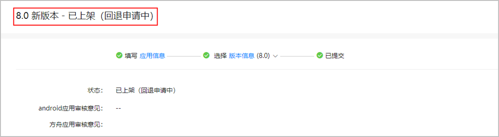

# 回退版本

您可以将当前在架的应用版本回退到上一个版本。版本回退是将当前在架版本回退到最近一次上架的应用版本，且只能按照版本发布顺序依次回退。如果您已回退到初始版本，您将无法继续回退。

通过分阶段发布和灰度发布的应用版本暂不支持回退。

## 前提条件

您必须在同一个应用版本的基础上进行过版本升级才能进行版本回退。

## 提交回退申请

1. 登录[AppGallery Connect](`https://developer.huawei.com/consumer/cn/service/josp/agc/index.html`)，选择“APP与元服务”。
2. 在应用列表中点击待回退的应用版本链接，进入该版本的“版本信息”页面。
3. 点击右上角的“版本回退”，在弹出框中填写回退原因，并点击“确认”。

   

   此时版本信息页面显示该版本“已上架（回退申请中）”，耐心等待审核通过即可。

   

   当您的应用从版本2回退到版本1后，如果您想再次对版本1升级，您需要确保您提交的应用签名与版本2的应用签名一致，否则选取软件包时会弹出错误提示框。相关内容参见[软件包签名不一致处理](`/docs/distribute/app-dist/game-center/game-center-update-0000001239645255/game-center-upgrade-version-0000001194325288#section15339193186`)。

   