import MergeTable from "@site/src/components/MergeTable";


# 游戏转移

## 定义

将华为开发者联盟上的应用从一个账号转移到另一个账号进行维护。应用转移后App ID不变，转移前后应用的APK包、原有的基础服务（如应用市场）、历史下载量和评论数据等均继续保留。

| 业务 | 定义 | 操作指导 |
| --- | --- | --- |
| 普通应用转移 | 不含华为支付渠道的应用转移 | [普通应用转移](#section2119145216252) |
| 应用内购买模式应用转移 | 包含华为支付渠道的应用（联运应用，含联运游戏）转移 | [应用内购买模式应用转移](#section88661059518) |
| 付费下载应用转移 | 采用付费下载模式合作的应用 | [付费下载应用转移](#section194301443318) |


* 如果转入方和转出方都是中国大陆的账号，可通过[线上转移流程](https://developer.huawei.com/consumer/cn/doc/app/agc-help-apptransfer-0000001439309461)申请。
* 文中“应用”均包含游戏类。
* 当前仅APK、AAB和RPK应用支持应用转移申请。
* 若应用开通了HealthServiceKit服务，请先完成转入方开发者资质审核，具体请参见运动健康服务《[应用开发者申请资质说明](https://developer.huawei.com/consumer/cn/doc/HMSCore-Guides/application-qualification-description-0000001425636570)》。

## 普通应用转移

转出方开发者：

1. 点击下载《[应用转移申请表](https://alliance-communityfile-drcn.dbankcdn.com/FileServer/getFile/cmtyPub/011/111/111/0000000000011111111.20251217151646.46555365559361399914173331020424%3A50001231000000%3A2800%3AC17BA52AFBB42CCA98C85803AF1CB81FF2A10F18B32E42F69BB8309C8BAAE5F2.zip?needInitFileName=true)》，填写并加盖公章。
2. 点击下载《[应用转移自检表](https://communityfile-drcn.op.hicloud.com/FileServer/getFile/cmtyManage/011/111/111/0000000000011111111.20200826165231.79484583230835794465114135085292%3A50520513005445%3A2800%3A70B63E60A9C0CFCC2D59FE164E67D41C5B9AB1AEDBD12C9EEBF7A129A9F869DB.xlsx?needInitFileName=true)》，参考《应用转移自检表》自检转出应用的服务及推广任务状态。
3. 在[AppGallery Connect](https://developer.huawei.com/consumer/cn/service/josp/agc/index.html)应用信息页面点击“应用转移”，填写转移信息并上传《应用转移申请表》盖章扫描件、转入方版权和版号资质，提交转移申请。具体资质审核要求，请见《[版权、版号资质审核](https://developer.huawei.com/consumer/cn/doc/app/80301)》。
4. 在[华为开发者联盟官网](https://developer.huawei.com/consumer/cn/)，鼠标置于右上角头像处，在下拉框内点击“我的工单”查看转移申请结果并告知转入方开发者。

转入方开发者：

1. 应用转移申请通过后，在[华为开发者联盟官网](https://developer.huawei.com/consumer/cn/)点击接收应用。
2. 重新提交应用审核，审核通过后华为应用市场、华为游戏中心方能显示新的开发者名称。
3. （可选）如果您的应用中集成SDK时配置了agconnect-services文件，请重新获取此文件并替换到应用中。
   1. 登录 [AppGallery Connect](https://developer.huawei.com/consumer/cn/service/josp/agc/index.html)，点击“开发与服务”。
   2. 在项目列表找到您的项目，点击项目进入“项目设置”页面，在“应用”区域重新下载agconnect-services.json或者agconnect-services.plist文件。

## 应用内购买模式应用转移

如果您的应用是联运应用，使用了华为账号服务和游戏服务的用户标识，如unionId、openId和playerId，应用认领和应用转移的影响如下，请在操作前谨慎考虑。

| 分类 | 应用认领 | 应用转移 |
| --- | --- | --- |
| openId | 变化 | 不变 |
| unionId | 变化 | 变化 |
| playerId | 需要[提交工单](https://developer.huawei.com/consumer/cn/support/feedback)咨询 | 不变 |


“unionId”、“openId”和“playerId”的概念介绍可参见[华为开发者社区](https://developer.huawei.com/consumer/cn/forum/topic/0203573539863840013?fid=0101271690375130218)。

转出方开发者：

1. 点击下载《[应用转移申请表](https://alliance-communityfile-drcn.dbankcdn.com/FileServer/getFile/cmtyPub/011/111/111/0000000000011111111.20251217151646.92415901982206893685802349397756%3A50001231000000%3A2800%3A37CBB14222C99D92CA0B005747B73C77BABA225AA362254FCD5B41E8DD25110C.zip?needInitFileName=true)》，填写并加盖公章。
2. 点击下载《[应用转移自检表](https://communityfile-drcn.op.hicloud.com/FileServer/getFile/cmtyManage/011/111/111/0000000000011111111.20200826165231.79484583230835794465114135085292%3A50520513005445%3A2800%3A70B63E60A9C0CFCC2D59FE164E67D41C5B9AB1AEDBD12C9EEBF7A129A9F869DB.xlsx?needInitFileName=true)》，参考《应用转移自检表》自检转出应用的服务及推广任务状态。
3. 在[AppGallery Connect](https://developer.huawei.com/consumer/cn/service/josp/agc/index.html)应用信息页面点击“应用转移”，填写转移信息并上传《应用转移申请表》盖章扫描件、转入方版权和版号资质，提交转移申请。具体资质审核要求，请参见《[版权、版号资质审核](https://developer.huawei.com/consumer/cn/doc/app/80301)》。
4. 在[华为开发者联盟官网](https://developer.huawei.com/consumer/cn/)，鼠标置于右上角头像处，在下拉框内点击“我的工单”查看转移申请结果并告知转入方开发者。

转入方开发者：

1. 开通支付权益并签署支付协议。
2. 应用转移申请通过后，在[华为开发者联盟官网](https://developer.huawei.com/consumer/cn/)点击接收应用，具体转移步骤请参见[在线申请操作指导](#section1523413461116)。
3. 如果您集成的是HMS SDK 2.0，请按照如下步骤a和b进行配置，如果您集成的是HMS SDK 3.0及以上版本，可跳过。
   1. 重新配置回调地址。保存配置后，支付权益状态应为开通状态。
   2. 更新支付参数：

      如果应用接入时，对接参数是写在开发者服务端，则将新的支付参数在开发者服务端更新，回调地址设置正确后新产生的应用收入即进入转入账号，应用转移完成。

      如果应用的对接参数不是配置在开发者服务端，需要重新在应用APK中接入支付参数，完成后将该APK上传到转入账号下，进行审核上架。建议应用在老APK中设置强更提醒，让用户升级到新版的APK。强更后，新产生的应用收入将进入转入账号。强更前，新产生的应用收入仍在转出账号中。应用转移完成。
4. 重新提交应用审核，审核通过后华为应用市场、华为游戏中心方能显示新的开发者名称。

## 付费下载应用转移


如您的应用（游戏）同时具有付费下载和应用内购买两种商务模式，需同时按两种对应的转移指导进行操作。

转出方开发者：

1. 点击下载《[应用转移申请表](https://alliance-communityfile-drcn.dbankcdn.com/FileServer/getFile/cmtyPub/011/111/111/0000000000011111111.20251217151646.20588817363739056328799781458712%3A50001231000000%3A2800%3A366BA79D4B257E591CEBBBB90B949609D1568B27DC8C93B4E00C2616AF8E60EC.zip?needInitFileName=true)》，填写并加盖公章。
2. 点击下载《[应用转移自检表](https://communityfile-drcn.op.hicloud.com/FileServer/getFile/cmtyManage/011/111/111/0000000000011111111.20200826165231.79484583230835794465114135085292%3A50520513005445%3A2800%3A70B63E60A9C0CFCC2D59FE164E67D41C5B9AB1AEDBD12C9EEBF7A129A9F869DB.xlsx?needInitFileName=true)》，参考《应用转移自检表》自检转出应用的服务及推广任务状态。
3. 在[AppGallery Connect](https://developer.huawei.com/consumer/cn/service/josp/agc/index.html)应用信息页面点击“应用转移”，填写转移信息并上传《应用转移申请表》盖章扫描件、转入方版权和版号资质，提交转移申请。具体资质审核要求，请见《[版权、版号资质审核](https://developer.huawei.com/consumer/cn/doc/app/80301)》。
4. 在[华为开发者联盟官网](https://developer.huawei.com/consumer/cn/)，鼠标置于右上角头像处，在下拉框内点击“我的工单”查看转移申请结果并告知转入方开发者。

转入方开发者：

1. 注册并实名认证。
2. 应用转移申请通过后，在开发者联盟管理中心点击接收应用。
3. 在[AppGallery Connect](https://developer.huawei.com/consumer/cn/service/josp/agc/index.html)创建一个应用（无需上传APK包，开通支付服务和应用市场服务即可），创建应用请参考：[创建应用](https://developer.huawei.com/consumer/cn/doc/app/agc-help-createapp-0000001146718717)。
4. 请按华为付费下载服务获取[付费应用信息](https://developer.huawei.com/consumer/cn/doc/AppGallery-connect-Guides/appgallerykit-paidapps-agcprepare-0000001074231614#section1413624211268)，获取“版权保护id”和“版权保护公钥”。
5. 修改应用代码，重新配置“版权保护id”和“版权保护公钥”，配置指导参见：[付费下载服务开发指南](https://developer.huawei.com/consumer/cn/doc/AppGallery-connect-Guides/appgallerykit-paidapps-devguide-0000001073913394#section1493618415250)， 修改如下变量：

   ```
   //版权保护id
   private static final String DRM_ID = "请在这里填写新账号版权保护id";
   //版权保护公钥
   private static final String DRM_PUBLIC_KEY = "请在这里填写新账号版权保护公钥"
   ```

   

   打包好重新配置参数的APK包后保留备用，待应用转移操作完成后提交审核。
6. 将重新配置参数的APK提交应用审核，审核通过后华为应用市场、华为游戏中心方能显示新的开发者名称。（如果应用接入时，“版权保护id”和“版权保护公钥”参数是写在服务端，则参数在服务端更新，即应用转移完成。）

   

   转移操作完成后需进行测试验证，确保下载的历史安装包仍可正常使用。

## 在线申请操作指导

1. 登录 [AppGallery Connect](https://developer.huawei.com/consumer/cn/service/josp/agc/index.html)，选择“APP与元服务”，点击“Android”页签。
2. 在应用列表中点击要转移的应用名称，如果有多款同名应用，可通过设备类型筛选查找。

   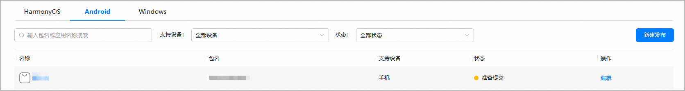
3. 选择“分发 > 应用上架 > 应用信息”，点击“应用转移”。

   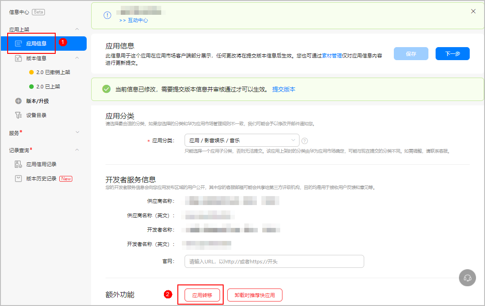
4. 系统会自动检测应用是否符合转移条件。若不符合，则需根据提示和下方“在线申请不成功处理指导”进行处理。若符合，则进入在线申请页面。

   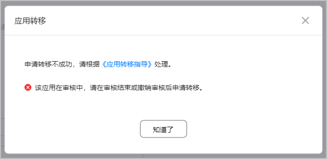
5. 进入在线申请页面后，根据要求填写以下必填项：

   概述：《应用名称》转移申请

   产品名称：请选择需要转移的应用

   问题描述：填写转移原因

   上传附件：请上传《应用转移申请表》扫描件、转入方版权和版号资质。具体资质审核要求，请见《[版权、版号资质审核](https://developer.huawei.com/consumer/cn/doc/app/80301)》。

   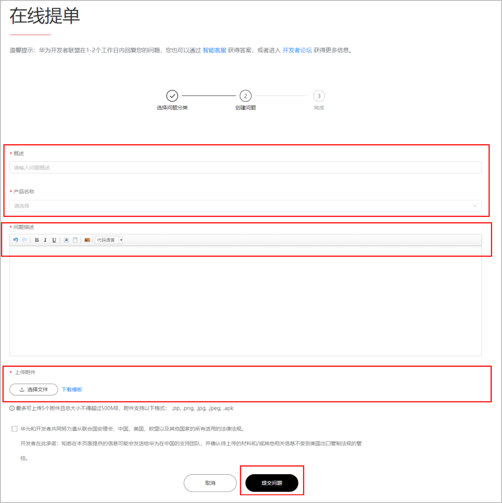
6. 提交申请后，工作人员将会在3个工作日内处理您的转移申请并回复处理结果。您可以在[华为开发者联盟官网](https://developer.huawei.com/consumer/cn/)，鼠标置于右上角头像处，下拉框内点击“我的工单”，选择应用转移的服务单号查看转移进度。
7. 转移申请通过后，华为方会发邮件通知转入方接收应用。转入方开发者需要登录[华为开发者联盟官网](https://developer.huawei.com/consumer/cn/)，点击右上角“管理中心”，在弹出的应用转移框中点击“接收”即可转移成功。

   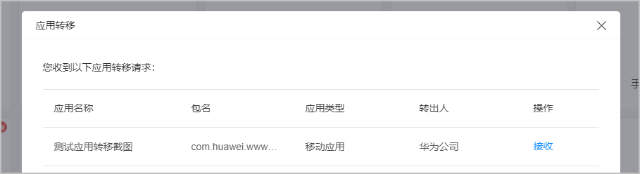

   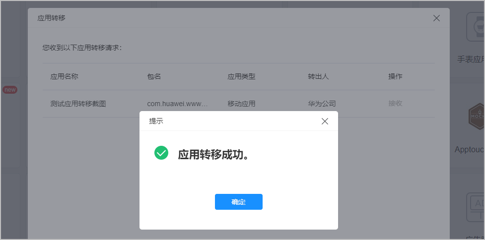
8. 应用转移成功后，转入方开发者需在72小时内提交应用审核并更新版权、版号等资质文件，审核通过后华为应用市场方能显示新的开发者名称。若未及时更新或更新的文件不符合华为应用市场资质审核标准，则华为应用市场有权下架该应用。

   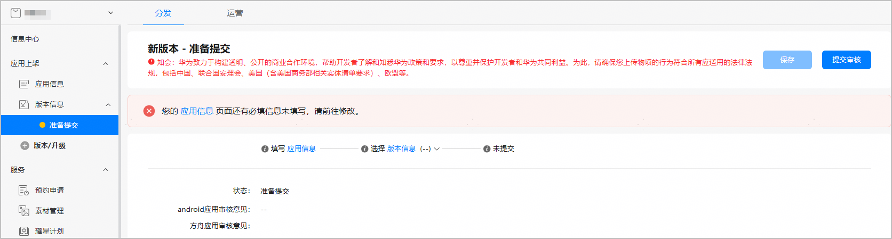

## 在线申请不成功处理指导

1. 该应用在审核中，请在审核结束或撤销审核后申请转移。

   如何处理：该应用正在审核中，审核结束或撤销审核后可转移。

   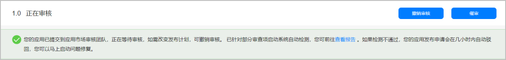
2. 该应用下的活动尚未结束（奖品为礼包、第三方卡券），请在活动结束后申请转移。

   如何处理：该应用下的活动奖品为礼包、第三方卡券时，活动任务状态为“草稿、新建驳回、撤销、终止、下线通过”可转移，其他状态不可转移。若处于以上状态仍不可转移，请确认您的应用是否参与了平台活动，平台活动结束/下线后可转移，详情可[在线提单](https://developer.huawei.com/consumer/cn/support/feedback/#/)咨询。

   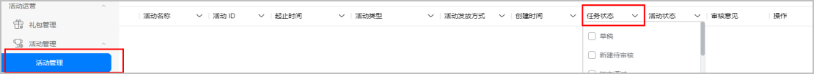
3. 该应用下的活动尚未结束（奖品为华为优惠券），请在活动结束15天后申请转移。

   如何处理：该应用下的活动奖品为华为优惠券时，活动任务状态为“草稿、新建驳回、撤销”时可转移，为“终止、下线通过”时，在终止/下线15天后可转移，其他状态不可转移。若处于以上状态仍不可转移，请确认您的应用是否参与了平台活动，平台活动结束/下线后可转移，详情可[在线提单](https://developer.huawei.com/consumer/cn/support/feedback/#/)咨询。
4. 该应用的礼包还在有效期，请在礼包下线后或删除礼包后申请转移。

   如何处理：该应用下礼包任务状态为“草稿、新建驳回、撤销、下线通过”可转移，如不处于以上状态，礼包下线或删除后可转移。

   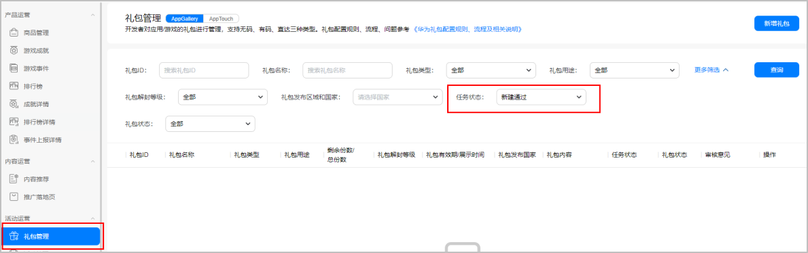
5. 该应用违规需缴纳违约金，请在缴清后申请转移。

   如何处理：该应用违规需缴纳违约金，详情可在AppGallery Connect应用信用记录页面查看，违约金缴清后可转移。

   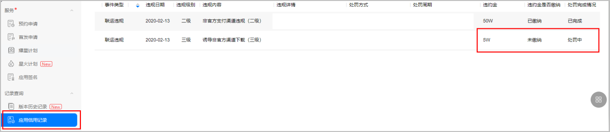
6. 应用有推广任务，请取消所有推广任务后申请转移。

   如何处理：应用仍有有效投放任务，请前往华为应用市场[应用推广平台](https://developer.huawei.com/consumer/cn/service/apcs/app/home.html)取消所有在投任务。
7. 推广账户仍有余额，请在退款后申请转移。

   如何处理：您的账户仍有余额，请尽快转出，如若在应用转移后仍有现金未转移，可参考[线上退款](https://developer.huawei.com/consumer/cn/doc/0010011)文档申请退款。
8. 应用推广已授权给客户投放伙伴，请取消所有推广任务和客户投放伙伴授权后申请转移。

   如何处理：应用已授权给客户投放伙伴，请您前往华为应用市场[应用推广平台](https://developer.huawei.com/consumer/cn/service/apcs/app/home.html)取消所有在投任务并取消授权客户投放伙伴。

## 常见问题

###应用转移后数据会发生变化吗？

* 前台数据：应用市场上已产生的下载量、用户评论数据不会清零；

* 后台数据：华为开发者联盟会员中心中该应用数据会清零，且不会迁移到新账号下。若您继续选择转移，则默认您已知晓并接受此种情况。


<MergeTable
  headers={['服务模块', '一级菜单', '二级菜单', '应用转移后是否可以查看历史数据']}
  rows={[
    [{ text: '分析', rowspan: 13 }, '概览', '', '否'],
    [null, { text: '分发分析', rowspan: 5 }, '下载安装', '是'],
    [null, null, '预约', '是'],
    [null, null, '新增与留存', '是'],
    [null, null, '应用内付费', '否'],
    [null, null, '付费下载明细', '否'],
    [null, { text: '运营分析', rowspan: 4 }, '优惠券活动', '否'],
    [null, null, '用户召回活动', '否'],
    [null, null, '财务报告', '否'],
    [null, null, '推送通知统计', '否'],
    [null, { text: '质量分析', rowspan: 3 }, '安装失败', '是'],
    [null, null, '崩溃', '是'],
    [null, null, 'ANR', '是'],
    ['运营', '用户运营', '互动评论', '是'],
  ]}
/>


###公司注销/个人离职导致无法提供公章/签名，如何申请应用转移？

如应用所属原公司已注销无法提供公章或个人开发者离职需转移至本公司却无法提供签名，请提供相关证明文件进行申请。

###什么样的情况下无法进行应用转移？

* 应用有云文件夹服务、手机预装服务（需删除），可[在线提单](https://developer.huawei.com/consumer/cn/support/feedback/#/)联系华为方删除。

* 应用推广任务未完成，如：应用市场应用推广、游戏有奖下载活动、云文件夹推广、礼包合作、预装合作、技术合作（需完成推广任务）。

* 应用有权签服务、音乐服务、阅读服务、浏览器服务、视频服务、生活服务不可进行转移。

* 应用处于审核状态时都不能转移，包括：上架审核、升级审核、下架审核、回退审核。

* 只有以下几个状态的应用才能进行转移：准备提交、待上架、已上架、待修改、被拒绝、已撤销上架、被开发者下架、被下架。

###应用转移如何结算？

* 历史数据不随应用迁移，历史结算数据需在转出账号里结算完毕。

* 转移完成后，新购买产生的流水才在转入账号里结算。

* 转移完成后，需检查转入账号下版权信息是否完善，如转入账号无版权材料，请及时提交。

* 转移完成后需查验“产品详情”中“开发者服务信息”，需与实际主体保持一致。如不一致（比如仍为原主体），请在转入账号中重新提交一次。

###应用转移支持哪些应用类型？

| 站点 | 手机APK | 手表APK | 智慧屏APK | 车机APK | 手机RPK | 智慧屏RPK | 车机RPK |
| --- | --- | --- | --- | --- | --- | --- | --- |
| 中国 | √ | √ | √ | √ | √ | √ | √ |
| 欧洲 | √ | √ | √ | x | x | x | x |
| 俄罗斯 | √ | √ | √ | x | x | x | x |

###应用转移有哪些需求约束？

* 账号持有者身份可以看见“应用转移”的按钮，并可以进行转移操作，其他角色无法看见“应用转移”按钮。支持跨站点转移。
* 如果迁移前的项目下，只有一个App，在迁移过程中，默认保留该App的历史数据。
* 如果迁移前的项目下，有多个App，则默认不保留该迁移App的历史数据，该项目下其余App的历史数据不会变化。