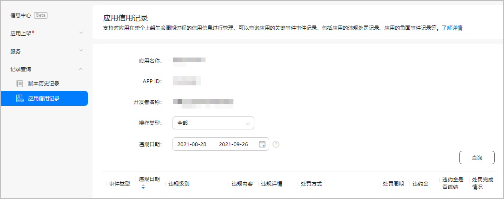
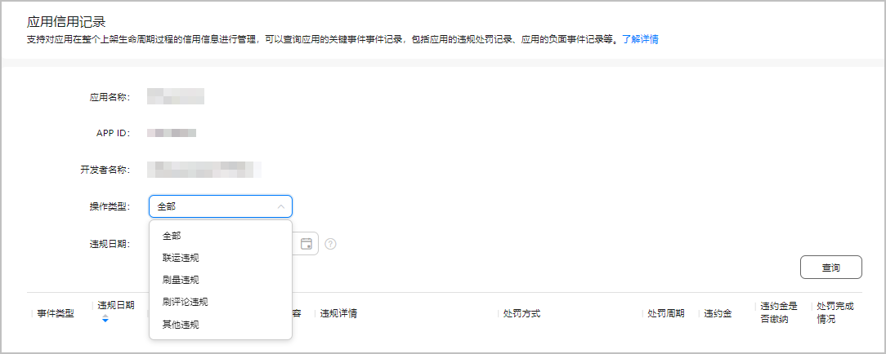
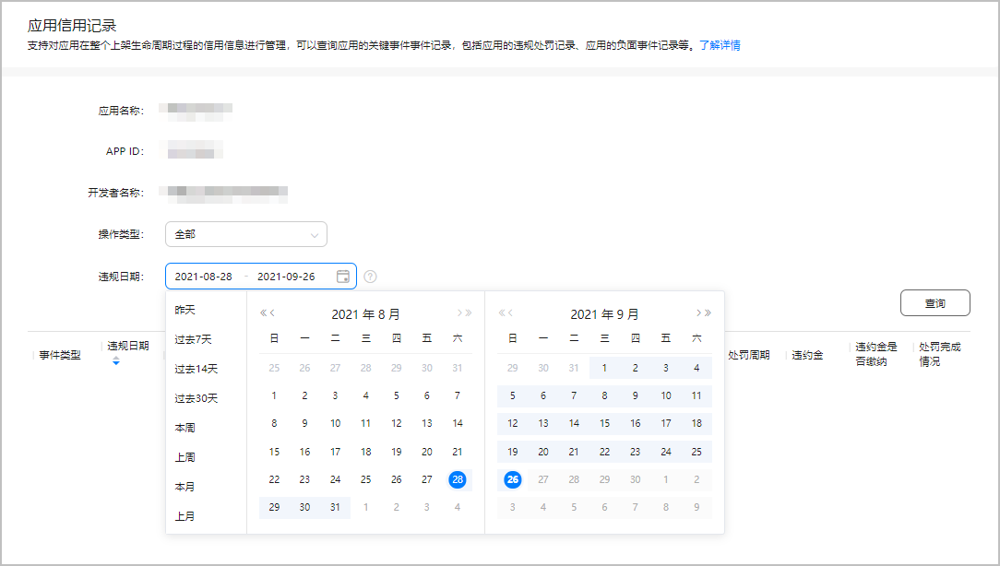
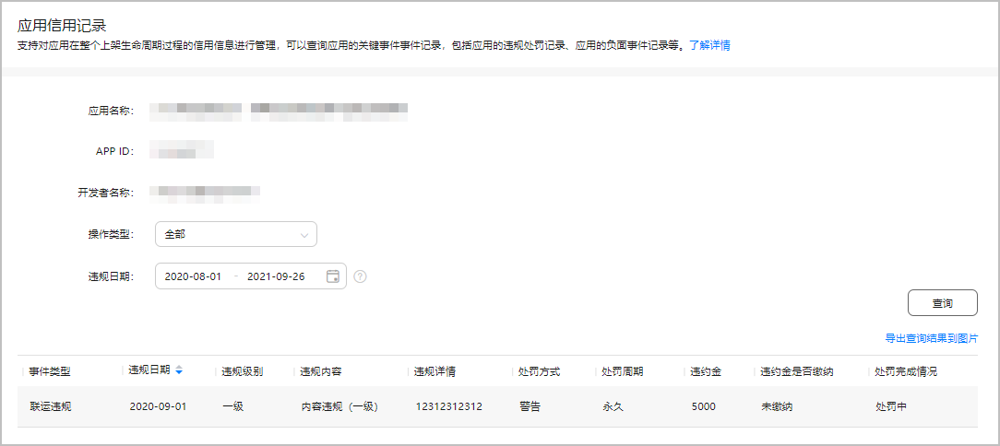
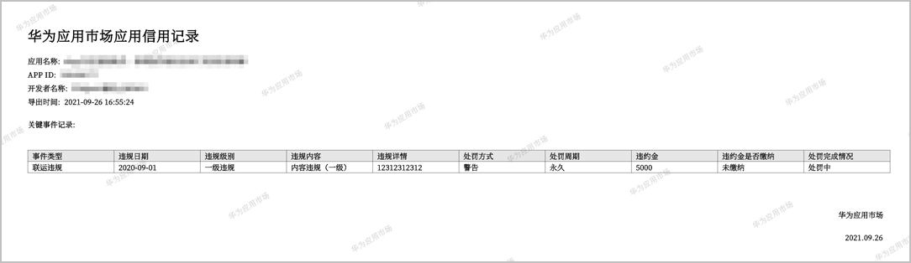

# 应用信用记录

应用信用记录是AppGallery Connect（以下简称AGC）对上架应用进行信用管理的信息资料库，包括违规处罚和负面事件等关键事件记录。它是我们评定开发者诚信行为的重要依据，也是应用转授权、主体转移的主要凭证。您可以在AGC上查询您应用的信用记录。

应用信用记录功能仅支持手机apk应用。

## 查询应用信用记录

1. 登录[AppGallery Connect](https://developer.huawei.com/consumer/cn/service/josp/agc/index.html)，点击“APP与元服务”。
2. 在应用列表中点击您的应用，选择“分发 &gt; 记录查询 &gt; 应用信用记录”。

   

3. 设置查询条件：操作类型、违规日期、或二者组合。
   * 操作类型：选择违规类型，包括“联运违规<strong>”</strong>、“刷量违规”、“刷评论违规”和“其他违规”。
     + 联运违规：联运应用的违规行为。
     + 刷量违规：所有应用（联运、非联运）恶意刷量刷榜行为，例如：刷下载量、流水、搜索等冒充用户行为以提高相关数据等。
     + 刷评论违规：所有应用（联运、非联运）刷评论，冒充用户评论以提高相关数据的行为。
     + 其他违规：包括但不限于游戏蹭量、换皮、应用的侵权投诉（参见[《华为应用市场侵权投诉通知和反通知流程》](https://developer.huawei.com/consumer/cn/doc/50120)），具体内容可从“违规详情”处获知。

       
   * 违规日期：选择起止日期。

     

4. 点击“查询”。
   * 如果应用无对应的违规记录，则查询结果为空，页面下方区域显示“暂无数据”。
   * 如果应用存在对应的违规记录，则页面下方区域显示查询结果列表。您可以按违规日期对查询结果进行正向或反向排序。

     

5. 点击“导出查询结果到图片”，将查询结果导出为图片文件。

   

如您还有其他疑问，请联系华为运营人员。