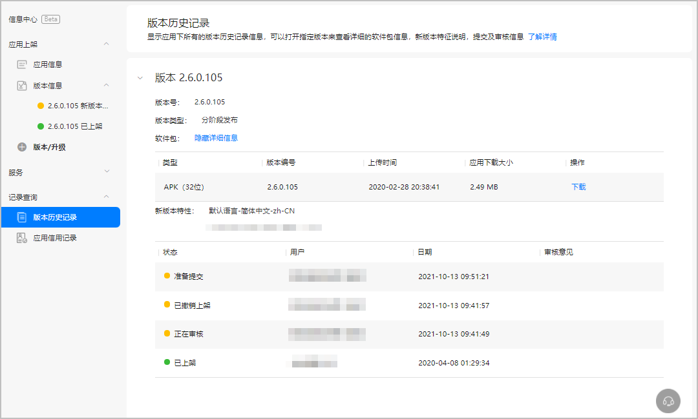
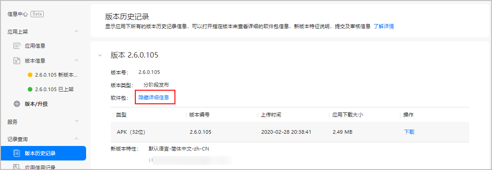
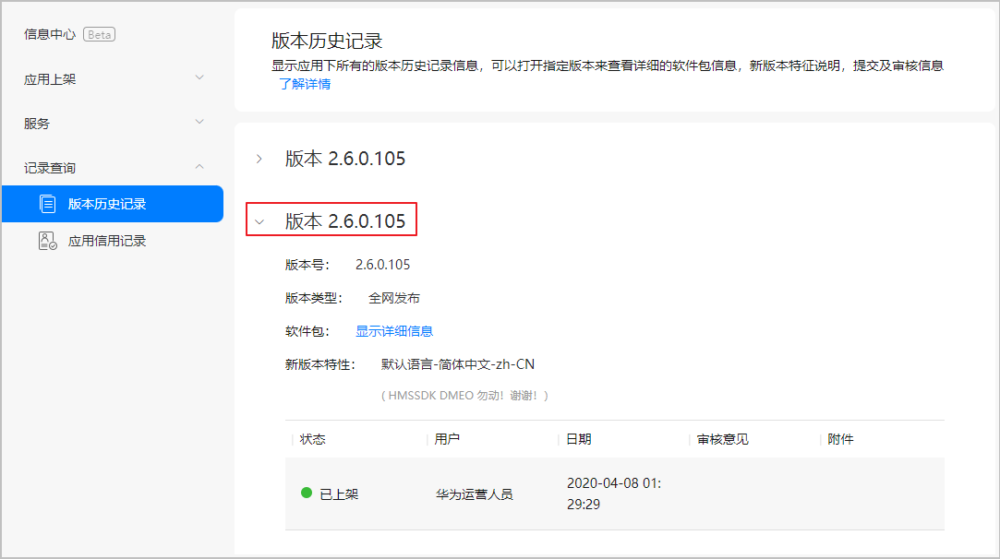
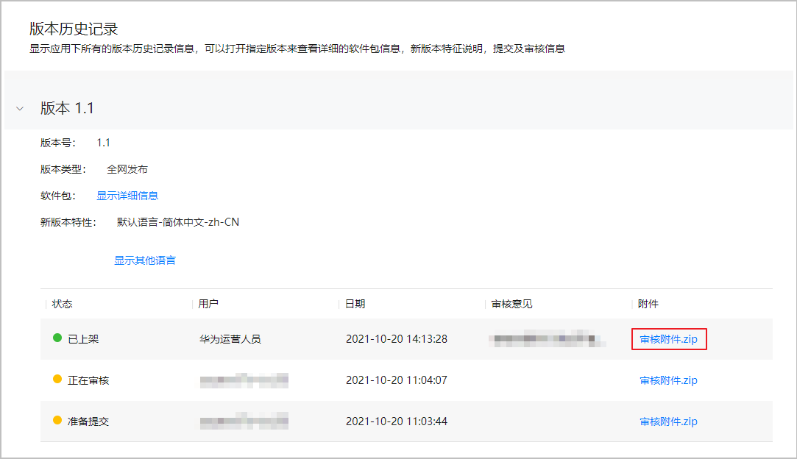
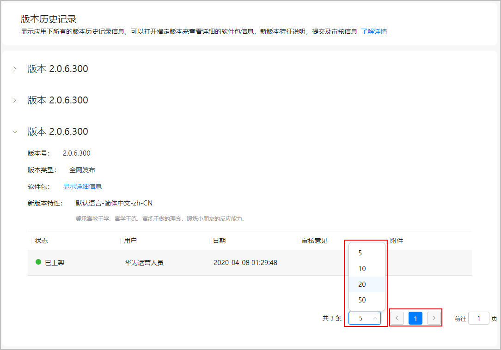

# 版本历史记录

版本历史记录是AppGallery Connect（以下简称AGC）对应用进行版本信息管理的信息资料库。您可以查看应用下所有的版本历史记录信息，也可以打开指定版本了解详细的软件包信息、新版本特征说明、提交及审核信息等。

## 查询版本历史记录

1. 登录[AppGallery Connect](`https://developer.huawei.com/consumer/cn/service/josp/agc/index.html`)，选择“APP与元服务”。
2. 在应用列表中选择待查看版本历史记录的应用，进入应用详情页。
3. 选择“分发 &gt; 记录查询 &gt; 版本历史记录”，在“版本历史记录”页面默认展示显示应用的各个历史版本信息。

   

   * 您可以点击“隐藏详细信息”，隐藏应用软件包的详细信息。

     
   * 您可以点击历史版本，可查看历史版本相应的信息。

     
   * 您可以点击附件链接查看审核附件内容。

     
   * 您可以点击右下角的下拉框选择每页展示的版本条数。支持分页展示，且每页最多展示50个版本。

     