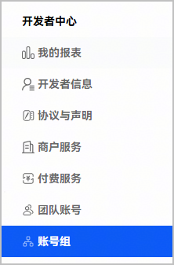
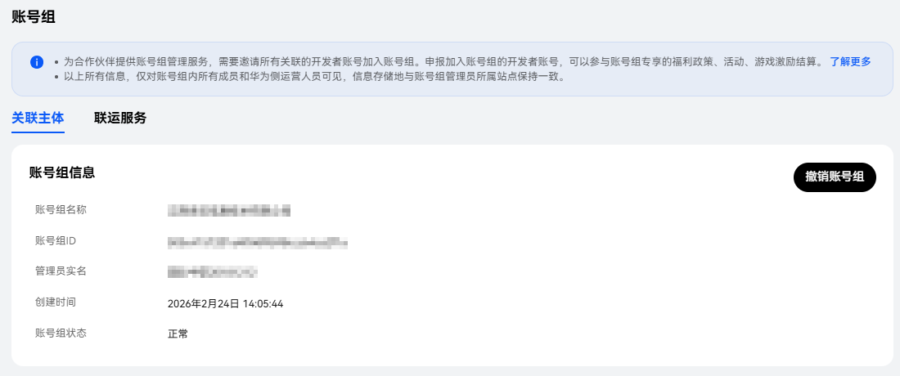
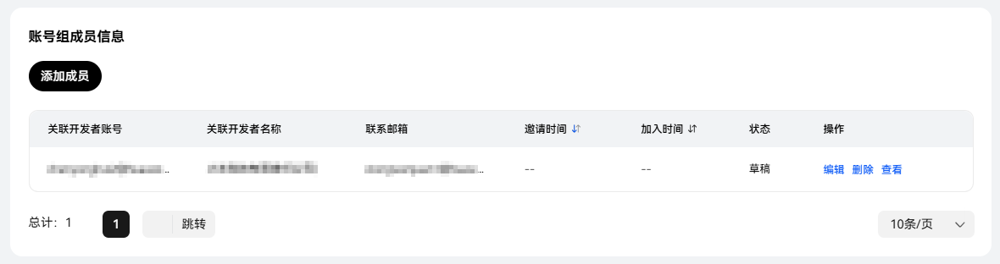
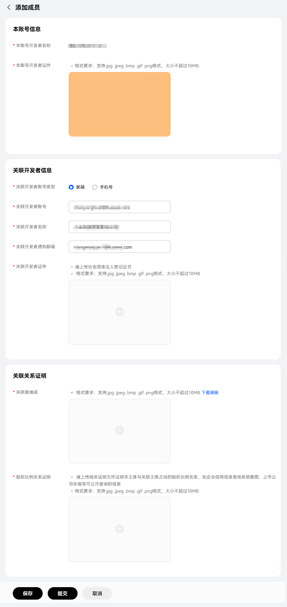
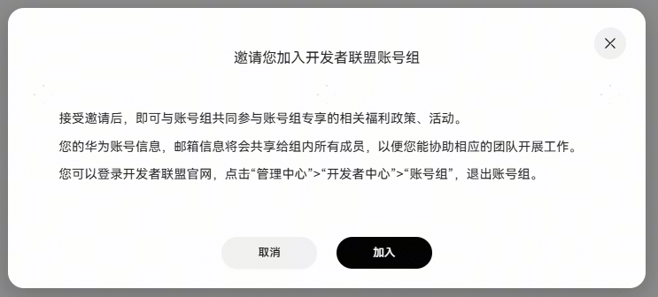
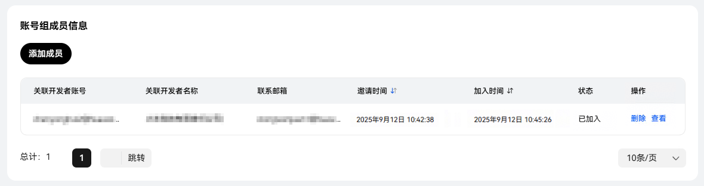

# 关联账号组

开发者及其关联公司在使用华为数字商品及联运服务时，需关联账号组。

请开发者前往[华为开发者联盟官网-管理中心](https://developer.huawei.com/consumer/cn/console/overview)将开发者账号关联账号组：

* 若[华为开发者联盟官网-管理中心](https://developer.huawei.com/consumer/cn/console/overview)未生成账号组，开发者可以按照[首次创建账号组的操作指导](#section78641714182519)关联账号组。
* 若[华为开发者联盟官网-管理中心](https://developer.huawei.com/consumer/cn/console/overview)已生成账号组，开发者可以按照[已生成账号组的操作指导](#section10663026199)关联账号组。

## 首次创建账号组的操作指导

在[华为开发者联盟官网-管理中心](https://developer.huawei.com/consumer/cn/console/overview)未生成账号组的开发者需要创建账号组。

###单个开发者账号

若开发者及其所有关联公司主体仅有一个开发者账号，则创建账号组的步骤如下：

| 序号 | 步骤 | | 说明 |
| --- | --- | --- | --- |
| 1 | 创建账号组 | | 请在**关联主体账号组**下创建账号组。  具体操作请参见[创建账号组](https://developer.huawei.com/consumer/cn/doc/start/cag-0000001265390541)。  建议以**管理员账号的公司主体名**作为账号组名。 |
| 2 | （可选）管理账号组 | 撤销账号组 | 具体操作请参见[撤销账号组](https://developer.huawei.com/consumer/cn/doc/start/deleting-group-member-0000001265590505)。 |
| 解冻账号组 | 若账号组存在违规行为，开发者联盟将冻结账号组，违规行为及冻结影响请参见[冻结账号组](https://developer.huawei.com/consumer/cn/doc/start/unfreeze-0000001266059777#section6698172616510)。  账号组冻结后将停止出具当月的结算单，在当前账号组解冻后再做处理。  如需解冻账号组，开发者可以通过[在线提单](https://developer.huawei.com/consumer/cn/support/feedback/#/add/202200004?level2=91&level3=401754903481820077)，提交解冻申请。  开发者联盟需要5~7工作日完成审批，请耐心等待。  审批结果将通过邮件告知开发者。 |

###多个开发者账号

若开发者及其所有关联公司主体存在多个开发者账号，则创建账号组及添加账号组成员的步骤如下：

| 序号 | 步骤 | | 说明 |
| --- | --- | --- | --- |
| 1 | 指定管理员账号 | | 若存在多个开发者账号，请指定其中一个账号作为管理员账号。 |
| 2 | 创建账号组 | | 仅管理员账号可以创建账号组，且需在**关联主体账号组**下创建账号组。  具体操作请参见[创建账号组](https://developer.huawei.com/consumer/cn/doc/start/cag-0000001265390541)。  建议以**管理员账号的公司主体名**作为账号组名。 |
| 3 | 添加账号组成员 | | 仅管理员账号可以添加账号组成员。  具体操作请参见[添加账号组成员](https://developer.huawei.com/consumer/cn/doc/start/aai-0000001265430513)。 |
| 4 | （可选）管理账号组 | 撤销账号组 | 仅管理员账号可以撤销账号组。  具体操作请参见[撤销账号组](https://developer.huawei.com/consumer/cn/doc/start/deleting-group-member-0000001265590505)。 |
| 删除账号组成员 | 仅管理员账号可以删除账号组成员。  具体操作请参见[删除账号组成员](https://developer.huawei.com/consumer/cn/doc/start/deleting-member-0000001220790380)。 |
| 退出账号组 | 具体操作请参见[成员退出账号组](https://developer.huawei.com/consumer/cn/doc/start/leaving-group-0000001221110348)。 |
| 解冻账号组 | 仅管理员账号可以解冻账号组。  若账号组存在违规行为，开发者联盟将冻结账号组，违规行为及冻结影响请参见[冻结账号组](https://developer.huawei.com/consumer/cn/doc/start/unfreeze-0000001266059777#section6698172616510)。  账号组冻结后将停止出具当月的结算单，在当前账号组解冻后再做处理。  如需解冻账号组，管理员账号可以通过[在线提单](https://developer.huawei.com/consumer/cn/support/feedback/#/add/202200004?level2=91&level3=401754903481820077)，提交解冻申请。  开发者联盟需要5~7工作日完成审批，请耐心等待。  审批结果将通过邮件告知账号组所有成员。 |

## 已生成账号组的操作指导

已生成账号组的开发者无需重新创建账号组，可以[添加账号组成员](#section143744181910)、[（可选）管理账号组](#section157019216336)。

###添加账号组成员

使用账号组的管理员账号登录[华为开发者联盟官网-管理中心](https://developer.huawei.com/consumer/cn/console/overview)，若账号组的账号列表存在“草稿”状态的开发者账号，表明该开发者账号尚未成为账号组的成员账号。

此时，管理员账号需要编辑“草稿”状态的账号信息，并向开发者联盟提交审批申请。

联盟审批后，若开发者账号通过邀请邮件同意加入账号组，账号状态将变更为“已加入”，表明该开发者账号成为账号组的成员账号。

**第一步：编辑并提交账号信息**

请使用账号组的管理员账号编辑并提交开发者账号信息，具体操作步骤如下：

1. 使用账号组的管理员账号登录[华为开发者联盟官网-管理中心](https://developer.huawei.com/consumer/cn/console/overview)，在左侧导航栏选择“开发者中心 > 账号组”。

   
2. 在“账号组”页面点击“**关联主体**”页签，开发者可以查看账号组信息。

   
3. 在“账号组成员信息”列表中，找到“草稿”状态的开发者账号，点击“编辑”。

   
4. 账号详情页的部分信息已自动填充，请根据提示修改信息或补充对应材料，其中“关联邀请函”请下载[模板.docx](https://alliance-communityfile-drcn.dbankcdn.com/FileServer/getFile/cmtyPub/011/111/111/0000000000011111111.20260424152622.26320346684258460775945031645039%3A20260601145909%3A2800%3AA46043AB7A6A457DA6473BB26C906EA72242CD34F923216F128A655ED8024E1D.docx?needInitFileName=true)。

   开发者账号的信息完成填写后，点击“提交”，提交账号信息的审批申请。

   

   开发者联盟需要1~3工作日完成审批，请耐心等待。

   若审批通过，系统会向开发者账号的联系邮箱发送邀请邮件。

**第二步：开发者账号接受邀请**

开发者账号接受邀请的操作步骤如下：

1. 开发者账号在联系邮箱中找到邀请邮件，并点击邮件上的激活链接。
2. 使用开发者账号登录[华为开发者联盟官网-管理中心](https://developer.huawei.com/consumer/cn/console/overview)，仔细阅读弹窗中的邀请信息。

   若同意加入账号组，点击“加入”，即可成为账号组的成员账号。

   

   账号状态变更为“已加入”。

   

###（可选）管理账号组

账号组的其他操作如下：

| 操作 | 说明 |
| --- | --- |
| 撤销账号组 | 仅管理员账号可以撤销账号组。  具体操作请参见[撤销账号组](https://developer.huawei.com/consumer/cn/doc/start/deleting-group-member-0000001265590505)。 |
| 删除账号组成员 | 仅管理员账号可以删除账号组成员。  具体操作请参见[删除账号组成员](https://developer.huawei.com/consumer/cn/doc/start/deleting-member-0000001220790380)。 |
| 退出账号组 | 具体操作请参见[成员退出账号组](https://developer.huawei.com/consumer/cn/doc/start/leaving-group-0000001221110348)。 |
| 解冻账号组 | 仅管理员账号可以解冻账号组。  若账号组存在违规行为，开发者联盟将冻结账号组，违规行为及冻结影响请参见[冻结账号组](https://developer.huawei.com/consumer/cn/doc/start/unfreeze-0000001266059777#section6698172616510)。  账号组冻结后将停止出具当月的结算单，在账号组解冻后再做处理。  如需解冻账号组，管理员账号可以通过[在线提单](https://developer.huawei.com/consumer/cn/support/feedback/#/add/202200004?level2=91&level3=401754903481820077)，提交解冻申请。  开发者联盟需要5~7工作日完成审批，请耐心等待。  审批结果将通过邮件告知账号组所有成员。 |