# 游戏预约魔方创意

游戏预约魔方创意是为[游戏预约](https://developer.huawei.com/consumer/cn/doc/app/game-center-pre-order-0000001239342333)提供的在线制作、轻松上手、简单轻量的设计网站。该网站支持一键预览，支持复杂的交互或跳转，您可以自由搭配组件，一键复用优质内容，轻松设计游戏预约的可视化H5落地页。

## 编辑器界面

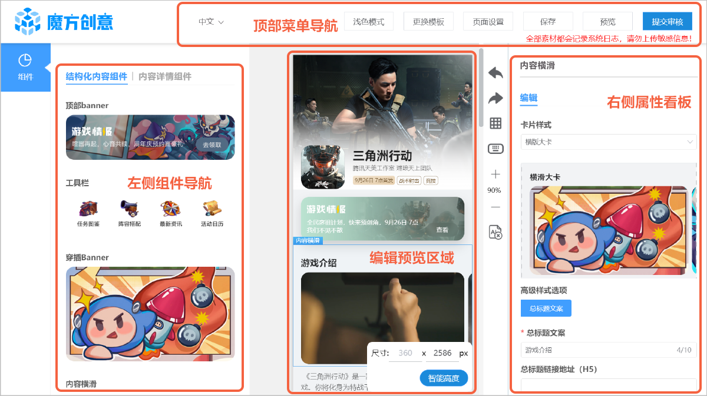

###左侧组件导航

“魔方创意”网站的左侧组件导航展示您可以使用到在玩页面的不同组件。按住并拖动组件到页面编辑区即可将组件添加至页面当中，组件的具体样式及配置方法，请参见[组件配置](#section62461025344)。

| 组件 | 说明 |
| --- | --- |
| [沉浸式应用头卡](#section1824619250417) | 可以配置应用的基本信息。 |
| [顶部banner](#section443853214149) | 可以在此处展示游戏的重大节点。 |
| [内容横滑](#section195781151918) | 横向排列展示多个内容，可横向滑动查看全部内容。可以和[段落文本组件](#section1324919253411)组合实现游戏介绍组件。 |
| [段落文本](#section1324919253411) | 可以填写游戏的基本介绍。可以和[内容横滑组件](#section195781151918)组合实现游戏介绍组件。 |
| [穿插Banner](#section257017197383) | 穿插banner组件是一种支持配置单个宽型banner的组件。穿插banner位置较为灵活，可以穿插在组件之间丰富页面样式。 |
| [内容平铺](#section67981564276) | 平铺展示多个内容。 |
| [页签容器](#section869975916276) | 可配置多个页签图标。  说明：  必须与内容横滑或内容平铺搭配使用。 |

###顶部菜单导航

| 组件 | 说明 |
| --- | --- |
| 语言切换 | 您仅能切换成“中文”或“English”。 |
| 浅色模式 | 可切换“深色模式”或“浅色模式”。 |
| 更换模板 | 您可以重新选择页面模板，请参见[创建H5页面](#section7182346111813)。 |
| 页面设置 | 您需要设置全局样式，例如页面名称、页面使用组件版本等。 |
| 保存 | 您可以随时保存页面内容。 |
| 预览 | 您可以随时[预览页面内容](/docs/distribute/app-dist/game-center/game-center-materials-0000001194142412/game-center-creatives-ideas-0000001429732169#section31105420225)。 |
| 提交审核 | 您可以在完成当前页面后[提交审核](#section7501181420712)。 |

###编辑预览区域

您可以设置页面高度，调整组件位置等。拖动组件进入该区域，点击组件可对其属性进行设置，右键可删除或复制组件。

* 智能高度

  配置完页面后，点击“智能高度”，页面高度会自动调整，去除底部留白。

###右侧属性面板

您可以设置不同组件的不同属性，例如样式、事件等。

## 创建H5页面

1. 跳转至“魔方创意”网站后，请在自动弹出的“创建页面”窗口中选择页面：
   * 您可以使用网站提供的主题模板。
   * 您可以复制历史页面。
   * 您可以使用空白页面。

   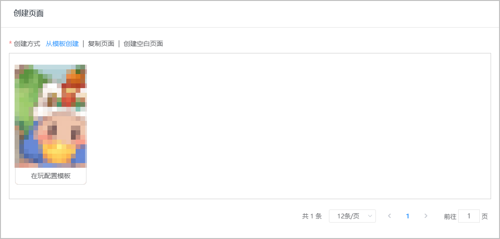
2. 根据需求使用网站组件并设置对应的组件属性，点击“保存”随时保存已完成的页面设计。

   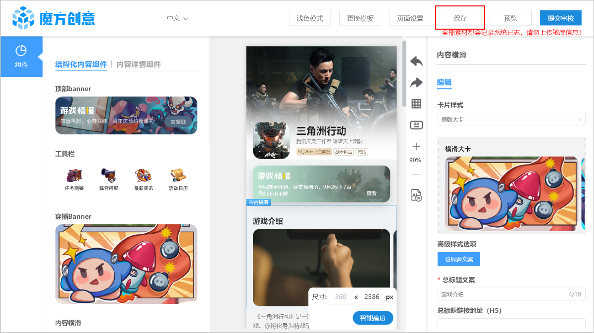

## 预览H5页面

页面编辑过程中可点击顶部菜单导航“预览”对页面效果进行预览，魔方创意提供多种方式预览：

* 您可以点击  或  直接查看手机模拟器中的展示效果。
* 您可以复制一键生成的链接，前往移动端查看展示效果。
* 您可以直接扫描二维码查看展示效果。

  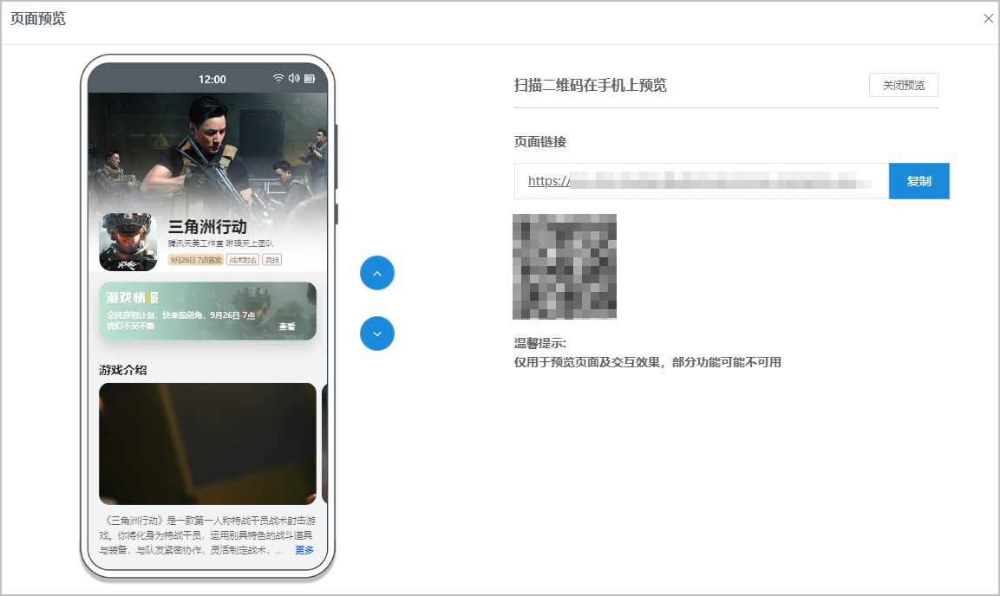

## 提交审核

完成页面所有编辑或修改操作，对页面样式满意后，保存内容，然后点击右上角“提交审核”对页面进行提交。

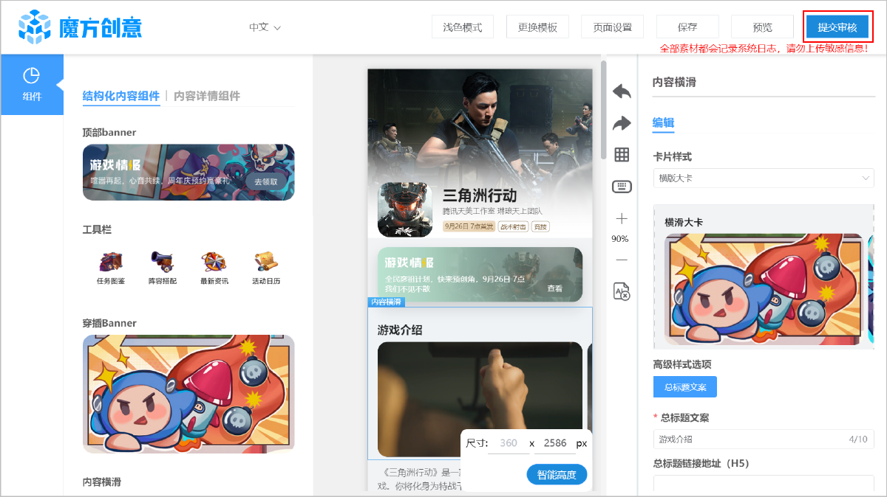

## 组件配置

###沉浸式应用头卡

* 组件介绍

  

  作为头部介绍卡片使用。可以配置应用的基本信息，如应用图标、应用名称、开发者名称和推荐标签。
* 组件配置

  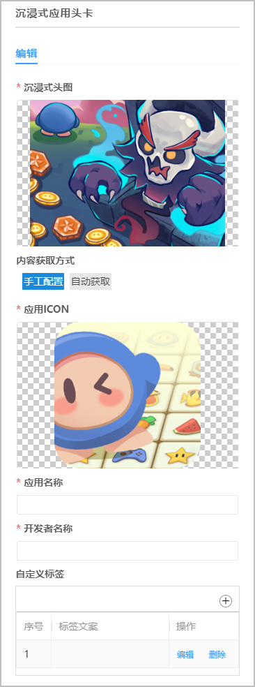

  | 参数 | | 说明 |
  | --- | --- | --- |
  | 沉浸式头图 | | 页面最上方展示的大图。  + 格式：JPG、PNG、JPEG、WEBP、GIF； + 尺寸：宽高比4:3，建议上传尺寸1080\*810px。 + 大小：小于500KB。 |
  | 内容获取方式 | | 可选择“手工配置”或“自动获取”。选择“手工配置”需自行填写全部应用信息。选择“自动获取”会自动获取相关应用信息，同时推荐标签内会展示预计上线时间、预约量和预约榜排名等信息。 |
  | 手工配置 | 应用ICON | 应用的图标，请与应用最终在商店内展示的图标保持一致。  要求如下：  + 格式：JPG、PNG、JPEG、WEBP、GIF； + 尺寸：宽高比1：1。 |
  | 应用名称 | 应用的名称，请与应用在商店内的名称保持一致。 |
  | 开发者名称 | 应用的开发者名称。 |
  | 自定义标签 | 编写自定义标签信息，最多可添加三个。  + 标签文案：标签展示的具体内容。 + 点击事件：可选择“跳转链接（H5/Deeplink）”或“跳转至帖子详情（帖子ID）”。   - 跳转链接（H5/Deeplink）：填写H5/Deeplink链接。   - 跳转至帖子详情（帖子ID）：需填写帖子ID，可选择填写客户端最低版本号。 |
  | 自动获取 | 内容来源 | 自动填写“游戏分发”。 |
  | APPID | 自动填写对应应用的APP ID。 |
  | 信息类型 | 当前仅可选择“预约信息”。 |
* 效果展示

  

###顶部banner

* 组件介绍

  

  当游戏有重大节点，如测试、定档和上线时，可以在此处呈现。

* 组件配置

  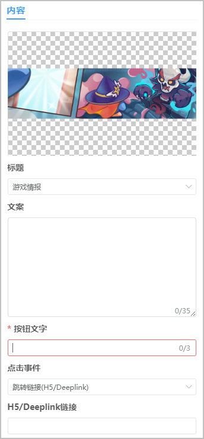

  | 参数 | 说明 |
  | --- | --- |
  | 图片 | 上传自定义图片。建议使用无文案图片。  要求如下：  + 格式：JPG、PNG、JPEG； + 尺寸：建议上传尺寸1080\*290px； + 大小：小于500KB。 |
  | 标题 | 当前仅可选“游戏情报”。 |
  | 文案 | 介绍文案，最多可以输入35个字符。 |
  | 按钮文字 | 必填，最多可以输入3个字符。 |
  | 点击事件 | + 跳转链接(H5/Deeplink)：需填写H5/Deeplink链接 + 跳转至帖子详情(帖子ID)：需填写帖子ID |
* 效果展示

  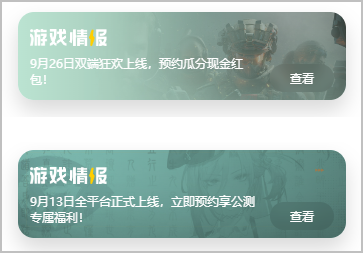

###内容横滑

* 组件介绍

  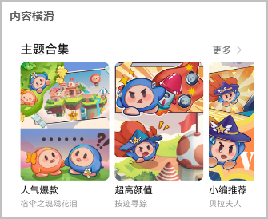

  横向排列展示多个内容，可横向滑动查看全部内容。卡片样式选择“横版大卡”选项，可以配置游戏介绍图片或介绍视频，和[段落文本组件](#section1324919253411)搭配使用可以实现游戏介绍组件。选择其他卡片样式，可用于角色介绍、资讯动态、最新活动、编辑室评测等多种内容形式的组合。
* 组件配置

  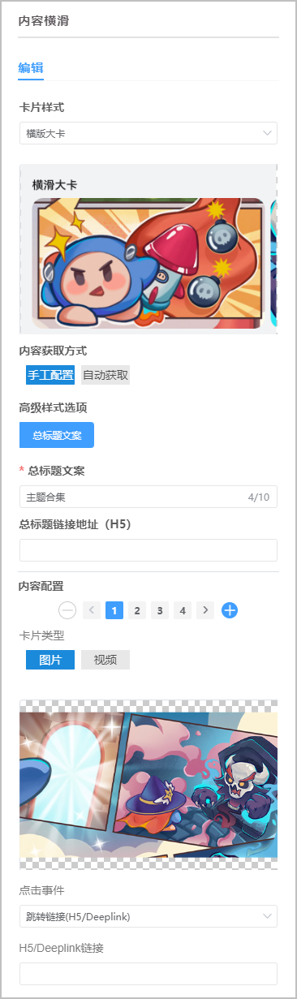

  | 参数 | | 说明 |
  | --- | --- | --- |
  | 卡片样式 | | 可选“杂志横滑”、“横版卡片”和“横版大卡”。 |
  | 高级样式选项 | | 包括“总标题文案”、“卡片标签”、“卡片标题”和“卡片文案”，默认需配置“总标题文案”、“卡片标题”和“卡片文案”，可根据需要点击取消或添加选项。  说明：  选择卡片样式为“横版大卡”时，仅可选择“总标题文案”选项。 |
  | 内容获取方式 | | 可选“手工配置”或“自动获取”。 |
  | 手工配置 | 总标题文案 | 必填，最多可以输入10个字符。 |
  | 总标题链接地址（H5） | 请填写总标题的链接地址。 |
  | 内容配置 | 设定内容数量，最多可配置15个。  分别上传各内容的图片或视频。  图片要求如下：  + 格式：JPG、PNG、JPEG、GIF； + 尺寸（杂志横滑）：宽高比3：4，建议上传尺寸960\*1280px； 尺寸（横版卡片）：宽高比16：9，建议上传尺寸1280\*720px；  尺寸（横版大卡）：宽高比16：9，建议上传尺寸1280\*720px； + 大小：小于500KB。 视频要求如下：  + 格式：视频格式为MP4，压缩格式为H264。 |
  | 卡片类型 | 选择卡片样式为“横版大卡”时出现，可选择图片或视频。 |
  | 卡片标签 | 请分别填写各内容的卡片标签，最多可以输入5个字符。 |
  | 卡片标题 | 请分别填写各内容的卡片标题。 |
  | 卡片文案 | 请分别填写各内容的卡片文案。 |
  | 点击事件 | + 跳转链接(H5/Deeplink)：需填写H5/Deeplink链接。 + 跳转至帖子详情(帖子ID)：需填写帖子ID，可选择填写客户端最低版本号。 |
  | 自动获取 | 内容来源 | + 游戏社区：需填写内容场景ID。 + 游戏活动：自动填写APPID。 |
  | 总标题（自定义） | 请填写总标题，最多可以输入10个字符。 |
  | 总标题链接地址（H5） | 请填写总标题链接地址。 |
* 效果展示

  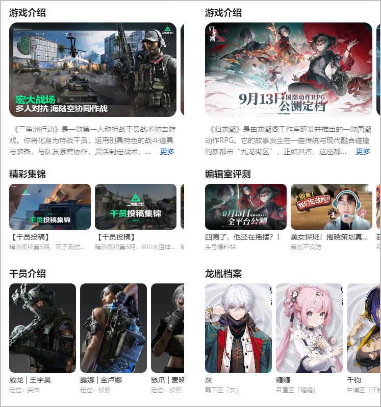

###段落文本

* 组件介绍

  

  可以填写游戏的基本介绍。可以和[内容横滑组件](#section195781151918)组合实现游戏介绍组件。
* 组件配置

  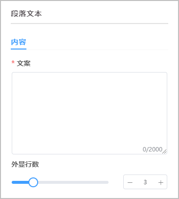

  | 参数 | 说明 |
  | --- | --- |
  | 文案 | 必填，请填写需要展示的文案，最多可以输入2000个字符。 |
  | 外显行数 | 选择文案展示的行数，可选择1~5行。 |
* 效果展示

  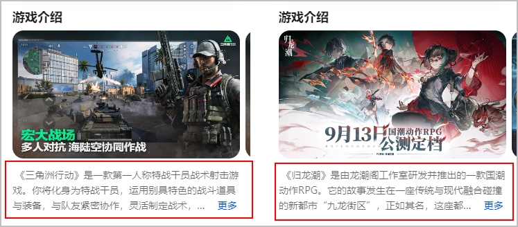

###穿插Banner

* 组件介绍

  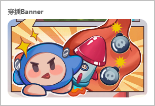

  穿插 banner 组件是一种支持配置单个宽型 banner 的组件。穿插 banner 位置较为灵活，可以穿插在组件之间丰富页面样式。可以通过该组件配置预约上线礼包、预约里程碑等图片内容。需要将礼包领取和发放方式在图片上标明，该组件可仅做展示效果，无需配置跳转链接。

* 组件配置

  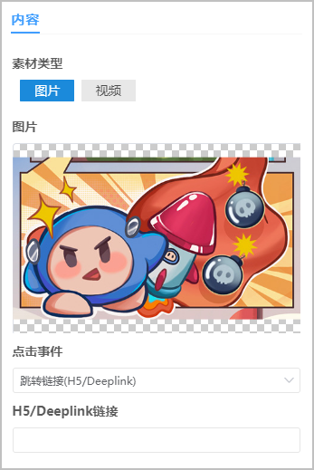

  | 参数 | 说明 |
  | --- | --- |
  | 素材类型 | 支持“图片”和“视频”。  图片要求如下：  + 格式：JPG、PNG、JPEG、WEBP、GIF； + 尺寸：宽高比16:9，建议上传尺寸1280\*720px； + 大小：小于500KB。 视频要求如下：  + 格式：视频格式为MP4，压缩格式为H264； + 大小：50MB以内。 |
  | 点击事件 | + 跳转链接(H5/Deeplink)：需填写H5/Deeplink链接 + 跳转至帖子详情(帖子ID)：需填写帖子ID |
* 效果展示

  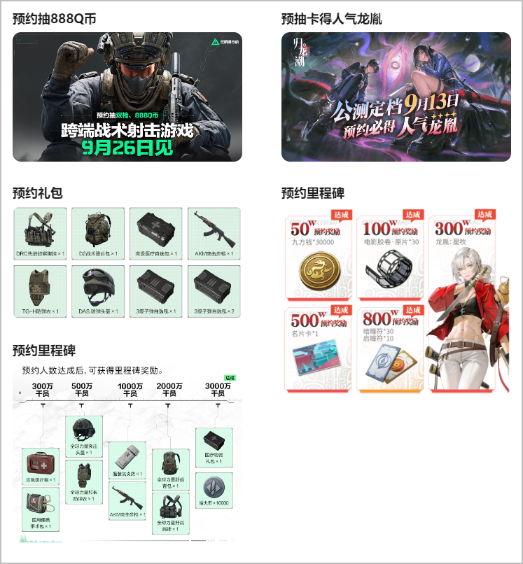

###内容平铺

* 组件介绍

  

  可以平铺展示多个内容，可配置相关游戏介绍视频或游戏介绍图片。

* 组件配置

  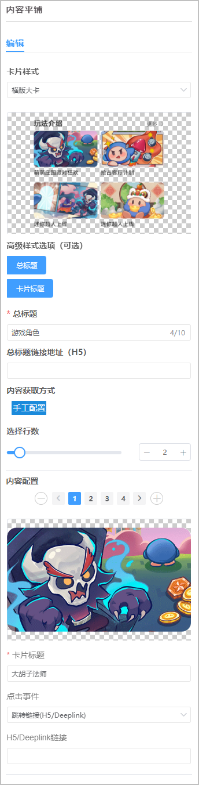

  | 参数 | | 说明 |
  | --- | --- | --- |
  | 卡片样式 | | 可选“横版大卡”（16：9）和“方形小卡”（1：1）。 |
  | 内容配置 | | 设定内容数量，最多可以设置10行。 |
  | 高级样式选项 | | 包括“总标题”和“卡片标题”，默认均需配置，如不需要可点击取消该项。 |
  | 总标题 | 总标题 | 必填，最多可以输入10个字符。 |
  | 总标题链接地址 | 暂不可用。 |
  | 卡片标题 | 卡片标题 | 请填写卡片标题。 |
  | 内容获取方式 | | 可选择“手工配置”或“自动获取”。 |
  | 手工配置 | 总标题 | 必填，最多可以输入10个字符。 |
  | 总标题链接地址（H5） | 请填写总标题的链接地址。 |
  | 选择行数 | 可选1~10。 |
  | 内容配置 | 设定内容数量，总数与配置的行数匹配。  分别上传各内容的图片。  要求如下：  + 格式：JPG、PNG、JPEG、GIF； + 尺寸（方形小卡）：宽高比1：1，建议上传尺寸1080\*1080px； 尺寸（横版大卡）：宽高比16：9，建议上传尺寸1280\*720px； + 大小：小于500KB。 |
  | 卡片标题 | 请分别填写各内容的卡片标题。 |
  | 点击事件 | + 跳转链接(H5/Deeplink)：填写H5/Deeplink链接。 + 跳转至帖子详情(帖子ID)：需填写帖子ID，可选择填写客户端最低版本号。 |
  | 自动获取 | 内容来源 | 可选择“游戏社区”或“游戏活动”。 |
  | 内容场景Id | 选择“内容来源”为“游戏社区”时必填，查询的总数要与配置的行数匹配。 |
  | APPID | 选择“内容来源”为“游戏活动”时出现，自动填写对应应用的APPID。 |
  | 总标题（自定义） | 可选择自行填写总标题，最多可以输入10个字符。 |
  | 总标题链接地址（H5） | 请填写总标题的链接地址。 |
  | 选择行数 | 可选1~10。 |
* 效果展示

  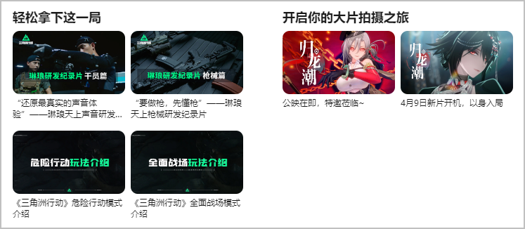

###页签容器

* 组件介绍

  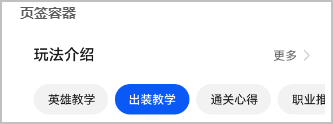

  页签容器可配置多个页签图标。必须与内容横滑或内容平铺搭配使用。

* 组件配置

  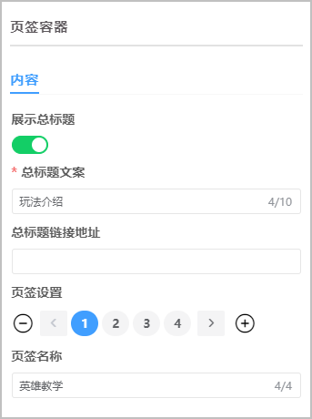

  | 参数 | 说明 |
  | --- | --- |
  | 展示总标题 | 选择是否展示总标题。 |
  | 总标题文案 | 必填，1~10个字符。 |
  | 总标题链接地址 | 请填写总标题的链接地址。 |
  | 页签设置 | 可配置多个页签，但不支持超过一行。 |
  | 页签名称 | 要求1~4个字符。 |

  编辑预览区域已放置页签容器、内容横滑组件或内容平铺组件后，选中内容横滑组件或内容平铺组件，可拖拽入页签容器，页签容器边框高亮时可放开鼠标，弹框提示“是否拖入当前容器？”，点击“确定”即可将该组件放入该页签。

  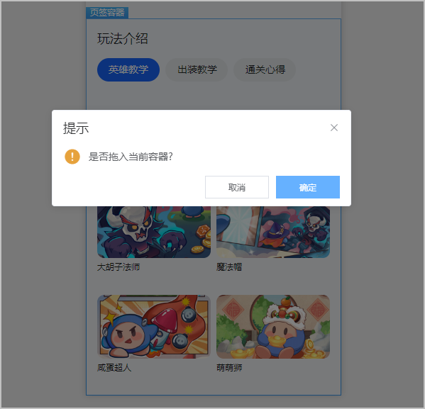

  多个页签需点击对应页签分别配置关联内容横滑组件或内容平铺组件。

  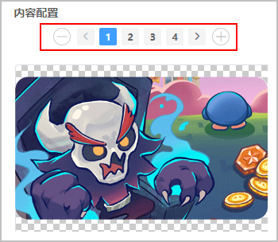