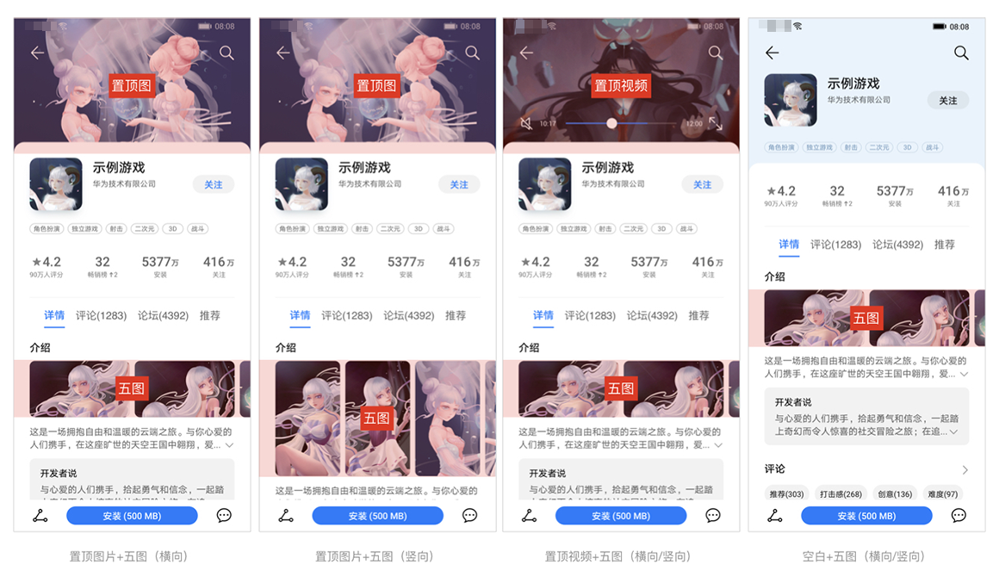
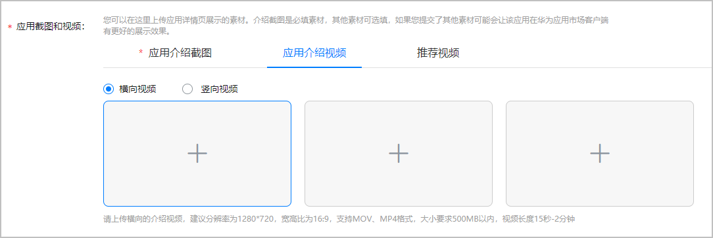
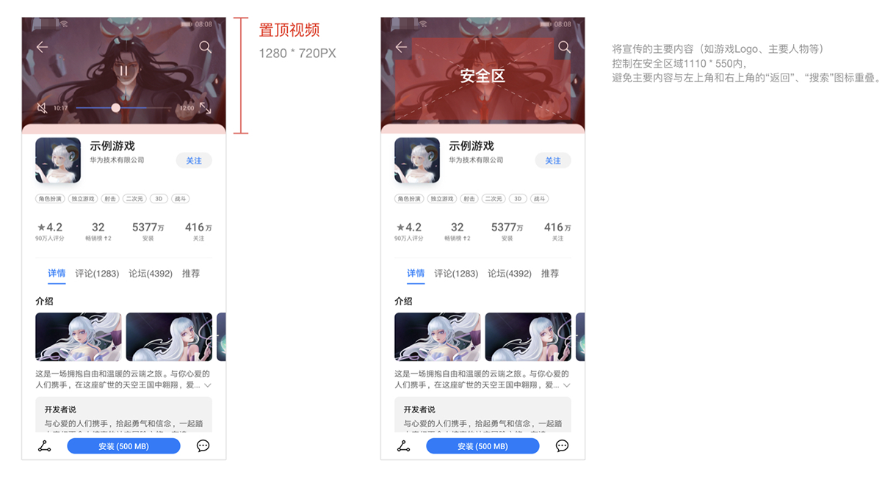
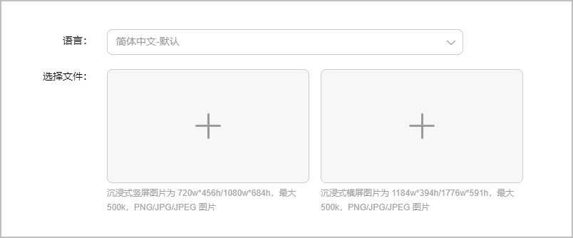
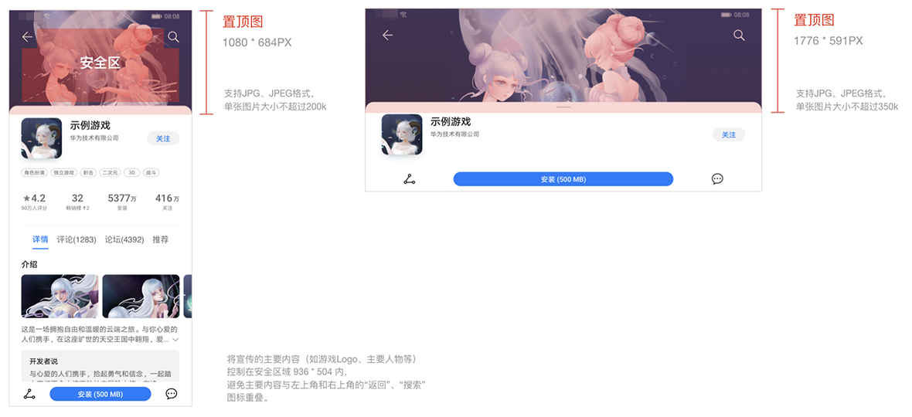
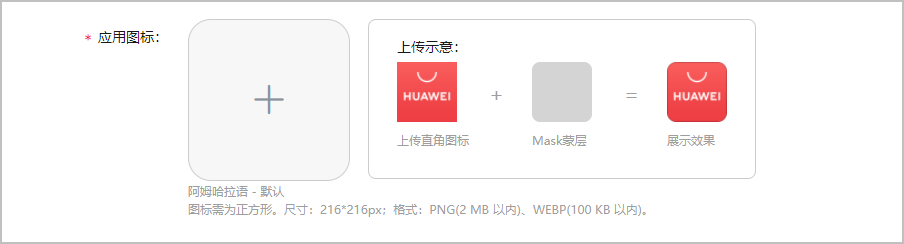
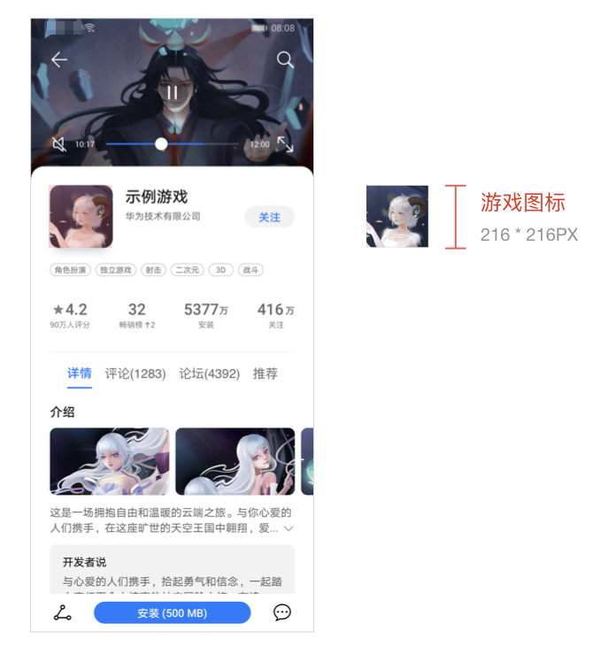
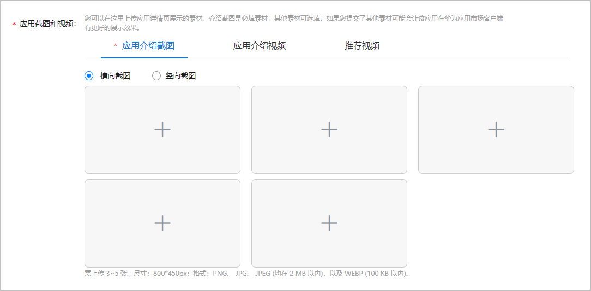
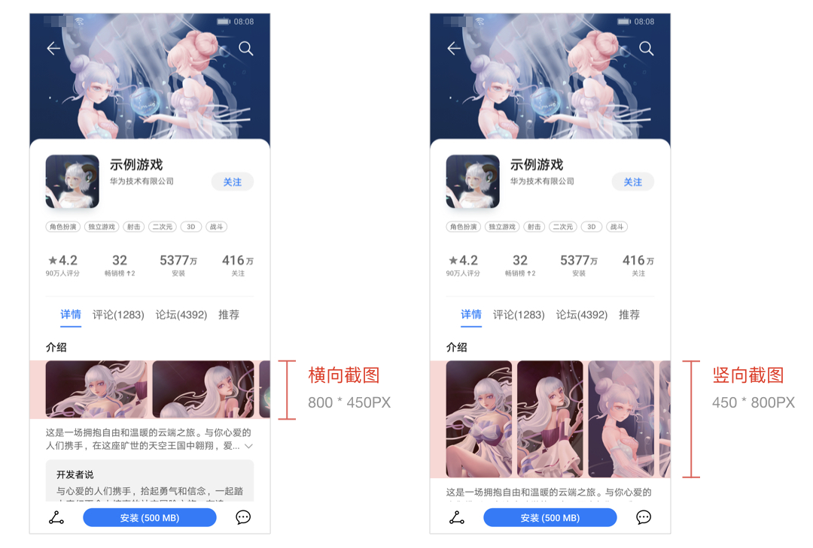

# 详情页素材规范及示例

华为应用市场/游戏中心的游戏详情页的素材主要有置顶图、置顶视频、游戏图标、横/竖向游戏介绍截图，主要有如下几种组合的游戏详情页。

## 置顶视频

### 适用范围

* 仅开放给[联运服务](`https://developer.huawei.com/consumer/cn/doc/promotion/service-introduction-0000001062607577`)项目使用。
* 适用于客户端10.5版本以上。

### 规范及示例

登录[AppGallery Connect](`https://developer.huawei.com/consumer/cn/service/josp/agc/index.html`)，点击“APP与元服务”，在“应用信息”页面上传横向的介绍视频。若您上传了多个横向视频，将展示第一个介绍视频。

建议置顶视频宽\*高为1280\*720px，宽高比为16:9，大小不超过500MB的MOV/MP4视频，时长约在15秒~2分钟。

## 置顶图

### 适用范围

* 仅开放给[联运服务](`https://developer.huawei.com/consumer/cn/doc/promotion/service-introduction-0000001062607577`)项目使用。
* 适用于客户端10.5版本以上。

### 规范及示例

登录[AppGallery Connect](`https://developer.huawei.com/consumer/cn/service/josp/agc/index.html`)，点击“APP与元服务”，在“配置沉浸式详情”页面上传沉浸式竖/横屏图片。

* 竖屏图片：需上传宽高为720\*456px或1080\*684px，大小不超过500KB的PNG/JPG/JPEG图片。
* 横屏图片：需上传宽高为1184\*394px或1776\*591px，大小不超过500KB的PNG/JPG/JPEG图片。

## 游戏图标

登录[AppGallery Connect](`https://developer.huawei.com/consumer/cn/service/josp/agc/index.html`)，点击“APP与元服务”，在“应用信息”页面上传图标。

游戏图标必须宽高一致，建议使用宽高为216\*216px的PNG（不超过2MB）或WEBP（不超过100KB）的图片。

## 游戏介绍截图

登录[AppGallery Connect](`https://developer.huawei.com/consumer/cn/service/josp/agc/index.html`)，点击“APP与元服务”，在“应用信息”页面上传横/竖向介绍截图。

* 横向截图：您需上传3~5张宽高为800\*450px的PNG/JPG/JPEG(均不超过2MB)或WEBP(不超过100KB)图片。
* 纵向截图：您需上传3~5张宽高为450\*800px的PNG/JPG/JPEG(均不超过2MB)或WEBP(不超过100KB)图片。

