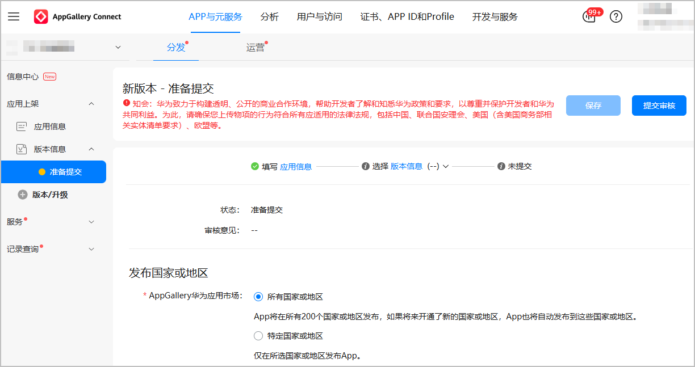
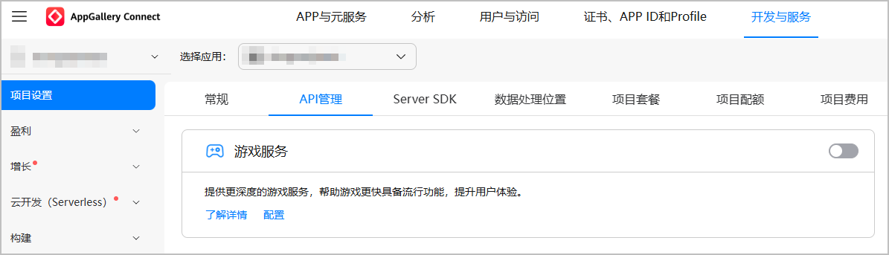
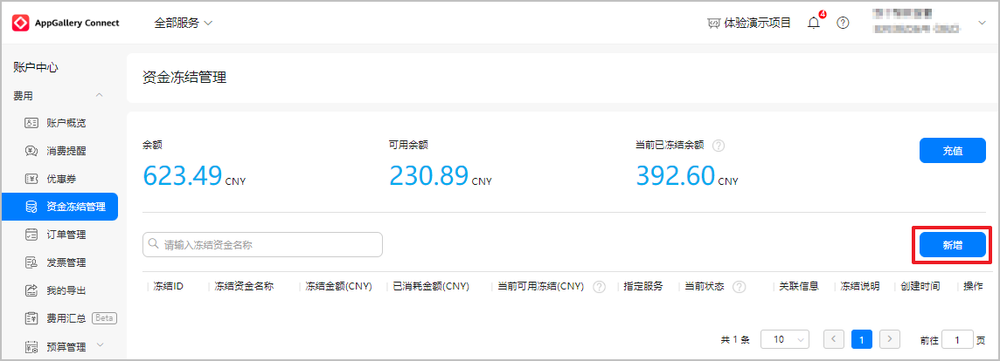
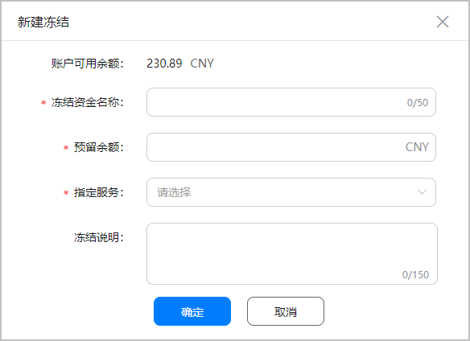
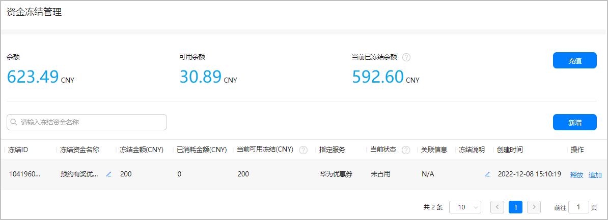

# FAQ

## 为什么活动管理平台的活动目的置灰？

* 当前应用版本未上架

  您可在[AppGallery Connect](https://developer.huawei.com/consumer/cn/service/josp/agc/index.html)管理台“分发 &gt; 版本信息”中对应用进行上架提交，审核通过后方可进行活动创建。

  
* 当前应用未开通游戏服务

  您可在[AppGallery Connect](https://developer.huawei.com/consumer/cn/service/josp/agc/index.html)管理台“开发与服务 &gt; 项目设置 &gt; API管理”页面开通“游戏服务”，成功开通后方可进行活动创建。

  

## 新游首发前，您可以申请哪些类型的运营活动？

仅不支持“安装有奖”和“首登有奖”活动类型。在新游首发前参与游戏测试、新游预约的用户将无法在活动期间获得奖品，因为他们在首发前已完成首次安装和首次使用华为账号登录，这可能引发用户的投诉。

## 如何设置礼包奖品数量（单位：份）？

为保障用户体验良好，礼包数量需覆盖活动期间所有参与用户，如登录类活动请按日活人数\*活动天数\*3倍预估，建议根据活跃度配置10万~100万（库存礼包到期将自动作废）。若活动过程中礼包数量不足可能引起用户投诉。

## 如何设置优惠券奖品数量（单位：份）？

为保障用户体验良好，优惠券数量建议配置为“不限量”，避免活动过程中奖品数量不足引起用户投诉。最终结算以实际消耗为准。

## 设置华为优惠券作为活动奖品时，成本由谁承担？

优惠券成本由您承担，以有效期内（X天）优惠券实际消耗金额为准，由系统自动在当月收入中扣减。举例说明如下：

* 活动规则

9月15日-9月20日，安装本应用/游戏即可领取10元专属优惠券，每人限获得1次奖励。

* 活动成本

假设参与活动人数1万人，则优惠券发放金额：1万人\*10元=10万元。

假设有效期内优惠券使用率90%，则优惠券使用金额：10万元\*90%=9万元。

* 结算方式

活动发放的优惠券部分照常参与分成，假设贵司当月流水100万，其中现金流水80万，优惠券流水20万（含活动的9万），双方五五分成（若为联运应用类则按三七分成），则贵司当月应收100万元\*50%=50万元，系统扣减活动成本后最终收入：50万元-9万元=41万元。

## 优惠券活动奖品要求？

您为已首发超过1个月的游戏申请安装/连登1天/首登类运营活动（限游戏类运营活动）时，活动奖品中的优惠券满减比例超过优惠券面额40%或者无门槛券的，不予通过。

## 如何冻结华为优惠券专用金额？

1. 进入“账户中心”页面，选择“费用 &gt; 资金冻结管理”，在页面右侧点击“新增”。

   
2. 在弹出的窗口中填写金额信息。

   

   | 填写项 | 说明 |
   | --- | --- |
   | 冻结资金名称 | 请填写添加华为优惠券的活动名称。 |
   | 预留金额 | 优惠券充值总金额。 |
   | 指定服务 | 选择“华为优惠券”。 |
   | 冻结说明（选填） | 您可以补充其它信息。 |
3. 成功冻结指定金额后，可在列表查看详细信息。

   