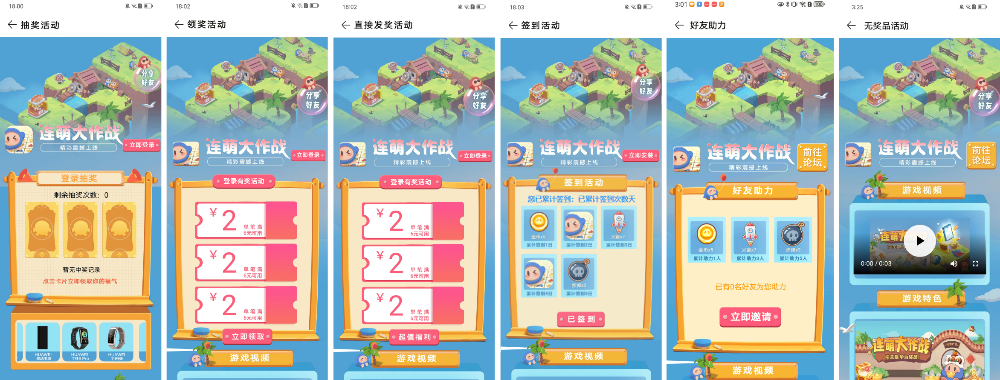
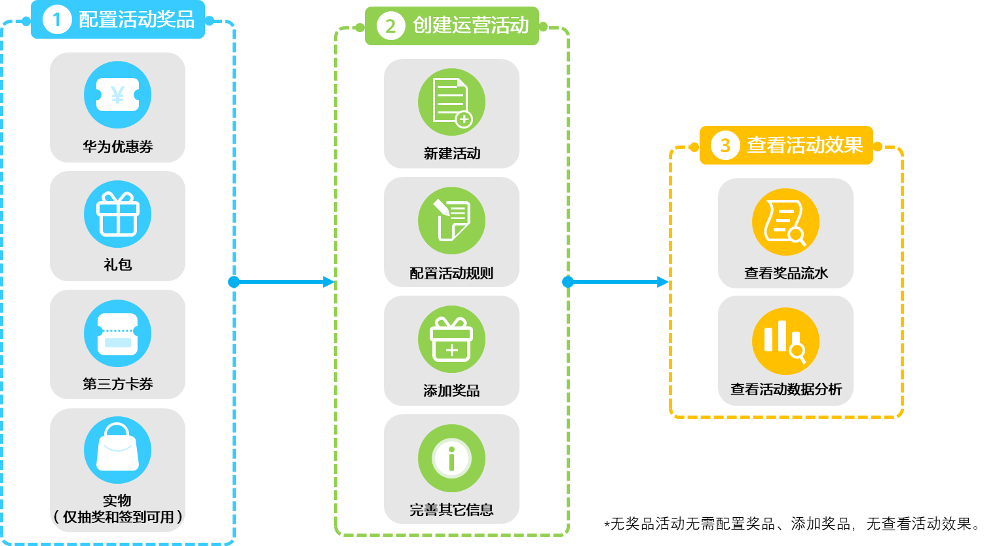
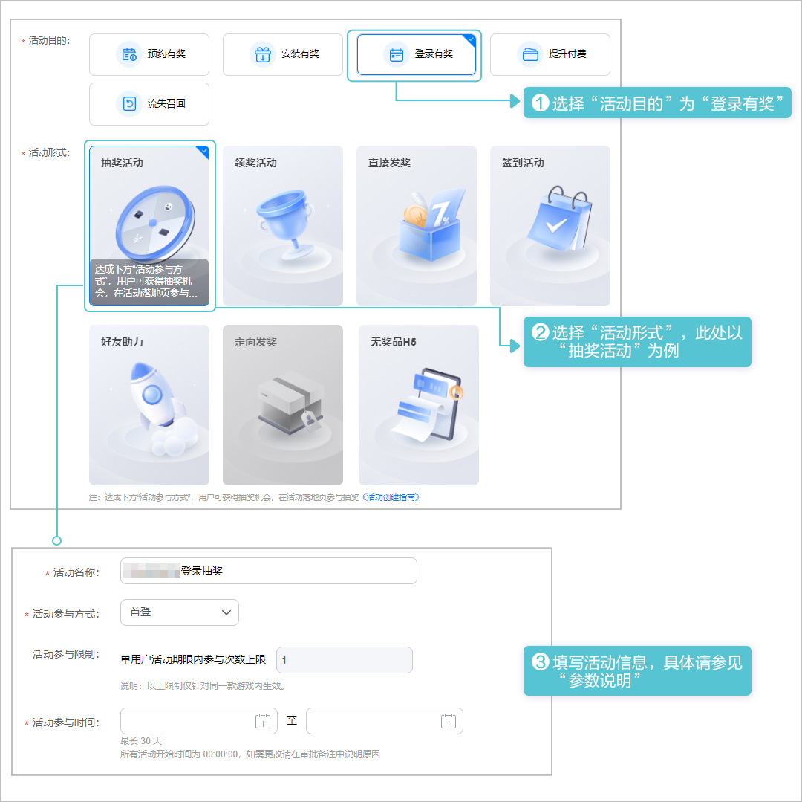
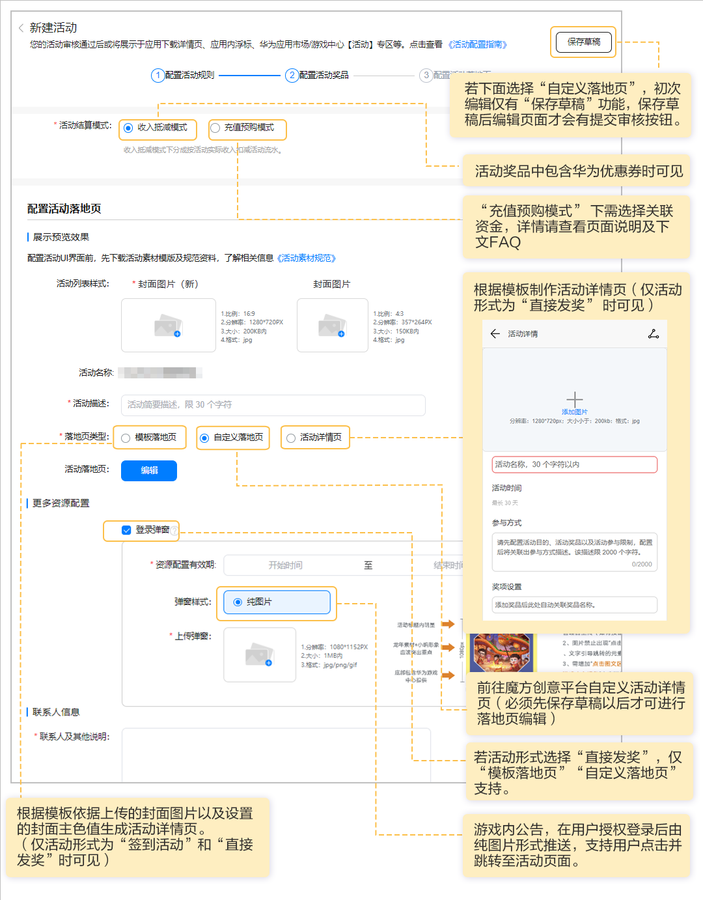
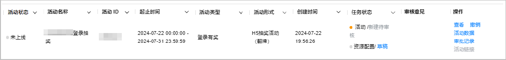

# 登录有奖

为了提升用户新增注册量和活跃度，您可以创建登录有奖活动。在活动期间，首次使用华为账号登录应用的新用户或者使用同一华为账号连续登录指定天数的用户有机会获得奖励。

已实名认证的企业开发者才能创建活动。

## 展示效果

登录有奖活动落地页展示效果如下。

## 接入流程

## 活动准备

* 已成功[创建应用](https://developer.huawei.com/consumer/cn/doc/distribution/app/agc-help-createapp-0000001146718717)，且软件包类型为“APK(Android应用)”或者“RPK(快应用)”，支持设备为“手机”。
* 含奖品的活动需提前准备奖品素材，详情请参见[奖品素材](/docs/distribute/app-dist/game-center/game-center-operation-0000001239502315/agc-help-activity-operation-0000001194302394/game-center-setup-activities-all-0000001657534737/game-center-setup-activities-param-0000001608575030#section953762813448)。
* 提前准备活动落地页素材。

  | 准备项 | | 说明 |
  | --- | --- | --- |
  | 活动封面图片 | | 要求宽高分辨率为1280px\*720px，且大小不超过200KB的JPG格式图片。  说明：  + 设计图无需Logo和文字，尽量突出活动主题和元素，更详细要求可参照[活动素材规范](https://alliance-communityfile-drcn.dbankcdn.com/FileServer/getFile/cmtyPub/011/111/111/0000000000011111111.20251015105451.95383088925136093128298412530955%3A50001231000000%3A2800%3A9BAA15635789AFBEE459943C3CCCFA8D28E28970C0443CD21F025A50CC90D0B7.zip?needInitFileName=true)。 + 活动形式为“直接发奖”且落地页选择“活动详情页”时还需要准备一份同一设计图，尺寸为357px\*264px，大小不超过150KB的JPG格式图片。 |

## 配置活动奖品

若创建无奖品活动可跳过该步骤。

通过各类运营活动，为用户提供活动奖励，以不同活动形式向用户发放奖品，需先配置可添加至运营活动的活动奖品，配置活动奖品操作步骤如下。文中具体参数说明请参见[参数说明](/docs/distribute/app-dist/game-center/game-center-operation-0000001239502315/agc-help-activity-operation-0000001194302394/game-center-setup-activities-all-0000001657534737/game-center-setup-activities-param-0000001608575030)。

1. 登录[AppGallery Connect](https://developer.huawei.com/consumer/cn/service/josp/agc/index.html)，点击“APP与元服务”，在应用列表中选择需要新增奖品的应用。
2. 新增奖品。

   

3. 填写奖品信息，完成后点击右上角“提交”提交审核。

   

## 创建活动

配置活动奖品并提交审核后，您可按如下步骤创建登录有奖活动。文中具体参数说明请参见[参数说明](/docs/distribute/app-dist/game-center/game-center-operation-0000001239502315/agc-help-activity-operation-0000001194302394/game-center-setup-activities-all-0000001657534737/game-center-setup-activities-param-0000001608575030)。

1. 登录[AppGallery Connect](https://developer.huawei.com/consumer/cn/service/josp/agc/index.html)，点击“APP与元服务”，在应用列表中选择应用。
2. 新建活动。

   
3. 配置活动规则。

   
4. 下滑页面至“活动奖品配置”区域配置活动奖品（若“活动形式”选择“无奖品H5”无需配置，不展示该内容）。

   
5. 配置活动落地页及其它信息。

   
6. 审核与上架。

   点击页面右上角“提交审核”提交审核后，华为工作人员审核活动申请预计需要1~3个工作日，请耐心等待。审核结果可在状态栏查看。

   

   

   若想修改审核中的活动，请先撤销运营活动的申请，重新编辑活动后再提交审核。