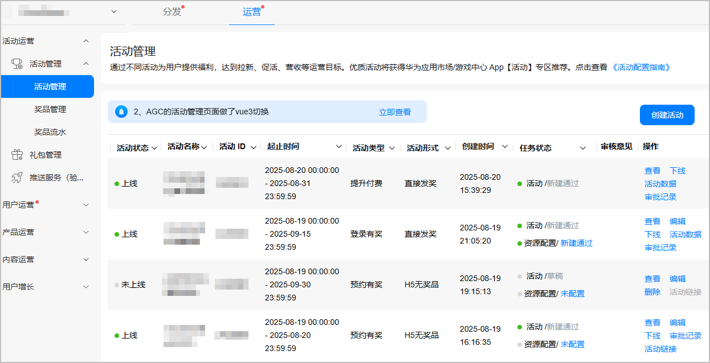
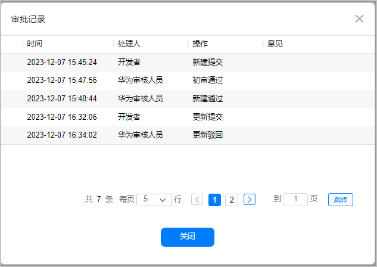
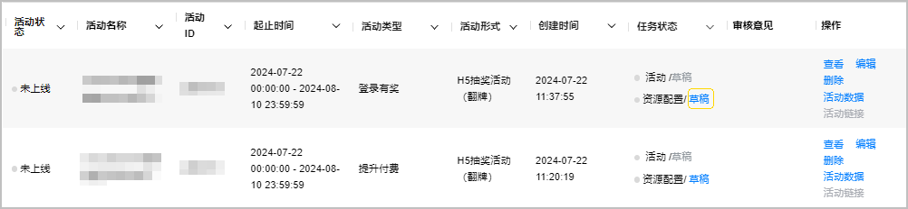
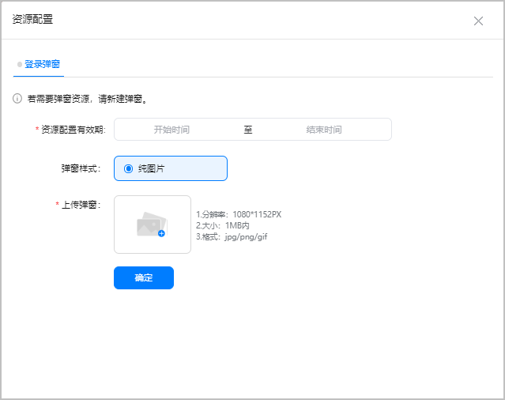

# 管理已创建活动

创建活动后，可对已创建的活动进行查看、编辑等操作。

## 查看活动列表

1. 登录[AppGallery Connect](`https://developer.huawei.com/consumer/cn/service/josp/agc/index.html`)，点击“APP与元服务”，在应用列表中选择应用。
2. 选择“运营 &gt; 活动管理”，查看活动列表。

   

## 管理活动

活动列表“操作”列提供查看、编辑、删除、下线等操作，“任务状态”列可查看活动和弹窗资源配置任务状态。

* 活动数据

  进入“优惠券活动”页面，查看添加“华为优惠券”奖品的活动数据，详见[查看活动数据分析](`/docs/distribute/app-dist/game-center/game-center-operation-0000001239502315/agc-help-activity-operation-0000001194302394/game-center-setup-activities-all-0000001657534737/game-center-setup-activities-results-0000001657854465#section9589153010419`)。
* 审批记录

  查看活动审批记录。

  
* 活动链接

  已上线的活动可以点击“活动链接”按钮一键复制该活动落地页链接。
* 编辑弹窗活动资源

  活动列表“任务状态”列展示弹窗资源配置状态，可直接点击状态链接进行配置操作。

  

  在如下图弹框中配置“登录弹窗”的内容，不同状态支持操作以具体页面为准。

  