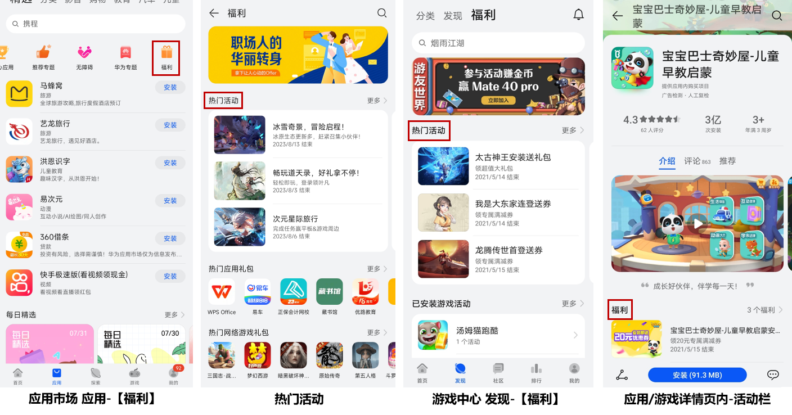
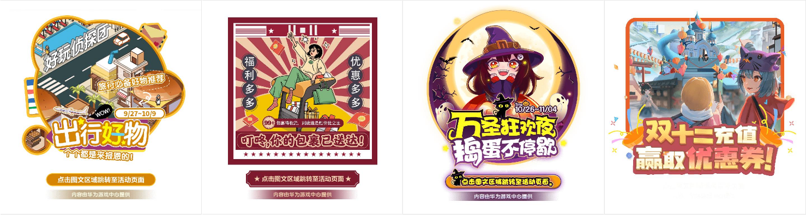

# 概述

华为应用市场面向所有实名认证的联运应用及游戏开发者开放运营活动管理功能，您可自助创建运营活动，通过审核后即可在华为应用市场、游戏中心正式上线，实现拉新、促活、创收等经营目标。

## 投放展示

运营活动将根据福利力度及目的配置不同资源位，例：华为应用市场客户端应用页的【福利】专区、游戏中心【福利】专区、应用详情页、应用内浮标等，参考效果如下。

部分活动类型支持游戏内弹窗。

## 活动目的

您可以基于不同的目的创建相应活动，活动管理当前提供以下5种活动目的场景供您选择。

| 活动目的场景 | 活动目的简介 | 操作指南 |
| --- | --- | --- |
| 预约有奖 | 创建活动提升预约量 | [预约有奖活动指导](`https://developer.huawei.com/consumer/cn/doc/app/game-center-setup-activities-reservation-0000001657694701`) |
| 安装有奖 | 创建活动提升安装量 | [安装有奖活动指导](`https://developer.huawei.com/consumer/cn/doc/app/game-center-setup-activities-install-0000001657934421`) |
| 登录有奖 | 创建活动增加用户登录 | [登录有奖活动指导](`https://developer.huawei.com/consumer/cn/doc/app/game-center-setup-activities-login-0000001608734802`) |
| 提升付费 | 创建活动提升用户充值付费 | [提升付费活动指导](`https://developer.huawei.com/consumer/cn/doc/app/game-center-setup-activities-increase-payment-0000001683109285`) |
| 流失召回 | 创建活动召回流失用户 | [流失召回活动指导](`https://developer.huawei.com/consumer/cn/doc/app/game-center-setup-activities-loss-recall-0000001634589718`) |

## 活动形式

基于不同的活动目的，您可以选择不同的活动形式。目前支持以下几种不同的活动形式，您可按需选择。

* <strong>抽奖活动</strong>：用户达成特定操作，可获得抽奖机会，在活动落地页参与抽奖。
* <strong>领奖活动</strong>：用户达成特定操作，可在活动落地页领取奖品。
* <strong>直接发奖</strong>：用户达成特定操作，奖品直接发放到账。
* <strong>签到活动</strong>：活动期间，用户签到指定天数，奖品直接发放到账。
* <strong>好友助力</strong>：活动期间，用户邀请指定数量的好友助力，奖品直接发放到账。
* <strong>定向发奖</strong>：圈选用户，对应用户可直接获得奖品，并收到奖品到账通知。
* <strong>无奖品H5</strong>：无需提供奖品，制作H5页面可用于宣传游戏内版本更新或游戏内活动。