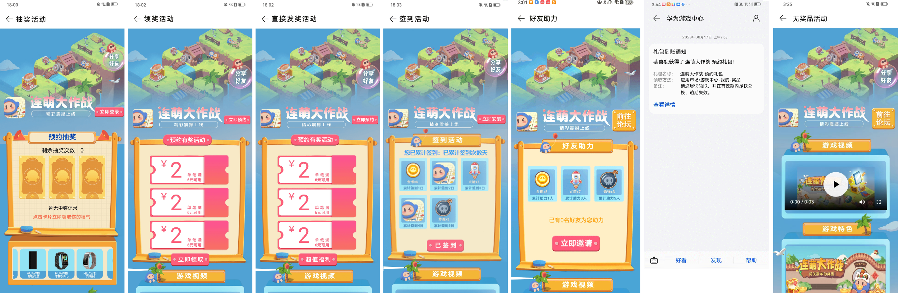
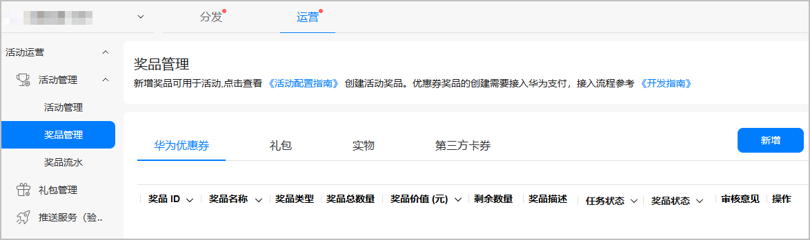
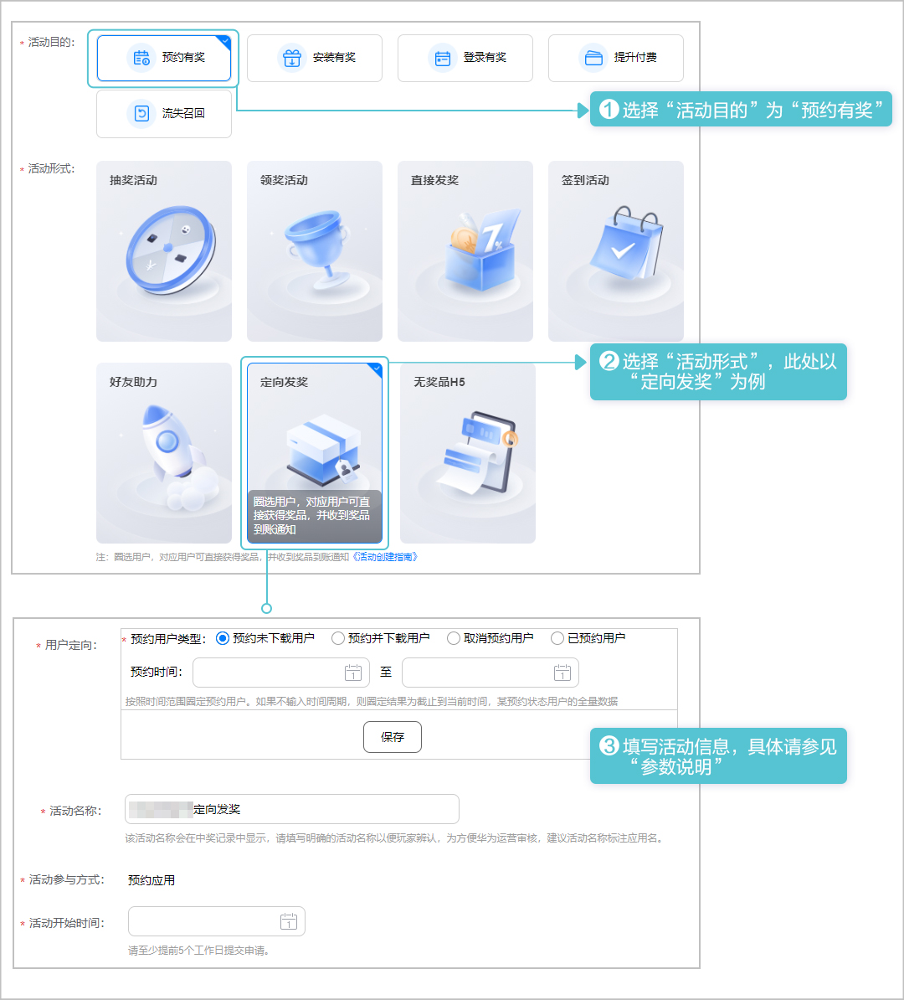
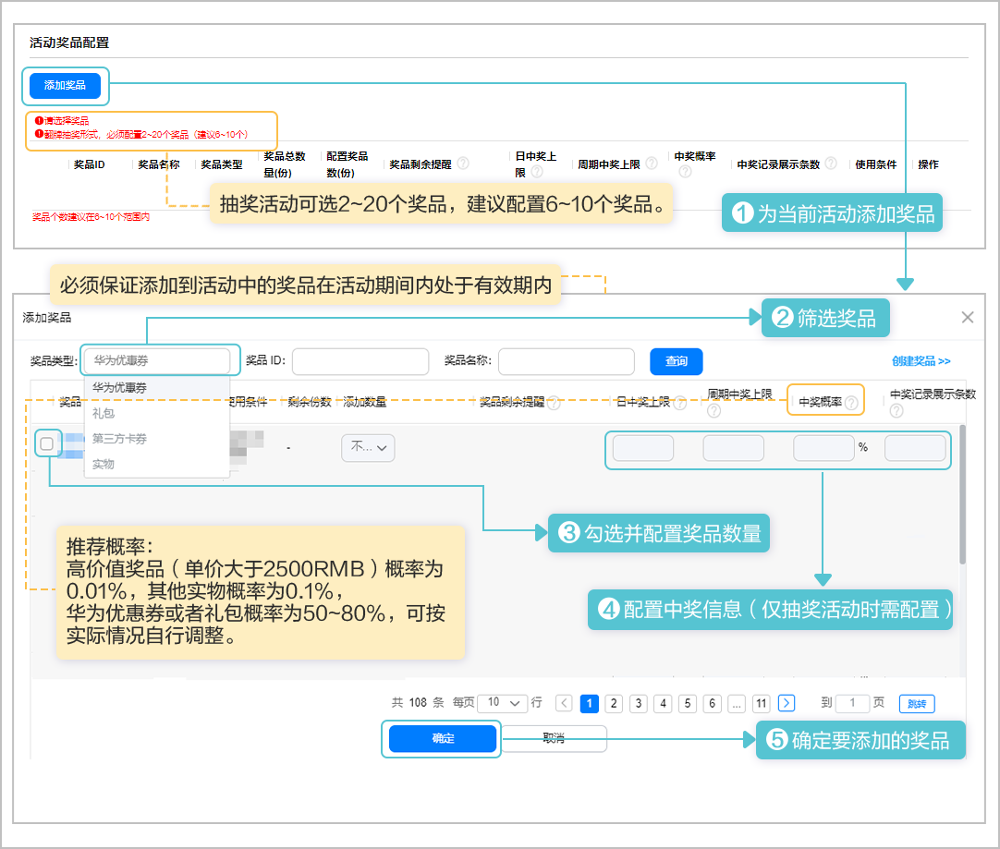
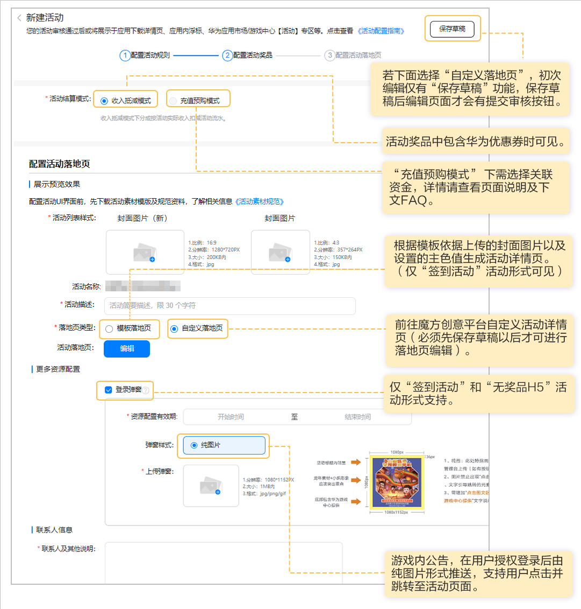
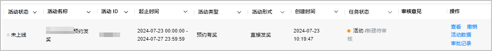

# 预约有奖

为了提升用户预约量，您可以创建预约有奖活动。在活动期间，首次预约游戏的用户有机会获得奖励。

已实名认证的企业开发者才能创建活动。

## 展示效果

预约有奖活动落地页展示效果如下。

## 接入流程

## 活动准备

* 已成功[创建应用](https://developer.huawei.com/consumer/cn/doc/distribution/app/agc-help-createapp-0000001146718717)，且软件包类型为“APK(Android应用)”，支持设备为“手机”。
* 含奖品的活动需提前准备奖品素材，详情请参见[奖品素材](/docs/distribute/app-dist/game-center/game-center-operation-0000001239502315/agc-help-activity-operation-0000001194302394/game-center-setup-activities-all-0000001657534737/game-center-setup-activities-param-0000001608575030#section953762813448)。
* 提前准备活动落地页素材。

  | 准备项 | | 说明 |
  | --- | --- | --- |
  | 活动封面图片 | | 要求宽高分辨率为1280px\*720px，且大小不超过200KB的JPG格式图片。  说明：  设计图无需Logo和文字，尽量突出活动主题和元素，更详细要求可参照[活动素材规范](https://alliance-communityfile-drcn.dbankcdn.com/FileServer/getFile/cmtyPub/011/111/111/0000000000011111111.20251015105447.95859162191972655453945908939893%3A50001231000000%3A2800%3A5F29CCDEAE57A7CC8E60CA2E70F8EED5892757CDBC4B7604A424BA8DFDB6D989.zip?needInitFileName=true)。 |

## 配置活动奖品

若创建无奖品活动可跳过该步骤。

通过各类运营活动，为用户提供活动奖励，以不同活动形式向用户发放奖品，需先配置可添加至运营活动的活动奖品，配置活动奖品操作步骤如下。文中具体参数说明请参见[参数说明](/docs/distribute/app-dist/game-center/game-center-operation-0000001239502315/agc-help-activity-operation-0000001194302394/game-center-setup-activities-all-0000001657534737/game-center-setup-activities-param-0000001608575030)。

1. 登录[AppGallery Connect](https://developer.huawei.com/consumer/cn/service/josp/agc/index.html)，点击“APP与元服务”，在应用列表中选择需要新增奖品的应用。
2. 新增奖品。

   

3. 填写奖品信息，完成后点击右上角“提交”提交审核。

   

## 创建活动

配置活动奖品并提交审核后，您可按如下步骤创建预约有奖活动。文中具体参数说明请参见[参数说明](/docs/distribute/app-dist/game-center/game-center-operation-0000001239502315/agc-help-activity-operation-0000001194302394/game-center-setup-activities-all-0000001657534737/game-center-setup-activities-param-0000001608575030)。

1. 登录[AppGallery Connect](https://developer.huawei.com/consumer/cn/service/josp/agc/index.html)，点击“APP与元服务”，在应用列表中选择应用。
2. 新建活动。

   
3. 配置活动规则。

   
4. 下滑页面至“活动奖品配置”区域配置活动奖品（若“活动形式”选择“无奖品H5”无需配置，不展示该内容）。

   
5. 配置活动落地页及其它信息（若“活动形式”选择“定向发奖”时无需配置，不展示该内容）。

   
6. 审核与上架。

   点击页面右上角“提交审核”提交审核后，华为工作人员审核活动申请预计需要1~3个工作日，请耐心等待。审核结果可在状态栏查看。

   

   

   若想修改审核中的活动，请先撤销运营活动的申请，重新编辑活动后再提交审核。