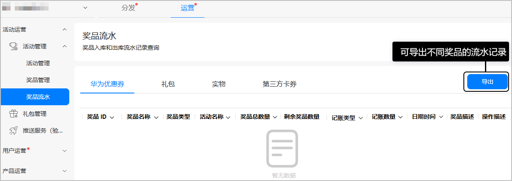
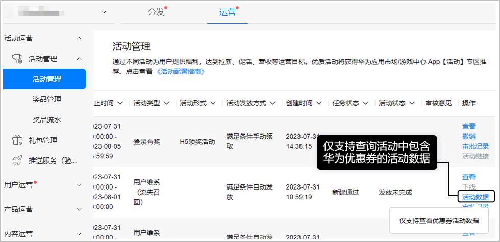
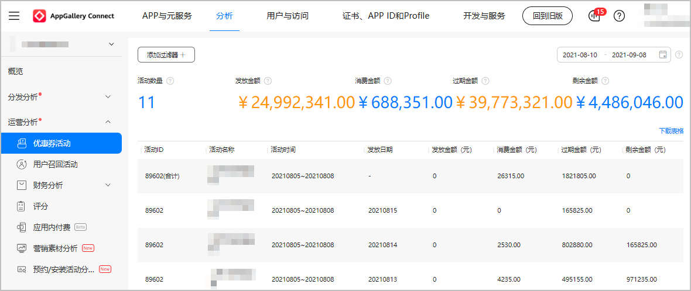

# 查看活动效果

活动结束后，您可以查看奖品流水和活动数据分析。

## 查看奖品流水

当运营活动上线后，您可以实时查看各类奖品的出/入库流水记录。

1. 登录[AppGallery Connect](`https://developer.huawei.com/consumer/cn/service/josp/agc/index.html`)，点击“APP与元服务”，在应用列表中选择应用。
2. 选择“运营 &gt; 活动运营 &gt;活动管理 &gt; 奖品流水”查看或导出不同奖品的流水记录。

   

## 查看活动数据分析

1. 登录[AppGallery Connect](`https://developer.huawei.com/consumer/cn/service/josp/agc/index.html`)，点击“APP与元服务”，在应用列表中点击需要查看活动数据分析的应用。
2. 选择“运营 &gt; 活动管理”，点击操作列的“活动数据”。

   
3. 进入“优惠券活动”页面，查看添加“华为优惠券”奖品的活动数据。

   