# 礼包管理

为了实现应用的精细化运营，华为礼包为用户提供了各类礼包权益，例如优惠券、VIP特权、打折券等，可为您的应用争取一定的下载量、曝光量。

## 展示专区

华为礼包将在不同的专区进行展示，例如礼包专区、应用详情页等。具体的展示专区以最终上线为准。

### 应用市场/游戏中心客户端

APK应用/游戏的礼包将分别投放至“应用市场”与“游戏中心”客户端。

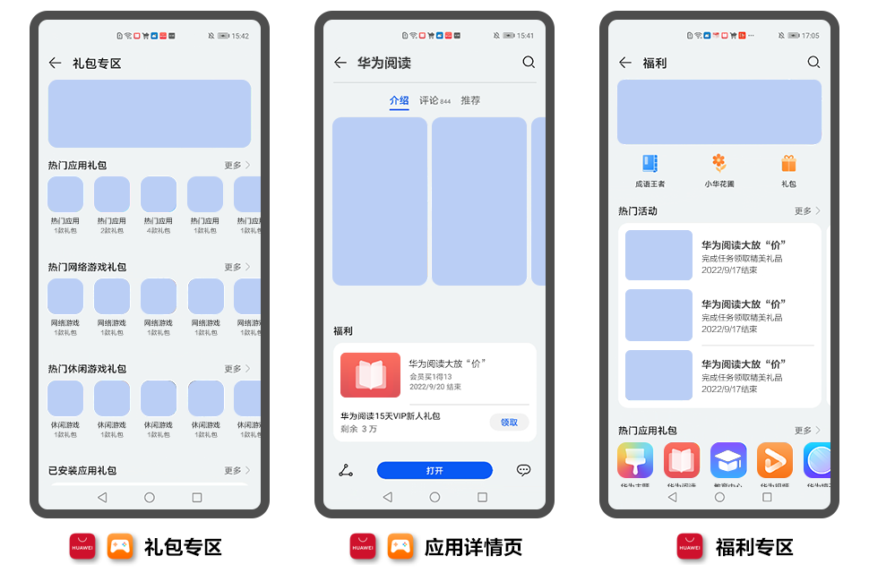

### 花瓣轻游客户端

RPK游戏（免安装应用）的礼包将投放至“花瓣轻游”客户端“游戏礼包”专区。

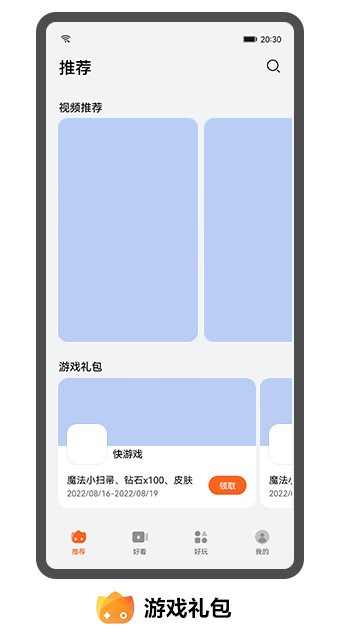

## 前提条件

* 仅面向已实名认证的联运应用及游戏开发者，且您的手机应用已上架。
* （可选）您可以[开通游戏版块](`https://developer.huawei.com/consumer/cn/doc/app/game-center-community-operation-0000001194305462`)，宣传游戏内容，聚集核心用户。

## 选择礼包类型

不同的礼包类型会有不同的派发形式、领取方式，您可以根据实际情况进行选择。

### 有码礼包

有码礼包支持APK应用/游戏，是以兑换码的形式向用户派发奖品，用户领取兑换码后，根据使用说明可在应用内兑换对应的礼包。

### 无码礼包

无码礼包支持APK应用/游戏、RPK游戏（免安装应用），用户成功领取礼包后，可根据使用说明在应用内领取对应的礼包。其中RPK游戏（免安装应用） 可参见[快游戏配置礼包](`https://developer.huawei.com/consumer/cn/doc/development/quickApp-Guides/quickgame-develop-gifts-0000001470302205`)。

### 直达礼包

* 礼包优势：提供了方便、快捷的领取方式，大大降低了礼包被刷领的风险。
* 创建前提：创建前需和华为工作人员对接服务器并通过相关测试，对接文件可参考[《直达礼包开发指南》](`https://developer.huawei.com/consumer/cn/doc/development/AppGallery-connect-Guides/agc-giftpackage-introduction`)。若未通过服务器对接测试，您创建的直达礼包将无法通过审核。

  

  请联系华为工作人员，游戏企业QQ：2851508950。
* 领取方式：玩家在游戏中心成功领取礼包后，可在游戏内指定的区服/角色直接领取礼包。
* 应用类型：仅支持RPK游戏。

## 准备礼包素材

选择礼包类型后，请准备对应的礼包素材。

### 有码礼包

若您选择“有码礼包”类型，您需要提前准备如下素材内容。

| 准备项 | 要求 |
| --- | --- |
| 礼包用途 | 您可以根据实际情况进行选择。   * 普通礼包：普通礼包为日常发布的礼包，APK应用/游戏均可申请，用户安装应用后即可根据使用方法进行领取。 * 论坛贡献值排名礼包：仅针对APK游戏，玩家在游戏论坛内的贡献值满足排名要求即可领取，请确认已开通对应的游戏社区论坛。 * 关注论坛礼包：仅针对APK游戏，玩家关注您的游戏论坛即可领取，请确认已开通对应的游戏社区论坛。 |
| 礼包串码文件 | 用户领取后可兑换奖品。文件的格式与要求如下：   * 文件中每行串码只能由大小写英文字母、数字、英文下划线和英文分隔符组成。 * 文件中每行仅排列1条串码，请勿添加其它注释文字。 * 文件中不能存在重复码的串码。 * 文件类型必须为ANSI编码的txt格式。 * 文件大小不能超过100M。 * 应用分类的礼包不少于3000份，游戏分类的礼包不少于500份，礼包种类要求不少于其他平台。 |
| 跳转地址（可选） | 用户在礼包详情页成功领取礼包后，点击“打开”或“复制兑换”后跳转的页面。您可配置指定网页URI或者应用内deeplink链接。 |
| 礼包名称 | * 建议格式“应用/游戏名称 礼包名”，例如“异界逃脱 新手礼包”。 * 礼包名称不超过20个字符，否则客户端展示不全。 * 禁止包含敏感/消极关键词，例如“\*\*\* 进群礼包”。 * 非活动礼包不可包含条件关键词，例如“\*\*\* 充值礼包”。 |
| 礼包图片（可选） | 礼包展示的缩略图。宽高216\*216px，大小不超过512KB的PNG图标。若未上传礼包图片将使用您的应用图标。 |
| 礼包内容 | 简要的奖品描述，不超过2000个字符。   * 应用分类建议格式为“应用名称+奖品名称”，例如“华为音乐30天VIP会员”，一行仅显示一个礼包奖品。 * 游戏分类建议格式为“奖品名称\*对应数量”，用“、”分隔，例如“金币\*4000、专属皮肤\*2”。 |
| 礼包领取/使用方法 | 礼包在应用内的领取步骤或使用说明，需与实际情况相符，且尽量清晰明了，不超过2000个字符。示例如下：   * 领取方法：   1. 下载并安装“华为音乐”应用。   2. 选择“我的&gt;华为音乐会员&gt;会员礼品”，输入兑换码兑换。   3. 成功兑换后，将自动返回“我的”界面，华为音乐会员日期已增加， 即已成功领取。 * 使用说明：   + 每个订单仅限使用一张优惠券，不可与其他优惠同时使用。   + 优惠券仅可在有效期内使用，逾期作废。 |

### 无码礼包

若您的APK应用/游戏选择“无码礼包”类型，您需要提前准备如下素材内容。

| 准备项 | 要求 |
| --- | --- |
| 跳转地址（可选） | 用户在礼包详情页成功领取礼包后，点击“打开”或“复制兑换”后跳转的页面。您可配置指定网页URI或者应用内deeplink链接。 |
| 礼包名称 | * 建议格式“应用/游戏名称 礼包名”，例如“异界逃脱 新手礼包”。 * 礼包名称不超过20个字符，否则客户端展示不全。 * 禁止包含敏感/消极关键词，例如“\*\*\* 进群礼包”。 * 非活动礼包不可包含条件关键词，例如“\*\*\* 充值礼包”。 |
| 礼包图片（可选） | 礼包展示的缩略图。宽高216\*216px，大小不超过512KB的PNG图标。若未上传礼包图片将使用您的应用图标。 |
| 礼包内容 | 简要的奖品描述，不超过2000个字符。   * 应用分类建议格式为“应用名称+奖品名称”，例如“华为音乐30天VIP会员”，一行仅显示一个礼包奖品。 * 游戏分类建议格式为“奖品名称\*对应数量”，用“、”分隔，例如“金币\*4000、专属皮肤\*2”。 |
| 礼包领取/使用方法 | 礼包在应用内的领取步骤或使用说明，需与实际情况相符，且尽量清晰明了，不超过2000个字符。示例如下：   * 领取方法：   1. 下载并安装“华为音乐”应用。   2. 选择“我的&gt;华为音乐会员&gt;会员礼品”，输入兑换码兑换。   3. 成功兑换后，将自动返回“我的”界面，华为音乐会员日期已增加， 即已成功领取。 * 使用说明：   + 每个订单仅限使用一张优惠券，不可与其他优惠同时使用。   + 优惠券仅可在有效期内使用，逾期作废。 |

### 直达礼包

若您选择“直达礼包”类型，您需要提前准备如下素材内容。

| 准备项 | 要求 |
| --- | --- |
| 礼包编码 | 应用内礼包的唯一标注ID，非[有码礼包](#section73942043161318)的串码。 |
| 礼包名称 | * 建议格式“游戏名称 礼包名”，例如“异界逃脱 新手礼包”。 * 礼包名称不超过20个字符，否则客户端展示不全。 * 禁止包含敏感/消极关键词，例如“\*\*\* 进群礼包”。 * 非活动礼包不可包含条件关键词，例如“\*\*\* 充值礼包”。 |
| 礼包图片（可选） | 礼包展示的缩略图。宽高216\*216px，大小不超过512KB的PNG图标。若未上传礼包图片将使用您的应用图标。 |
| 礼包内容 | 简要的奖品描述，不超过2000个字符。建议格式为“奖品名称\*对应数量”，用“、”分隔，例如“金币\*4000、专属皮肤\*2”。 |
| 礼包领取/使用方法 | 礼包在应用内的领取步骤或使用说明，需与实际情况相符，且尽量清晰明了，不超过2000个字符。 |

## 提交礼包申请

1. 登录[AppGallery Connect](`https://developer.huawei.com/consumer/cn/service/josp/agc/index.html`)，点击“APP与元服务”，在应用列表页面选择需要新增礼包的应用。
2. 选择“运营 &gt; 活动运营 &gt; 礼包管理”，在“礼包管理”页面右侧点击“新增礼包”。

   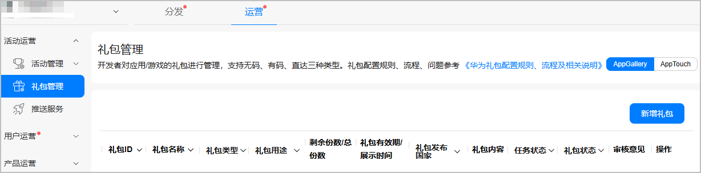
3. 在弹出的“新增礼包”窗口选择[有码礼包](#section148673491966)、或[无码礼包](#section4354957868)、或[直达礼包](#section85547179107)后，点击“确定”。

   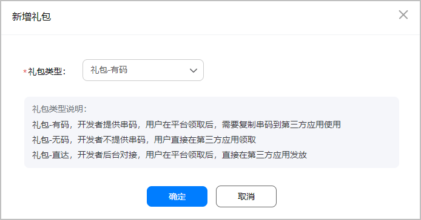

   

   RPK游戏（免安装应用） 创建无码礼包可参见[快游戏配置礼包](`https://developer.huawei.com/consumer/cn/doc/development/quickApp-Guides/quickgame-develop-gifts-0000001470302205`)。

### 提交有码礼包

在“新增礼包”页面填写有码礼包信息，完成后点击“提交审核”。

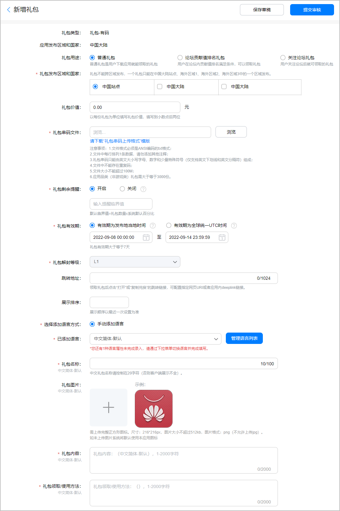

| 配置项 | 说明 |
| --- | --- |
| 礼包用途 | 选择礼包的用途。 |
| 礼包发布区域和国家 | 勾选礼包发布的区域：   * 只能在当前应用发布的其中一个站点中选择区域和国家。 * 国内礼包统一勾选“中国大陆”。 |
| 礼包价值（可选） | 单份礼包的现金价值，保留小数点后两位。 |
| 礼包串码文件 | 上传提前准备的串码文件。 |
| 礼包剩余提醒 | 是否开启礼包剩余提醒：   * 开启：当礼包剩余数量到达或低于您填写的数量时，系统将自动发送通知。每天发送1次提醒，同一礼包最多连续发送3次。 * 关闭：关闭通知功能。 |
| 礼包有效期 | 用户领取礼包的时间段，请统一勾选“有效期为发布地当地时间”。   * 应用分类不少于15天；游戏分类不少于7天。 * 首发礼包通常为3~6个月；节日礼包为保证时效性，建议不超过1个月。 |
| 礼包解封等级 | 用户可以领取礼包需要达到的应用等级：   * 应用分类默认为L1，不可更改。 * 游戏分类可根据实际情况设置解封等级。 |
| 跳转地址（可选） | 填写提前准备的网页URI或者应用内deeplink链接。 |
| 展示排序（可选） | 礼包在应用详情页的展示位排序，“1”表示展示在应用详情页的第一位，以此类推。 |
| 已添加语言 | * 若礼包发布在“中国大陆”时，默认为“简体中文”。 * 若礼包发布在非中国大陆时，默认为“美式英语”。 |
| 礼包名称 | 填写提前准备的礼包名称。 |
| 礼包图片（可选） | 上传提前准备的礼包图片。 |
| 礼包内容 | 填写提前准备的礼包内容。 |
| 礼包领取/使用方法 | 填写提前准备的礼包领取/使用方法。 |

### 提交无码礼包

在“新增礼包”页面填写APK应用/游戏的无码礼包，完成后点击“提交审核”。

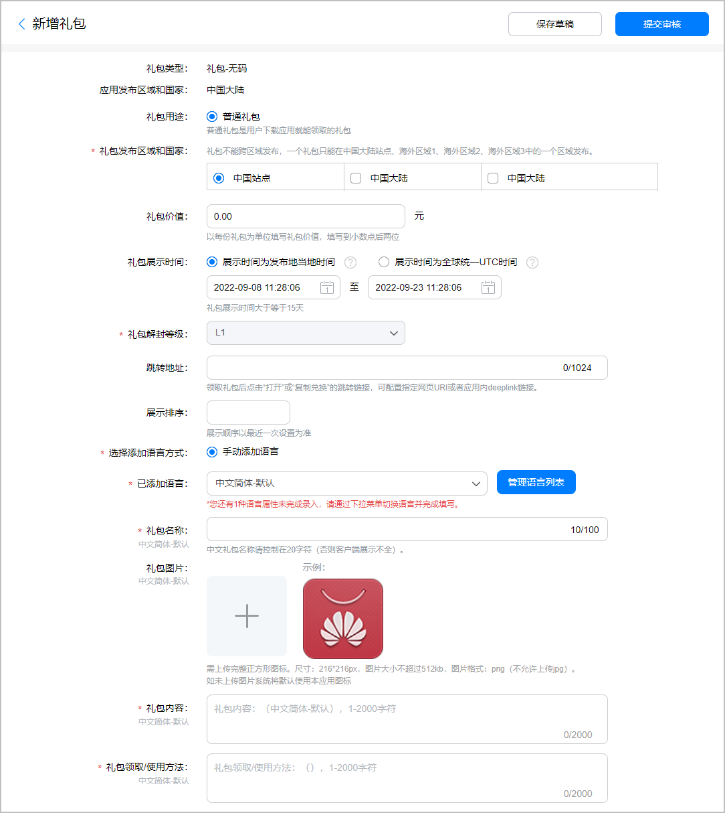

| 配置项 | 说明 |
| --- | --- |
| 礼包发布区域和国家 | 勾选礼包发布的区域：   * 只能在当前应用发布的其中一个站点中选择区域和国家。 * 国内礼包统一勾选“中国大陆”。 |
| 礼包价值（可选） | 单份礼包的现金价值，保留小数点后两位。 |
| 礼包展示时间 | 用户领取礼包的时间段，请统一勾选“有效期为发布地当地时间”。   * 应用分类不少于15天；游戏分类不少于7天。 * 首发礼包通常为3~6个月；节日礼包为保证时效性，建议不超过1个月。 |
| 礼包解封等级 | 用户可以领取礼包需要达到的应用等级：   * 应用分类默认为L1，不可更改。 * 游戏分类可根据实际情况设置解封等级。 |
| 跳转地址（可选） | 填写提前准备的网页URI或应用内deeplink链接。 |
| 展示排序（可选） | 礼包在应用详情页的展示位排序，“1”表示展示在应用详情页的第一位，以此类推。 |
| 已添加语言 | * 若礼包发布在“中国大陆”时，默认为“简体中文”。 * 若礼包发布在非中国大陆时，默认为“美式英语”。 |
| 礼包名称 | 填写提前准备的礼包名称。 |
| 礼包图片 | 上传提前准备的礼包图片。 |
| 礼包内容 | 填写提前准备的礼包内容。 |
| 礼包领取/使用方法 | 填写提前准备的礼包领取/使用方法。 |

### 提交直达礼包

在“新增礼包”页面根据提示填写直达礼包信息，完成后先点击“定向测试”，通过测试后再点击“提交审核”。若未通过定向测试，您的直达礼包申请不会通过审批。

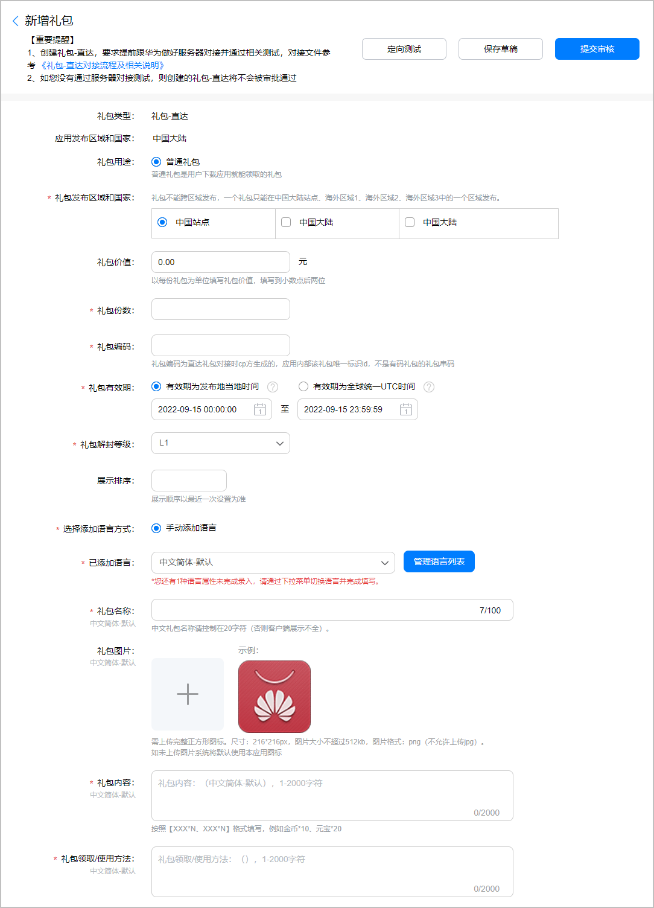

| 配置项 | 说明 |
| --- | --- |
| 礼包发布区域和国家 | 勾选礼包发布的区域：  * 只能在当前应用发布的其中一个站点中选择区域和国家。 * 国内礼包统一勾选“中国大陆”。 |
| 礼包价值（可选） | 单份礼包的现金价值，保留小数点后两位。 |
| 礼包份数 | 请填写直达礼包的发放数量。 |
| 礼包编码 | 请填写提前准备的礼包编码。 |
| 礼包有效期 | 用户领取礼包的时间段。请统一勾选“有效期为发布地当地时间”，建议不少于7天。   * 首发礼包通常为3~6个月。 * 节日礼包为保证时效性，建议不超过1个月。 |
| 礼包解封等级 | 用户可以领取礼包需要达到的应用等级。游戏类应用可根据实际情况设置解封等级。 |
| 展示排序（可选） | 礼包在应用详情页的展示位排序，“1”表示展示在应用详情页的第一位，以此类推。 |
| 已添加语言 | * 若礼包发布在“中国大陆”时，默认为“简体中文”。 * 若礼包发布在非中国大陆时，默认为“美式英语”。 |
| 礼包名称 | 填写提前准备的礼包名称。 |
| 礼包图片（可选） | 上传提前准备的礼包图片。 |
| 礼包内容 | 填写提前准备的礼包内容。 |
| 礼包领取/使用方法 | 填写提前准备的礼包领取/使用方法。 |

### 审核与上线

华为工作人员审核应用分类的礼包需要1个工作日，审核游戏分类需要1~3个工作日，请耐心等待，审核结果可在“审核意见”栏查看。提交礼包申请后，礼包的初始状态为“未上线”。审核通过且到达生效日期后，礼包的状态变更为“上线”。

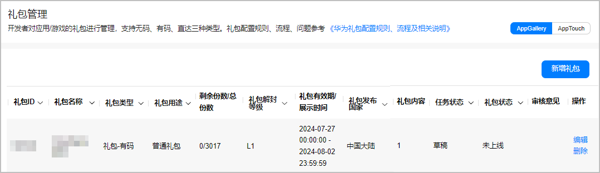

## 管理礼包

### 编辑礼包

您可以重新编辑礼包的相关信息，并填写“修改备注”，完成后点击“提交审核”。

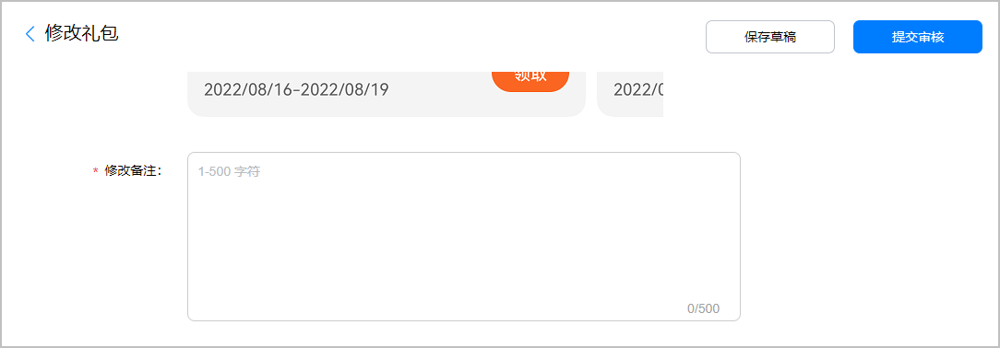

### 下线礼包

处于“上线”状态的礼包支持下线操作，在华为工作人员审核通过后，礼包状态变更为“已下线”状态。

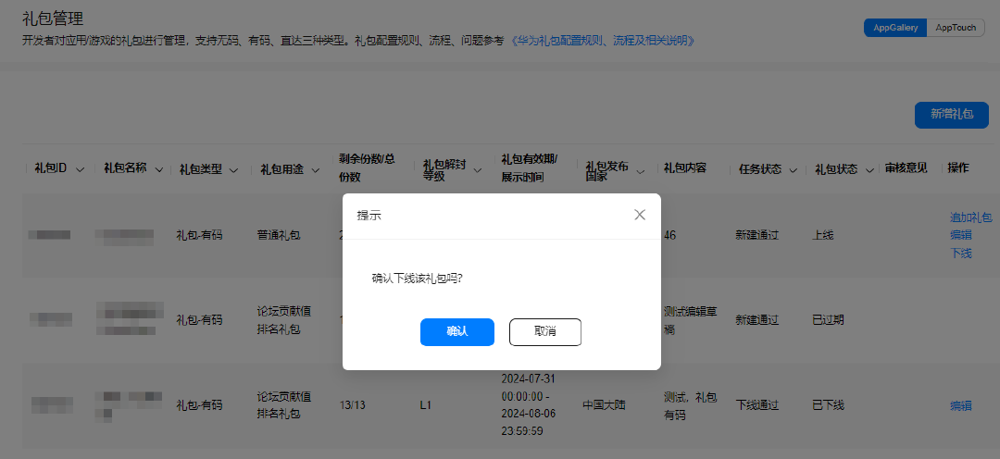

### 追加礼包

有码礼包或直达礼包上线后，您可以以不同的方式继续追加礼包数量。

1. 点击礼包“操作”列的“追加礼包”。

   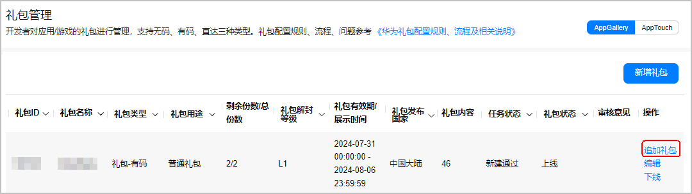
2. 不同类型的礼包追加方式不同。
   * 有码礼包在弹出的窗口点击“浏览”，上传新的串码文件后点击“确定”。

     

     请严格按照[格式与要求](#ZH-CN_TOPIC_0000001239505383__p1257213491308)生成串码文件。

     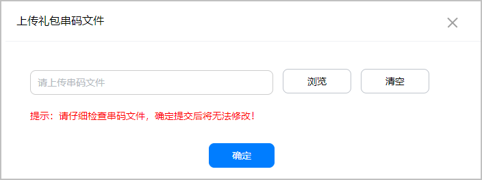
   * 直达礼包在弹出的“追加礼包”窗口直接填写追加数量后，点击“确定”。

     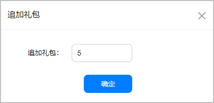
3. 成功上传后会有弹窗提示您实际追加的礼包数量。请耐心等待华为工作人员的审核。

   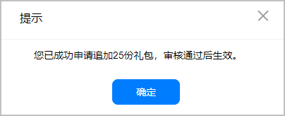

## FAQ

### 有码礼包被刷领了如何处理？

有码礼包在上线当日就领取完毕，且兑换数量不足领取数量的20%时，即可判定有码礼包被刷领，若出现此情况，建议：

* 应用品类：
  + 及时分批次[追加礼包](#section1345314418175)，例如10000份串码文件可拆分成5次上传。
  + 若礼包价值过高，可以暂时先下架礼包。
  + 将该批次礼包设置为仅限从应用市场/游戏中心渠道下载应用才可兑换。
* 游戏品类：
  + 及时分批次[追加礼包](#section1345314418175)，例如10000份串码文件可拆分成5次上传。
  + 若礼包价值过高，建议将“礼包解封等级”上调至L3以上。
  + 将该批次礼包设置为仅限从游戏中心渠道下载游戏才可兑换。
  + 若游戏多次遇到礼包被刷领现象，建议您接入[直达礼包](#section18971922152614)。

### 礼包串码文件传错/礼包提前过期怎么办？

请尽快[下线礼包](#section5209533131719)，并联系华为工作人员进行审核。若礼包上线后已有用户领取，请在后续配合华为工作人员对用户进行补偿。

### 用户投诉礼包问题，如何处理？

* 若因用户操作不当、或已兑换过此礼包等用户自身原因，您需要使用官方账号对用户评论或投诉进行回复说明。
* 若因礼包本身问题，请尽快[下线礼包](#section5209533131719)，并对投诉用户进行点对点补偿。若领取礼包人数超过100人，您需要24小时内发布公告，说明礼包问题，并公示补偿方案。