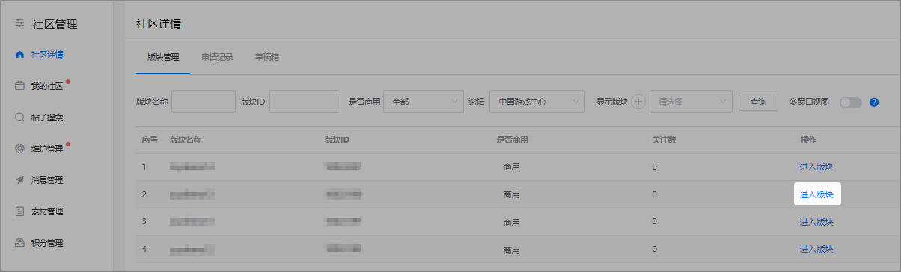
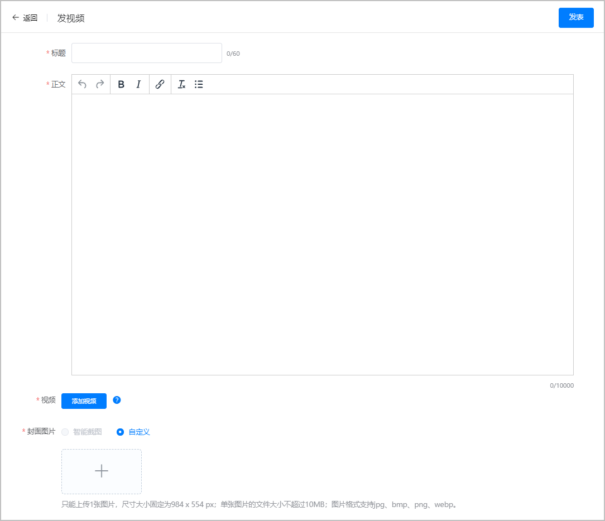
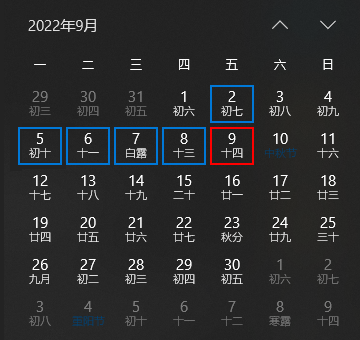

# 《CG鉴赏家》栏目

## 栏目简介

“CG鉴赏家”栏目旨在为用户呈现高品质、有趣、有料的游戏视频，此栏目由论坛视频帖承载，将在华为应用市场和华为游戏中心APP中展示。

## 视频贴创建流程

### 游戏视频贴创建

1. 打开[AppGallery Connect](`https://developer.huawei.com/consumer/cn/service/josp/agc/index.html#/`)-登录账号 - 进入管理中心 - 社区管理板块。
2. 在社区管理详情页输入并点击“进入版块”。

   
3. 点击“发视频”进入创建页面。

   

目前封面图片暂时只支持自定义，请上传984\*554像素的图片。暂不支持大小1G以上的视频。目前视频转码需要15分钟以上，如在工作时间9:30-19:00上传的视频超过3小时仍未显示审核成功，建议重新上传。

### 栏目视频要求

1. 视频贴内容包括但不限于新内容爆料、游戏评测、游戏访谈、微电影等；
2. 视频帖内容不得含有：二维码/公众号/链接/口播等任何形式引导至外部平台的内容。

## 申请流程

### 可申请游戏

在华为应用市场/华为游戏中心正常上架、已创建预约的游戏且有论坛视频帖，均可申请。

### 申请流程

1. 填写申请表

   下载“[华为CG鉴赏家栏目申请+游戏名称.xlsx](`https://alliance-communityfile-drcn.dbankcdn.com/FileServer/getFile/cmtyPub/011/111/111/0000000000011111111.20251217151647.53402672739020663881845210985590%3A50001231000000%3A2800%3AC08F1D434F1CA71BFB817ADA0C4B92DB65E7B1DA14F35810BFD34A01B773C976.xlsx?needInitFileName=true`)”申请表，并仔细填写必填内容。未按照要求填写的申请将不予受理。
2. 视频内容评估

   华为运营人员将会对申请游戏视频内容、论坛维护质量及游戏运营状况进行综合评估。
3. 通知入选

   入选游戏将会在评估结束后，3个工作日内得到答复，未入选游戏不再另行通知。
4. 封面制作

   收到答复的游戏需根据要求进行封面制作，若无法按期（提前1个工作日）按要求完成编辑，将无法上线，故取消资格。
5. 栏目上线

   审核通过的内容不确保按申请时间上线，上线时间将由华为运营人员在申请周期内综合评定。

### 栏目排期

《CG鉴赏家》栏目每周五排期一次。

### 申请受理时间

每周五9:00至下周四18:00可以申请《CG鉴赏家》栏目下周五的排期。例如2022.9.2 9:00（周五）~2022.9.8 18:00（周四）这个时间段内可以申请2022.9.9（周五）的排期资源。

### 申请间隔

单款游戏每个自然周仅限申请一条视频内容，请根据实际情况申请。

### 申请方式

* 网络游戏发送申请表至：gameop@huawei.com
* 休闲游戏发送申请表至：gamebeta@huawei.com

## 注意事项

1. 如游戏入选此栏目，推广期间，要求对评论进行及时维护并与玩家互动，合作伙伴对玩家回复的质量及效率将会影响下次排期申请。
2. 对于【CG鉴赏家】栏目，若存在任何疑问请及时联系商务或对接运营人员咨询。