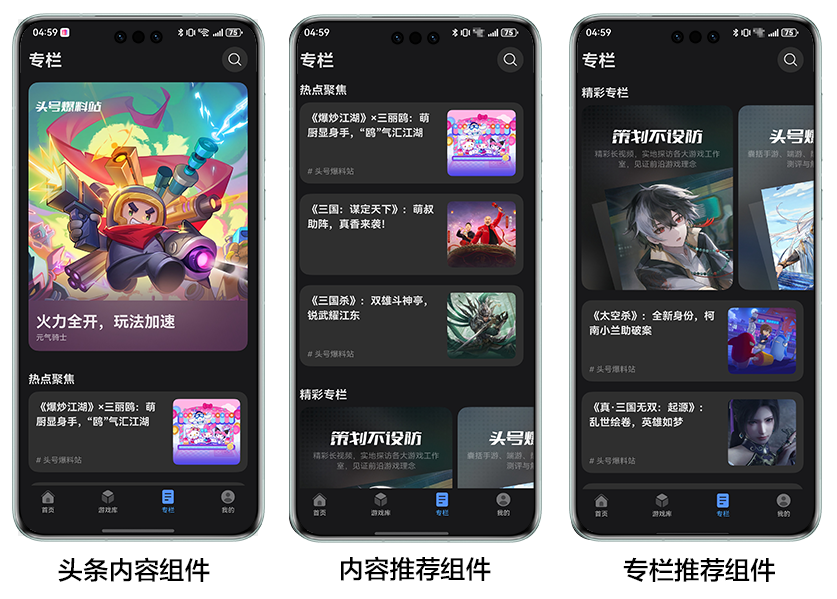
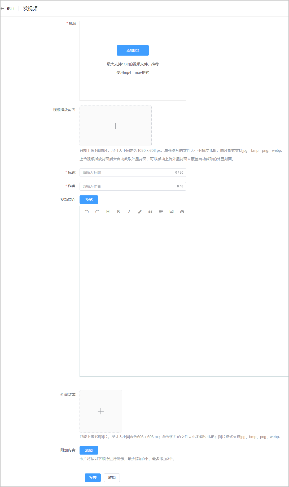
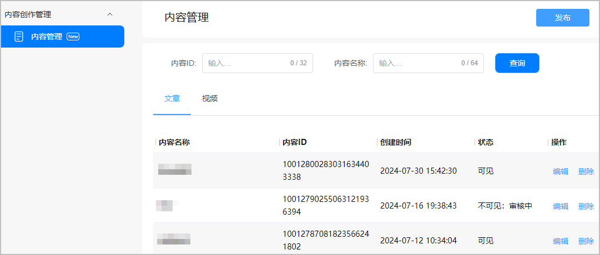

# 内容创作管理

游戏中心精品内容专栏Tab展示优质游戏内容资讯。您可以在AGC控制台创建并管理自己游戏的相关内容，提交上线有机会展示到游戏中心内容专栏不同区位，让更多的玩家注意到您的游戏讯息，提升关注度。

## 展示效果

## 内容管理

您可以在“内容管理”创建并管理自己游戏的内容作品。根据主体部分所属类型，内容可分为【图文内容】与【视频内容】，各自的定义如下：

* 图文内容：主体部分为文章正文，由文本、图片（支持多张）、视频自由组合。
* 视频内容：主体部分为1个视频，正文部分为文本，正文不支持添加视频、图片。

### 创建内容

1. 登录[AppGallery Connect](`https://developer.huawei.com/consumer/cn/service/josp/agc/index.html`)，在首页选择“全部服务”，并搜索“游戏内容创作”，点击进入“游戏内容创作 &gt; 内容管理”页面。
2. 点击“发布”，选择“写文章”或“发视频”创建图文内容或视频内容。

   
3. 在内容编辑界面完成内容创作后点击“发表”提交。
   * 写文章

     

     | 参数 | 说明 |
     | --- | --- |
     | 标题 | 1~64个字符。 |
     | 作者 | 1~8个字符。 |
     | 正文 | 使用编辑器进行内容主体撰写。最多8000个字符。可点击“预览”查看内容展示效果。  说明：  + 正文中插入图片不超过三十张。 + 单张图片不超过10M。 |
     | 头图 | 只能上传1张图片，要求如下：  + 尺寸大小固定为1080px\*1080px。 + 单张图片的大小不超过10MB。 + 格式支持jpg、bmp、png、webp。 可勾选是否将封面图作为头图展示。 |
     | 外显封面 | 上传头图后会自动截取外显封面，不支持手动上传外显封面。 |
     | 附加内容（可选） | 点击“添加”，可以选择添加其它子内容。卡片将按下方顺序进行展示，最少添加0个，最多添加3个。 |
   * 发视频

     

     | 参数 | 说明 |
     | --- | --- |
     | 视频 | 大小需超过5MB，最大支持1GB视频文件，推荐使用mp4、mov格式。 |
     | 视频播放封面 | 只能上传1张图片，要求如下：  + 尺寸大小固定为1080px\*606px。 + 单张图片的文件大小不超过1MB。 + 图片格式支持jpg、bmp、png、webp。 说明：  上传视频播放封面后会自动截取外显封面，可以手动上传外显封面来覆盖自动截取的外显封面。 |
     | 标题 | 1~30个字符。 |
     | 作者 | 1~8个字符。 |
     | 视频简介 | 0~500个字符。可点击“预览”查看内容展示效果。 |
     | 外显封面图（可选） | 只能上传1张图片，要求如下：  + 尺寸大小固定为606px\*606px。 + 单张图片的大小不超过1MB。 + 格式支持jpg、bmp、png、webp。 |
     | 附加内容（可选） | 点击“添加”，可以选择添加其它子内容。卡片将按下方顺序进行展示，最少添加0个，最多添加3个。 |

### 管理内容

1. 登录[AppGallery Connect](`https://developer.huawei.com/consumer/cn/service/josp/agc/index.html`)，在首页选择“全部服务”，并搜索“游戏内容创作”，点击进入“游戏内容创作 &gt; 内容管理”页面。
2. 页面展示已创建的内容列表，可切换页签查看文章内容和视频内容。点击操作列的“编辑”和“删除”可对内容进行二次编辑或删除操作。

   