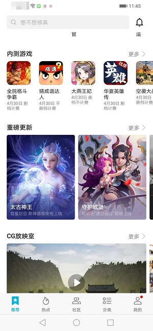
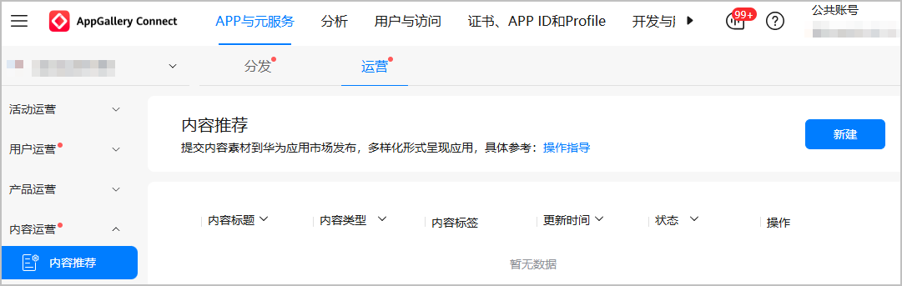
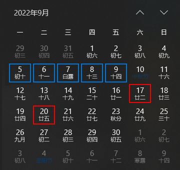
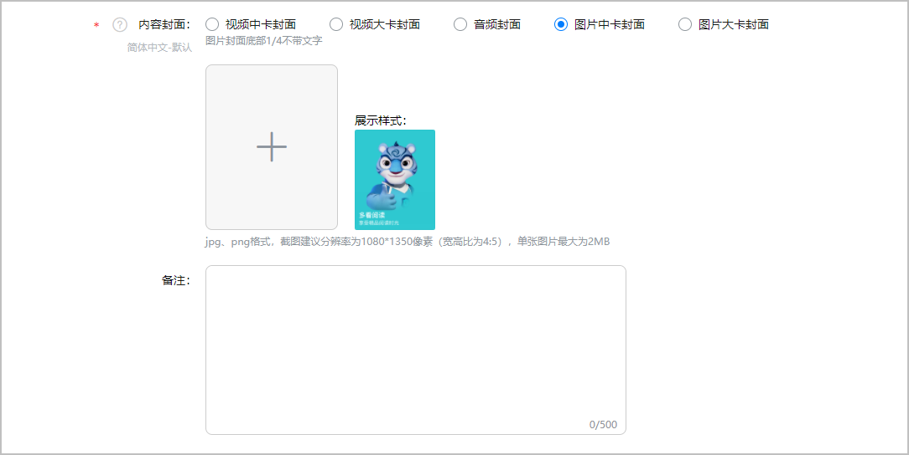
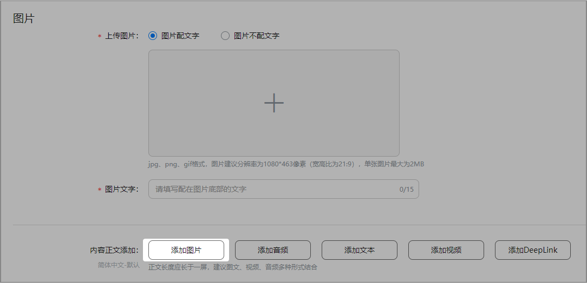
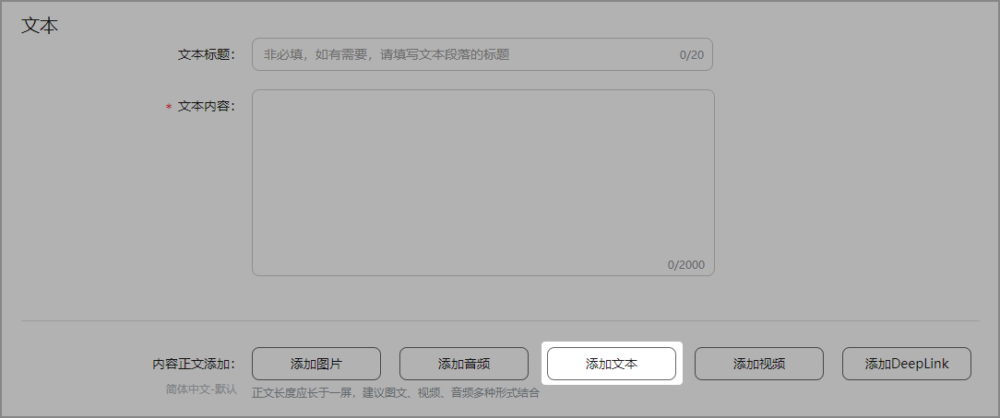
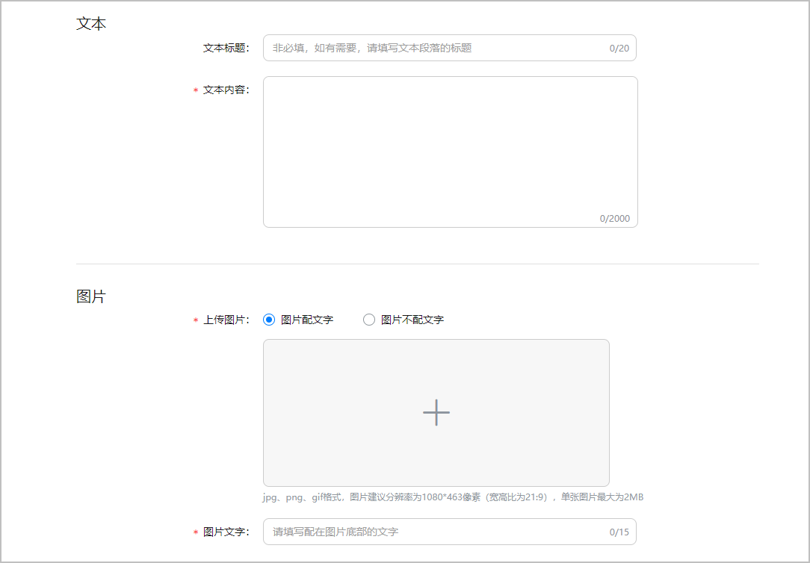
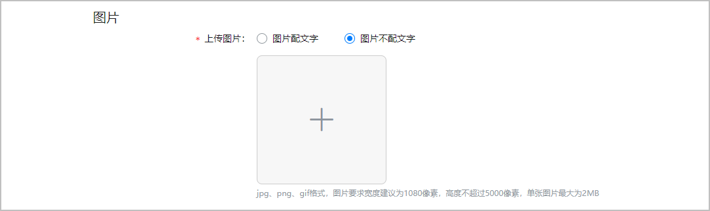
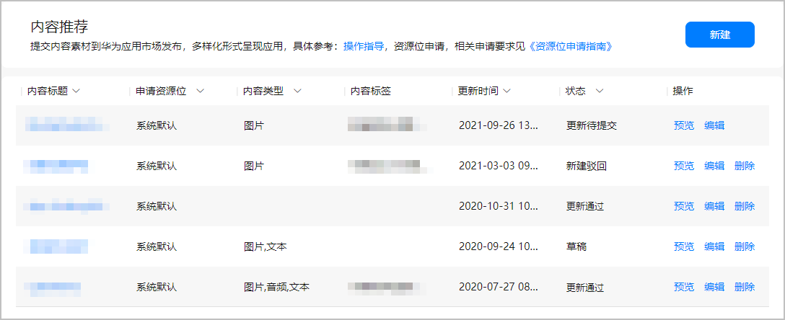

import MergeTable from "@site/src/components/MergeTable";

# 《重磅更新》栏目

## 栏目介绍

“重磅更新”栏目旨在为用户呈现新鲜丰富的游戏版本更新内容，面向有重大版本更新内容的热门游戏，此栏目将会展示在华为应用市场和华为游戏中心APP中。

## 功能入口

[AppGallery Connect](https://developer.huawei.com/consumer/cn/service/josp/agc/index.html) > APP与元服务 > 运营 > 内容运营 > 内容推荐。

## 申请流程

###可申请游戏

在华为应用市场/华为游戏中心正常上架且有重点版本更新的游戏可进行申请。

###申请流程

1. 填写申请表。下载“华为重磅更新栏目申请+游戏名称”申请表，休闲游戏与网络游戏申请表格不一样，请根据对应游戏所属分类填写申请表，要求仔细填写内容，未按照要求填写游戏将不予受理。
2. 版本评估。华为运营人员将会对申请游戏版本及游戏运营状况进行综合评估。
3. 通知入选。入选游戏将会在3个工作日内得到答复，未入选游戏不再另行通知。
4. 栏目制作。收到答复的游戏需根据要求进行更新内容编辑，若无法按期（提前1个工作日）按要求完成编辑，将无法上线，故取消资格。
5. 栏目上线。审核通过内容将按照申请对应排期准时上线。

点击下载申请表：

[重磅更新栏目申请表-休闲游戏](https://alliance-communityfile-drcn.dbankcdn.com/FileServer/getFile/cmtyPub/011/111/111/0000000000011111111.20251015105438.87916265345440513630720083954267%3A50001231000000%3A2800%3A3D70F26F50E8FC76B214D3BB72025E12BE4FC4B826BD240A30112C596B09D0F2.xlsx?needInitFileName=true)

[重磅更新栏目申请表-网络游戏](https://alliance-communityfile-drcn.dbankcdn.com/FileServer/getFile/cmtyPub/011/111/111/0000000000011111111.20251015105438.36529327279786347482756199063139%3A50001231000000%3A2800%3A4A07DEFE3234CB58FFAB4D555393A2CF052FD77A0068CF7B296853479B6E3AB7.xlsx?needInitFileName=true)

###栏目排期

《重磅更新》栏目每周有2次更新日期，分别是每周二与每周六。

###申请受理时间

每周一9:00至每周五18:00可以申请《重磅更新》栏目下周六或下下周二的排期。例如2022.9.5 9:00（周一）~2022.9.9 18:00（周五）这个时间段内可以申请2022.9.17（周六）或2022.9.20（周二）其中一期的排期资源。

###申请间隔

同款游戏两次“重磅更新”栏目推广周期间隔需大于30天，请根据实际情况申请。

###申请方式

* 网络游戏发送申请表至：gameop@huawei.com
* 休闲游戏发送申请表至：gamebeta@huawei.com

* 发布内容禁止引导用户到非华为渠道。
* 正文内容500-1000字以内，小段标题13字以内。
* 文末最后一句需添加：（以上内容由华为游戏中心提供）

## 商业诚信要求【重要】

“重磅更新”的目的是向用户展示游戏版本热点事件，并非常规曝光资源，鼓励开发者共同建设该栏目，举报不良欺骗行为，包括且不限于以下行为：

* 虚报版本内容，以获取曝光 。
* 多个月连续申请，为了满足申报规则，更新无关痛痒的内容，实际无效果。

###违规行为及对应处罚方式

<MergeTable
  headers={['违规类型', '违规行为', '违规次数（每自然年累计）', '处罚方式']}
  rows={[
    [{ text: '虚报游戏版本、更新无关痛痒并夸大版本效果。', rowspan: 2 }, { text: '通过虚报游戏版本以获取营销资源的不诚信行为，虚报版本包含但不限于以下情况：恶意捏造不存在版本申请资源、版本推迟未及时告知且在申请时上报该版本、同一版本反复申请、为满足申报条件更新无关痛痒的版本并夸大其效果等。', rowspan: 2 }, '第一次', '对应游戏下架1个月；且停止“重磅更新”“重点游戏推广”等营销资源申请，静默时间为半年。 说明： 该游戏若发生主体转移情况，该惩罚机制依然维持。 游戏惩罚时间到期后，需由开发者主动发起上架流程。'],
    [null, null, '第二次', '所在公司所有游戏永久下架，冻结账号，终止合作。'],
  ]}
/>

###违规处罚说明及执行

* 违规处罚说明

对于违反本规定的游戏，华为有权单方视情节轻重调整处罚措施。包括对单个游戏及对开发者的处罚。处罚措施包括但不限于如下内容：

1. 下架：终止游戏在华为应用市场运营，并对游戏执行下架动作；
2. 停止推广资源申请：禁止游戏申请“重磅更新”“重点游戏推广”等推广资源；
3. 冻结账号：冻结开发者在华为开发者联盟注册的账号；
4. 违规次数：按每游戏统计，累计周期为1年（自然年），每自然年12月31日24点清零；
5. 申请再上架：游戏惩罚时间到期后，需由开发者主动发起上架流程，经审核后游戏再上架。

* 违规处罚执行

1. 华为在发现违规行为后第一时间执行下架、降级、冻结资源申请等处罚，并通过电子邮件形式通知违规合作伙伴（通知邮箱为game.business@huawei.com）。若因游戏负责人/开发者联系信息不准确而导致无法联系的，由此造成的各类损失概由开发者自行负责。涉及下架和降级的，处罚期满且对违规行为整改完成后，游戏方可上架或恢复原有级别。
2. 华为有权根据违规游戏情节严重程度，进行处罚调整，包括但不限于延长下架或降级时间、追究违规行为给华为造成的全部损失等。
3. 华为在必要时会调整本规定，无须另行通知开发者，新的规定一旦公开即有效替代原来的规定，并对华为、开发者产生约束力，请开发者定时关注华为开发者联盟网站。华为拥有对本规定的最终解释权。

## 栏目操作方法

###新增“内容推荐”

* 入选要求

提交申请表并且得到入选通知的游戏，在后台“内容推荐”模块提交内容后会进入审核环节，未获得入选通知的游戏提交“内容推荐”模块后将会自动被驳回。

* 内容要求

以介绍新版本更新亮点为主，排版要求及文章风格可参考华为应用市场客户端中的“重磅更新”栏目已上线游戏，请根据下面要求在后台提交对应排版的图文内容。

###编辑“内容推荐”

1. 语言：点击“管理语言列表”，勾选需要支持的语言种类。
2. 标题：填写游戏名称。
3. 副标题：填写版本名/版本简介（12字以内）。
4. 封面选择：选择“图片封面”并上传符合尺寸要求、对接确认过的中卡图作为封面图片。

   
5. Banner添加：选择添加图片，上传的第一张图作为顶部banner 。

   
6. 添加简介：选择“添加文本”，在Banner下方添加游戏简介文案（包含游戏简介+本次更新亮点简介） 。

   
7. 正文部分：根据图文模板规范，继续在该页面分段添加图文内容（每段配图在对应段落下方）。

   
8. 其他：配图可选配文字或不配文字，建议不配。

   

###审核结果通知

开发者提交内容后，将由华为运营人员进行审核，系统将会自动邮件通知开发者审核结果。

###审核被驳回

当开发者提交内容被驳回后，审核状态将变为“新建驳回”，开发者可在驳回内容基础上进行再次“编辑”后提交，直至审核通过。

