# 创建应用内商品

|  |  |
| --- | --- |
| 您可以通过华为商品管理系统（PMS）将您的应用商品信息托管在华为侧，方便您的应用商品价格国际化管理，助力您的应用进行全球化推广。还可以在[商品营销](`https://developer.huawei.com/consumer/cn/doc/app/game-center-managing-product-marketing-0000001198744990`)中，让您的应用在应用市场详情页获得更多的资源曝光。  新增商品共有三种方式，一种是通过在AGC控制台[新增单个商品](#section873719282516)的方式，一种是通过在AGC控制台[批量导入商品](#section173850553264)的方式，除此之外，您还可以通过创建商品接口创建单个商品或者通过批量创建商品接口批量创建商品，具体请参见[创建商品](`https://developer.huawei.com/consumer/cn/doc/AppGallery-connect-Guides/agcapi-pms-add_product-0000001115868326`)。 |  |

商品类型分为非订阅类商品和自动续期订阅商品：

| 商品 | 说明 |
| --- | --- |
| 非订阅类商品 | 一次性购买的商品，又可分为消耗品和非消耗品。   * 消耗品：随使用减少，需要再次购买的商品，例如游戏货币，游戏道具。 * 非消耗品：用户只需购买一次，这类商品不会过期或随着使用而减少，例如去广告，升级专业版。 |
| 自动续期订阅商品 | 可自动续期购买的一种商品，例如月度会员。 |

应用分发地包含中国大陆的非订阅类商品（消耗/非消耗商品）还可以配置虚拟商品。虚拟商品库存服务是AGC为分发到中国大陆的商品提供的托管虚拟商品库存的一种服务。目前，暂不支持自动续期订阅商品配置虚拟商品。具体请参考[配置虚拟商品](#section22140508113)。

## 前提条件

* 建议使用Google Chrome浏览器访问商品管理服务，最低版本为62.0.3202.62。
* 您需要先设置好应用分发国家/地区。
* 新建商品前，您需要提前仔细规划好商品ID，以便顺畅完成商品配置。商品ID规则如下：
  + 必须以大小写字母或数字开头，并且只能由大小写字母 (A-Z,a-z)、数字 (0-9)、下划线（\_）或句点 (.) 组成。
  + 输入字符数上限148个。
  + 同一个应用内商品ID不能重复，保存后将无法修改（删除后也无法再次使用该商品ID新建商品）。

## 新增单个商品

### 非订阅类商品

1. 登录[AppGallery Connect](`https://developer.huawei.com/consumer/cn/service/josp/agc/index.html`)，选择“APP与元服务”。
2. 在应用列表中点击需要新增商品的应用。

   
3. 在“运营”页签下的左侧导航栏中，选择“产品运营 &gt; 商品管理”。
4. 选择“商品列表”页签，并点击“添加商品”。

   

   如果应用还未设置分发国家/地区，则会弹出“请先设置应用分发国家/地区”的警告提示，请先设置应用分发国家/地区后再创建商品。

   
5. 配置商品信息，完成后点击“保存”。

   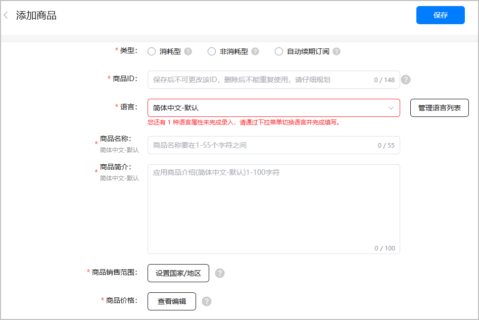

   相关参数如下表所示。

   | 参数 | 说明 |
   | --- | --- |
   | 类型 | 非订阅类商品只能选择“消耗型”或者“非消耗型”。请参见[非订阅类商品](#ZH-CN_TOPIC_0000001239502323__zh-cn_topic_0000001064472502_p133713287137)。  注意：  商品创建成功后，商品类型将无法更改。 |
   | 商品ID | 必须以大小写字母或数字开头，并且只能由大小写字母 (A-Z,a-z)、数字 (0-9)、下划线（\_）或句点 (.) 组成。输入字符数上限148个字符。  注意：  同一个应用内商品ID不能重复，保存后将无法修改（删除后也无法再次使用），请仔细规划。 |
   | 语言 | 点击“管理语言列表”，勾选需要支持的语言种类。  注意：  如果配置多种语言种类后，必须依次选择下拉框中配置的语言，配置此语言对应的“商品名称”和“商品简介”。 |
   | 商品名称 | 不能为空，最长55个字符，不支持特殊字符 | |
   | 商品简介 | 不能为空，最长100个字符，不支持特殊字符 | |
   | 商品销售范围 | 点击“设置国家/地区”，设置商品可供用户购买的国家/地区，不能为空，销售范围至少选择1个销售国家/地区。  说明：  勾选“新国家或地区”后，华为应用市场会对未来新增的国家或地区自动提供您的商品，届时以您设置的全球商品定价为准。 |
   | 商品价格 | 点击“查看编辑”，为商品配置合适的价格。  说明：  此价格为展示给用户查看和支付的应用内商品价格（含税），华为将根据当地税率，扣税后与开发者分成，分成以对账单为准。 |

6. 点击商品编辑页面的“查看编辑”，配置商品的用户支付价格（含税）。

   勾选“汇率换算基准价格”类型，选择国家和币种，配置基准价格，根据使用需要勾选排序规则，在列表中选择使用汇率刷新价格的国家/地区，点击 “刷新”同步更新商品的用户支付价格（含税）。

   

   * 当您在设置完“汇率换算基准价格”并点击刷新后，系统会自动根据汇率（及[税率](`https://developer.huawei.com/consumer/en/doc/start/merchant-service-0000001053025967#section154132916309`)）和相应币种美化/更正规则计算出所选国家/地区商品的用户支付价格（含税），具体请参考[换算规则描述](`https://developer.huawei.com/consumer/cn/doc/app/game-center-conversion-rule-description-0000001239182363`)。
   * 您还可以根据不同国家/地区的商品价格策略，手动编辑商品价格表中指定国家/地区的价格，保存后将以此价格作为商品在该国家/地区的用户支付价格（含税）。
   * 在使用汇率刷新不同国家/地区商品的用户支付价格（含税）时，如出现币种兑换查无汇率的警告，则您需要手动填写该国家/地区商品的用户支付价格（含税）。
   * 华为汇率每日刷新，但是不会更改您已经保存的商品价格，如果您需要刷新商品价格，可以手动根据当前最新汇率刷新。
   * 税率只与不同国家/地区相关，如果某国家/地区没有税率，则表示税率为0，不含税价即等同于含税价，页面展示为横线“-”。

   

   相关参数如下表所示。

   | 参数 | 说明 |
   | --- | --- |
   | 汇率换算基准价格 | 商品价格的汇率换算基准价格。目前，支持填入“含税”或“不含税”两种类型的基准价格，默认为“含税”类型。  * 含税：汇率换算基准价格中含有税额。 * 不含税：汇率换算基准价格中不含税额。 说明：  系统会根据汇率换算基准价格计算出商品的用户支付价格（含税），具体请参考[换算规则描述](`https://developer.huawei.com/consumer/cn/doc/app/game-center-conversion-rule-description-0000001239182363`)。  由于不同国家/地区的币种不同，系统会根据您输入的汇率换算基准价格进行如下规则的自动调整：  * 通用币种要求国家/地区：支持整数或小数（均保留两位小数）作为输入价格，如输入1.34，则将1.34作为该商品的输入价格。 * 特殊币种要求国家/地区（详见下表）： – 仅支持整数（保留两位小数）的国家/地区，以整数或向上取整的值（均保留两位小数）作为输入价格，如输入5.02，则默认选取6.00作为该商品的输入价格。  – 仅以五分之一为最小单位（保留两位小数）的国家/地区，以整数或向上取符合五分之一要求的数值（均保留两位小数）作为输入价格，如输入1.23，则默认选取1.40作为该商品的输入价格。 |
   | 排序规则 | 国家/地区的排序规则。  * 按字母A-Z顺序排序 * 按地理区域分组排序 |
   | 置顶国家/地区 | 置顶汇率换算国家/地区，方便您查看或编辑商品价格，可选。  * 当国家/地区按字母A-Z顺序排序时，您可以在下拉选项中选择您要置顶的国家/地区。 * 当国家/地区按地理区域分组排序时，您可以在下拉选项中选择您要置顶的区域。 |

   特殊币种要求国家/地区如下表所示。

   | 区域 | 序号 | 国家/地区 | 币种 | 备注 |
   | --- | --- | --- | --- | --- |
   | 欧洲 | 1 | 匈牙利 | HUF | 仅支持整数（保留两位小数），如5.00 |
   | 2 | 冰岛 | ISK | 仅支持整数（保留两位小数），如5.00 |
   | 亚太 | 3 | 越南 | VND | 仅支持整数（保留两位小数），如5.00 |
   | 4 | 印度尼西亚 | IDR | 仅支持整数（保留两位小数），如5.00 |
   | 5 | 日本 | JPY | 仅支持整数（保留两位小数），如5.00 |
   | 6 | 法属波利尼西亚 | XPF | 仅支持整数（保留两位小数），如5.00 |
   | 中东、北非、南非 | 7 | 喀麦隆 | XAF | 仅支持整数（保留两位小数），如5.00 |
   | 8 | 塞内加尔 | XOF | 仅支持整数（保留两位小数），如5.00 |
   | 9 | 刚果（布） | XAF | 仅支持整数（保留两位小数），如5.00 |
   | 10 | 几内亚 | XAF | 仅支持整数（保留两位小数），如5.00 |
   | 11 | 加蓬 | XAF | 仅支持整数（保留两位小数），如5.00 |
   | 12 | 毛里塔尼亚 | MRO | 仅支持以五分之一为最小单位（保留两位小数），如1.00、1.20、1.40、1.60、1.80、2.00 |
   | 13 | 尼日尔 | XOF | 仅支持整数（保留两位小数），如5.00 |
   | 14 | 乍得 | XAF | 仅支持整数（保留两位小数），如5.00 |
   | 15 | 赤道几内亚 | XAF | 仅支持整数（保留两位小数），如5.00 |
   | 16 | 肯尼亚 | KES | 仅支持整数（保留两位小数），如5.00 |
   | 拉美 | 17 | 巴拉圭 | PYG | 仅支持整数（保留两位小数），如5.00 |
   | 18 | 哥伦比亚 | COP | 仅支持整数（保留两位小数），如5.00 |
   | 19 | 智利 | CLP | 仅支持整数（保留两位小数），如5.00 |

7. 点击“保存”，并在弹框中点击“确定”。
8. 如需使该商品生效，返回商品列表，点击该商品对应“操作”列的“激活”即可，具体请参考[激活应用内商品](`https://developer.huawei.com/consumer/cn/doc/app/game-center-deactivating-product-0000001239622347#section8229172719335`)。

* 单个应用创建商品的上限是50000个。
* 除了在AGC界面可以新增商品，您还可以通过[创建商品](`https://developer.huawei.com/consumer/cn/doc/AppGallery-connect-References/agcapi-addproduct-android-0000002171407001`)接口创建单个商品或者通过[批量创建商品](`https://developer.huawei.com/consumer/cn/doc/AppGallery-connect-References/agcapi-batchaddproduct-android-0000002171288605`)接口批量创建商品。

### 自动续期订阅商品

1. 登录[AppGallery Connect](`https://developer.huawei.com/consumer/cn/service/josp/agc/index.html`)，选择“APP与元服务”。
2. 在应用列表中点击需要新增商品的应用。

   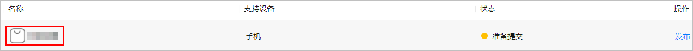

3. 在“运营”页签下的左侧导航栏中，选择“产品运营 &gt; 商品管理”。
4. 选择“商品列表”页签，点击“添加商品”。

   

   如果应用还未设置分发国家/地区，则会弹出“请先设置应用分发国家/地区”的提示，请先设置应用分发国家/地区后再创建商品。

   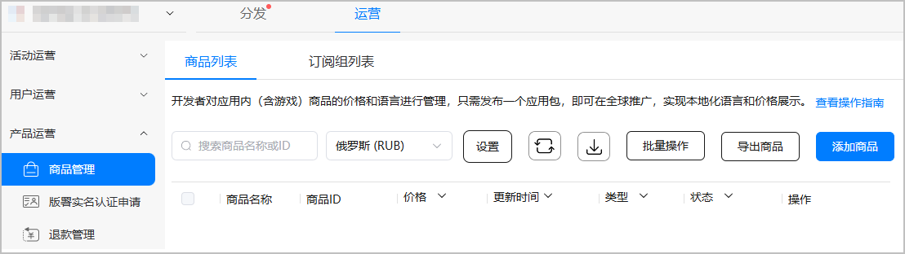

5. 配置商品信息，完成后点击“保存”。

   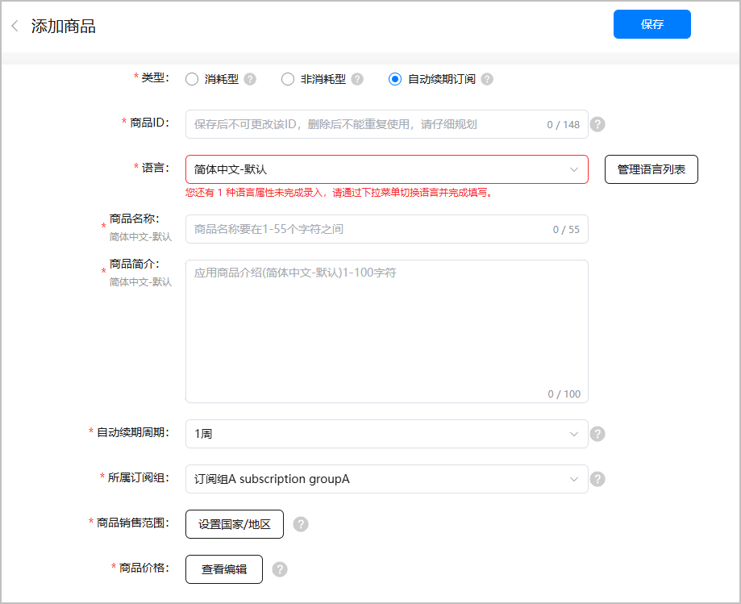

   相关参数如下表所示。

   | 参数 | 说明 |
   | --- | --- |
   | 类型 | 选择“自动续期订阅”。  注意：  商品创建成功后，商品类型将无法更改。 |
   | 商品ID | 必须以大小写字母或数字开头，并且只能由大小写字母 (A-Z,a-z)、数字 (0-9)、下划线（\_）和句点 (.) 组成。输入字符数上限148个字符。  注意：  同一个应用内商品ID不能重复，保存后将无法修改（删除后也无法再次使用），请仔细规划。 |
   | 语言 | 点击“管理语言列表”，勾选需要支持的语言种类。  注意：  如果配置多种语言种类后，必须依次选择下拉框中配置的语言，配置此语言对应的“商品名称”和“商品简介”。 |
   | 商品名称 | 不能为空，最长55个字符，不支持以下特殊字符 | |
   | 商品简介 | 不能为空，最长100个字符，不支持以下特殊字符 | |
   | 自动续期周期 | 该参数只有在“类型”选择“自动续期订阅”时才会展示。  系统将按此周期自动扣除订阅商品价格。除非用户主动取消或商品涨价后用户未确认自动取消或用户账号多次扣费失败自动取消，否则会自动按此周期续期。  当前支持的续期周期为1周、1个月、2个月、3个月、6个月、1年、30天（上次订阅日期+30天）、31天（上次订阅日期+31天）。 |
   | 所属订阅组 | 该参数只有在“类型”选择“自动续期订阅”时才会展示。  自动续期订阅商品所属的订阅组，必须提前创建。创建订阅组的具体步骤请参见[新增订阅组](`https://developer.huawei.com/consumer/cn/doc/distribution/app/agc-help-manage-subscription-group-0000001100174674`)。 |
   | 商品销售范围 | 点击“设置国家/地区”，设置商品可供用户购买的国家/地区，不能为空，销售范围至少选择1个销售国家/地区。  说明：  勾选“新国家或地区”后，华为应用市场会对未来新增的国家或地区自动提供您的商品，届时以您设置的全球商品定价为准。 |
   | 商品价格 | 点击“查看编辑”，为商品选择合适的价格。  说明：  此价格为展示给用户查看和支付的应用内商品价格（含税），华为将根据当地税率，扣税后与开发者分成，分成以对账单为准。 |

6. 点击商品编辑页面的“查看编辑”，配置商品的用户支付价格（含税）。

   勾选“汇率换算基准价格”类型，选择国家和币种，配置基准价格，根据使用需要勾选排序规则，在列表中选择使用汇率刷新价格的国家/地区，点击 “刷新”同步更新商品的用户支付价格（含税）。

   

   * 当您在设置完“汇率换算基准价格”并点击刷新后，系统会自动根据汇率（及[税率](`https://developer.huawei.com/consumer/en/doc/start/merchant-service-0000001053025967#section154132916309`)）和相应币种美化/更正规则计算出您所选国家/地区商品的用户支付价格（含税），具体请参考[换算规则描述](`https://developer.huawei.com/consumer/cn/doc/app/game-center-conversion-rule-description-0000001239182363`)。
   * 您还可以根据不同国家/地区的商品的价格策略，手动编辑商品价格表中指定国家/地区的价格，保存后将以此价格作为商品在该国家/地区的用户支付价格（含税）。
   * 在使用汇率刷新不同国家/地区商品的用户支付价格（含税）时，如出现币种兑换查无汇率异常场景的警告，则您需要手动填写该国家/地区商品的用户支付价格（含税）。
   * 华为汇率每日刷新，但是不会更改您已经保存的商品价格，如果您需要刷新商品价格，可以手动根据当前最新汇率刷新。
   * 税率只与不同国家/地区相关，如果某国家/地区没有税率，则表示税率为0，不含税价即等同于含税价，页面展示为横线“-”。

   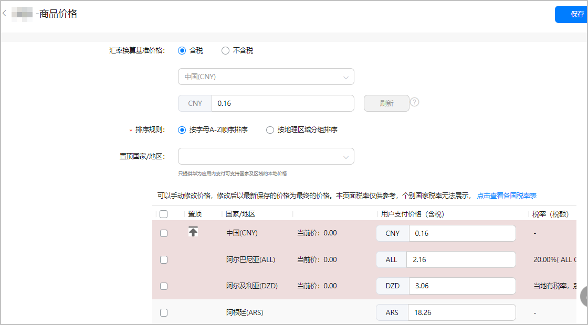

   相关参数如下表所示。

   | 参数 | 说明 |
   | --- | --- |
   | 汇率换算基准价格 | 商品价格的汇率换算基准价格。目前，支持填入“含税”或“不含税”两种类型的基准价格。  * 含税：汇率换算基准价格中含有税额。 * 不含税：汇率换算基准价格中不含税额。 说明：  系统会根据汇率换算基准价格计算出商品的用户支付价格（含税），具体请参考[换算规则描述](`https://developer.huawei.com/consumer/cn/doc/app/game-center-conversion-rule-description-0000001239182363`)。  由于不同国家/地区的币种不同，系统会根据您输入的汇率换算基准价格进行如下规则的自动调整：  * 通用币种要求国家/地区：支持整数或小数（均保留两位小数）作为输入价格，如输入1.34，则将1.34作为该商品的输入价格。 * 特殊币种要求国家/地区（详见下表）： – 仅支持整数（保留两位小数）的国家/地区，以整数或向上取整的值（均保留两位小数）作为输入价格，如输入5.02，则默认选取6.00作为该商品的输入价格。  – 仅以五分之一为最小单位（保留两位小数）的国家/地区，以整数或向上取符合五分之一要求的数值（均保留两位小数）作为输入价格，如输入1.23，则默认选取1.40作为该商品的输入价格。 |
   | 排序规则 | 国家/地区的排序规则。  * 按字母A-Z顺序排序 * 按地理区域分组排序 |
   | 置顶国家/地区 | 置顶汇率换算国家/地区，方便您查看或编辑商品价格，可选。  * 当国家/地区按字母A-Z顺序排序时，您可以在下拉选项中选择您要置顶的国家/地区。 * 当国家/地区按地理区域分组排序时，您可以在下拉选项中选择您要置顶的区域。 |

   特殊币种要求国家/地区如下表所示。

   | 区域 | 序号 | 国家/地区 | 币种 | 备注 |
   | --- | --- | --- | --- | --- |
   | 欧洲 | 1 | 匈牙利 | HUF | 仅支持整数（保留两位小数），如5.00 |
   | 2 | 冰岛 | ISK | 仅支持整数（保留两位小数），如5.00 |
   | 亚太 | 3 | 越南 | VND | 仅支持整数（保留两位小数），如5.00 |
   | 4 | 印度尼西亚 | IDR | 仅支持整数（保留两位小数），如5.00 |
   | 5 | 日本 | JPY | 仅支持整数（保留两位小数），如5.00 |
   | 6 | 法属波利尼西亚 | XPF | 仅支持整数（保留两位小数），如5.00 |
   | 中东、北非、南非 | 7 | 喀麦隆 | XAF | 仅支持整数（保留两位小数），如5.00 |
   | 8 | 塞内加尔 | XOF | 仅支持整数（保留两位小数），如5.00 |
   | 9 | 刚果布 | XAF | 仅支持整数（保留两位小数），如5.00 |
   | 10 | 几内亚 | XAF | 仅支持整数（保留两位小数），如5.00 |
   | 11 | 加蓬 | XAF | 仅支持整数（保留两位小数），如5.00 |
   | 12 | 毛里塔尼亚 | MRO | 仅支持以五分之一为最小单位（保留两位小数），如1.00、1.20、1.40、1.60、1.80、2.00 |
   | 13 | 尼日尔 | XOF | 仅支持整数（保留两位小数），如5.00 |
   | 14 | 乍得 | XAF | 仅支持整数（保留两位小数），如5.00 |
   | 15 | 赤道几内亚 | XAF | 仅支持整数（保留两位小数），如5.00 |
   | 16 | 肯尼亚 | KES | 仅支持整数（保留两位小数），如5.00 |
   | 拉美 | 17 | 巴拉圭 | PYG | 仅支持整数（保留两位小数），如5.00 |
   | 18 | 哥伦比亚 | COP | 仅支持整数（保留两位小数），如5.00 |
   | 19 | 智利 | CLP | 仅支持整数（保留两位小数），如5.00 |

7. 点击“保存”，并在弹框中点击“确定”。
8. 如需使该商品生效，返回商品列表，点击该商品对应“操作”列的“激活”即可，具体请参考[激活应用内商品](`https://developer.huawei.com/consumer/cn/doc/app/game-center-deactivating-product-0000001239622347#section8229172719335`)。

* 单个应用创建商品的上限是50000个。
* 除了在AGC界面可以新增商品，您还可以通过[创建商品](`https://developer.huawei.com/consumer/cn/doc/AppGallery-connect-References/agcapi-addproduct-android-0000002171407001`)接口创建单个商品或者通过[批量创建商品](`https://developer.huawei.com/consumer/cn/doc/AppGallery-connect-References/agcapi-batchaddproduct-android-0000002171288605`)接口批量创建商品，具体请参见[创建商品](`https://developer.huawei.com/consumer/cn/doc/AppGallery-connect-Guides/agcapi-pms-add_product-0000001115868326`)。

## 批量导入商品

1. 登录[AppGallery Connect](`https://developer.huawei.com/consumer/cn/service/josp/agc/index.html`)，选择“APP与元服务”。
2. 在应用列表中点击需要导入商品的应用。
3. 在“运营”页签下的左侧导航栏中，选择“产品运营 &gt; 商品管理”。
4. 在“商品列表”页签中，点击页面右上角下载商品模板，在下载的模板中按要求填写商品信息。

   

   “商品模板”中支持填写的国家/地区、语言、币种等商品信息，具体可参见[国家/地区、语言、币种列表](`https://developer.huawei.com/consumer/cn/doc/distribution/app/agc-help-supported-countries-overview-0000001146718725`)。

   

5. 点击“批量操作”下拉选项中的 “添加商品”，并在弹出的添加框中点击选择上传已填写的商品模板。

   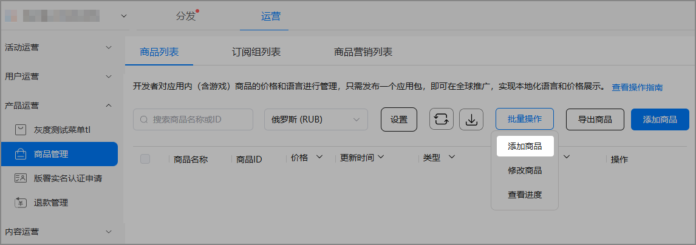

6. 在弹框中点击“确定”，完成商品导入。

单个应用创建商品的上限是50000个。

## 配置虚拟商品

虚拟商品库存服务，即分发到中国大陆的应用中商品，AGC提供托管虚拟商品库存的一种服务。您可以在AGC中配置虚拟商品，并在您的应用中允许用户使用兑换码兑换对应的商品。当用户在华为应用市场/游戏中心点击购买商品后，由华为应用市场/游戏中心直接发起支付，支付完成后用户可以在华为应用市场/游戏中心获取商品兑换码，用户可前往应用/网页中兑换对应的虚拟商品。

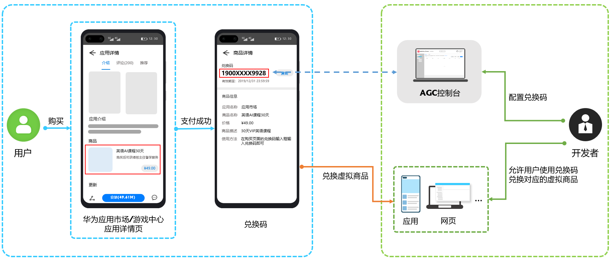

目前，只有非订阅类商品（消耗/非消耗商品）可以配置虚拟商品，每个商品可对应多个虚拟兑换码。配置虚拟商品，需进入“配置虚拟商品库存”服务入口，设置“兑换码有效期”，上传兑换码。

* 如分发地未包含中国大陆，“配置虚拟商品库存”入口默认隐藏。
* 已设置商品营销Deeplink或发货通知地址，则不能再配置虚拟商品库存。

1. 登录[AppGallery Connect](`https://developer.huawei.com/consumer/cn/service/josp/agc/index.html`)，选择“APP与元服务”。
2. 在应用列表中点击需要配置虚拟商品的应用。

3. 在“运营”页签下的左侧导航栏中，选择“产品运营 &gt; 商品管理”。
4. 在商品列表中，点击需要配置虚拟商品的非订阅类商品对应“操作”列的“编辑”。

   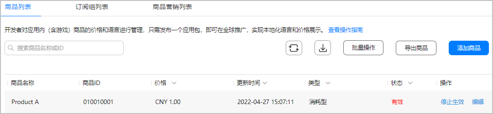
5. 进入“编辑商品”页面，完善商品相关信息后，点击下方“添加”。

   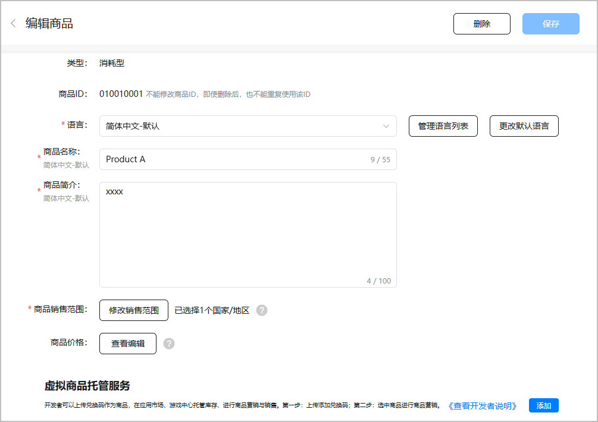

6. 进入“配置虚拟商品库存”页面，点击“添加”按钮。

   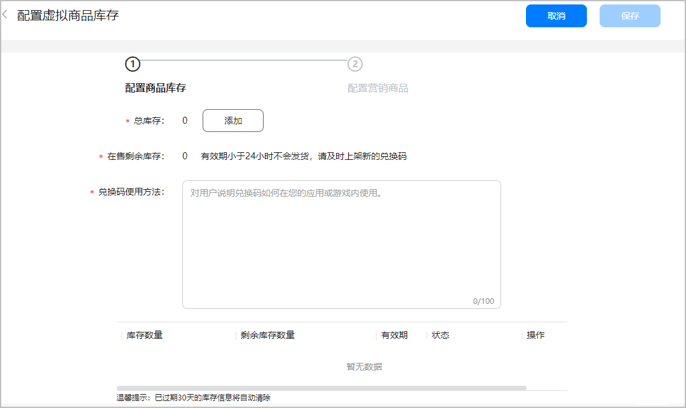

7. 进入“配置虚拟商品库存”页面，设置“兑换码有效期”，并点击“请下载格式模板”，根据实际情况填写完成后点击“浏览”，上传已填写的兑换码文件，在弹出的提示窗口点击“确定”，完成兑换码上传，点击右上方“保存”，并在弹出的提示窗口点击“确定”，完成添加商品库存操作。
   * 有效期设置：当前展示的时间为您的电脑系统时区时间，对用户展示将自动转换为其手机系统的时区时间。有效期必须大于48小时。
   * 模板格式与要求：

   -文件格式必须是ANSI编码的txt格式；

   -文件中每行排列1条数据，请勿添加其他注释；

   -串码只能由英文大小写字母、数字和少量特殊符号（仅支持英文下划线和英文分隔符）组成；

   -文件中不能存在重复码（重复码将被系统自动过滤掉）；

   -文件大小不能超过100M。

   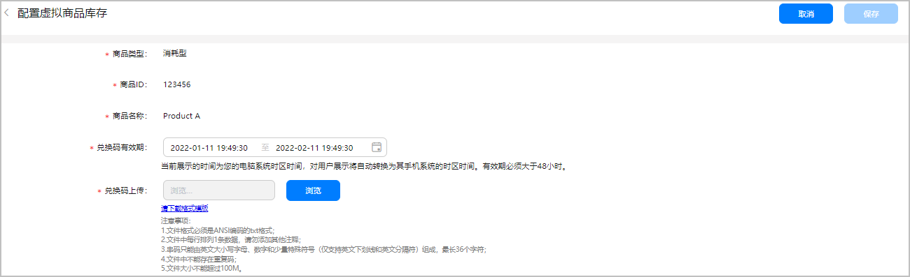

8. 进入“配置虚拟商品库存”页面，填写“兑换码使用方法”，点击右上方“保存”。

   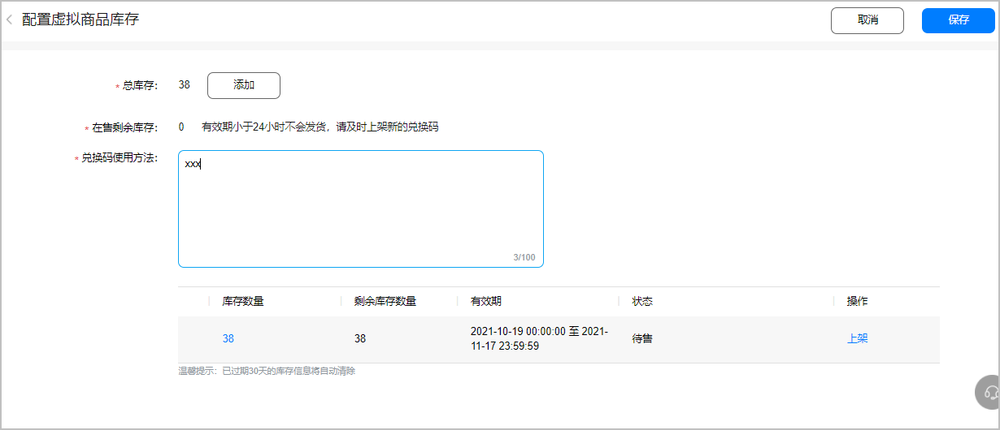

9. 查看总库存明细列表，状态列显示“待售”，点击操作列“上架”，选择上架的库存。

   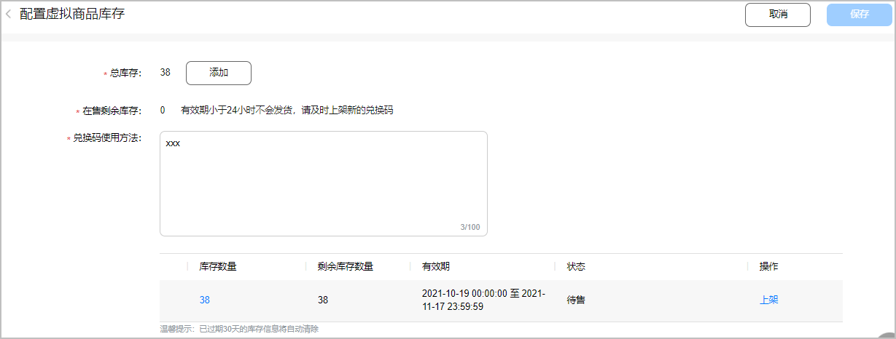

10. 确认“兑换码数量”和“有效期”（可编辑），点击“确认上架”，并在弹出的提示窗口中点击“确定”，完成需上架库存的提交。

    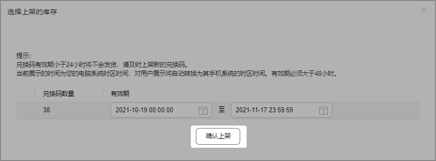

11. 上架成功后，页面将跳转至商品营销列表，具体配置步骤请参见[管理商品营销](`https://developer.huawei.com/consumer/cn/doc/app/game-center-managing-product-marketing-0000001198744990`)。

    

    如需配置营销商品，应确保商品已激活，否则将无法购买。