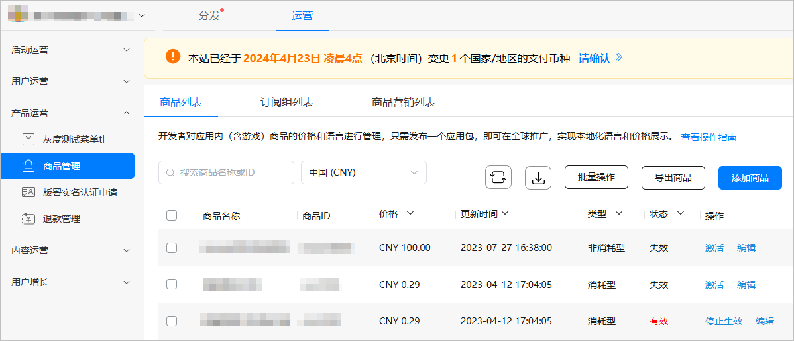
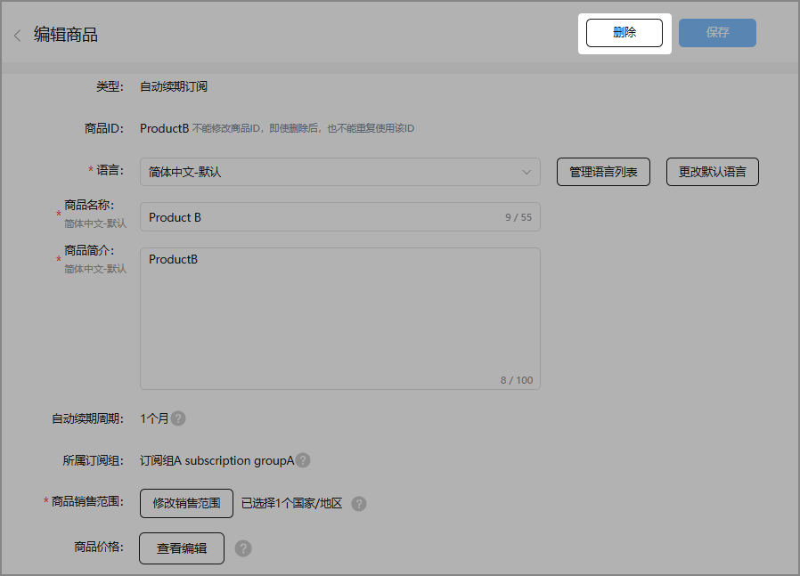
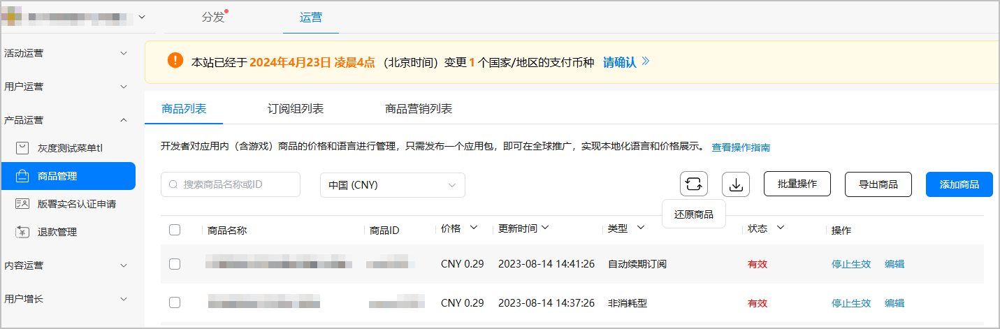
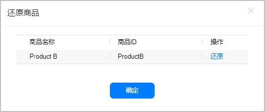

# 删除/还原应用内商品

## 前提条件

* 您已在商品管理[新增商品](/docs/distribute/app-dist/game-center/game-center-operation-0000001239502315/game-center-goods-management-0000001194462390/game-center-creating-product-0000001239502323)。
* 建议使用Google Chrome浏览器访问商品管理服务，最低版本为62.0.3202.62。

## 删除商品

如果您想将某个冗余的商品从商品列表中去除，您可以选择删除该商品。

待删除的商品应处于失效状态，否则无法删除该商品，商品的失效操作具体请参考[失效商品](/docs/distribute/app-dist/game-center/game-center-operation-0000001239502315/game-center-goods-management-0000001194462390/game-center-deactivating-product-0000001239622347#section1851819158336)。

1. 登录[AppGallery Connect](https://developer.huawei.com/consumer/cn/service/josp/agc/index.html)，选择“APP与元服务”。
2. 在应用列表中点击需要删除的商品的应用。
3. 在“运营”页签下的左侧导航栏中，选择“产品运营 &gt; 商品管理”。
4. 在商品列表中，点击待删除商品对应“操作”列下的“编辑”。

   
5. 点击“编辑商品”页面右上角的“删除商品”。

   

6. 在弹框中，点击“确认”。

   

   删除商品后，该商品将无法支付购买，且此商品ID将无法在该应用下继续创建商品时使用。

## 还原商品

商品被删除后，您将无法通过商品列表查看该商品的相关信息。如果您需要找回已删除的商品，您可通过还原操作，将该商品恢复至商品列表中。

目前，仅支持90天（含）内已删除商品的还原操作。

1. 登录[AppGallery Connect](https://developer.huawei.com/consumer/cn/service/josp/agc/index.html)，选择“APP与元服务”。
2. 在应用列表中点击需要被还原的商品的应用。
3. 在“运营”页签下的左侧导航栏中，选择“产品运营 &gt; 商品管理”。
4. 点击页面右上角下拉选项中“还原商品”。

   
5. 在查询框中输入商品ID或商品标题，点击“确定”进行查询。

   
6. 点击待还原商品“操作”列的“还原”，即可成功还原该商品。

   