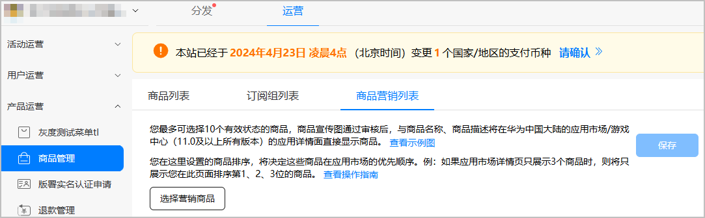
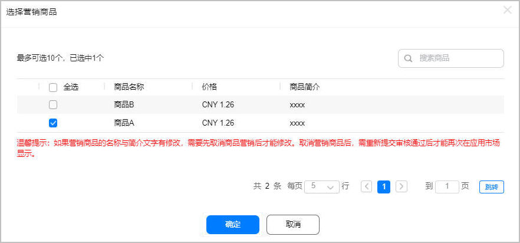
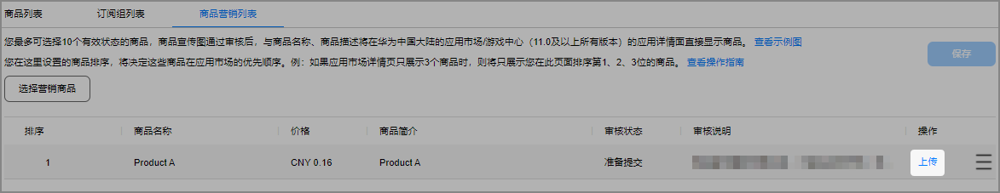
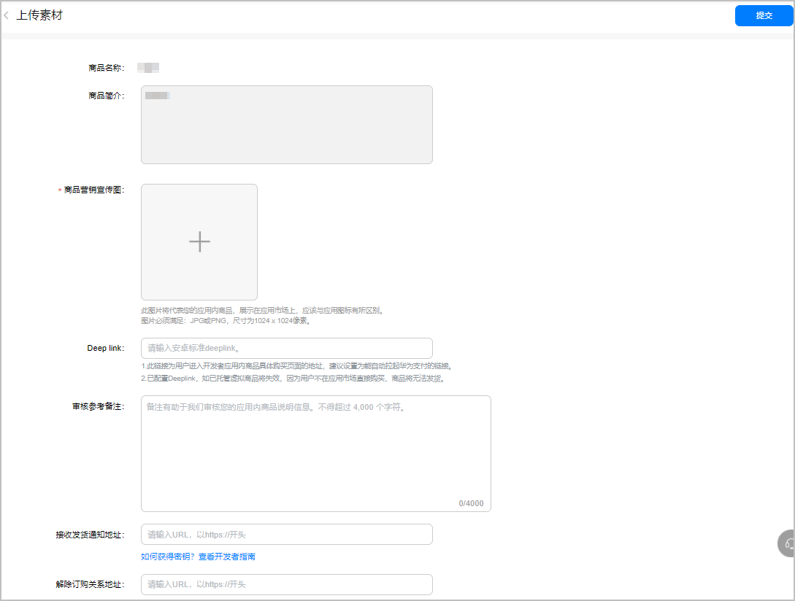

# 管理商品营销

商品营销是指开发者可以选择指定的商品进行营销包装，将商品宣传图、商品名称、商品描述展示在应用市场（10.2.0及以上所有版本）的应用详情页面。用户可以直接在应用市场的应用详情页面购买商品。

商品营销目前支持以下两种方式：

* DeepLink方式：用户点击购买应用市场的商品后将拉起开发者APP，由APP自行完成支付和发货。
* 商品直购方式：用户点击购买应用市场的商品后由华为HMS Core发起支付，在支付完成后由华为服务器通知开发者服务器完成商品发货。

商品营销管理功能目前仅支持中国大陆发布的应用，仅支持企业开发者。

## 前提条件

* 您已在商品管理[新增商品](/docs/distribute/app-dist/game-center/game-center-operation-0000001239502315/game-center-goods-management-0000001194462390/game-center-creating-product-0000001239502323)。
* 您的应用分发地区包含中国大陆。
* 您需准备1024\*1024px的JPG或PNG格式的图片，作为在应用市场的应用详情页面展示的商品营销宣传图。
* 建议使用Google Chrome浏览器访问商品管理服务，最低版本为62.0.3202.62。

## 操作步骤

1. 登录[AppGallery Connect](https://developer.huawei.com/consumer/cn/service/josp/agc/index.html)，选择“APP与元服务”。
2. 在应用列表中点击需要设置商品营销管理的应用。
3. 选择“运营”页签，在左侧导航栏选择“产品运营 &gt; 商品管理”，选择“商品营销列表”页签，点击“选择营销商品”。

   

只有应用分发地区包含中国大陆时才会展示“商品营销列表”页签。

4. 选择需要营销的商品，点击“确定”。

   

5. 选择完成后在营销商品列表中，点击对应的“上传”。

   

6. 填写相关的素材，完成后点击“提交”。

   

   相关参数如下表所示。

   | 参数 | 说明 |
   | --- | --- |
   | 商品营销宣传图 | 在应用市场的应用详情页面展示的商品图标，应该与应用图标有所区别，且必须为1024\*1024px的JPG或PNG格式的图片。 |
   | DeepLink | DeepLink为用户进入开发者应用内商品具体购买页面的链接地址，建议设置为能自动拉起华为支付的链接。  说明：  * 对于非订阅类商品，此参数为可选。 * 对于自动续期订阅商品，此参数必选，且只支持DeepLink方式。 * 如果同时配置“DeepLink”和“接收发货通知地址”，优先使用DeepLink方式。 * DeepLink与虚拟商品兑换码不可同时配置。如果已经配置过兑换码，该项置灰不可编辑。 |
   | 审核参考备注 | 发起商品营销的备注信息，便于审核人员审核。 |
   | 接收发货通知地址 | 如果商品营销需要支持商品直购方式，配置为用户在应用市场详情页购买商品成功后，华为服务器向开发者服务器发送的发货通知地址，由开发者提供。  说明：  * 非订阅类商品，此参数可选。 * 自动续期订阅商品不展示此参数。 * 接收发货通知地址与虚拟商品兑换码不可同时配置。如果已经配置过兑换码，该项置灰不可编辑。 |
   | 解除订购关系地址 | 华为服务器向开发者服务器发送解除订购关系通知的地址，由开发者提供。用户通过退款接口或者运营人工操作发起的退款，处理完毕后，会通过该地址告知已解除订购关系的消息。  说明：  * 非订阅类商品，此参数可选。 * 自动续期订阅商品不展示此参数。 * 解除订购关系地址与虚拟商品兑换码不可同时配置。如果已经配置过兑换码，该项置灰不可编辑。 |